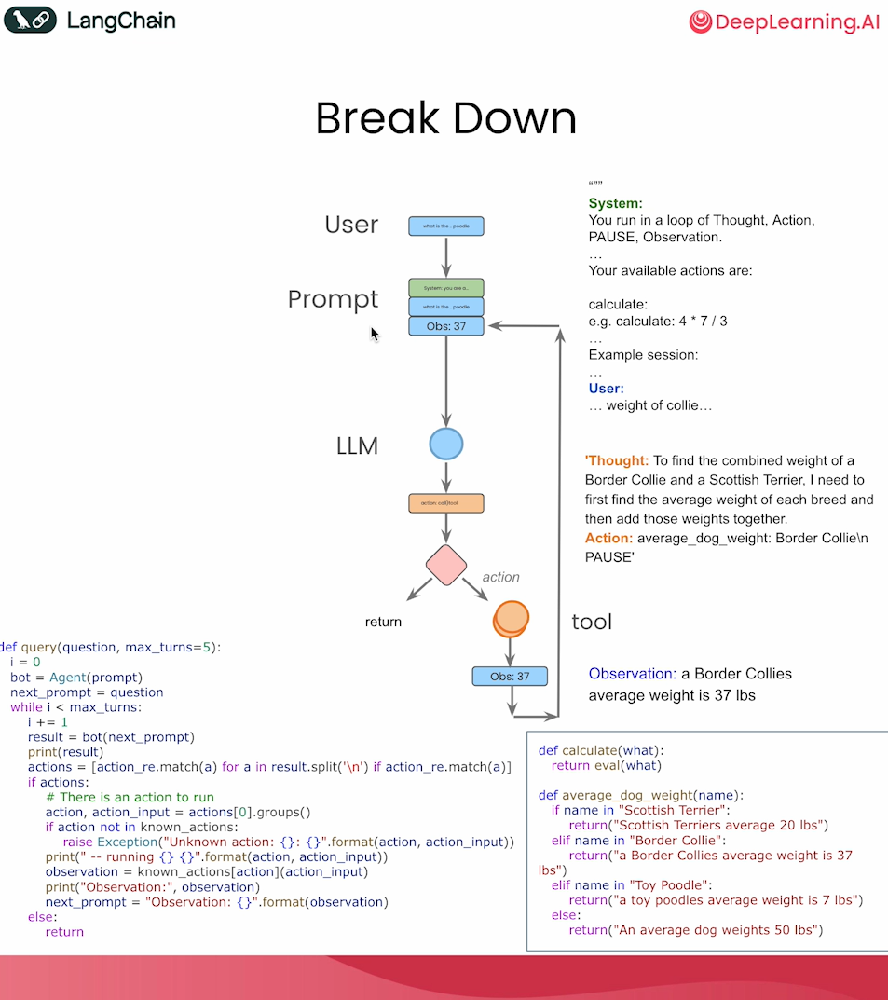
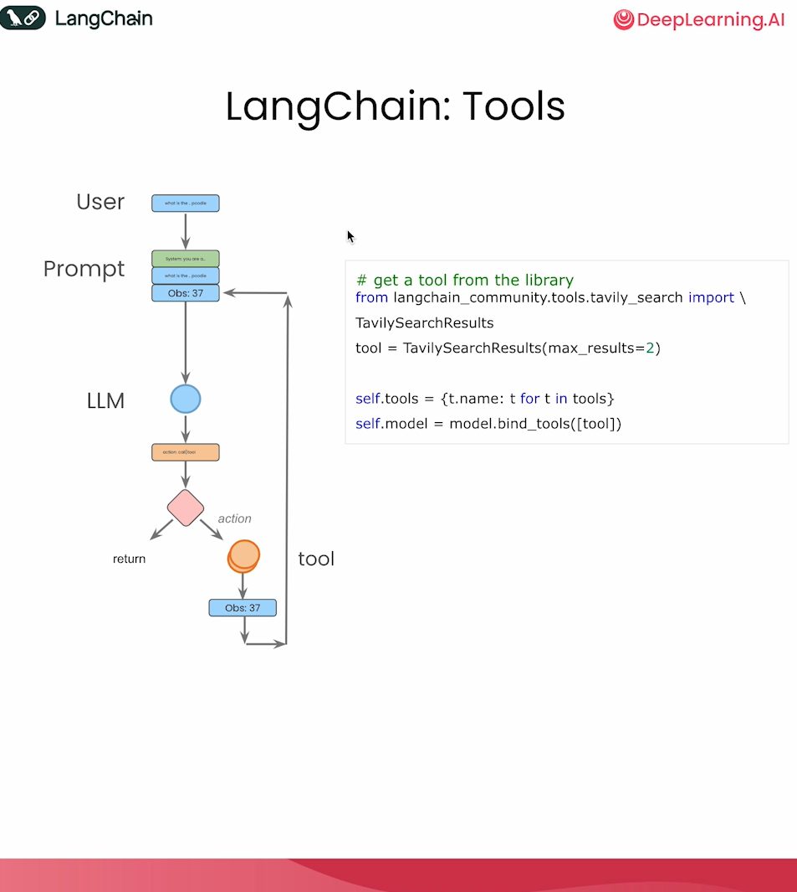
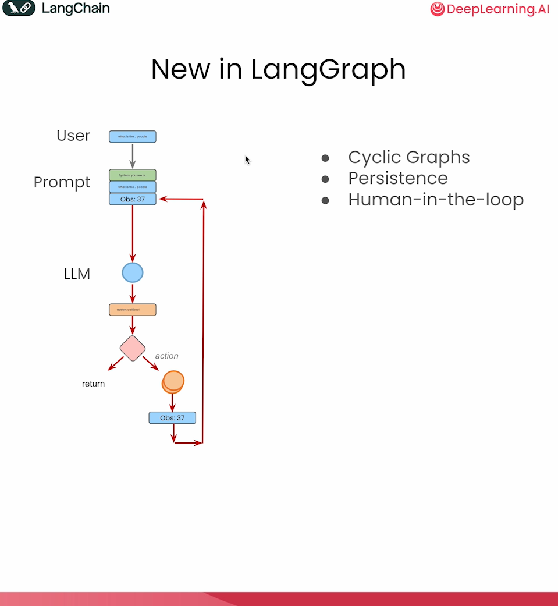
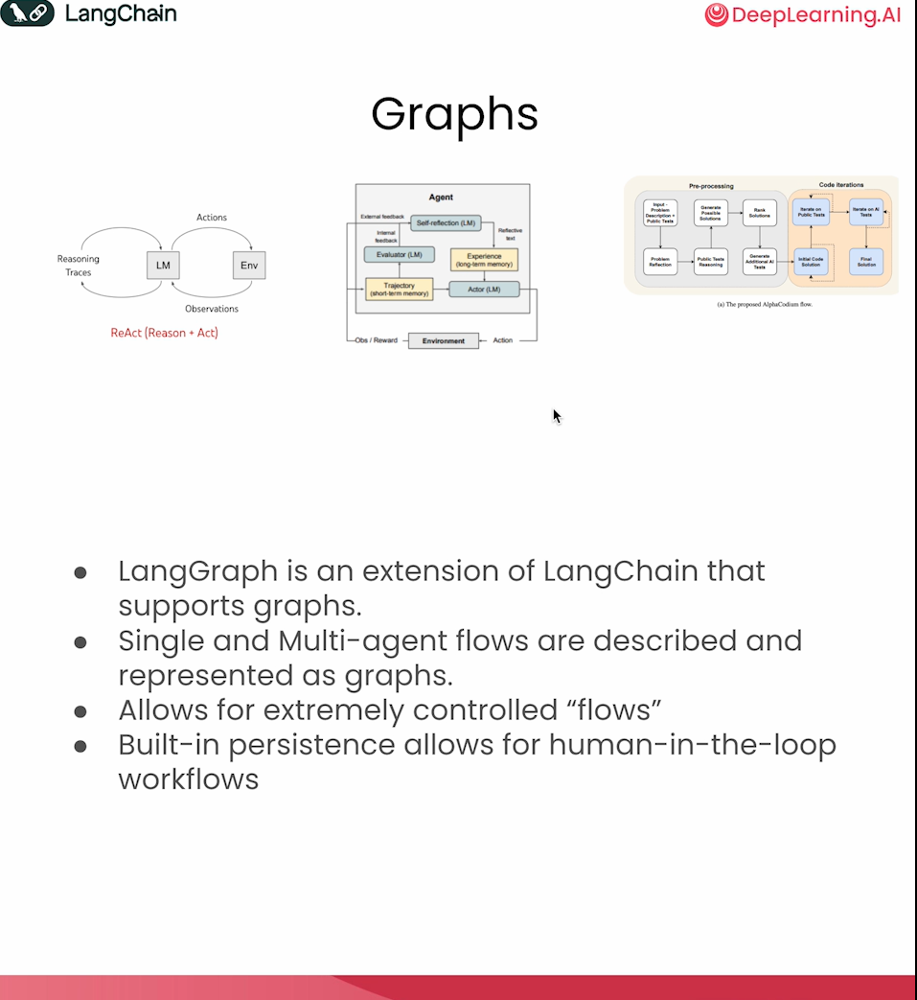
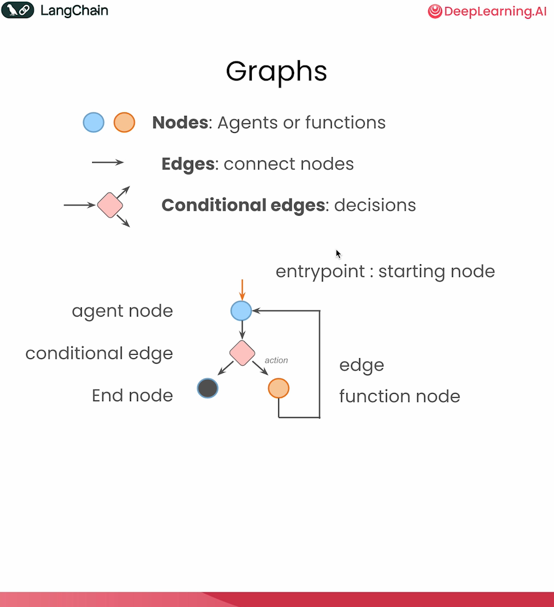
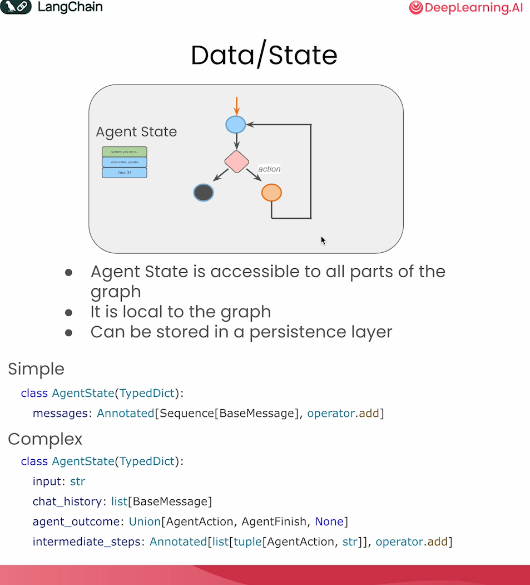
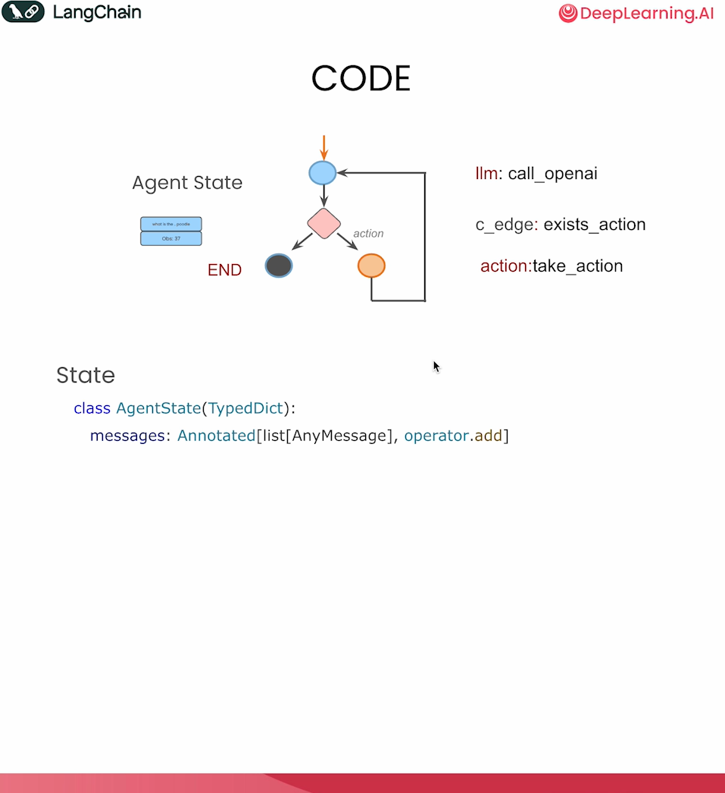
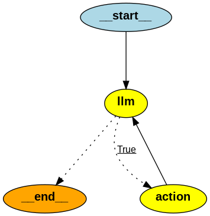

# LangGraph Components

使用 LangGraph 实现一个 Agent。

## Breakdown

将上节课的 Agent 拆解成如下的图。



### 提示词模板

https://smith.langchain.com/hub/hwchase17/react

可复用的提示词模板

```
Answer the following questions as best you can. You have access to the following tools:

{tools}

Use the following format:

Question: the input question you must answer

Thought: you should always think about what to do

Action: the action to take, should be one of [{tool_names}]

Action Input: the input to the action

Observation: the result of the action

... (this Thought/Action/Action Input/Observation can repeat N times)

Thought: I now know the final answer

Final Answer: the final answer to the original input question

Begin!

Question: {input}

Thought:{agent_scratchpad}
```

### Tools



### New in LangGraph

除了上面的提示词模板和 Tools 以外，LangGraph 提供了编排控制流的能力。

包括循环图，持久化和人为干预。



### Graphs



Graphs 中包括节点（函数或者 Agents），边（连接节点），有条件边（判定）



## Data/State




## 代码





```
from dotenv import load_dotenv
_ = load_dotenv()

from langgraph.graph import StateGraph, END
from typing import TypedDict, Annotated
import operator
from langchain_core.messages import AnyMessage, SystemMessage, HumanMessage, ToolMessage
from langchain_openai import ChatOpenAI
from langchain_community.tools.tavily_search import TavilySearchResults

tool = TavilySearchResults(max_results=4) #increased number of results
print(type(tool))
print(tool.name)

# > If you are not familiar with python typing annotation, you can refer to the [python documents](https://docs.python.org/3/library/typing.html).

class AgentState(TypedDict):
    messages: Annotated[list[AnyMessage], operator.add]


class Agent:

    def __init__(self, model, tools, system=""):
        self.system = system
        graph = StateGraph(AgentState)
        graph.add_node("llm", self.call_openai)
        graph.add_node("action", self.take_action)
        graph.add_conditional_edges(
            "llm",
            self.exists_action,
            {True: "action", False: END}
        )
        graph.add_edge("action", "llm")
        graph.set_entry_point("llm")
        self.graph = graph.compile()
        self.tools = {t.name: t for t in tools}
        self.model = model.bind_tools(tools)

    def exists_action(self, state: AgentState):
        result = state['messages'][-1]
        return len(result.tool_calls) > 0

    def call_openai(self, state: AgentState):
        messages = state['messages']
        if self.system:
            messages = [SystemMessage(content=self.system)] + messages
        message = self.model.invoke(messages)
        return {'messages': [message]}

    def take_action(self, state: AgentState):
        tool_calls = state['messages'][-1].tool_calls
        results = []
        for t in tool_calls:
            print(f"Calling: {t}")
            if not t['name'] in self.tools:      # check for bad tool name from LLM
                print("\n ....bad tool name....")
                result = "bad tool name, retry"  # instruct LLM to retry if bad
            else:
                result = self.tools[t['name']].invoke(t['args'])
            results.append(ToolMessage(tool_call_id=t['id'], name=t['name'], content=str(result)))
        print("Back to the model!")
        return {'messages': results}

prompt = """You are a smart research assistant. Use the search engine to look up information. \
You are allowed to make multiple calls (either together or in sequence). \
Only look up information when you are sure of what you want. \
If you need to look up some information before asking a follow up question, you are allowed to do that!
"""

model = ChatOpenAI(model="gpt-3.5-turbo")  #reduce inference cost
abot = Agent(model, [tool], system=prompt)

#from IPython.display import Image
#Image(abot.graph.get_graph().draw_png())

messages = [HumanMessage(content="What is the weather in sf?")]
result = abot.graph.invoke({"messages": messages})

"""
Calling: {'name': 'tavily_search_results_json', 'args': {'query': 'weather in San Francisco'}, 'id': 'call_ATgRAV2Mi9OAnhO1GEQTUGTs'}
Back to the model!
"""

"""
{'messages': [HumanMessage(content='What is the weather in sf?'),
  AIMessage(content='', additional_kwargs={'tool_calls': [{'id': 'call_ATgRAV2Mi9OAnhO1GEQTUGTs', 'function': {'arguments': '{"query":"weather in San Francisco"}', 'name': 'tavily_search_results_json'}, 'type': 'function'}]}, response_metadata={'token_usage': {'completion_tokens': 21, 'prompt_tokens': 153, 'total_tokens': 174}, 'model_name': 'gpt-3.5-turbo', 'system_fingerprint': None, 'finish_reason': 'tool_calls', 'logprobs': None}, id='run-882cdb04-b626-4301-a183-4dd082fb4893-0', tool_calls=[{'name': 'tavily_search_results_json', 'args': {'query': 'weather in San Francisco'}, 'id': 'call_ATgRAV2Mi9OAnhO1GEQTUGTs'}]),
  ToolMessage(content='[{\'url\': \'https://www.weatherapi.com/\', \'content\': "{\'location\': {\'name\': \'San Francisco\', \'region\': \'California\', \'country\': \'United States of America\', \'lat\': 37.78, \'lon\': -122.42, \'tz_id\': \'America/Los_Angeles\', \'localtime_epoch\': 1717992319, \'localtime\': \'2024-06-09 21:05\'}, \'current\': {\'last_updated_epoch\': 1717992000, \'last_updated\': \'2024-06-09 21:00\', \'temp_c\': 14.4, \'temp_f\': 57.9, \'is_day\': 0, \'condition\': {\'text\': \'Partly cloudy\', \'icon\': \'//cdn.weatherapi.com/weather/64x64/night/116.png\', \'code\': 1003}, \'wind_mph\': 16.1, \'wind_kph\': 25.9, \'wind_degree\': 250, \'wind_dir\': \'WSW\', \'pressure_mb\': 1015.0, \'pressure_in\': 29.96, \'precip_mm\': 0.0, \'precip_in\': 0.0, \'humidity\': 87, \'cloud\': 75, \'feelslike_c\': 12.8, \'feelslike_f\': 55.1, \'windchill_c\': 10.6, \'windchill_f\': 51.0, \'heatindex_c\': 12.5, \'heatindex_f\': 54.6, \'dewpoint_c\': 10.4, \'dewpoint_f\': 50.7, \'vis_km\': 16.0, \'vis_miles\': 9.0, \'uv\': 1.0, \'gust_mph\': 18.8, \'gust_kph\': 30.2}}"}, {\'url\': \'https://weather.com/weather/tenday/l/San Francisco CA USCA0987:1:US\', \'content\': "Comfy & Cozy\\nThat\'s Not What Was Expected\\nOutside\\n\'No-Name Storms\' In Florida\\nGifts From On High\\nWhat To Do For Wheezing\\nSurviving The Season\\nStay Safe\\nAir Quality Index\\nAir quality is considered satisfactory, and air pollution poses little or no risk.\\n Health & Activities\\nSeasonal Allergies and Pollen Count Forecast\\nNo pollen detected in your area\\nCold & Flu Forecast\\nFlu risk is low in your area\\nWe recognize our responsibility to use data and technology for good. recents\\nSpecialty Forecasts\\n10 Day Weather-San Francisco, CA\\nToday\\nMon 18 | Day\\nConsiderable cloudiness. Tue 19\\nTue 19 | Day\\nLight rain early...then remaining cloudy with showers in the afternoon. Wed 27\\nWed 27 | Day\\nOvercast with rain showers at times."}, {\'url\': \'https://world-weather.info/forecast/usa/san_francisco/june-2024/\', \'content\': \'Extended weather forecast in San Francisco. Hourly Week 10 days 14 days 30 days Year. Detailed ⚡ San Francisco Weather Forecast for June 2024 - day/night 🌡️ temperatures, precipitations - World-Weather.info.\'}, {\'url\': \'https://www.accuweather.com/en/us/san-francisco/94103/weather-forecast/347629\', \'content\': \'San Francisco, CA Weather Forecast, with current conditions, wind, air quality, and what to expect for the next 3 days. Go Back Aurora alert: Northern lights to glow over US Friday night.\'}]', name='tavily_search_results_json', tool_call_id='call_ATgRAV2Mi9OAnhO1GEQTUGTs'),
  AIMessage(content='The current weather in San Francisco is partly cloudy with a temperature of 57.9°F (14.4°C). The wind speed is 25.9 km/h coming from the WSW direction. The humidity is at 87% with a cloud cover of 75%. The visibility is 16.0 km, and the UV index is 1.0.', response_metadata={'token_usage': {'completion_tokens': 76, 'prompt_tokens': 969, 'total_tokens': 1045}, 'model_name': 'gpt-3.5-turbo', 'system_fingerprint': None, 'finish_reason': 'stop', 'logprobs': None}, id='run-479d57be-e920-4f22-bbac-7cab2bb7b688-0')]}
"""

print(result['messages'][-1].content)
"""
'The current weather in San Francisco is partly cloudy with a temperature of 57.9°F (14.4°C). The wind speed is 25.9 km/h coming from the WSW direction. The humidity is at 87% with a cloud cover of 75%. The visibility is 16.0 km, and the UV index is 1.0.'
"""

messages = [HumanMessage(content="What is the weather in SF and LA?")]
result = abot.graph.invoke({"messages": messages})

"""
messages = [HumanMessage(content="What is the weather in SF and LA?")]
result = abot.graph.invoke({"messages": messages})
messages = [HumanMessage(content="What is the weather in SF and LA?")]
result = abot.graph.invoke({"messages": messages})
Calling: {'name': 'tavily_search_results_json', 'args': {'query': 'weather in San Francisco'}, 'id': 'call_bsVGGgT94uoHbAXXHB6eTfMH'}
Calling: {'name': 'tavily_search_results_json', 'args': {'query': 'weather in Los Angeles'}, 'id': 'call_xcIdQfE2fLUqrxbuIvMEqDXR'}
Back to the model!
"""

"""
{'messages': [HumanMessage(content='What is the weather in SF and LA?'),
  AIMessage(content='', additional_kwargs={'tool_calls': [{'id': 'call_bsVGGgT94uoHbAXXHB6eTfMH', 'function': {'arguments': '{"query": "weather in San Francisco"}', 'name': 'tavily_search_results_json'}, 'type': 'function'}, {'id': 'call_xcIdQfE2fLUqrxbuIvMEqDXR', 'function': {'arguments': '{"query": "weather in Los Angeles"}', 'name': 'tavily_search_results_json'}, 'type': 'function'}]}, response_metadata={'token_usage': {'completion_tokens': 57, 'prompt_tokens': 155, 'total_tokens': 212}, 'model_name': 'gpt-3.5-turbo', 'system_fingerprint': None, 'finish_reason': 'tool_calls', 'logprobs': None}, id='run-9ecb88af-a186-4ad2-9b6e-d4dd48ceb54e-0', tool_calls=[{'name': 'tavily_search_results_json', 'args': {'query': 'weather in San Francisco'}, 'id': 'call_bsVGGgT94uoHbAXXHB6eTfMH'}, {'name': 'tavily_search_results_json', 'args': {'query': 'weather in Los Angeles'}, 'id': 'call_xcIdQfE2fLUqrxbuIvMEqDXR'}]),
  ToolMessage(content='[{\'url\': \'https://www.weatherapi.com/\', \'content\': "{\'location\': {\'name\': \'San Francisco\', \'region\': \'California\', \'country\': \'United States of America\', \'lat\': 37.78, \'lon\': -122.42, \'tz_id\': \'America/Los_Angeles\', \'localtime_epoch\': 1717992319, \'localtime\': \'2024-06-09 21:05\'}, \'current\': {\'last_updated_epoch\': 1717992000, \'last_updated\': \'2024-06-09 21:00\', \'temp_c\': 14.4, \'temp_f\': 57.9, \'is_day\': 0, \'condition\': {\'text\': \'Partly cloudy\', \'icon\': \'//cdn.weatherapi.com/weather/64x64/night/116.png\', \'code\': 1003}, \'wind_mph\': 16.1, \'wind_kph\': 25.9, \'wind_degree\': 250, \'wind_dir\': \'WSW\', \'pressure_mb\': 1015.0, \'pressure_in\': 29.96, \'precip_mm\': 0.0, \'precip_in\': 0.0, \'humidity\': 87, \'cloud\': 75, \'feelslike_c\': 12.8, \'feelslike_f\': 55.1, \'windchill_c\': 10.6, \'windchill_f\': 51.0, \'heatindex_c\': 12.5, \'heatindex_f\': 54.6, \'dewpoint_c\': 10.4, \'dewpoint_f\': 50.7, \'vis_km\': 16.0, \'vis_miles\': 9.0, \'uv\': 1.0, \'gust_mph\': 18.8, \'gust_kph\': 30.2}}"}, {\'url\': \'https://world-weather.info/forecast/usa/san_francisco/june-2024/\', \'content\': \'Hourly Week 10 days 14 days 30 days Year. Detailed ⚡ San Francisco Weather Forecast for June 2024 - day/night 🌡️ temperatures, precipitations - World-Weather.info.\'}, {\'url\': \'https://forecast.weather.gov/MapClick.php?x=165&y=156&site=mtr&zmx=&map_x=165&map_y=156\', \'content\': \'2 Miles S San Francisco CA 37.77°N 122.44°W (Elev. 253 ft) Last Update: 1:27 pm PDT Jun 6, 2024. Forecast Valid: 8pm PDT Jun 6, 2024-6pm PDT Jun 13, 2024 . Forecast Discussion . Additional Resources. Radar & Satellite Image. Hourly Weather Forecast ... Severe Weather ; Current Outlook Maps ; Drought ; Fire Weather ; Fronts/Precipitation Maps ...\'}, {\'url\': \'https://forecast.weather.gov/zipcity.php?inputstring=San+Francisco,CA\', \'content\': \'San Francisco CA 37.77°N 122.41°W (Elev. 131 ft) Last Update: 6:00 pm PDT Jun 7, 2024. Forecast Valid: 7pm PDT Jun 7, 2024-6pm PDT Jun 14, 2024 . Forecast Discussion . Additional Resources. Radar & Satellite Image. Hourly Weather Forecast. ... Severe Weather ; Current Outlook Maps ; Drought ; Fire Weather ; Fronts/Precipitation Maps ; Current ...\'}]', name='tavily_search_results_json', tool_call_id='call_bsVGGgT94uoHbAXXHB6eTfMH'),
  ToolMessage(content='[{\'url\': \'https://www.weatherapi.com/\', \'content\': "{\'location\': {\'name\': \'Los Angeles\', \'region\': \'California\', \'country\': \'United States of America\', \'lat\': 34.05, \'lon\': -118.24, \'tz_id\': \'America/Los_Angeles\', \'localtime_epoch\': 1717992494, \'localtime\': \'2024-06-09 21:08\'}, \'current\': {\'last_updated_epoch\': 1717992000, \'last_updated\': \'2024-06-09 21:00\', \'temp_c\': 18.3, \'temp_f\': 64.9, \'is_day\': 0, \'condition\': {\'text\': \'Clear\', \'icon\': \'//cdn.weatherapi.com/weather/64x64/night/113.png\', \'code\': 1000}, \'wind_mph\': 6.9, \'wind_kph\': 11.2, \'wind_degree\': 280, \'wind_dir\': \'W\', \'pressure_mb\': 1014.0, \'pressure_in\': 29.94, \'precip_mm\': 0.0, \'precip_in\': 0.0, \'humidity\': 70, \'cloud\': 0, \'feelslike_c\': 18.3, \'feelslike_f\': 64.9, \'windchill_c\': 18.9, \'windchill_f\': 66.1, \'heatindex_c\': 19.1, \'heatindex_f\': 66.4, \'dewpoint_c\': 12.0, \'dewpoint_f\': 53.6, \'vis_km\': 16.0, \'vis_miles\': 9.0, \'uv\': 1.0, \'gust_mph\': 11.4, \'gust_kph\': 18.4}}"}, {\'url\': \'https://world-weather.info/forecast/usa/los_angeles/june-2024/\', \'content\': \'Extended weather forecast in Los Angeles. Hourly Week 10 days 14 days 30 days Year. Detailed ⚡ Los Angeles Weather Forecast for June 2024 - day/night 🌡️ temperatures, precipitations - World-Weather.info.\'}, {\'url\': \'https://www.weathertab.com/en/c/e/06/united-states/california/los-angeles/\', \'content\': \'Avg High Temps 75 to 85 °F. Avg Low Temps 50 to 60 °F. Explore comprehensive June 2024 weather forecasts for Los Angeles, including daily high and low temperatures, precipitation risks, and monthly temperature trends. Featuring detailed day-by-day forecasts, dynamic graphs of daily rain probabilities, and temperature trends to help you plan ...\'}, {\'url\': \'https://www.accuweather.com/en/us/los-angeles/90012/june-weather/347625\', \'content\': \'Get the monthly weather forecast for Los Angeles, CA, including daily high/low, historical averages, to help you plan ahead.\'}]', name='tavily_search_results_json', tool_call_id='call_xcIdQfE2fLUqrxbuIvMEqDXR'),
  AIMessage(content='The current weather in San Francisco is partly cloudy with a temperature of 57.9°F. The wind speed is 25.9 kph coming from the WSW direction.\n\nIn Los Angeles, the current weather is clear with a temperature of 64.9°F. The wind speed is 11.2 kph coming from the west direction.', response_metadata={'token_usage': {'completion_tokens': 72, 'prompt_tokens': 1694, 'total_tokens': 1766}, 'model_name': 'gpt-3.5-turbo', 'system_fingerprint': None, 'finish_reason': 'stop', 'logprobs': None}, id='run-5fc1ae2f-f855-43ed-8558-e4a8814a4fa5-0')]}
{'messages': [HumanMessage(content='What is the weather in SF and LA?'),
  AIMessage(content='', additional_kwargs={'tool_calls': [{'id': 'call_bsVGGgT94uoHbAXXHB6eTfMH', 'function': {'arguments': '{"query": "weather in San Francisco"}', 'name': 'tavily_search_results_json'}, 'type': 'function'}, {'id': 'call_xcIdQfE2fLUqrxbuIvMEqDXR', 'function': {'arguments': '{"query": "weather in Los Angeles"}', 'name': 'tavily_search_results_json'}, 'type': 'function'}]}, response_metadata={'token_usage': {'completion_tokens': 57, 'prompt_tokens': 155, 'total_tokens': 212}, 'model_name': 'gpt-3.5-turbo', 'system_fingerprint': None, 'finish_reason': 'tool_calls', 'logprobs': None}, id='run-9ecb88af-a186-4ad2-9b6e-d4dd48ceb54e-0', tool_calls=[{'name': 'tavily_search_results_json', 'args': {'query': 'weather in San Francisco'}, 'id': 'call_bsVGGgT94uoHbAXXHB6eTfMH'}, {'name': 'tavily_search_results_json', 'args': {'query': 'weather in Los Angeles'}, 'id': 'call_xcIdQfE2fLUqrxbuIvMEqDXR'}]),
  ToolMessage(content='[{\'url\': \'https://www.weatherapi.com/\', \'content\': "{\'location\': {\'name\': \'San Francisco\', \'region\': \'California\', \'country\': \'United States of America\', \'lat\': 37.78, \'lon\': -122.42, \'tz_id\': \'America/Los_Angeles\', \'localtime_epoch\': 1717992319, \'localtime\': \'2024-06-09 21:05\'}, \'current\': {\'last_updated_epoch\': 1717992000, \'last_updated\': \'2024-06-09 21:00\', \'temp_c\': 14.4, \'temp_f\': 57.9, \'is_day\': 0, \'condition\': {\'text\': \'Partly cloudy\', \'icon\': \'//cdn.weatherapi.com/weather/64x64/night/116.png\', \'code\': 1003}, \'wind_mph\': 16.1, \'wind_kph\': 25.9, \'wind_degree\': 250, \'wind_dir\': \'WSW\', \'pressure_mb\': 1015.0, \'pressure_in\': 29.96, \'precip_mm\': 0.0, \'precip_in\': 0.0, \'humidity\': 87, \'cloud\': 75, \'feelslike_c\': 12.8, \'feelslike_f\': 55.1, \'windchill_c\': 10.6, \'windchill_f\': 51.0, \'heatindex_c\': 12.5, \'heatindex_f\': 54.6, \'dewpoint_c\': 10.4, \'dewpoint_f\': 50.7, \'vis_km\': 16.0, \'vis_miles\': 9.0, \'uv\': 1.0, \'gust_mph\': 18.8, \'gust_kph\': 30.2}}"}, {\'url\': \'https://world-weather.info/forecast/usa/san_francisco/june-2024/\', \'content\': \'Hourly Week 10 days 14 days 30 days Year. Detailed ⚡ San Francisco Weather Forecast for June 2024 - day/night 🌡️ temperatures, precipitations - World-Weather.info.\'}, {\'url\': \'https://forecast.weather.gov/MapClick.php?x=165&y=156&site=mtr&zmx=&map_x=165&map_y=156\', \'content\': \'2 Miles S San Francisco CA 37.77°N 122.44°W (Elev. 253 ft) Last Update: 1:27 pm PDT Jun 6, 2024. Forecast Valid: 8pm PDT Jun 6, 2024-6pm PDT Jun 13, 2024 . Forecast Discussion . Additional Resources. Radar & Satellite Image. Hourly Weather Forecast ... Severe Weather ; Current Outlook Maps ; Drought ; Fire Weather ; Fronts/Precipitation Maps ...\'}, {\'url\': \'https://forecast.weather.gov/zipcity.php?inputstring=San+Francisco,CA\', \'content\': \'San Francisco CA 37.77°N 122.41°W (Elev. 131 ft) Last Update: 6:00 pm PDT Jun 7, 2024. Forecast Valid: 7pm PDT Jun 7, 2024-6pm PDT Jun 14, 2024 . Forecast Discussion . Additional Resources. Radar & Satellite Image. Hourly Weather Forecast. ... Severe Weather ; Current Outlook Maps ; Drought ; Fire Weather ; Fronts/Precipitation Maps ; Current ...\'}]', name='tavily_search_results_json', tool_call_id='call_bsVGGgT94uoHbAXXHB6eTfMH'),
  ToolMessage(content='[{\'url\': \'https://www.weatherapi.com/\', \'content\': "{\'location\': {\'name\': \'Los Angeles\', \'region\': \'California\', \'country\': \'United States of America\', \'lat\': 34.05, \'lon\': -118.24, \'tz_id\': \'America/Los_Angeles\', \'localtime_epoch\': 1717992494, \'localtime\': \'2024-06-09 21:08\'}, \'current\': {\'last_updated_epoch\': 1717992000, \'last_updated\': \'2024-06-09 21:00\', \'temp_c\': 18.3, \'temp_f\': 64.9, \'is_day\': 0, \'condition\': {\'text\': \'Clear\', \'icon\': \'//cdn.weatherapi.com/weather/64x64/night/113.png\', \'code\': 1000}, \'wind_mph\': 6.9, \'wind_kph\': 11.2, \'wind_degree\': 280, \'wind_dir\': \'W\', \'pressure_mb\': 1014.0, \'pressure_in\': 29.94, \'precip_mm\': 0.0, \'precip_in\': 0.0, \'humidity\': 70, \'cloud\': 0, \'feelslike_c\': 18.3, \'feelslike_f\': 64.9, \'windchill_c\': 18.9, \'windchill_f\': 66.1, \'heatindex_c\': 19.1, \'heatindex_f\': 66.4, \'dewpoint_c\': 12.0, \'dewpoint_f\': 53.6, \'vis_km\': 16.0, \'vis_miles\': 9.0, \'uv\': 1.0, \'gust_mph\': 11.4, \'gust_kph\': 18.4}}"}, {\'url\': \'https://world-weather.info/forecast/usa/los_angeles/june-2024/\', \'content\': \'Extended weather forecast in Los Angeles. Hourly Week 10 days 14 days 30 days Year. Detailed ⚡ Los Angeles Weather Forecast for June 2024 - day/night 🌡️ temperatures, precipitations - World-Weather.info.\'}, {\'url\': \'https://www.weathertab.com/en/c/e/06/united-states/california/los-angeles/\', \'content\': \'Avg High Temps 75 to 85 °F. Avg Low Temps 50 to 60 °F. Explore comprehensive June 2024 weather forecasts for Los Angeles, including daily high and low temperatures, precipitation risks, and monthly temperature trends. Featuring detailed day-by-day forecasts, dynamic graphs of daily rain probabilities, and temperature trends to help you plan ...\'}, {\'url\': \'https://www.accuweather.com/en/us/los-angeles/90012/june-weather/347625\', \'content\': \'Get the monthly weather forecast for Los Angeles, CA, including daily high/low, historical averages, to help you plan ahead.\'}]', name='tavily_search_results_json', tool_call_id='call_xcIdQfE2fLUqrxbuIvMEqDXR'),
  AIMessage(content='The current weather in San Francisco is partly cloudy with a temperature of 57.9°F. The wind speed is 25.9 kph coming from the WSW direction.\n\nIn Los Angeles, the current weather is clear with a temperature of 64.9°F. The wind speed is 11.2 kph coming from the west direction.', response_metadata={'token_usage': {'completion_tokens': 72, 'prompt_tokens': 1694, 'total_tokens': 1766}, 'model_name': 'gpt-3.5-turbo', 'system_fingerprint': None, 'finish_reason': 'stop', 'logprobs': None}, id='run-5fc1ae2f-f855-43ed-8558-e4a8814a4fa5-0')]}
"""

# Note, the query was modified to produce more consistent results. 
# Results may vary per run and over time as search information and models change.

query = "Who won the super bowl in 2024? In what state is the winning team headquarters located? \
What is the GDP of that state? Answer each question." 
messages = [HumanMessage(content=query)]

model = ChatOpenAI(model="gpt-4o")  # requires more advanced model
abot = Agent(model, [tool], system=prompt)
result = abot.graph.invoke({"messages": messages})

"""
Calling: {'name': 'tavily_search_results_json', 'args': {'query': 'who won the Super Bowl in 2024'}, 'id': 'call_fyxzzbePE0kUy5eMAs3eb2MU'}
Back to the model!
Calling: {'name': 'tavily_search_results_json', 'args': {'query': 'GDP of Missouri 2024'}, 'id': 'call_GVWkak1VjtzRvbjsUb3gPMby'}
Back to the model!
"""

"""
{'messages': [HumanMessage(content='Who won the super bowl in 2024? In what state is the winning team headquarters located? What is the GDP of that state? Answer each question.'),
  AIMessage(content='', additional_kwargs={'tool_calls': [{'id': 'call_fyxzzbePE0kUy5eMAs3eb2MU', 'function': {'arguments': '{"query":"who won the Super Bowl in 2024"}', 'name': 'tavily_search_results_json'}, 'type': 'function'}]}, response_metadata={'token_usage': {'completion_tokens': 26, 'prompt_tokens': 176, 'total_tokens': 202}, 'model_name': 'gpt-4o', 'system_fingerprint': 'fp_319be4768e', 'finish_reason': 'tool_calls', 'logprobs': None}, id='run-43c5e906-bbfe-4b47-a9f9-d682bb2242f2-0', tool_calls=[{'name': 'tavily_search_results_json', 'args': {'query': 'who won the Super Bowl in 2024'}, 'id': 'call_fyxzzbePE0kUy5eMAs3eb2MU'}]),
  ToolMessage(content='[{\'url\': \'https://www.hollywoodreporter.com/news/general-news/super-bowl-2024-winner-1235822266/\', \'content\': "The Best Last-Minute Deals on San Francisco 49ers vs. Kansas City Chiefs Tickets Online\\nRed Carpet Essentials Awards: The Best Foundations and Face Powders, According to Hollywood Insiders\\nTHR Newsletters\\nSign up for THR news straight to your inbox every day\\nMost Popular\\nGrammy Awards: Winners List\\nJapan’s Embassy Issues Statement About Taylor Swift’s Super Bowl Plans\\nWendy Williams Seen for First Time in a Year in Devastating Lifetime Documentary Trailer\\nGina Carano Sues Disney Over ‘Mandalorian’ Firing in Lawsuit Funded by Elon Musk\\nCarl Weathers’ Super Bowl Ad Being Adjusted Following Death\\nMust Reads\\nJon Stewart Explains ‘Daily Show’ Return and Apple TV Exit\\n‘Suits’ Stars Patrick J. Adams and Gabriel Macht Share Advice for Spinoff Cast\\nDonald Glover and Maya Erskine on Real-Life Marriage, Professional Divorce and When to Walk Away\\nThe Definitive Voice of Entertainment News\\nSubscribe for full access to The Hollywood Reporter\\nMost Popular\\nTravis Kelce\'s First Words to Taylor Swift After Winning the Super Bowl Have Us Swooning\\nHighest Paid Athletes in the World: Our Sites\\nNews\\nExpand news menu\\nFilm\\nExpand film menu\\nTV\\nExpand tv menu\\nAwards\\nExpand awards menu\\nLifestyle\\nExpand lifestyle menu\\nBusiness\\nExpand business menu\\nCharts\\nExpand charts menu\\nMore Essentials\\nExpand more-essentials menu\\nFollow Us\\nAlerts & Newsletters\\noptional screen reader Full List\\nBehind Hulu\'s Sensational Truman Capote Show Is the Collector Who Quietly Built MoMA\\nDamian Marley\'s Mom, Cindy Breakspeare, Incites Backlash Over Bob Marley Birthday Tribute\\nYou may also like\\nThis 2-in-1 Treadmill Is More Than $100 off on Amazon Today (And Folds Under Your Bed)\\nRichard Perry and Jane Fonda’s Onetime Beverly Hills House Can Be Yours for $11 Million\\nLarsa Pippen, Marcus Jordan Delete All Instagram Photos Together, Spark Breakup\\xa0Rumors\\nSubscriber Support\\nThe Hollywood Reporter\\nLegal\\nFollow Us\\nNewsletter Sign Up\\nHave a Tip?\\nSend us a tip using our anonymous form.\\n The Definitive Voice of Entertainment News\\nSubscribe for full access to The Hollywood Reporter\\nsite categories\\nWhere to Stream Oscar-Nominated Film ‘Poor Things’ Online\\nThe Definitive Voice of Entertainment News\\nSubscribe for full access to The Hollywood Reporter\\nKansas City Chiefs Win Super Bowl LVIII\\n Why Was Jack Dorsey Wearing a “Satoshi” T-Shirt at the Super Bowl?\\nTaylor Swift and Travis Kelce Embrace After Kansas City Chiefs Win Super Bowl\\nShirtless Fans Escorted Out of Allegiant Stadium After Running Onto Field During Super Bowl\\nSuper Bowl: Robert F. Kennedy Jr. Presidential Campaign Spot Repurposes 1960 John F. Kennedy Ad\\nMarlee Matlin “Shocked” at Lack of Screen Time for Deaf Performers During CBS’ Super Bowl Pregame Show\\nBen Affleck Attempts Pop Stardom in Dunkin’"}, {\'url\': \'https://apnews.com/live/super-bowl-2024-updates\', \'content\': \'Throw in the fact that Chiefs coach Andy Reid will be in his fifth Super Bowl, the third most in NFL history, and has a chance to win a third ring, and the knowledge on the Kansas City sideline will be an advantage too big for the 49ers to overcome.\\n She performed in Japan on Saturday night before a flight across nine time zones and the international date line to reach the U.S.\\nRihanna performs during halftime of the NFL Super Bowl 57 football game between the Philadelphia Eagles and the Kansas City Chiefs, Sunday, Feb. 12, 2023, in Glendale, Ariz. (AP Photo/David J. Phillip)\\n After the teams take the field, Post Malone will perform “America the Beautiful” and Reba McEntire will sing “The Star-Spangled Banner.”\\nSan Francisco 49ers quarterback Brock Purdy (13) warms up before the NFL Super Bowl 58 football game against the Kansas City Chiefs, Sunday, Feb. 11, 2024, in Las Vegas. He was also the referee when the Chiefs beat the 49ers in the Super Bowl four years ago — and when the Rams beat the Saints in the 2019 NFC championship game after an infamous missed call.\\n Purdy’s comeback from the injury to his throwing arm suffered in last season’s NFC championship loss to the Philadelphia Eagles has been part of the storybook start to his career that started as Mr. Irrelevant as the 262nd pick in the 2022 draft.\\n\'}, {\'url\': \'https://www.espn.com/nfl/story/_/id/39480722/49ers-chiefs-live-super-bowl-lviii-updates-moments-highlights\', \'content\': "With a relentless defense and opportune plays by their star quarterback -- including a pair of gutsy overtime scrambles -- the Chiefs won their third Super Bowl in five years in a 25-22 overtime victory against the San Francisco 49ers in only the second overtime game in Super Bowl history.\\n Staff\\nTaylor Swift supports Travis Kelce, chugs drink at Super Bowl LVIII10hTory Barron\\nAfter posting a losing record in December, the Chiefs embraced an underdog, villain mentality throughout the postseason, upsetting three teams en route to their second consecutive Super Bowl title, becoming the ninth team to repeat as Super Bowl champions and first since the 2004 New England Patriots.\\n ESPN\\nSuper Bowl 2024 - Highlights from Chiefs\' win vs. 49ers\\nMike Tannenbaum and Tim Hasselbeck react to the Chiefs\' thrilling overtime victory over the 49ers in the Super Bowl. The 49ers had the ball with 2:51 to go in a tied game, but a signature Steve Spagnuolo blitz on third down late in the fourth quarter forced a 49ers field goal. Led by their captains, most of the Chiefs arrived to Allegiant Stadium in Las Vegas on Sunday in all black, signaling a steely resolve to upset Brock Purdy and the NFC\'s best offensive ensemble.\\n"}, {\'url\': \'https://www.sportingnews.com/us/nfl/news/super-bowl-2024-live-score-49ers-chiefs-results-highlights/0c440aa7145b809ed174d8ff\', \'content\': \'Super Bowl start time\\nSuper Bowl 58 between the Chiefs and 49ers is set to kick off at 6:30 p.m. ET (3:30 p.m. local time) in Las Vegas, Nev.\\n6:30 p.m. ET has become the standard start time for Super Bowls and is preceded by performances of "Lift Every Voice and Sing," "America the Beautiful," and "The Star-Spangled Banner. Brock Purdy drops a dime to Chris Conley on 3rd & 9 🎯\\n📺: #SBLVIII on CBS\\n📱: Stream on #NFLPlus https://t.co/dClcEDViWl pic.twitter.com/Oa10d7khdl\\n7:10 p.m. — The 49ers are relying heavily on McCaffrey, who takes the ball on each of the first three snaps on this drive. 📺: #SBLVIII on CBS\\n📱: Stream on #NFLPlus https://t.co/dClcEDViWl pic.twitter.com/yUc00MtP84\\n7:24 p.m. — The 49ers force a 3rd & 1, but Rashee Rice is easily able to pick up the first and one or two more yards.\\n49ers 3, Chiefs 0\\n7:19 p.m. MORE SUPER BOWL 58:\\n•\\xa0 Inside Taylor Swift and Travis Kelce\\\'s whirlwind dating timeline\\n•. Ranking the thriving Mike and Kyle Shanahan coaching tree\\n•. Tracking every Super Bowl 58 commercial\\nWhat channel is the Super Bowl on?\\nSuper Bowl 58 will be broadcast nationally on CBS. PURDY TO JENNINGS TO CMC FOR SIX 🔥\\n📺: #SBLVIII on CBS\\n📱: Stream on #NFLPlus https://t.co/dClcEDViWl pic.twitter.com/ktiTXIiHzS\\n7:47 p.m. — L\\\'Jarius Sneed, who was on the other side of this two weeks ago, gets hit with an unsportsmanlike conduct penalty and and gives the 49ers their 11th first down.\'}]', name='tavily_search_results_json', tool_call_id='call_fyxzzbePE0kUy5eMAs3eb2MU'),
  AIMessage(content='1. **Who won the Super Bowl in 2024?**\n   The Kansas City Chiefs won the Super Bowl in 2024.\n\n2. **In what state is the winning team headquarters located?**\n   The Kansas City Chiefs are headquartered in Missouri.\n\n3. **What is the GDP of that state?**\n   I will now look up the GDP of Missouri.', additional_kwargs={'tool_calls': [{'id': 'call_GVWkak1VjtzRvbjsUb3gPMby', 'function': {'arguments': '{"query":"GDP of Missouri 2024"}', 'name': 'tavily_search_results_json'}, 'type': 'function'}]}, response_metadata={'token_usage': {'completion_tokens': 99, 'prompt_tokens': 2042, 'total_tokens': 2141}, 'model_name': 'gpt-4o', 'system_fingerprint': 'fp_319be4768e', 'finish_reason': 'tool_calls', 'logprobs': None}, id='run-5a748b16-2b6a-43fc-b8e1-38908ffea00f-0', tool_calls=[{'name': 'tavily_search_results_json', 'args': {'query': 'GDP of Missouri 2024'}, 'id': 'call_GVWkak1VjtzRvbjsUb3gPMby'}]),
  ToolMessage(content='[{\'url\': \'https://www.statista.com/statistics/187908/gdp-of-the-us-federal-state-of-missouri-since-1997/\', \'content\': \'Published by Statista Research Department , Apr 8, 2024. In 2023, the real gross domestic product (GDP) of Missouri was 344.12 billion U.S. dollars. This is an increase from the previous year ...\'}, {\'url\': \'https://en.wikipedia.org/wiki/List_of_U.S._states_and_territories_by_GDP\', \'content\': "GDP per capita also varied widely throughout the United States in 2022, with New York ($105,226), Massachusetts ($99,274), and North Dakota ($96,461) recording the three highest GDP per capita figures in the U.S., while Mississippi ($47,572), Arkansas ($54,644), and West Virginia ($54,870) recorded the three lowest GDP per capita figures in the U.S. The District of Columbia, though, recorded a GDP per capita figure far higher than any U.S. state in 2022 at $242,853.\\n 50 states and the District of Columbia[edit]\\nThe table below lists the annual Nominal GDP of each U.S. state and the District of Columbia in 2022, as well as the GDP change and GDP per capita for that year. Northern Mariana Islands[edit]\\nThe Northern Mariana Islands GDP was $1.18 billion ($1,180 million) in 2019; GDP for the Northern Mariana Islands decreased by 11.2% in 2019; and GDP per capita in the Northern Mariana Islands was $20,659 in 2019.[5][4][6]\\nSee also[edit]\\nReferences[edit]\\nExternal links[edit]\\n*Top country subdivisions by GDP Such fluctuations may change a country\'s ranking from one year to the next, even though they often make little or no difference in the standard of living of its population.[2]\\nOverall, in the calendar year 2022, the United States\' Nominal GDP at Current Prices totaled at $25.463 trillion, as compared to $23.315 trillion in 2021.\\n The Bureau of Economic Analysis (BEA) collects GDP data for four U.S. territories (American Samoa, Guam, the Northern Mariana Islands, and the U.S. Virgin Islands) separately from the states and the District of Columbia."}, {\'url\': \'https://usafacts.org/topics/economy/state/missouri/\', \'content\': "Real gross domestic product (GDP) Missouri\'s share of the US economy. Real gross domestic product (GDP) by industry. ... A majority of funding for the 2024 election — over 65%, or nearly $5.6 billion — comes from political action committees, also known as PACs. Published on May 17, 2024."}, {\'url\': \'https://www.bea.gov/data/gdp/gdp-state\', \'content\': "Real gross domestic product (GDP) increased in all 50 states and the District of Columbia in the fourth quarter of 2023, with the percent change ranging from 6.7 percent in Nevada to 0.2 percent in Nebraska ... Next Release: June 28, 2024; Gross Domestic Product by State and Personal Income by State, 4th Quarter \'23 and Preliminary \'23 - CHART"}]', name='tavily_search_results_json', tool_call_id='call_GVWkak1VjtzRvbjsUb3gPMby'),
  AIMessage(content='3. **What is the GDP of that state?**\n   As of 2023, the GDP of Missouri was approximately $344.12 billion USD. The 2024 data is not yet available, but it is likely to be in a similar range.', response_metadata={'token_usage': {'completion_tokens': 54, 'prompt_tokens': 2863, 'total_tokens': 2917}, 'model_name': 'gpt-4o', 'system_fingerprint': 'fp_319be4768e', 'finish_reason': 'stop', 'logprobs': None}, id='run-57937e24-0e01-48c7-ac3b-6bb116477574-0')]}
"""

print(result['messages'][-1].content)

"""
3. **What is the GDP of that state?**
   As of 2023, the GDP of Missouri was approximately $344.12 billion USD. The 2024 data is not yet available, but it is likely to be in a similar range.
"""
```


## 参考文献
- https://learn.deeplearning.ai/courses/ai-agents-in-langgraph/lesson/3/langgraph-components