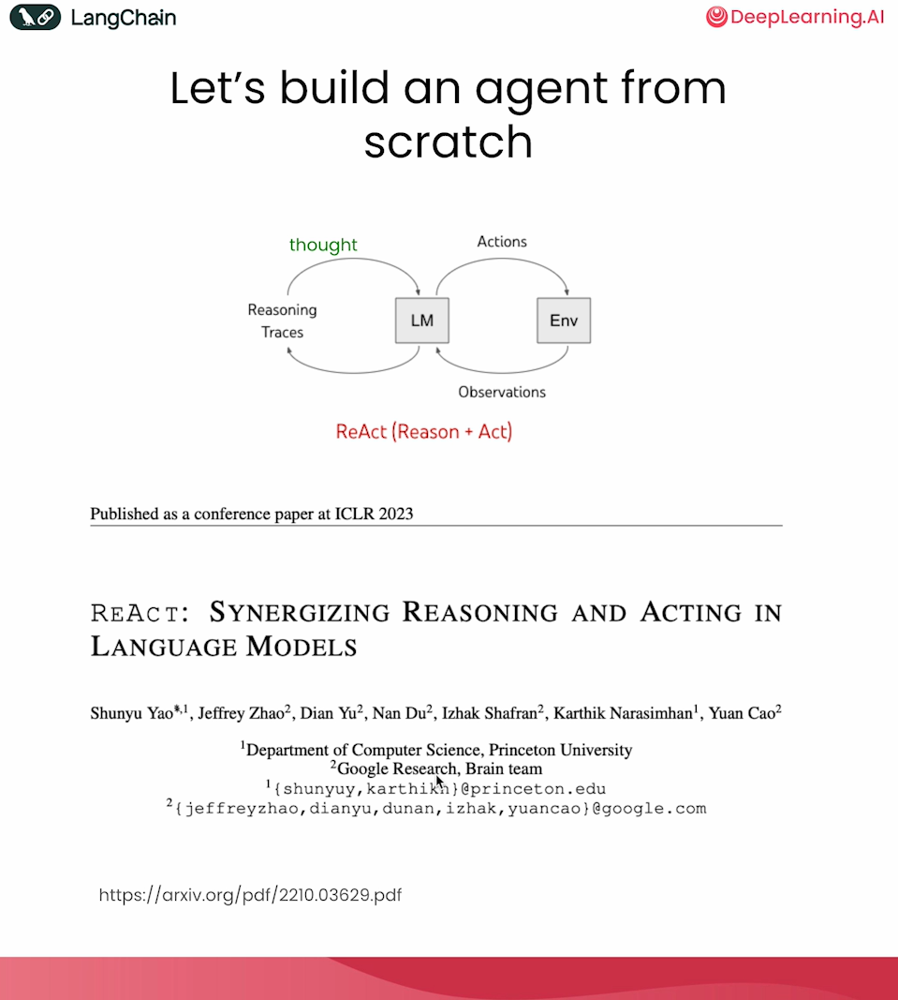
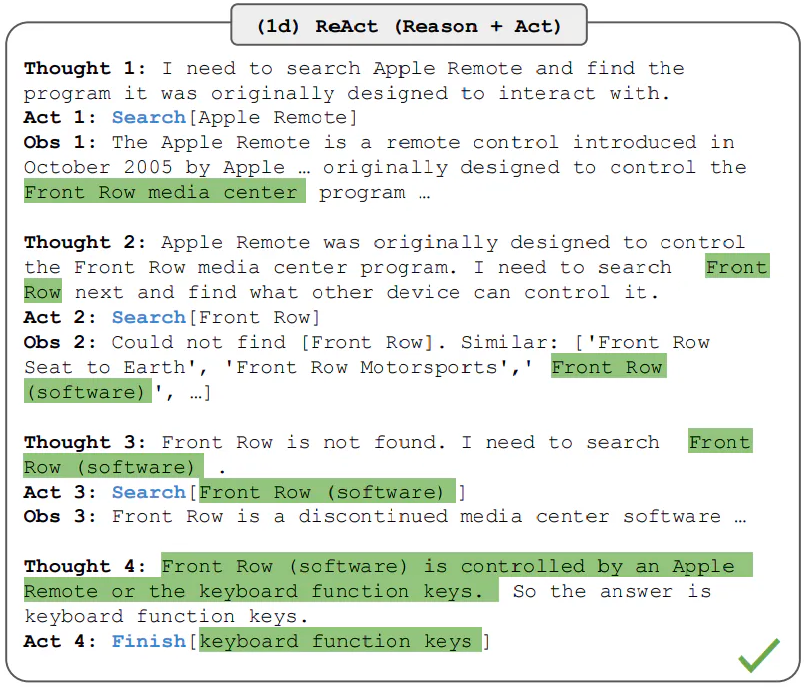

# Simple ReAct Agent from Scratch

搭建一个简单的 ReAct Agent。

## ReAct Agent

based on https://til.simonwillison.net/llms/python-react-pattern

从零开始搭建一个基于 ReAct 的 Agent。



[Yao et al.](https://arxiv.org/abs/2210.03629) 在 2022 年提出一种称为 ReAct 的框架。该框架允许大语言模型(LLM)以交织的方式生成 reasoning traces 和 task-specific actions 的动作。

生成推理轨迹（reasoning traces）使模型能够诱导、跟踪和更新行动计划，甚至处理例外情况。动作步骤允许模型与外部资源(如知识库或环境)进行交互并获取信息。

ReAct 框架可以让 LLM 与外部工具进行交互，以检索可导致更可靠和事实性响应的额外信息。

结果表明，ReAct 可以在语言和决策任务上优于一些最先进的基线模型。ReAct 还提高了 LLM 的可解释性和可信度。总的来说，作者发现最佳方法是将 ReAct 与 Chain-of-Thought (CoT) 相结合，这允许使用内部知识和在推理过程中获得的外部信息。

## ReAct 如何工作？

ReAct 受到了 "acting" 和 "reasoning" 之间协同效应的启发，这种协同效应允许人类学习新任务并做出决策或进行推理。

Chain-of-Thought (CoT) 提示已经展示了 LLM 执行推理轨迹以生成涉及算术和常识推理等任务的答案的能力(Wei 等人，2022)。但是，缺乏对外部世界的访问或无法更新其知识可能会导致事实幻觉和错误传播等问题。

ReAct 是一种将推理和行动与 LLM 相结合的一般范式。ReAct 提示 LLM 为任务生成口语化的推理轨迹和动作。这使系统能够执行动态推理，以创建、维护和调整行动计划，同时还能与外部环境(如 Wikipedia)进行交互，将额外信息纳入推理过程中。下图展示了 ReAct 的一个示例以及执行问答任务的不同步骤。



在上面的示例中，我们用了一个来自 HotpotQA 的问题作为 prompt:

```
Aside from the Apple Remote, what other devices can control the program Apple Remote was originally designed to interact with?
```

请注意，在上下文中也添加了示例，但我们在此处为简单起见将其省略。我们可以看到，模型生成了任务解决轨迹(思考，行动)。Obs 对应于正在交互的环境(如搜索引擎)的观察结果。本质上，ReAct 可以检索信息以支持推理，而推理有助于确定下一步应该检索什么。

## 代码

使用 GLM4。

```
import openai
import re
import httpx
import os
import json
from openai import OpenAI

base_url = "https://open.bigmodel.cn/api/paas/v4"
api_key = "xxx.xxx"
model_name = "glm-4-air"

client = OpenAI(api_key=api_key, base_url=base_url)

chat_completion = client.chat.completions.create(
    model=model_name,
    messages=[{"role": "user", "content": "Hello world"}]
)

print(chat_completion.choices[0].message.content)

class Agent:
    def __init__(self, system=""):
        self.system = system
        self.messages = []
        if self.system:
            self.messages.append({"role": "system", "content": system})

    def __call__(self, message):
        self.messages.append({"role": "user", "content": message})
        result = self.execute()
        self.messages.append({"role": "assistant", "content": result})
        return result

    def execute(self):
        completion = client.chat.completions.create(
                        model="glm-4-air",
                        temperature=0.1,
                        messages=self.messages)
        return completion.choices[0].message.content

prompt = """
You run in a loop of Thought, Action, PAUSE, Observation.
At the end of the loop you output an Answer
Use Thought to describe your thoughts about the question you have been asked.
Use Action to run one of the actions available to you - then return PAUSE.
Observation will be the result of running those actions.

Your available actions are:

calculate:
e.g. calculate: 4 * 7 / 3
Runs a calculation and returns the number - uses Python so be sure to use floating point syntax if necessary

average_dog_weight:
e.g. average_dog_weight: Collie
returns average weight of a dog when given the breed

Example session:

Question: How much does a Bulldog weigh?
Thought: I should look the dogs weight using average_dog_weight
Action: average_dog_weight: Bulldog
PAUSE

You will be called again with this:

Observation: A Bulldog weights 51 lbs

You then output:

Answer: A bulldog weights 51 lbs
""".strip()


def calculate(what):
    return eval(what)

def average_dog_weight(name):
    if name in "Scottish Terrier":
        return("Scottish Terriers average 20 lbs")
    elif name in "Border Collie":
        return("a Border Collies average weight is 37 lbs")
    elif name in "Toy Poodle":
        return("a toy poodles average weight is 7 lbs")
    else:
        return("An average dog weights 50 lbs")

known_actions = {
    "calculate": calculate,
    "average_dog_weight": average_dog_weight
}


abot = Agent(prompt)
result = abot("How much does a toy poodle weigh?")
print(result)
"""
Thought: I should find out the average weight of a toy poodle using the average_dog_weight function.
Action: average_dog_weight: Toy Poodle
PAUSE
"""

result = average_dog_weight("Toy Poodle")
next_prompt = "Observation: {}".format(result)
abot(next_prompt)
print(json.dumps(abot.messages, indent=4))
"""
[
    {
        "role": "system",
        "content": "You run in a loop of Thought, Action, PAUSE, Observation.\nAt the end of the loop you output an Answer\nUse Thought to describe your thoughts about the question you have been asked.\nUse Action to run one of the actions available to you - then return PAUSE.\nObservation will be the result of running those actions.\n\nYour available actions are:\n\ncalculate:\ne.g. calculate: 4 * 7 / 3\nRuns a calculation and returns the number - uses Python so be sure to use floating point syntax if necessary\n\naverage_dog_weight:\ne.g. average_dog_weight: Collie\nreturns average weight of a dog when given the breed\n\nExample session:\n\nQuestion: How much does a Bulldog weigh?\nThought: I should look the dogs weight using average_dog_weight\nAction: average_dog_weight: Bulldog\nPAUSE\n\nYou will be called again with this:\n\nObservation: A Bulldog weights 51 lbs\n\nYou then output:\n\nAnswer: A bulldog weights 51 lbs"
    },
    {
        "role": "user",
        "content": "How much does a toy poodle weigh?"
    },
    {
        "role": "assistant",
        "content": "Thought: I should find out the average weight of a toy poodle using the average_dog_weight function.\nAction: average_dog_weight: Toy Poodle\nPAUSE"
    },
    {
        "role": "user",
        "content": "Observation: a toy poodles average weight is 7 lbs"
    },
    {
        "role": "assistant",
        "content": "Answer: A toy poodle weighs an average of 7 lbs."
    }
]
"""


abot = Agent(prompt)
question = """I have 2 dogs, a border collie and a scottish terrier. \
What is their combined weight"""
abot(question)

next_prompt = "Observation: {}".format(average_dog_weight("Border Collie"))
print(next_prompt)

abot(next_prompt)
next_prompt = "Observation: {}".format(average_dog_weight("Scottish Terrier"))
print(next_prompt)

abot(next_prompt)
next_prompt = "Observation: {}".format(eval("37 + 20"))
print(next_prompt)

abot(next_prompt)
print(json.dumps(abot.messages, indent=4))
"""
[
    {
        "role": "system",
        "content": "You run in a loop of Thought, Action, PAUSE, Observation.\nAt the end of the loop you output an Answer\nUse Thought to describe your thoughts about the question you have been asked.\nUse Action to run one of the actions available to you - then return PAUSE.\nObservation will be the result of running those actions.\n\nYour available actions are:\n\ncalculate:\ne.g. calculate: 4 * 7 / 3\nRuns a calculation and returns the number - uses Python so be sure to use floating point syntax if necessary\n\naverage_dog_weight:\ne.g. average_dog_weight: Collie\nreturns average weight of a dog when given the breed\n\nExample session:\n\nQuestion: How much does a Bulldog weigh?\nThought: I should look the dogs weight using average_dog_weight\nAction: average_dog_weight: Bulldog\nPAUSE\n\nYou will be called again with this:\n\nObservation: A Bulldog weights 51 lbs\n\nYou then output:\n\nAnswer: A bulldog weights 51 lbs"
    },
    {
        "role": "user",
        "content": "I have 2 dogs, a border collie and a scottish terrier. What is their combined weight"
    },
    {
        "role": "assistant",
        "content": "Thought: I need to find the average weight of a border collie and a scottish terrier, then add them together to get the combined weight.\n\nAction: average_dog_weight: Border Collie\nPAUSE"
    },
    {
        "role": "user",
        "content": "Observation: a Border Collies average weight is 37 lbs"
    },
    {
        "role": "assistant",
        "content": "Thought: Now I need to find the average weight of a Scottish Terrier.\n\nAction: average_dog_weight: Scottish Terrier\nPAUSE"
    },
    {
        "role": "user",
        "content": "Observation: Scottish Terriers average 20 lbs"
    },
    {
        "role": "assistant",
        "content": "Thought: Now that I have the average weights of both a Border Collie and a Scottish Terrier, I can add them together to find the combined weight.\n\nAction: calculate: 37 + 20\nPAUSE"
    },
    {
        "role": "user",
        "content": "Observation: 57"
    },
    {
        "role": "assistant",
        "content": "Answer: The combined weight of a Border Collie and a Scottish Terrier is 57 lbs."
    }
]
"""
```

### 使用一个 Loop

```
action_re = re.compile('^Action: (\w+): (.*)$')   # python regular expression to selection action

def query(question, max_turns=5):
    i = 0
    bot = Agent(prompt)
    next_prompt = question
    while i < max_turns:
        i += 1
        result = bot(next_prompt)
        print(result)
        actions = [
            action_re.match(a)
            for a in result.split('\n')
            if action_re.match(a)
        ]
        if actions:
            # There is an action to run
            action, action_input = actions[0].groups()
            if action not in known_actions:
                raise Exception("Unknown action: {}: {}".format(action, action_input))
            print(" -- running {} {}".format(action, action_input))
            observation = known_actions[action](action_input)
            print("Observation:", observation)
            next_prompt = "Observation: {}".format(observation)
        else:
            print(json.dumps(bot.messages, indent=4))
            return
    print(json.dumps(bot.messages, indent=4))

question = """I have 2 dogs, a border collie and a scottish terrier. \
What is their combined weight"""
query(question)

```

运行结果：

```
Thought: I need to find the average weight of both a border collie and a scottish terrier, then add those weights together to get the combined weight.

Action: average_dog_weight: Border Collie
PAUSE
 -- running average_dog_weight Border Collie
Observation: a Border Collies average weight is 37 lbs
Thought: Now I have the average weight of the border collie. Next, I need to find the average weight of the scottish terrier.

Action: average_dog_weight: Scottish Terrier
PAUSE
 -- running average_dog_weight Scottish Terrier
Observation: Scottish Terriers average 20 lbs
Thought: Now that I have the average weights for both the border collie and the scottish terrier, I can add them together to find their combined average weight.

Action: calculate: 37 + 20
PAUSE
 -- running calculate 37 + 20
Observation: 57
Answer: The combined average weight of a border collie and a scottish terrier is 57 lbs.


[
    {
        "role": "system",
        "content": "You run in a loop of Thought, Action, PAUSE, Observation.\nAt the end of the loop you output an Answer\nUse Thought to describe your thoughts about the question you have been asked.\nUse Action to run one of the actions available to you - then return PAUSE.\nObservation will be the result of running those actions.\n\nYour available actions are:\n\ncalculate:\ne.g. calculate: 4 * 7 / 3\nRuns a calculation and returns the number - uses Python so be sure to use floating point syntax if necessary\n\naverage_dog_weight:\ne.g. average_dog_weight: Collie\nreturns average weight of a dog when given the breed\n\nExample session:\n\nQuestion: How much does a Bulldog weigh?\nThought: I should look the dogs weight using average_dog_weight\nAction: average_dog_weight: Bulldog\nPAUSE\n\nYou will be called again with this:\n\nObservation: A Bulldog weights 51 lbs\n\nYou then output:\n\nAnswer: A bulldog weights 51 lbs"
    },
    {
        "role": "user",
        "content": "I have 2 dogs, a border collie and a scottish terrier. What is their combined weight"
    },
    {
        "role": "assistant",
        "content": "Thought: I need to find the average weight of both a border collie and a scottish terrier, then add those weights together to get the combined weight.\n\nAction: average_dog_weight: Border Collie\nPAUSE"
    },
    {
        "role": "user",
        "content": "Observation: a Border Collies average weight is 37 lbs"
    },
    {
        "role": "assistant",
        "content": "Thought: Now I have the average weight of the border collie. Next, I need to find the average weight of the scottish terrier.\n\nAction: average_dog_weight: Scottish Terrier\nPAUSE"
    },
    {
        "role": "user",
        "content": "Observation: Scottish Terriers average 20 lbs"
    },
    {
        "role": "assistant",
        "content": "Thought: Now that I have the average weights for both the border collie and the scottish terrier, I can add them together to find their combined average weight.\n\nAction: calculate: 37 + 20\nPAUSE"
    },
    {
        "role": "user",
        "content": "Observation: 57"
    },
    {
        "role": "assistant",
        "content": "Answer: The combined average weight of a border collie and a scottish terrier is 57 lbs."
    }
]

```

## 参考文献
- https://learnprompting.org/zh-Hans/docs/advanced_applications/react
- https://til.simonwillison.net/llms/python-react-pattern
- https://learn.deeplearning.ai/courses/ai-agents-in-langgraph/lesson/2/build-an-agent-from-scratch
- https://www.promptingguide.ai/techniques/react