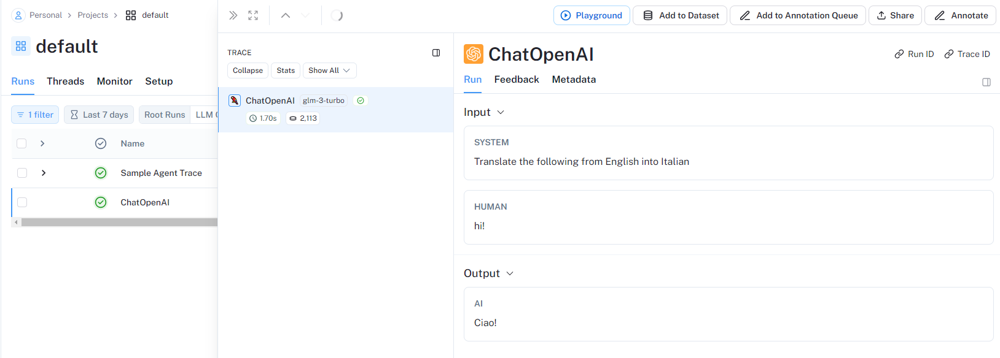
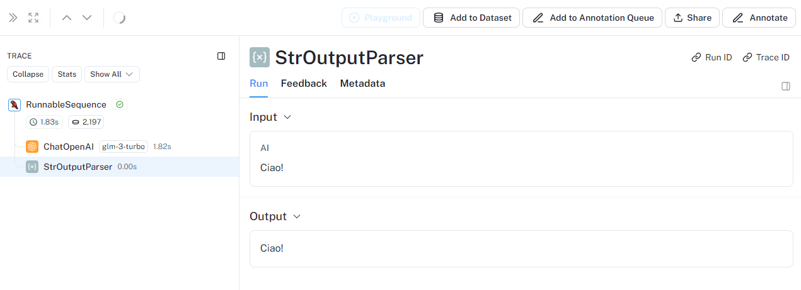
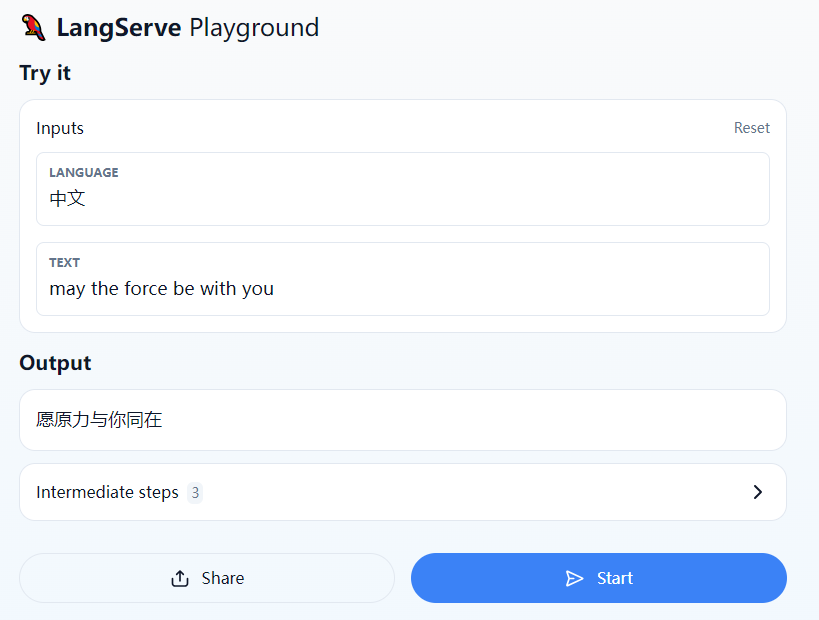

# Build a Simple LLM Application

在这个快速入门指南中，我们将展示如何构建一个简单的大语言模型应用程序。这个应用程序将把文本从英语翻译成其他语言。这是一个相对简单的大语言模型应用程序，它只需要一次大语言模型调用加上一些提示。尽管如此，这仍然是一个很好的开始使用 LangChain 的方式 - 只需要一些提示和大语言模型调用，就可以构建很多功能！

## Concepts
将涵盖以下概念:
- 使用语言模型
- 使用 PromptTemplates 和 OutputParsers
- 使用 LangChain 来串联 PromptTemplate、LLM 和 OutputParser
- 使用 LangSmith 对应用程序进行调试和跟踪
- 使用 LangServe 部署应用程序

## Setup
- Jupyter Notebook
- pip install langchain
- LangSmith
  - 使用 LangChain 构建的许多应用程序都包含多个步骤，需要多次调用大语言模型(LLM)。随着应用程序变得越来越复杂，能够检查链条或代理内部究竟发生了什么变得至关重要。实现这一目标的最佳方式就是使用 LangSmith。
  - 生成 token 后配置环境变量
  ```
  export LANGCHAIN_TRACING_V2="true"
  export LANGCHAIN_API_KEY="..."
  ```
  ```
  import getpass
  import os

  os.environ["LANGCHAIN_TRACING_V2"] = "true"
  os.environ["LANGCHAIN_API_KEY"] = "API-Key"
  ```

## 代码

这里以 Chatglm 为例。

```
from langchain.chat_models import ChatOpenAI
from langchain.schema import HumanMessage, SystemMessage, AIMessage

api_key = "xxx.xxx"
server_url = "https://open.bigmodel.cn/api/paas/v4"

model = ChatOpenAI(
    model="glm-3-turbo",
    openai_api_key=api_key,
    openai_api_base=server_url,
    max_tokens=100,
    temperature=0.7,
)

from langchain_core.messages import HumanMessage, SystemMessage

messages = [
    SystemMessage(content="Translate the following from English into Italian"),
    HumanMessage(content="hi!"),
]

model.invoke(messages)

```

```
AIMessage(content='Ciao!', response_metadata={'token_usage': {'completion_tokens': 5, 'prompt_tokens': 2014, 'total_tokens': 2019}, 'model_name': 'glm-3-turbo', 'system_fingerprint': None, 'finish_reason': 'stop', 'logprobs': None}, id='run-227beb4f-0e0b-42cb-b910-34746b36c764-0')
```

如果使用了 LangSmith，登录到 LangSmith 上可以看到相关的 Trace。




## OutputParsers

上面的模型的响应是一个 AIMessage。这包含一个字符串响应以及关于该响应的其他元数据。很多时候，我们可能只想使用字符串响应。我们可以使用一个简单的输出解析器来提取出这个响应。

```
from langchain_core.output_parsers import StrOutputParser

parser = StrOutputParser()

result = model.invoke(messages)

parser.invoke(result)
```

```
'Ciao!'
```

更常见的是，我们可以将这个输出解析器与模型"串联（chain）"起来。这意味着这个输出解析器将在这个 chain 中每次都被调用。这个 chain 接受语言模型的输入类型(字符串或消息列表)，并返回输出解析器的输出类型(字符串)。

我们可以使用 `|` 运算符轻松创建这个 chain。LangChain 中使用 `|` 运算符来将两个元素组合在一起。

```
chain = model | parser
chain.invoke(messages)
```

如果使用了 LangSmith，我们可以看到这个链条有两个步骤：首先调用语言模型，然后将其结果传递给输出解析器。




## Prompt Templates

目前，我们正在直接将一个消息列表传递给语言模型。这个消息列表是从何处来的呢？通常情况下，它是由用户输入和应用程序逻辑的组合构造而成的。这个应用程序逻辑通常会取原始的用户输入，并将其转换成一个准备传递给语言模型的消息列表。常见的转换包括添加系统消息或使用用户输入格式化模板。

PromptTemplates 是 LangChain 中的一个概念，旨在帮助完成这种转换。它们接受原始的用户输入，并返回准备传递给语言模型的数据(提示)。

让我们在这里创建一个 PromptTemplate。它将接受两个用户变量:

- language: 要翻译成的语言
- text: 要翻译的文本

```
from langchain_core.prompts import ChatPromptTemplate

system_template = "Translate the following into {language}:"

prompt_template = ChatPromptTemplate.from_messages(
    [("system", system_template), ("user", "{text}")]
)

result = prompt_template.invoke({"language": "italian", "text": "hi"})
# ChatPromptValue(messages=[SystemMessage(content='Translate the following into italian:'), HumanMessage(content='hi')])

result.to_messages()
# [SystemMessage(content='Translate the following into italian:'),
# HumanMessage(content='hi')]

chain = prompt_template | model | parser
chain.invoke({"language": "italian", "text": "hi"})

```

## Serving with LangServe

既然我们已经构建了一个应用程序，接下来就需要部署它。这就是 LangServe 发挥作用的地方。LangServe 能帮助开发者将 LangChain 的 Chains 部署为 REST API。你并不需要使用 LangServe 来使用 LangChain，但在这个指南中，我们会演示如何使用 LangServe 部署你的应用程序。

虽然这个指南的第一部分是打算在 Jupyter Notebook 或脚本中运行的，但我们现在要转移出来了。我们将创建一个 Python 文件，然后从命令行与之进行交互。

安装：
```
pip install "langserve[all]"
```

为了创建我们应用程序的服务器，我们将制作一个 serve.py 文件。这个文件将包含我们提供应用程序的逻辑，它由以下三个部分组成:
- 之前构建的链条的定义
- FastAPI 应用程序
- 使用 langserve.add_routes 定义一个路由来提供这个 Chain

```
#!/usr/bin/env python
from typing import List

from fastapi import FastAPI
from langchain_core.prompts import ChatPromptTemplate
from langchain_core.output_parsers import StrOutputParser
from langchain_openai import ChatOpenAI
from langserve import add_routes

# 1. Create prompt template
system_template = "Translate the following into {language}:"
prompt_template = ChatPromptTemplate.from_messages([
    ('system', system_template),
    ('user', '{text}')
])

# 2. Create model
model = ChatOpenAI()

# 3. Create parser
parser = StrOutputParser()

# 4. Create chain
chain = prompt_template | model | parser


# 4. App definition
app = FastAPI(
  title="LangChain Server",
  version="1.0",
  description="A simple API server using LangChain's Runnable interfaces",
)

# 5. Adding chain route

add_routes(
    app,
    chain,
    path="/chain",
)

if __name__ == "__main__":
    import uvicorn

    uvicorn.run(app, host="0.0.0.0", port=8000)
```

执行
```
python serve.py
```
```
INFO:     Started server process [3847]
INFO:     Waiting for application startup.

 __          ___      .__   __.   _______      _______. _______ .______     ____    ____  _______
|  |        /   \     |  \ |  |  /  _____|    /       ||   ____||   _  \    \   \  /   / |   ____|
|  |       /  ^  \    |   \|  | |  |  __     |   (----`|  |__   |  |_)  |    \   \/   /  |  |__
|  |      /  /_\  \   |  . `  | |  | |_ |     \   \    |   __|  |      /      \      /   |   __|
|  `----./  _____  \  |  |\   | |  |__| | .----)   |   |  |____ |  |\  \----.  \    /    |  |____
|_______/__/     \__\ |__| \__|  \______| |_______/    |_______|| _| `._____|   \__/     |_______|

LANGSERVE: Playground for chain "/chain/" is live at:
LANGSERVE:  │
LANGSERVE:  └──> /chain/playground/
LANGSERVE:
LANGSERVE: See all available routes at /docs/

```
现在我们的 Chain 被部署到  http://localhost:8000。

## Playground
每个 LangServe 服务都带有一个简单的内置 UI，用于配置和调用应用程序，支持流式输出和查看中间步骤。请访问 http://localhost:8000/chain/playground/ 来试一试!



## Client
现在让我们设置一个客户端，以编程方式与我们的服务进行交互。我们可以很容易地使用 langserve.RemoteRunnable 来实现这一点。通过使用它，我们可以与提供的 Chain 进行交互，就像它在客户端运行一样。

```
from langserve import RemoteRunnable

remote_chain = RemoteRunnable("http://localhost:8000/chain/")
print(remote_chain.invoke({"language": "chinese", "text": "May the force be with you!"}))
```

## Conclusion

在这个教程中，我们一起学习了如何创建我们的第一个简单的 LLM 应用程序。我们了解了如何使用语言模型、如何解析它们的输出、如何创建提示模板、如何通过 LangSmith 深入了解我们创建的链条，以及如何使用 LangServe 部署它们。

## 参考文献
- https://python.langchain.com/v0.2/docs/tutorials/llm_chain/
- https://python.langchain.com/v0.2/docs/langserve/