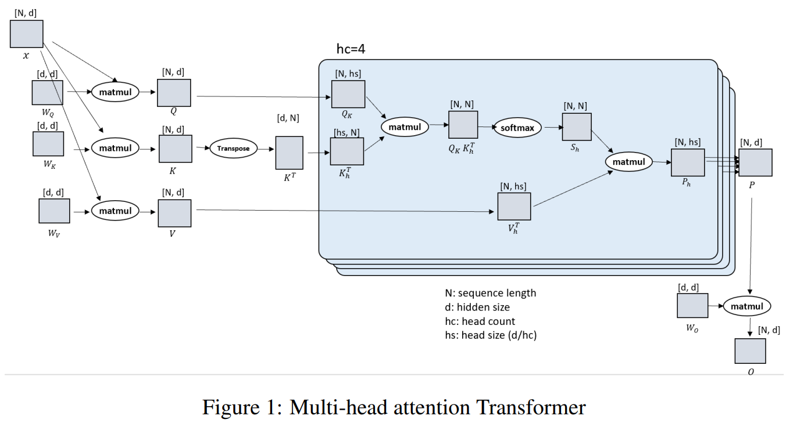
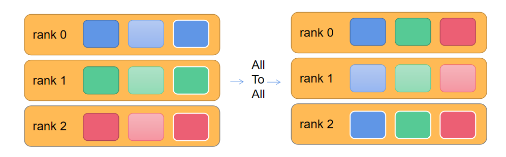
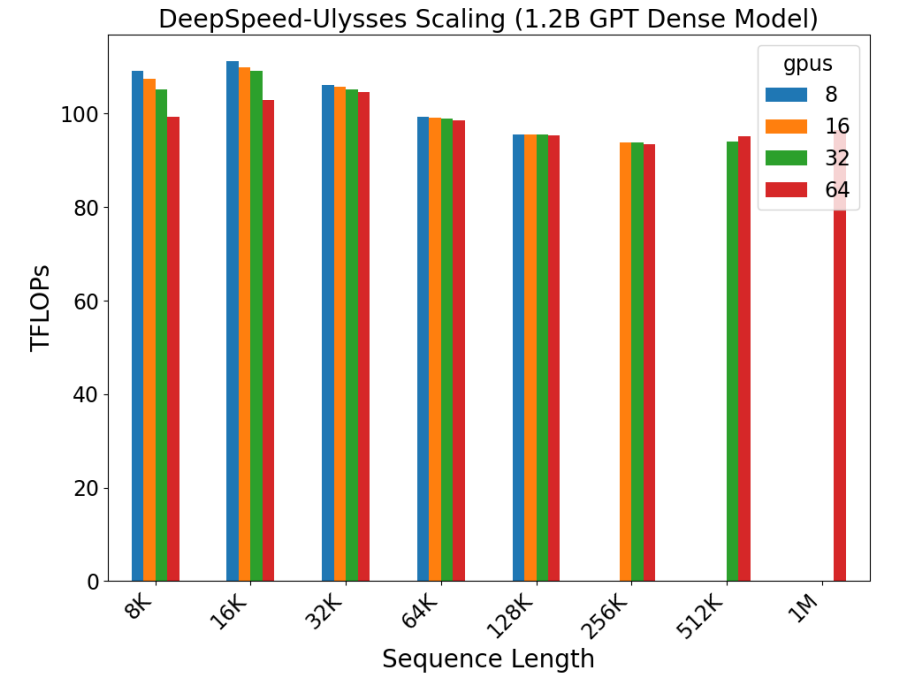

# DeepSpeed-Ulysses

[DeepSpeed Ulysses: System Optimizations for Enabling Training of Extreme Long Sequence Transformer Models](https://arxiv.org/abs/2309.14509)

## Introduction

在本文中，我们介绍了 DeepSpeed-Ulysses（或称为 Ulysses，一本非常长的小说），这是一种简单、可移植和有效的方法，可以实现高效且可扩展的长序列语言模型（LLM）训练。

DeepSpeed-Ulysses 将每个样本沿着序列维度划分到参与训练的多个 GPU 上。在进行注意力计算之前，它使用 all-to-all 的通信集合在被划分的 Q、K 和 V 上，以便每个 GPU 接收完整的序列，但只用于一组不重叠的注意力头部。这使得参与训练的 GPU 可以并行计算不同的注意力头部。最后，DeepSpeed-Ulysses 使用另一个 all-to-all 的操作，将结果沿着注意力头部进行聚集，同时重新沿着序列维度进行划分。

DeepSpeed-Ulysses 训练 Transformer 模型的序列长度比现有系统大 4 倍，同时能够训练包含超过一百万个 Token 的序列。
- 与现有系统相比，通信量减少了 10 倍以上，从而提高了吞吐量高达 2.5 倍，并保持了超过 175 TFlops/GPU（超过硬件峰值的 54%）的持续吞吐量。
- 完全通用且实现无关的注意力：DeepSpeed 序列并行（Ulysses）支持稠密和稀疏注意力，并且可以与高效的注意力实现（如 FlashAttention v2 [Dao, 2023]）一起使用。
- 支持大规模模型训练：DeepSpeed 序列并行不仅支持大序列长度，还支持大规模模型大小，与 ZeRO-3 配合使用。
- 易于使用和可移植，对现有训练框架的代码修改需求最小。

## Transformer Architecture

Transformer 将输入序列投影为查询（Q）、键（K）和值（V）embeddings 的序列组成。

QKV 通常是一个大小为 N、b、d 的三维张量，其中 N 是序列长度，b 是 micro batch size，d是 hidden dimension。

QKV 张量被输入到注意力块，这是 Transformer 模型的核心组件。注意力的输出是Transformer 架构中多层感知器（MLP）或 position-wise feed-forward的输入。

## 系统设计

与已知的 Transformer 架构类似，该设计包括将输入序列 N 划分到 P 个可用设备上。每个本地的 N/P 划分被投影为查询（Q）、键（K）和值（V）embeddings。接下来，通过参与计算设备之间高度优化的 all-to-all 集合操作，将 (QKV) embeddings 收集到全局 QKV 中。在 all-to-all 集合之后，按 head 计算注意力，形式如下：

$$ Outputcontext = Softmax( (QK^T)/ \sqrt{d} ) V $$

在注意力计算之后，另一个 all-to-all 集合操作将注意力计算的输出上下文张量转换为序列（N/P）并行形式，以供 Transformer 层块中其余模块的后续操作（MLP 矩阵乘法、层归一化等）使用。

DeepSpeed- Ulysses 的核心在于切分 Q、K、V 后进行的 All-to-All 通信方式，这个通信方式同 Allreduce 一样，是分布式训练中的 Collective functions，All-to-All 在每个进程向每个其他进程发消息的一部分，最后处理器拥有各个进程消息的一部分。他的作用相当于分布式转置  Transpose 操作。

缺点：Ulysses也有明显缺点，就是转置后切分维度 d/P，我们希望 d/P=hc/P * head_size，即对 head_cnt 所在维度切分，这样 Attention 的计算都在一张卡上完成，从而可以使用 FlashAttention 等单卡优化。但是如果遇到 GQA 或者 MQA 情况，K、V 的 head_cnt 很小，导致 GPU 数目 P 也不能变得很大。

## 评估

第一组实验是在 1.2B 参数的 GPT 模型上对序列长度进行强扩展，最多达到 100 万个 Token。DeepSpeed 序列并行性允许随着 GPU 数量的增加线性增加序列长度，并且序列长度与 GPU 数量相对线性缩放，并在适当的 GPU 数量下保持类似的计算吞吐量。

## 参考文献
- https://juejin.cn/post/7357917500963258378
- https://zhuanlan.zhihu.com/p/689067888