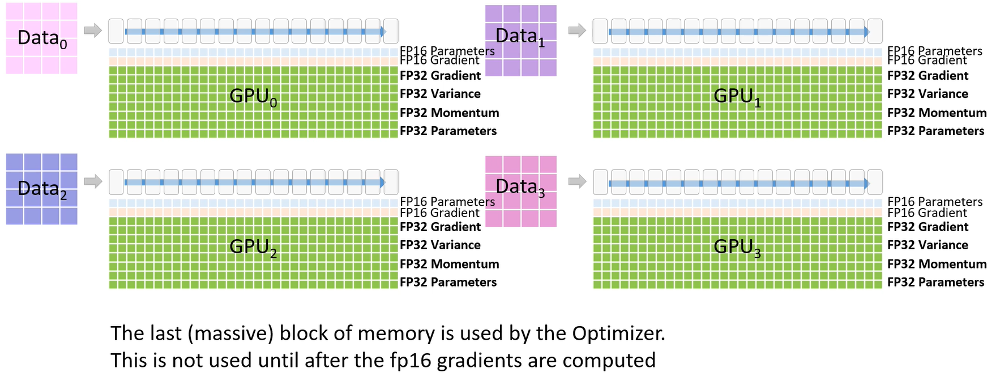

# Zero Redundancy Optimizer

论文：[ZeRO: Memory Optimizations Toward Training Trillion Parameter Models](https://arxiv.org/pdf/1910.02054.pdf)

微软开发了 ZeRO(Zero Redundancy Optimizer) 来克服数据并行和模型并行的局限性，并同时实现两者的优点。ZeRO 通过将模型状态（参数、梯度和优化器状态）在数据并行进程之间进行分割，而不是复制，来消除数据并行进程之间的内存冗余。在训练过程中，它使用动态通信调度来在分布式设备之间共享必要的状态，以保持数据并行性的计算粒度和通信量。

称之为基于 ZeRO 的数据并行性，它允许每个设备的内存使用与数据并行性的程度成线性比例增长，并且产生与数据并行性相似的通信量。基于 ZeRO 的数据并行性可以适应任意大小的模型，只要聚合的设备内存足够大以共享模型状态即可。

## 模型状态: Optimizer, Gradients 和 Parameters

在训练过程中，大部分设备内存被模型状态消耗。以 Adam 为例，Adam 是深度学习训练中最流行的优化器之一。Adam 需要存储两个优化器状态，来更新梯度。

- time averaged momentum (一阶移动平均动量)
- variance of the gradients （二阶梯度方差）

因此，为了使用 Adam 训练模型，必须有足够的内存来存储动量和梯度方差的副本。此外，还需要足够的内存来存储梯度和权重本身。在这三种与参数相关的张量中，优化器状态通常消耗最多的内存，尤其是在应用混合精度训练时。

### 混合精度训练 (Mixed-Precision Training)

在当前一代 NVIDIA GPU 上，训练大型模型的最先进方法是使用混合精度（fp16/32）训练，其中参数和激活以 fp16 格式存储，从而可以利用这些 GPU 上的高吞吐量张量核心单元 (tensor core unit)。在混合精度训练中，前向传播和反向传播都使用 fp16 的权重和激活进行。然而，为了在反向传播结束时有效地计算和应用更新，混合精度优化器会保留参数的 fp32 副本以及所有其他优化器状态的 fp32 副本。

以 Adam 作为具体示例。对于使用 Adam 进行混合精度训练的具有 $\Psi$ 个参数的模型，需要足够的内存来存储参数和梯度的 fp16 副本，分别需要 $2\Psi$ 字节和 $2\Psi$ 字节的内存。此外，还需要存储优化器状态：参数、动量和方差的 fp32 副本，分别需要 $4\Psi$ 字节、$4\Psi$ 字节和 $4\Psi$ 字节的内存。让我们用 $K$ 来表示优化器状态的内存乘数，即额外存储它们所需的内存为 $K\Psi$ 字节。混合精度 Adam 的 K 值为 12。总共，这将导致 $2\Psi + 2\Psi + K\Psi = 16\Psi$ 字节的内存需求。对于像 GPT-2 这样拥有 1.5B 个参数的模型，这将导致至少需要 16 * 1.5B = 24GB 的内存，这远远高于仅需要存储 fp16 参数的微薄 3GB 内存需求。

### 剩余内存消耗 (Residual Memory Consumption)

#### 激活值 (Activations)

在训练过程中，激活值可以占用大量的内存。以一个具体的例子来说，使用 1K 序列长度和批量大小 32 进行训练的 1.5B 参数的 GPT-2 模型大约需要 60GB 的内存。激活检查点(Activation checkpointing)，或激活值重新计算（activation recomputation）是一种常见的方法，通过牺牲 33% 的重新计算开销，减少激活值内存的消耗，大约可以减少总激活值数量的平方根。这将把该模型的激活值内存消耗减少到约 8GB。

尽管有了显著的减少，即使使用激活检查点，对于更大的模型来说，激活值内存仍然可能变得非常庞大。例如，一个类似于 GPT 的拥有 100B 参数的模型，在批量大小为 32 时，仍然需要约 60GB 的内存，即使使用激活检查点。

#### 临时缓冲区(Temporary buffers)

用于存储中间结果的临时缓冲区对于大型模型来说会消耗相当大的内存。在进行诸如梯度 all-reduce 或梯度范数计算等操作之前，通常会将所有梯度融合到一个扁平化的缓冲区中，以提高吞吐量。例如，跨设备的  all-reduce 带宽会随着较大的消息大小而提高。虽然梯度本身通常存储为 fp16 张量，但融合的缓冲区可能是一个 fp32 张量，具体取决于操作类型。当模型的大小较大时，这些临时缓冲区的大小就变得非常重要。例如，对于一个拥有 1.5B 个参数的模型，一个扁平化的 fp32 缓冲区将需要 6GB 的内存。

#### 内存碎片化 (Memory Fragmentation)

到目前为止，我们已经讨论了训练过程中的实际内存消耗。此外，即使可用内存充足，仍有可能用尽可用内存。这可能是由内存碎片化引起的。如果没有足够的连续内存来满足内存请求，即使总可用内存大于请求的内存量，内存请求也会失败。我们观察到在训练非常大型模型时存在显著的内存碎片化问题，导致在某些极端情况下，尽管仍有超过 30% 的内存可用，但会出现内存耗尽的问题。

## ZeRO 的三个阶段

ZeRO具有三个主要的优化阶段，对应于优化器状态、梯度和参数的分割。当累积启用时：

图：比较模型状态的每个设备的内存消耗，其中包括三个阶段的 ZeRO-DP 优化。$\Psi$ 表示模型大小（参数数量），$K$ 表示优化器状态的内存乘数，$N_d$ 表示 DP 的程度。在这个例子中，我们假设模型大小为 $\Psi = 7.5B $，DP 程度为 $N_d = 64$，基于 Adam 优化器的混合精度训练，$K = 12$。

- ZerO1：优化器状态分区（$P_{os}$）- 内存减少 4 倍，与数据并行性相同的通信量。
- Zero2：添加梯度分区（$P_{os+g}$）- 内存减少 8 倍，与数据并行性相同的通信量。
- Zero3：添加参数分区（$P_{os+g+p}$）- 内存减少与数据并行性程度 $N_d$ 成线性关系。例如，在 64 个GPU上进行切分（$N_d=64$）将导致内存减少 64 倍。通信量略有增加约50% 。

ZeRO 消除了内存冗余，并使整个集群的全部聚合内存容量可用。启用了所有三个阶段后，ZeRO 可以在仅使用 1024 个 NVIDIA GPU 上训练一个万亿参数的模型。一个具有万亿参数的模型，使用 Adam 等优化器以 16 位精度，需要大约 16TB 的内存来存储优化器状态、梯度和参数。16TB 除以 1024 等于 16GB，这在 GPU 的合理范围内。

## Zero 图例

- 假定有一个 16 层的 Transformer 模型（比如 Turning NLR 或者 BERT Large）

- 使用 4 路数据并行，同时使用 ZeRO3 内存优化

- 每个 GPU 保存了部分的模型参数，梯度和优化器状态。

- 其中包括 FP16 的参数和梯度，FP32 的参数，梯度和优化器状态（这里和 paper 中的描述对不上，增加了梯度的 FP32 值，这样 $K$ 变成了 16）

- 开始训练过程

每个 GPU 负责整个模型中的一部分，同时使用 4 路数据并行的 ZeRO3。

一个 batch 的训练过程。

GPU0 初始化了 M0 部分的参数，然后广播给 GPU1,2,3。

每个 GPU 都有了 M0 阶段的参数，然后用各自的数据进行前向计算。

一旦 M0 阶段前向计算完成，GPU1,2,3 就可以删除 M0 阶段的参数。

同样类似，完成 M1，M2，M3 阶段的前向计算。

- 前向阶段完成后，每个 GPU 基于各自的数据计算 Loss。

- 开始反向传播，从 M3 开始计算。

GPU0,1,2 把它们的 M3 梯度传给 GPU3，GPU3 进行梯度累加计算，然后更新自己保存的 fp16 梯度。

GPU0,1,2 可以删掉它们保存的临时 M3 的梯度和参数。

- 更新优化器状态和参数。

从最新的梯度计算出 fp32 的一阶和二阶动量，然后更新 fp32 的模型参数，然后转换成 fp16。

更新到各自的参数中。

至此完成一次 batch 的前向和反向计算过程。

## 参考文献
- https://www.microsoft.com/en-us/research/blog/zero-deepspeed-new-system-optimizations-enable-training-models-with-over-100-billion-parameters/