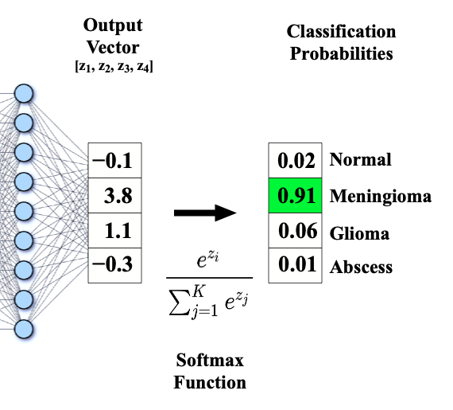

# Llama & Llama2

本文介绍 Llama & Llama2 的演进，其中关键的技术。

## LLaMA

LLaMA (Large Language Model Meta AI) 是 Meta 于 2023 年 2 月发布的大语言模型。2023 年 7 月，Meta 推出了 LLaMA2, repo: https://github.com/facebookresearch/llama。基于 LLaMA 衍生出了大量的下游模型。


来源：[A Survey of Large Language Models](https://arxiv.org/abs/2303.18223)

## LLaMA1 和 LLaMA2 的区别


## LLaMA2 的训练细节

论文：[Llama 2: Open Foundation and Fine-Tuned Chat Models](https://arxiv.org/abs/2307.09288)

论文中提到的训练细节用红框标出


- LLaMA2 的模型

```
LlamaForTextGeneration(
  (model): LlamaModel(
    (embed_tokens): Embedding(32000, 4096, padding_idx=0)
    (layers): ModuleList(
      (0-31): 32 x LlamaDecoderLayer(
        (self_attn): LlamaAttention(
          (q_proj): Linear(in_features=4096, out_features=4096, bias=False)
          (k_proj): Linear(in_features=4096, out_features=4096, bias=False)
          (v_proj): Linear(in_features=4096, out_features=4096, bias=False)
          (o_proj): Linear(in_features=4096, out_features=4096, bias=False)
          (rotary_emb): LlamaRotaryEmbedding()
        )
        (mlp): LlamaMLP(
          (gate_proj): Linear(in_features=4096, out_features=11008, bias=False)
          (up_proj): Linear(in_features=4096, out_features=11008, bias=False)
          (down_proj): Linear(in_features=11008, out_features=4096, bias=False)
          (act_fn): SiLUActivation()
        )
        (input_layernorm): LlamaRMSNorm()
        (post_attention_layernorm): LlamaRMSNorm()
      )
    )
    (norm): LlamaRMSNorm()
  )
  (lm_head): Linear(in_features=4096, out_features=32000, bias=False)
) 
```

## 关键技术

这里简要介绍一下目前 LLaMA 所采用的一些关键技术。

### Tokenizer

- 最常用的三种 tokenize 算法：BPE(Byte-Pair Encoding)，WordPiece 和 SentencePiece。
- tokenizer 对大模型的影响集中在两个方面：
  - 上下文窗口: 这是模型一次可以处理 token 的最大数量。一个句子生成的 token 越少，那么模型可支持的上下文窗口就越大。
  - 训练数据 token: 影响整体的训练数据 token 量，同样影响训练的整个时长。
- LLaMA2 使用与 LLaMA 1 相同的 tokenizer；它采用了一种字节对编码（BPE）算法（Sennrich等，2016），使用了来自 SentencePiece 的实现（Kudo和Richardson，2018）。
  - 将所有数字拆分为单独的数字，并使用字节来分解未知的 UTF-8 字符。
  - 总量为 32000 token。
- BPE(Byte-Pair Encoding)
  - BPE 首先将词分成单个字符，然后依次用另一个字符替换频率最高的一对字符 ，直到循环次数结束。


- OpenAI 的 tokenizer:  https://platform.openai.com/tokenizer
  - This translates to roughly ¾ of a word (so 100 tokens ~= 75 words).


### 位置编码

#### 绝对位置编码
- Sinusoidal 位置编码是在原 Transformer 模型中使用的一种显式编码
- 其中 $p_{k, 2i}$ 和 $p_{k, 2i+1}$ 分别是位置索引第 $k$ 个向量中的第 $2i$ 和 $2i+1$ 个分量。


- 一个长度为 32 的输入序列（每个输入向量的特征维度是 128 ）的 Sinusoidal 编码的可视化如下：


#### RoPE
- 旋转位置编码（Rotary Position Embedding，RoPE）是论文 [Roformer: Enhanced Transformer With Rotray Position Embedding](https://arxiv.org/pdf/2104.09864.pdf) 提出的一种能够将相对位置信息依赖集成到 self-attention 中，并提升 transformer 架构性能的位置编码方式。
- RoPE 具有更好的外推性，目前是大模型相对位置编码中应用最广的方式之一。
- 外推性是指大模型在训练时和预测时的输入长度不一致，导致模型的泛化能力下降的问题。例如，如果一个模型在训练时只使用了 512 个 token 的文本，那么在预测时如果输入超过 512 个 token，模型可能无法正确处理。这就限制了大模型在处理长文本或多轮对话等任务时的效果。
- 论文中提出为了能利用上 token 之间的相对位置信息，假定 query 向量 $q_m$ 和 key 向量 $k_n$ 之间的内积操作可以被一个函数 $g$ 表示，该函数 $g$ 的输入是词嵌入向量 $x_m$,$x_n$ 和它们之间的相对位置$m-n$ 如下, 接下来的目标就是找到一个等价的位置编码方式，从而使得上述关系成立。


- 论文中论证通过向量旋转的方式得到目标函数如下：
  


#### ALiBi
- ALiBi 由论文 Train Short, Test Long: Attention with Linear Biases Enables Input Length Extrapolation 提出。
- 为了有效地实现外推，作者引入了一种称为"注意力线性偏置 (ALiBi)"的方法。ALiBi 根据 token 之间的距离给 attention score 加上一个预设好的偏置矩阵，比如 $q$ 和 $k$ 相对位置差 1 就加上一个 -1 的偏置，两个 token 距离越远这个负数就越大，代表他们的相互贡献越低。由于注意力机制一般会有多个 head，这里针对每一个 head 会乘上一个预设好的斜率项(Slope)。
- 举个例子，原来的注意力矩阵为 $A$，叠加了 ALiBi 后为 $A + mB$ 如下所示：


#### 层归一化

- 相比较于 Transformer，LLAMA 使用了 Pre-LN 的方式，将 LayerNorm 放在了 Attention 之前。
- 同时使用 RMSNorm 替代了 Layer normalization。


##### Layer normalization


##### RMSNorm 


- RMSNorm(Root Mean Square Layer Normalization) 的提出是为了提升 layerNorm 的训练速度提出的。RMSNorm 也是一种 layerNorm，只是归一化的方法不同。相比 layerNorm 中利用均值和方差进行归一化，RMSNorm 利用均方根进行归一化。
- 对于 layerNorm 和 RMSNorm，layerNorm 包含缩放和平移两部分，RMSNorm 去除了平移部分，只保留了缩放部分。有研究认为 layerNorm 取得成功的关键是缩放部分的缩放不变性，而不是平移部分的平移不变性。
- RMSNorm 相比一般的 layerNorm，减少了计算均值和平移系数的部分，训练速度更快，效果基本相当，甚至有所提升。

#### Pre-LN 和 Post-LN
- 论文 [On Layer Normalization in the Transformer Architecture](https://arxiv.org/pdf/2002.04745.pdf) 研究了 Pre-LN 和 Post-LN 的差别。
  - Pre-LN 在不同层的梯度比较均衡，训练会比较稳定


#### 激活函数

- LLaMA 模型在其前馈层中采用了 SwiGLU 激活函数，而不是大多数模型采用的标准 ReLU 函数。


- 论文 GLU Variants Improve Transformer 研究了 GLU 的变体对 Transformer 模型性能的影响。


#### KV Cache


- KV Cache 的全称是 key-value cache，可以简单理解为对大模型前向过程中的 key-value 缓存的优化。
- 不去做 KV Cache，会对大规模推理造成几个压力：(1) 频繁的开辟增加显存；(2) 显存很快就不够用了；(3) 增加了很多冗余矩阵计算量。所以进行 KV 缓存优化是大规模训练、推理里很重要的一个环节。
- KV Cache 采用以空间换时间的思想，复用上次推理的 KV 缓存，可以极大降低内存压力、提高推理性能，而且不会影响任何计算精度。
- 不使用 KV Cache


- 使用 KV Cache


#### Flash Attention


- 在时间复杂度上，Self Attention 对于每个位置需要计算它与所有其他位置的相关性，这样的计算次数会随着序列长度的增加而呈二次增长。
- 在空间复杂度上，Self attention 需要存储一个矩阵来保存所有位置的相关性分数，这个矩阵的大小也会随着序列长度的增加而呈二次增长。
- 因此，对于非常长的序列，这种二次复杂度会导致计算和内存消耗急剧增加，使得模型在处理这样的输入时会变得相对缓慢且需要大量内存。
- 论文 [FlashAttention: Fast and Memory-Efficient Exact Attention with IO-Awareness](https://arxiv.org/pdf/2205.14135.pdf) 提出了 FlashAttention
- Flash Attention 从计算的 GPU 显存的读写优化方面入手来提高 attention 计算的效率。其主要思想是通过分块（tiling）技术，来减少 GPU HBM 和 GPU SRAM 之间的数据读写操作。


- 底层的数学原理



- Softmax 函数分块计算：
  - 假定有一个向量 $x = [x_1, x_2, ..., x_B]$，那么 $softmax(x)$ 等价于如下公式：
    - 先取 $x$ 的最大值，然后每一个 $x_i$ 都减去 $m(x)$，然后计算 $e^{{x_i}- m(x)}$，最后得到和原始的 $softmax(x)$ 等价
  
  - 这时如果有一个向量 $x = [x^{(1)}, x^{(2)}]$，是两个向量的合并，那么 $softmax(x)$ 等价于如下公式：
  

- Flash Attention 算法


#### GQA

- 论文 [GQA: Training Generalized Multi-Query Transformer Models from Multi-Head Checkpoints](https://arxiv.org/pdf/2305.13245.pdf) 提出了 GQA(Group Query Attention)。
- 如前所述，在模型生成回答时，需要前面生成的 KV 缓存起来，来加速计算。多头注意力机制 (MHA) 需要的缓存量很大，Multi-Query Attention 指出多个头之间可以共享 KV 对。Group Query Attention 没有像 MQA 一样极端，将 query 分组，组内共享 KV，效果接近 MHA，速度上与 MQA 相当。


- LLaMA2 的论文中进行了试验对比


- GQA 能够在更大的 batch size 大小下可以实现更高的吞吐量，并且在较小的 batch size 上有等同的延迟


#### AdamW 优化器

- 论文 [Fixing Weight Decay Regularization in Adam](https://openreview.net/forum?id=rk6qdGgCZ) 提出了 AdamW。
- AdamW 是在 Adam+L2 正则化的基础上进行改进的算法。使用 Adam 优化带 L2 正则的损失并不有效，如果引入 L2 正则项，在计算梯度的时候会加上对正则项求梯度的结果。
- 那么如果本身比较大的一些权重对应的梯度也会比较大，由于 Adam 计算步骤中减去项会有除以梯度平方的累积，使得减去项偏小。按常理说，越大的权重应该惩罚越大，但是在 Adam 并不是这样。
- 而权重衰减对所有的权重都是采用相同的系数进行更新，越大的权重显然惩罚越大。


- Adam 和 AdamW 的对比


