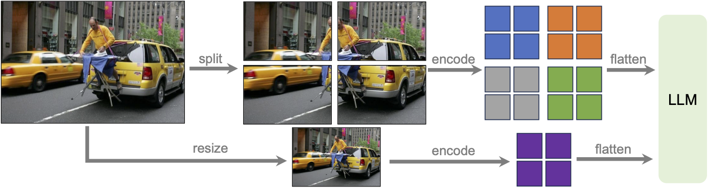
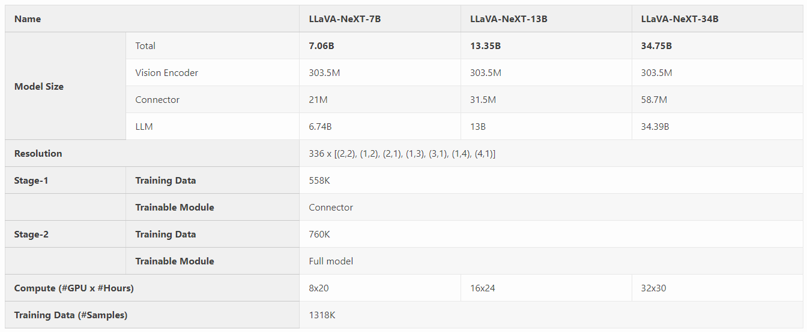
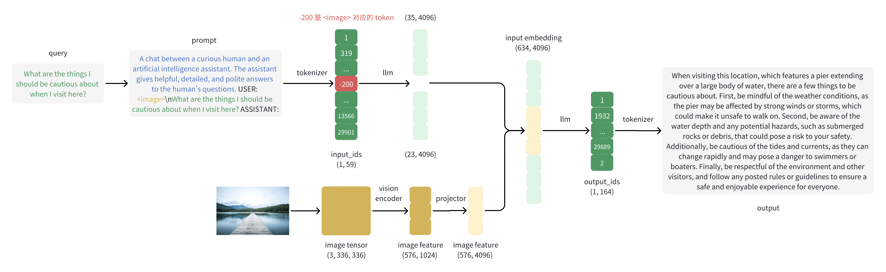

# LLaVA

2024 年 1 月 30 日推出了 LLaVA-NeXT(LLaVA-1.6) 相比较于 LLaVA-1.5(October 2023) 在推理、OCR 和世界知识方面有所改进。

## 比较
相比 LLaVA-1.5，LLaVA-NeXT 有以下几点改进：

- 将输入图像分辨率提高 4 倍的像素。这使得它能够获取更多的视觉细节。它支持三种宽高比，分辨率可达到 $672 \times 672$、$336 \times 1344$、$1344 \times 336$。
- 通过改进的视觉指令调整数据混合，实现更好的视觉推理和 OCR 能力。
- 在更多场景下提供更好的视觉对话，涵盖不同的应用。具备更好的世界知识和逻辑推理能力。
- 使用 SGLang 实现高效的部署和推理。

## 技术细节

- （1）动态高分辨率 (Dynamic High Resolution)
设计模型时采用了高分辨率，以保持其数据效率。当提供高分辨率的图像和保留这些细节的表示时，模型在感知图像的复杂细节方面的能力显著提高。它减少了模型在面对低分辨率图像时猜测想象的视觉内容的错误。采用 `AnyRes(Any Resolution)` 技术旨在适应各种高分辨率的图像。采用了网格配置 $\lbrace2×2,1×\lbrace2,3,4\rbrace,\lbrace2,3,4\rbrace×1\rbrace$，在性能效率和运营成本之间保持平衡。



- （2）数据混合 (Data Mixture)
  - 高质量用户指令数据(High-quality User Instruct Data)：对高质量视觉指令数据的定义依赖于两个主要标准：首先，任务指令的多样性，确保充分代表可能在现实场景中遇到的广泛用户意图，特别是在模型部署阶段。其次，回应的优越性至关重要，目的是征求用户的积极反馈。为了实现这一目标，我们考虑了两个数据来源：(1)现有的 GPT-V 数据，包括 LAION-GPT-V 和 ShareGPT-4V。(2)为了进一步促进更多场景下的更好视觉对话，我们收集了一个小型的 15K 视觉指令微调数据集，涵盖不同的应用。指令和图像来自 LLaVA 演示，是真实用户的请求。我们仔细筛选可能涉及隐私问题或潜在有害的样本，并使用 GPT-4V 生成回应。
  - 多模态文档/图表数据。(1)我们从训练数据中移除了 TextCaps，因为我们意识到 TextCaps 使用与 TextVQA 相同的一组训练图像。这样做可以在开发过程中更好地了解我们的模型在评估 TextVQA 时的零样本OCR能力。为了保持和进一步改进我们模型的 OCR 能力，我们用 DocVQA 和 SynDog-EN 替换了 TextCaps。(2)受到 Qwen-VL-7B-Chat 的启发，我们进一步添加了 ChartQA、DVQA 和 AI2D，以改善对图表和图示的理解能力。

- （3）扩展LLM骨干模型
除了 Vicuna-1.5（7B 和 13B）之外，我们考虑了更多的 LLM，包括 Mistral-7B 和 Nous-Hermes-2-Yi-34B。这些 LLM 具有良好的特性，灵活的商业使用条款，强大的双语支持和更大的语言模型容量。这使得 LLaVA 能够支持更广泛的用户和社区中的更多场景。LLaVA 的设计适用于各种 LLM，并且与 LLM 的容量可扩展到 34B 的规模。




## 执行模型

```
from llava.model.builder import load_pretrained_model
from llava.mm_utils import get_model_name_from_path
from llava.eval.run_llava import eval_model

model_path = "llava-v1.5-7b" # or llava-v1.6-vicuna-7b
prompt = "What are the things I should be cautious about when I visit here?"
image_file = "https://llava-vl.github.io/static/images/view.jpg"

args = type('Args', (), {
    "model_path": model_path,
    "model_base": None,
    "model_name": get_model_name_from_path(model_path),
    "query": prompt,
    "conv_mode": None,
    "image_file": image_file,
    "sep": ",",
    "temperature": 0,
    "top_p": None,
    "num_beams": 1,
    "max_new_tokens": 512
})()

eval_model(args)

```

`llava-v1.5-7b` 返回：
```
When visiting this location, which features a pier extending over a large body of water, there are a few things to be cautious about. First, be mindful of the weather conditions, as the pier may be affected by strong winds or storms, which could make it unsafe to walk on. Second, be aware of the water depth and any potential hazards, such as submerged rocks or debris, that could pose a risk to your safety. Additionally, be cautious of the tides and currents, as they can change rapidly and may pose a danger to swimmers or boaters. Finally, be respectful of the environment and other visitors, and follow any posted rules or guidelines to ensure a safe and enjoyable experience for everyone.

```

`llava-v1.6-vicuna-7b` 返回：
```
When visiting a location like the one shown in the image, which appears to be a serene lake with a dock and surrounded by forested mountains, there are several things you should be cautious about:

1. **Weather Conditions**: Be prepared for changing weather conditions. Mountain weather can be unpredictable, and sudden changes can be dangerous.

2. **Water Safety**: If you plan to swim or engage in water activities, make sure you are aware of the water depth, currents, and any potential hazards such as submerged rocks or debris.

3. **Wildlife**: Depending on the region, there may be wildlife to be aware of. Keep a safe distance from any animals you encounter and do not feed them.

4. **Insects and Plants**: Be mindful of insects and plants that could cause irritation or allergic reactions.

5. **Leave No Trace**: Respect the environment by not littering and by taking all your trash with you.

6. **Navigation**: Have a map or GPS device and know how to use them. It's easy to get lost in a natural setting, especially if you're not familiar with the area.

7. **Emergency Preparedness**: Have a basic first aid kit and know how to use it. It's also a good idea to have a charged phone for emergency calls.

8. **Local Regulations**: Follow any local regulations or guidelines, such as fishing licenses, campfire rules, or restrictions on certain activities.

9. **Physical Preparedness**: Make sure you are physically prepared for the activities you plan to do, whether it's hiking, swimming, or simply walking along the dock.

10. **Emergency Plan**: Have a plan in case of an emergency. Know the location of the nearest help or ranger station.

Enjoy your visit, and always prioritize safety and respect for the environment.

```

## 模型结构

llava-v1.5-7b 和 llava-v1.6-vicuna-7b 的模型结构一样：

```
LlavaLlamaForCausalLM(
  (model): LlavaLlamaModel(
    (embed_tokens): Embedding(32000, 4096, padding_idx=0)
    (layers): ModuleList(
      (0-31): 32 x LlamaDecoderLayer(
        (self_attn): LlamaSdpaAttention(
          (q_proj): Linear(in_features=4096, out_features=4096, bias=False)
          (k_proj): Linear(in_features=4096, out_features=4096, bias=False)
          (v_proj): Linear(in_features=4096, out_features=4096, bias=False)
          (o_proj): Linear(in_features=4096, out_features=4096, bias=False)
          (rotary_emb): LlamaRotaryEmbedding()
        )
        (mlp): LlamaMLP(
          (gate_proj): Linear(in_features=4096, out_features=11008, bias=False)
          (up_proj): Linear(in_features=4096, out_features=11008, bias=False)
          (down_proj): Linear(in_features=11008, out_features=4096, bias=False)
          (act_fn): SiLU()
        )
        (input_layernorm): LlamaRMSNorm()
        (post_attention_layernorm): LlamaRMSNorm()
      )
    )
    (norm): LlamaRMSNorm()
    (vision_tower): CLIPVisionTower(
      (vision_tower): CLIPVisionModel(
        (vision_model): CLIPVisionTransformer(
          (embeddings): CLIPVisionEmbeddings(
            (patch_embedding): Conv2d(3, 1024, kernel_size=(14, 14), stride=(14, 14), bias=False)
            (position_embedding): Embedding(577, 1024)
          )
          (pre_layrnorm): LayerNorm((1024,), eps=1e-05, elementwise_affine=True)
          (encoder): CLIPEncoder(
            (layers): ModuleList(
              (0-23): 24 x CLIPEncoderLayer(
                (self_attn): CLIPAttention(
                  (k_proj): Linear(in_features=1024, out_features=1024, bias=True)
                  (v_proj): Linear(in_features=1024, out_features=1024, bias=True)
                  (q_proj): Linear(in_features=1024, out_features=1024, bias=True)
                  (out_proj): Linear(in_features=1024, out_features=1024, bias=True)
                )
                (layer_norm1): LayerNorm((1024,), eps=1e-05, elementwise_affine=True)
                (mlp): CLIPMLP(
                  (activation_fn): QuickGELUActivation()
                  (fc1): Linear(in_features=1024, out_features=4096, bias=True)
                  (fc2): Linear(in_features=4096, out_features=1024, bias=True)
                )
                (layer_norm2): LayerNorm((1024,), eps=1e-05, elementwise_affine=True)
              )
            )
          )
          (post_layernorm): LayerNorm((1024,), eps=1e-05, elementwise_affine=True)
        )
      )
    )
    (mm_projector): Sequential(
      (0): Linear(in_features=1024, out_features=4096, bias=True)
      (1): GELU(approximate='none')
      (2): Linear(in_features=4096, out_features=4096, bias=True)
    )
  )
  (lm_head): Linear(in_features=4096, out_features=32000, bias=False)
)
```

## 处理流程




特殊 token
```
# Model Constants
IGNORE_INDEX = -100
IMAGE_TOKEN_INDEX = -200
DEFAULT_IMAGE_TOKEN = "<image>"
DEFAULT_IMAGE_PATCH_TOKEN = "<im_patch>"
DEFAULT_IM_START_TOKEN = "<im_start>"
DEFAULT_IM_END_TOKEN = "<im_end>"
IMAGE_PLACEHOLDER = "<image-placeholder>"
```

### 主体代码


```
    conv = conv_templates[args.conv_mode].copy()
    conv.append_message(conv.roles[0], qs)
    conv.append_message(conv.roles[1], None)
    prompt = conv.get_prompt()
    # 处理完成后， 增加 <image> token：
    # "A chat between a curious human and an artificial intelligence assistant. The assistant gives helpful, detailed, and polite answers to the human's questions. USER: <image>\nWhat are the things I should be cautious about when I visit here? ASSISTANT:"

    image_files = image_parser(args)
    images = load_images(image_files)
    image_sizes = [x.size for x in images]
    images_tensor = process_images(
        images,
        image_processor,
        model.config
    ).to(model.device, dtype=torch.float16)
    # 处理完成后的图片 Tensor
    # Tensor shape: torch.Size([1, 5, 3, 336, 336])

    input_ids = (
        tokenizer_image_token(prompt, tokenizer, IMAGE_TOKEN_INDEX, return_tensors="pt")
        .unsqueeze(0)
        .cuda()
    )
    # 输出的 ID，其中 -200 是图片的占位符
    # tensor([[    1,   319, 13563,  1546,   263, 12758,  5199,   322,   385, 23116,
         21082, 20255, 29889,   450, 20255,  4076,  8444, 29892, 13173, 29892,
           322,  1248,   568,  6089,   304,   278,  5199, 29915, 29879,  5155,
         29889,  3148,  1001, 29901, 29871,  -200, 29871,    13,  5618,   526,
           278,  2712,   306,   881,   367,   274,  1300,  2738,  1048,   746,
           306,  6493,  1244, 29973,   319,  1799,  9047, 13566, 29901]],
       device='cuda:0')

    with torch.inference_mode():
        output_ids = model.generate(
            input_ids,
            images=images_tensor,
            image_sizes=image_sizes,
            do_sample=True if args.temperature > 0 else False,
            temperature=args.temperature,
            top_p=args.top_p,
            num_beams=args.num_beams,
            max_new_tokens=args.max_new_tokens,
            use_cache=True,
        )

    outputs = tokenizer.batch_decode(output_ids, skip_special_tokens=True)[0].strip()
    print(outputs)
```


### 图片处理代码

llava-v1.6 的区别在于图片的处理。 llava-v1.5 只有一个分辨率。

```
def process_images(images, image_processor, model_cfg):
    image_aspect_ratio = getattr(model_cfg, "image_aspect_ratio", None)
    new_images = []
    if image_aspect_ratio == 'pad': # llava-v1.5 的分支
        for image in images:
            image = expand2square(image, tuple(int(x*255) for x in image_processor.image_mean))
            image = image_processor.preprocess(image, return_tensors='pt')['pixel_values'][0]
            new_images.append(image)
    elif image_aspect_ratio == "anyres": # llava-v1.6 的分支
        for image in images:
            image = process_anyres_image(image, image_processor, model_cfg.image_grid_pinpoints)
            new_images.append(image)
    else:
        return image_processor(images, return_tensors='pt')['pixel_values']
    if all(x.shape == new_images[0].shape for x in new_images):
        new_images = torch.stack(new_images, dim=0)
    return new_images
```

llava-v1.5 输出了 1 张图片 Tensor，llava-v1.6 输出了 5 张图片 Tensor。

```
# Tensor shape: torch.Size([1, 5, 3, 336, 336])
```
### 图片 encoder

```
def encode_images(self, images):
    image_features = self.get_model().get_vision_tower()(images)
    image_features = self.get_model().mm_projector(image_features)
    return image_features
```

不同模型的图片处理完成后，的输出分别如下：

```
llava-v1.5:
encode_images: torch.Size([1, 576, 4096])

llava-v1.6:
encode_images:  torch.Size([5, 576, 4096])
```


虽然不同原始分辨率处理后的图片 Tensor shape 相同，但是不同原始分辨率的图片最终进入到 LLM 的 token 数量不同，示例：

```
(Pdb) p inputs_embeds.shape
torch.Size([1, 2202, 4096])

(Pdb) inputs_embeds.shape
torch.Size([1, 2242, 4096])
```

主要的处理代码在 `prepare_inputs_labels_for_multimodal` 中。

mm_projector 是两个 MLP 层。

```
def build_vision_projector(config, delay_load=False, **kwargs):
    projector_type = getattr(config, 'mm_projector_type', 'linear')

    if projector_type == 'linear':
        return nn.Linear(config.mm_hidden_size, config.hidden_size)

    mlp_gelu_match = re.match(r'^mlp(\d+)x_gelu$', projector_type)
    if mlp_gelu_match:
        mlp_depth = int(mlp_gelu_match.group(1))
        modules = [nn.Linear(config.mm_hidden_size, config.hidden_size)]
        for _ in range(1, mlp_depth):
            modules.append(nn.GELU())
            modules.append(nn.Linear(config.hidden_size, config.hidden_size))
        return nn.Sequential(*modules)
```


## 参考文献
- https://llava-vl.github.io/blog/2024-01-30-llava-next/
- [网站](https://llava.hliu.cc/)
- https://zhuanlan.zhihu.com/p/696654492