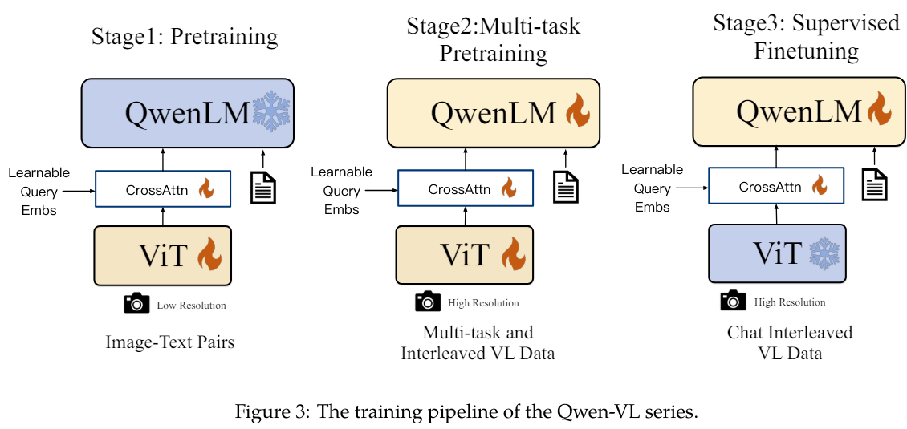

# QwenVL

Qwen-VL（Qwen Large Vision Language Model）是阿里提出的大型模型系列 Qwen（简称同传千问）的多模态版本。

Qwen-VL 接受图像、文本和边界框作为输入，并输出文本和边界框。Qwen-VL 的特点包括：

- 强大的性能：在多个英语评估基准（包括零样本字幕生成、VQA、DocVQA 和 Grounding）上，它明显超过了现有的开源大型视觉语言模型（LVLM）在类似的模型规模下的表现。
- 支持多语言 LVLM 的文本识别：Qwen-VL 自然地支持英语、中文和多语言对话，并促进了对图像中中英双语文本的端到端识别。
- 多图像交替对话：这个特性允许输入和比较多个图像，并能够针对这些图像提出相关问题并进行多图像的叙事。
- 首个支持中文 Grounding 的通用模型：通过中文和英文的开放域语言表达来检测边界框。
- 细粒度的识别和理解：与其他开源 LVLM 目前使用的 $224×224$ 分辨率相比， $448×448$ 的分辨率促进了细粒度的文本识别、文档问答和边界框标注。


## 模型的训练流程




### 

## 模型的使用

```
from transformers import AutoModelForCausalLM, AutoTokenizer
from transformers.generation import GenerationConfig
import torch
torch.manual_seed(1234)

tokenizer = AutoTokenizer.from_pretrained("Qwen-VL-Chat", trust_remote_code=True)

model = AutoModelForCausalLM.from_pretrained("Qwen-VL-Chat", device_map="cuda", trust_remote_code=True, fp16=True).eval()

# Specify hyperparameters for generation (No need to do this if you are using transformers>=4.32.0)
# model.generation_config = GenerationConfig.from_pretrained("Qwen/Qwen-VL", trust_remote_code=True)

query = tokenizer.from_list_format([
    {'image': 'https://qianwen-res.oss-cn-beijing.aliyuncs.com/Qwen-VL/assets/demo.jpeg'},
    {'text': 'Generate the caption in English with grounding:'},
])
inputs = tokenizer(query, return_tensors='pt')
inputs = inputs.to(model.device)
pred = model.generate(**inputs)
response = tokenizer.decode(pred.cpu()[0], skip_special_tokens=False)
print(response)
```


```
Picture 1: https://qianwen-res.oss-cn-beijing.aliyuncs.com/Qwen-VL/assets/demo.jpeg</img>
Generate the caption in English with grounding:<ref> Woman</ref><box>(452,379),(729,801)</box> sitting on the beach with<ref> her dog</ref><box>(216,426),(578,895)</box> at sunset.<|endoftext|>
```


## 模型结构

```
QWenLMHeadModel(
  (transformer): QWenModel(
    (wte): Embedding(151936, 4096)
    (drop): Dropout(p=0.0, inplace=False)
    (rotary_emb): RotaryEmbedding()
    (h): ModuleList(
      (0-31): 32 x QWenBlock(
        (ln_1): RMSNorm()
        (attn): QWenAttention(
          (c_attn): Linear(in_features=4096, out_features=12288, bias=True)
          (c_proj): Linear(in_features=4096, out_features=4096, bias=False)
          (attn_dropout): Dropout(p=0.0, inplace=False)
        )
        (ln_2): RMSNorm()
        (mlp): QWenMLP(
          (w1): Linear(in_features=4096, out_features=11008, bias=False)
          (w2): Linear(in_features=4096, out_features=11008, bias=False)
          (c_proj): Linear(in_features=11008, out_features=4096, bias=False)
        )
      )
    )
    (ln_f): RMSNorm()
    (visual): VisionTransformer(
      (conv1): Conv2d(3, 1664, kernel_size=(14, 14), stride=(14, 14), bias=False)
      (ln_pre): LayerNorm((1664,), eps=1e-06, elementwise_affine=True)
      (transformer): TransformerBlock(
        (resblocks): ModuleList(
          (0-47): 48 x VisualAttentionBlock(
            (ln_1): LayerNorm((1664,), eps=1e-06, elementwise_affine=True)
            (ln_2): LayerNorm((1664,), eps=1e-06, elementwise_affine=True)
            (attn): VisualAttention(
              (in_proj): Linear(in_features=1664, out_features=4992, bias=True)
              (out_proj): Linear(in_features=1664, out_features=1664, bias=True)
            )
            (mlp): Sequential(
              (c_fc): Linear(in_features=1664, out_features=8192, bias=True)
              (gelu): GELU(approximate='none')
              (c_proj): Linear(in_features=8192, out_features=1664, bias=True)
            )
          )
        )
      )
      (attn_pool): Resampler(
        (kv_proj): Linear(in_features=1664, out_features=4096, bias=False)
        (attn): MultiheadAttention(
          (out_proj): NonDynamicallyQuantizableLinear(in_features=4096, out_features=4096, bias=True)
        )
        (ln_q): LayerNorm((4096,), eps=1e-06, elementwise_affine=True)
        (ln_kv): LayerNorm((4096,), eps=1e-06, elementwise_affine=True)
      )
      (ln_post): LayerNorm((4096,), eps=1e-06, elementwise_affine=True)
    )
  )
  (lm_head): Linear(in_features=4096, out_features=151936, bias=False)
)
```


## 图片处理

- 图像输入：图像通过视觉编码器和适配器进行处理，生成固定长度的图像特征序列。为了区分图像特征输入和文本特征输入，分别在图像特征序列的开头和结尾附加了两个特殊标记（``和`</img>`），表示图像内容的起始和结束。
- 边界框输入和输出：为了增强模型对细粒度视觉理解和 grounding 的能力，Qwen-VL 的训练使用了以区域描述、问题和检测形式的数据。与涉及图像-文本描述或问题的传统任务不同，这个任务需要模型准确理解和生成指定格式的区域描述。对于给定的边界框，应用了归一化处理（在范围`[0, 1000)`内）并转换为指定的字符串格式：`(Xtopleft, Ytopleft),(Xbottomright, Ybottomright)`。该字符串被视为文本进行标记，不需要额外的位置词汇表。为了区分检测字符串和常规文本字符串，在边界框字符串的开头和结尾添加了两个特殊标记（`<box>`和`</box>`）。此外，为了将边界框与其对应的描述性词语或句子适当关联起来，还引入了另一组特殊标记（`<ref>`和`</ref>`），标记边界框所指的内容。


示例中的输入：

```
query = tokenizer.from_list_format([
    {'image': 'https://qianwen-res.oss-cn-beijing.aliyuncs.com/Qwen-VL/assets/demo.jpeg'},
    {'text': 'Generate the caption in English with grounding:'},
])

```
先转换成：

```
'Picture 1: https://qianwen-res.oss-cn-beijing.aliyuncs.com/Qwen-VL/assets/demo.jpeg</img>\nGenerate the caption in English with grounding:'
```

再转换成（先 encode，再 decode）

```
[b'Picture', b' ', b'1', b':', b' ', '', b'https', b'://', b'q', b'ian', b'wen', b'-res', b'.', b'oss', b'-cn', b'-be', b'ijing', b'.ali', b'y', b'unc', b's', b'.com', b'/Q', b'wen', b'-V', b'L', b'/assets', b'/demo', b'.jpeg', '</img>', b'\n', b'Generate', b' the', b' caption', b' in', b' English', b' with', b' grounding', b':']
```

然后查找列表中图片的起始 tag，也就是 `` 和 `</img>`。

将这两个 tag 中间的字符填充成固定大小为 256 字符，不足的用 `<imgpad>` 字符来做填充。

主要代码如下：
```
def _encode_imgurl(img_tokens):
    assert img_tokens[0] == self.image_start_tag and img_tokens[-1] == self.image_end_tag
    img_tokens = img_tokens[1:-1]
    img_url = b''.join(img_tokens)
    out_img_tokens = list(map(self.decoder.get, img_url))
    # IMG_TOKEN_SPAN = 256
    if len(out_img_tokens) > IMG_TOKEN_SPAN:
        raise ValueError("The content in {}..{} is too long".format(
            self.image_start_tag, self.image_end_tag))
    # self.image_pad_tag = "<imgpad>"
    out_img_tokens.extend([self.image_pad_tag] * (IMG_TOKEN_SPAN - len(out_img_tokens)))
    out_img_tokens = [self.image_start_tag] + out_img_tokens + [self.image_end_tag]
    return out_img_tokens
```

生成的 out_img_tokens 为：
```
['', b'\xab', b'\xb8', b'\xb8', b'\xb4', b'\xb7', b'[', b'P', b'P', b'\xb5', b'\xac', b'\xa4', b'\xb2', b'\xbb', b'\xa8', b'\xb2', b'N', b'\xb6', b'\xa8', b'\xb7', b'O', b'\xb3', b'\xb7', b'\xb7', b'N', b'\xa6', b'\xb2', b'N', b'\xa5', b'\xa8', b'\xac', b'\xae', b'\xac', b'\xb2', b'\xaa', b'O', b'\xa4', b'\xb0', b'\xac', b'\xbd', b'\xb9', b'\xb2', b'\xa6', b'\xb7', b'O', b'\xa6', b'\xb3', b'\xb1', b'P', b'r', b'\xbb', b'\xa8', b'\xb2', b'N', b'w', b'm', b'P', b'\xa4', b'\xb7', b'\xb7', b'\xa8', b'\xb8', b'\xb7', b'P', b'\xa7', b'\xa8', b'\xb1', b'\xb3', b'O', b'\xae', b'\xb4', b'\xa8', b'\xaa', '<imgpad>', '<imgpad>', '<imgpad>', '<imgpad>', '<imgpad>', '<imgpad>', '<imgpad>', '<imgpad>', '<imgpad>', '<imgpad>', '<imgpad>', '<imgpad>', '<imgpad>', '<imgpad>', '<imgpad>', '<imgpad>', '<imgpad>', '<imgpad>', '<imgpad>', '<imgpad>', '<imgpad>', '<imgpad>', '<imgpad>', '<imgpad>', '<imgpad>', '<imgpad>', '<imgpad>', '<imgpad>', '<imgpad>', '<imgpad>', '<imgpad>', '<imgpad>', '<imgpad>', '<imgpad>', '<imgpad>', '<imgpad>', '<imgpad>', '<imgpad>', '<imgpad>', '<imgpad>', '<imgpad>', '<imgpad>', '<imgpad>', '<imgpad>', '<imgpad>', '<imgpad>', '<imgpad>', '<imgpad>', '<imgpad>', '<imgpad>', '<imgpad>', '<imgpad>', '<imgpad>', '<imgpad>', '<imgpad>', '<imgpad>', '<imgpad>', '<imgpad>', '<imgpad>', '<imgpad>', '<imgpad>', '<imgpad>', '<imgpad>', '<imgpad>', '<imgpad>', '<imgpad>', '<imgpad>', '<imgpad>', '<imgpad>', '<imgpad>', '<imgpad>', '<imgpad>', '<imgpad>', '<imgpad>', '<imgpad>', '<imgpad>', '<imgpad>', '<imgpad>', '<imgpad>', '<imgpad>', '<imgpad>', '<imgpad>', '<imgpad>', '<imgpad>', '<imgpad>', '<imgpad>', '<imgpad>', '<imgpad>', '<imgpad>', '<imgpad>', '<imgpad>', '<imgpad>', '<imgpad>', '<imgpad>', '<imgpad>', '<imgpad>', '<imgpad>', '<imgpad>', '<imgpad>', '<imgpad>', '<imgpad>', '<imgpad>', '<imgpad>', '<imgpad>', '<imgpad>', '<imgpad>', '<imgpad>', '<imgpad>', '<imgpad>', '<imgpad>', '<imgpad>', '<imgpad>', '<imgpad>', '<imgpad>', '<imgpad>', '<imgpad>', '<imgpad>', '<imgpad>', '<imgpad>', '<imgpad>', '<imgpad>', '<imgpad>', '<imgpad>', '<imgpad>', '<imgpad>', '<imgpad>', '<imgpad>', '<imgpad>', '<imgpad>', '<imgpad>', '<imgpad>', '<imgpad>', '<imgpad>', '<imgpad>', '<imgpad>', '<imgpad>', '<imgpad>', '<imgpad>', '<imgpad>', '<imgpad>', '<imgpad>', '<imgpad>', '<imgpad>', '<imgpad>', '<imgpad>', '<imgpad>', '<imgpad>', '<imgpad>', '<imgpad>', '<imgpad>', '<imgpad>', '<imgpad>', '<imgpad>', '<imgpad>', '<imgpad>', '<imgpad>', '<imgpad>', '<imgpad>', '<imgpad>', '<imgpad>', '<imgpad>', '<imgpad>', '<imgpad>', '<imgpad>', '<imgpad>', '<imgpad>', '<imgpad>', '<imgpad>', '<imgpad>', '<imgpad>', '<imgpad>', '<imgpad>', '<imgpad>', '<imgpad>', '<imgpad>', '<imgpad>', '<imgpad>', '<imgpad>', '<imgpad>', '<imgpad>', '<imgpad>', '<imgpad>', '<imgpad>', '<imgpad>', '</img>']
```

最终转换完成的 token list 为：

```
[b'Picture', b' ', b'1', b':', b' ', '', b'\xab', b'\xb8', b'\xb8', b'\xb4', b'\xb7', b'[', b'P', b'P', b'\xb5', b'\xac', b'\xa4', b'\xb2', b'\xbb', b'\xa8', b'\xb2', b'N', b'\xb6', b'\xa8', b'\xb7', b'O', b'\xb3', b'\xb7', b'\xb7', b'N', b'\xa6', b'\xb2', b'N', b'\xa5', b'\xa8', b'\xac', b'\xae', b'\xac', b'\xb2', b'\xaa', b'O', b'\xa4', b'\xb0', b'\xac', b'\xbd', b'\xb9', b'\xb2', b'\xa6', b'\xb7', b'O', b'\xa6', b'\xb3', b'\xb1', b'P', b'r', b'\xbb', b'\xa8', b'\xb2', b'N', b'w', b'm', b'P', b'\xa4', b'\xb7', b'\xb7', b'\xa8', b'\xb8', b'\xb7', b'P', b'\xa7', b'\xa8', b'\xb1', b'\xb3', b'O', b'\xae', b'\xb4', b'\xa8', b'\xaa', '<imgpad>', '<imgpad>', '<imgpad>', '<imgpad>', '<imgpad>', '<imgpad>', '<imgpad>', '<imgpad>', '<imgpad>', '<imgpad>', '<imgpad>', '<imgpad>', '<imgpad>', '<imgpad>', '<imgpad>', '<imgpad>', '<imgpad>', '<imgpad>', '<imgpad>', '<imgpad>', '<imgpad>', '<imgpad>', '<imgpad>', '<imgpad>', '<imgpad>', '<imgpad>', '<imgpad>', '<imgpad>', '<imgpad>', '<imgpad>', '<imgpad>', '<imgpad>', '<imgpad>', '<imgpad>', '<imgpad>', '<imgpad>', '<imgpad>', '<imgpad>', '<imgpad>', '<imgpad>', '<imgpad>', '<imgpad>', '<imgpad>', '<imgpad>', '<imgpad>', '<imgpad>', '<imgpad>', '<imgpad>', '<imgpad>', '<imgpad>', '<imgpad>', '<imgpad>', '<imgpad>', '<imgpad>', '<imgpad>', '<imgpad>', '<imgpad>', '<imgpad>', '<imgpad>', '<imgpad>', '<imgpad>', '<imgpad>', '<imgpad>', '<imgpad>', '<imgpad>', '<imgpad>', '<imgpad>', '<imgpad>', '<imgpad>', '<imgpad>', '<imgpad>', '<imgpad>', '<imgpad>', '<imgpad>', '<imgpad>', '<imgpad>', '<imgpad>', '<imgpad>', '<imgpad>', '<imgpad>', '<imgpad>', '<imgpad>', '<imgpad>', '<imgpad>', '<imgpad>', '<imgpad>', '<imgpad>', '<imgpad>', '<imgpad>', '<imgpad>', '<imgpad>', '<imgpad>', '<imgpad>', '<imgpad>', '<imgpad>', '<imgpad>', '<imgpad>', '<imgpad>', '<imgpad>', '<imgpad>', '<imgpad>', '<imgpad>', '<imgpad>', '<imgpad>', '<imgpad>', '<imgpad>', '<imgpad>', '<imgpad>', '<imgpad>', '<imgpad>', '<imgpad>', '<imgpad>', '<imgpad>', '<imgpad>', '<imgpad>', '<imgpad>', '<imgpad>', '<imgpad>', '<imgpad>', '<imgpad>', '<imgpad>', '<imgpad>', '<imgpad>', '<imgpad>', '<imgpad>', '<imgpad>', '<imgpad>', '<imgpad>', '<imgpad>', '<imgpad>', '<imgpad>', '<imgpad>', '<imgpad>', '<imgpad>', '<imgpad>', '<imgpad>', '<imgpad>', '<imgpad>', '<imgpad>', '<imgpad>', '<imgpad>', '<imgpad>', '<imgpad>', '<imgpad>', '<imgpad>', '<imgpad>', '<imgpad>', '<imgpad>', '<imgpad>', '<imgpad>', '<imgpad>', '<imgpad>', '<imgpad>', '<imgpad>', '<imgpad>', '<imgpad>', '<imgpad>', '<imgpad>', '<imgpad>', '<imgpad>', '<imgpad>', '<imgpad>', '<imgpad>', '<imgpad>', '<imgpad>', '<imgpad>', '<imgpad>', '<imgpad>', '<imgpad>', '<imgpad>', '<imgpad>', '<imgpad>', '<imgpad>', '<imgpad>', '<imgpad>', '<imgpad>', '<imgpad>', '<imgpad>', '<imgpad>', '<imgpad>', '<imgpad>', '<imgpad>', '<imgpad>', '<imgpad>', '</img>', b'\n', b'Generate', b' the', b' caption', b' in', b' English', b' with', b' grounding', b':']
```

再做 tokenizer 得到如下，其中 151859 是 `<imgpad>` 的 ID，151857 是 Image 的起始 ID, 151858 是 Image 的结束 ID。

```
[24669, 220, 16, 25, 220, 151857, 104, 116, 116, 112, 115, 58, 47, 47, 113, 105, 97, 110, 119, 101, 110, 45, 114, 101, 115, 46, 111, 115, 115, 45, 99, 110, 45, 98, 101, 105, 106, 105, 110, 103, 46, 97, 108, 105, 121, 117, 110, 99, 115, 46, 99, 111, 109, 47, 81, 119, 101, 110, 45, 86, 76, 47, 97, 115, 115, 101, 116, 115, 47, 100, 101, 109, 111, 46, 106, 112, 101, 103, 151859, 151859, 151859, 151859, 151859, 151859, 151859, 151859, 151859, 151859, 151859, 151859, 151859, 151859, 151859, 151859, 151859, 151859, 151859, 151859, 151859, 151859, 151859, 151859, 151859, 151859, 151859, 151859, 151859, 151859, 151859, 151859, 151859, 151859, 151859, 151859, 151859, 151859, 151859, 151859, 151859, 151859, 151859, 151859, 151859, 151859, 151859, 151859, 151859, 151859, 151859, 151859, 151859, 151859, 151859, 151859, 151859, 151859, 151859, 151859, 151859, 151859, 151859, 151859, 151859, 151859, 151859, 151859, 151859, 151859, 151859, 151859, 151859, 151859, 151859, 151859, 151859, 151859, 151859, 151859, 151859, 151859, 151859, 151859, 151859, 151859, 151859, 151859, 151859, 151859, 151859, 151859, 151859, 151859, 151859, 151859, 151859, 151859, 151859, 151859, 151859, 151859, 151859, 151859, 151859, 151859, 151859, 151859, 151859, 151859, 151859, 151859, 151859, 151859, 151859, 151859, 151859, 151859, 151859, 151859, 151859, 151859, 151859, 151859, 151859, 151859, 151859, 151859, 151859, 151859, 151859, 151859, 151859, 151859, 151859, 151859, 151859, 151859, 151859, 151859, 151859, 151859, 151859, 151859, 151859, 151859, 151859, 151859, 151859, 151859, 151859, 151859, 151859, 151859, 151859, 151859, 151859, 151859, 151859, 151859, 151859, 151859, 151859, 151859, 151859, 151859, 151859, 151859, 151859, 151859, 151859, 151859, 151859, 151859, 151859, 151859, 151859, 151859, 151859, 151859, 151859, 151859, 151859, 151859, 151858, 198, 31115, 279, 17256, 304, 6364, 448, 94741, 25]
```

输入的 input_ids:
```
inputs {
    'input_ids': tensor([[ 24669,    220,     16,     25,    220, 151857,    104,    116,    116,
            112,    115,     58,     47,     47,    113,    105,     97,    110,
            119,    101,    110,     45,    114,    101,    115,     46,    111,
            115,    115,     45,     99,    110,     45,     98,    101,    105,
            106,    105,    110,    103,     46,     97,    108,    105,    121,
            117,    110,     99,    115,     46,     99,    111,    109,     47,
             81,    119,    101,    110,     45,     86,     76,     47,     97,
            115,    115,    101,    116,    115,     47,    100,    101,    109,
            111,     46,    106,    112,    101,    103, 151859, 151859, 151859,
         151859, 151859, 151859, 151859, 151859, 151859, 151859, 151859, 151859,
         151859, 151859, 151859, 151859, 151859, 151859, 151859, 151859, 151859,
         151859, 151859, 151859, 151859, 151859, 151859, 151859, 151859, 151859,
         151859, 151859, 151859, 151859, 151859, 151859, 151859, 151859, 151859,
         151859, 151859, 151859, 151859, 151859, 151859, 151859, 151859, 151859,
         151859, 151859, 151859, 151859, 151859, 151859, 151859, 151859, 151859,
         151859, 151859, 151859, 151859, 151859, 151859, 151859, 151859, 151859,
         151859, 151859, 151859, 151859, 151859, 151859, 151859, 151859, 151859,
         151859, 151859, 151859, 151859, 151859, 151859, 151859, 151859, 151859,
         151859, 151859, 151859, 151859, 151859, 151859, 151859, 151859, 151859,
         151859, 151859, 151859, 151859, 151859, 151859, 151859, 151859, 151859,
         151859, 151859, 151859, 151859, 151859, 151859, 151859, 151859, 151859,
         151859, 151859, 151859, 151859, 151859, 151859, 151859, 151859, 151859,
         151859, 151859, 151859, 151859, 151859, 151859, 151859, 151859, 151859,
         151859, 151859, 151859, 151859, 151859, 151859, 151859, 151859, 151859,
         151859, 151859, 151859, 151859, 151859, 151859, 151859, 151859, 151859,
         151859, 151859, 151859, 151859, 151859, 151859, 151859, 151859, 151859,
         151859, 151859, 151859, 151859, 151859, 151859, 151859, 151859, 151859,
         151859, 151859, 151859, 151859, 151859, 151859, 151859, 151859, 151859,
         151859, 151859, 151859, 151859, 151859, 151859, 151859, 151859, 151859,
         151859, 151858,    198,  31115,    279,  17256,    304,   6364,    448,
          94741,     25]]), 
          'token_type_ids': tensor([[0, 0, 0, 0, 0, 0, 0, 0, 0, 0, 0, 0, 0, 0, 0, 0, 0, 0, 0, 0, 0, 0, 0, 0,
         0, 0, 0, 0, 0, 0, 0, 0, 0, 0, 0, 0, 0, 0, 0, 0, 0, 0, 0, 0, 0, 0, 0, 0,
         0, 0, 0, 0, 0, 0, 0, 0, 0, 0, 0, 0, 0, 0, 0, 0, 0, 0, 0, 0, 0, 0, 0, 0,
         0, 0, 0, 0, 0, 0, 0, 0, 0, 0, 0, 0, 0, 0, 0, 0, 0, 0, 0, 0, 0, 0, 0, 0,
         0, 0, 0, 0, 0, 0, 0, 0, 0, 0, 0, 0, 0, 0, 0, 0, 0, 0, 0, 0, 0, 0, 0, 0,
         0, 0, 0, 0, 0, 0, 0, 0, 0, 0, 0, 0, 0, 0, 0, 0, 0, 0, 0, 0, 0, 0, 0, 0,
         0, 0, 0, 0, 0, 0, 0, 0, 0, 0, 0, 0, 0, 0, 0, 0, 0, 0, 0, 0, 0, 0, 0, 0,
         0, 0, 0, 0, 0, 0, 0, 0, 0, 0, 0, 0, 0, 0, 0, 0, 0, 0, 0, 0, 0, 0, 0, 0,
         0, 0, 0, 0, 0, 0, 0, 0, 0, 0, 0, 0, 0, 0, 0, 0, 0, 0, 0, 0, 0, 0, 0, 0,
         0, 0, 0, 0, 0, 0, 0, 0, 0, 0, 0, 0, 0, 0, 0, 0, 0, 0, 0, 0, 0, 0, 0, 0,
         0, 0, 0, 0, 0, 0, 0, 0, 0, 0, 0, 0, 0, 0, 0, 0, 0, 0, 0, 0, 0, 0, 0, 0,
         0, 0, 0, 0, 0, 0, 0, 0]]), 
         'attention_mask': tensor([[1, 1, 1, 1, 1, 1, 1, 1, 1, 1, 1, 1, 1, 1, 1, 1, 1, 1, 1, 1, 1, 1, 1, 1,
         1, 1, 1, 1, 1, 1, 1, 1, 1, 1, 1, 1, 1, 1, 1, 1, 1, 1, 1, 1, 1, 1, 1, 1,
         1, 1, 1, 1, 1, 1, 1, 1, 1, 1, 1, 1, 1, 1, 1, 1, 1, 1, 1, 1, 1, 1, 1, 1,
         1, 1, 1, 1, 1, 1, 1, 1, 1, 1, 1, 1, 1, 1, 1, 1, 1, 1, 1, 1, 1, 1, 1, 1,
         1, 1, 1, 1, 1, 1, 1, 1, 1, 1, 1, 1, 1, 1, 1, 1, 1, 1, 1, 1, 1, 1, 1, 1,
         1, 1, 1, 1, 1, 1, 1, 1, 1, 1, 1, 1, 1, 1, 1, 1, 1, 1, 1, 1, 1, 1, 1, 1,
         1, 1, 1, 1, 1, 1, 1, 1, 1, 1, 1, 1, 1, 1, 1, 1, 1, 1, 1, 1, 1, 1, 1, 1,
         1, 1, 1, 1, 1, 1, 1, 1, 1, 1, 1, 1, 1, 1, 1, 1, 1, 1, 1, 1, 1, 1, 1, 1,
         1, 1, 1, 1, 1, 1, 1, 1, 1, 1, 1, 1, 1, 1, 1, 1, 1, 1, 1, 1, 1, 1, 1, 1,
         1, 1, 1, 1, 1, 1, 1, 1, 1, 1, 1, 1, 1, 1, 1, 1, 1, 1, 1, 1, 1, 1, 1, 1,
         1, 1, 1, 1, 1, 1, 1, 1, 1, 1, 1, 1, 1, 1, 1, 1, 1, 1, 1, 1, 1, 1, 1, 1,
         1, 1, 1, 1, 1, 1, 1, 1]])}

```

## 图片 encoder

图片在进入 LLM 之前会做如下的 encode。

```
# QWenModel 
if past_key_values is None and torch.any(input_ids == self.config.visual['image_start_id']):
    bos_pos = torch.where(input_ids == self.config.visual['image_start_id'])
    eos_pos = torch.where(input_ids == self.config.visual['image_start_id'] + 1)
    assert (bos_pos[0] == eos_pos[0]).all()
    img_pos = torch.stack((bos_pos[0], bos_pos[1], eos_pos[1]), dim=1)
    images = []
    for i, a, b in img_pos:
        image = input_ids[i][a + 1 : b - 1].tolist()
        image = image[ : image.index(self.config.visual['image_start_id'] + 2)]
        images.append(bytes(image).decode('utf-8'))


    images = self.visual.encode(images)
    assert images.shape[0] == len(images)
    fake_images = None


# VisionTransformer
def encode(self, image_paths: List[str]):
    images = []
    for image_path in image_paths:
        if image_path.startswith("http://") or image_path.startswith("https://"):
            image = Image.open(requests.get(image_path, stream=True).raw)
        else:
            image = Image.open(image_path)
        image = image.convert("RGB")
        # 图片经过前处理后，变成 torch.Size([3, 448, 448])
        images.append(self.image_transform(image))
    images = torch.stack(images, dim=0)
    # 经过 ViT 后变成 torch.Size([1, 256, 4096])
    return self(images)
```
然后经过如下代码，将 images 作为 Embedding 替换到原来填充的 token 的位置上。

```
#  img_pos: tensor([[  0,   5, 262]], device='cuda:0')
for idx, (i, a, b) in enumerate(img_pos):
    hidden_states[i][a + 1 : b] = images[idx]
```

最终输入到 LLM 的 Embedding 为 `torch.Size([1, 272, 4096])`。

## CrossAttention

Cross Attension 层的代码如下，可学习的 query shape: `torch.Size([256, 4096])`。

图片经过 ViT 后为 `torch.Size([1, 1024, 1664])`，经过 Cross Attetion 后变成 `torch.Size([1, 256, 4096])`。

```
class Resampler(nn.Module):
    """
    A 2D perceiver-resampler network with one cross attention layers by
        (grid_size**2) learnable queries and 2d sincos pos_emb
    Outputs:
        A tensor with the shape of (grid_size**2, embed_dim)
    """
    def __init__(
            self,
            grid_size,
            embed_dim,
            num_heads,
            kv_dim=None,
            norm_layer=nn.LayerNorm
    ):
        super().__init__()
        self.num_queries = grid_size ** 2
        self.embed_dim = embed_dim
        self.num_heads = num_heads

        self.pos_embed = nn.Parameter(
            torch.from_numpy(get_2d_sincos_pos_embed(embed_dim, grid_size)).float()
        ).requires_grad_(False)

        # 可学习的 query： torch.Size([256, 4096])
        self.query = nn.Parameter(torch.zeros(self.num_queries, embed_dim))
        trunc_normal_(self.query, std=.02)

        if kv_dim is not None and kv_dim != embed_dim:
            self.kv_proj = nn.Linear(kv_dim, embed_dim, bias=False)
        else:
            self.kv_proj = nn.Identity()

        self.attn = nn.MultiheadAttention(embed_dim, num_heads)
        self.ln_q = norm_layer(embed_dim)
        self.ln_kv = norm_layer(embed_dim)
        
        # self.apply(self._init_weights)

    def _init_weights(self, m):
        if isinstance(m, nn.Linear):
            trunc_normal_(m.weight, std=.02)
            if isinstance(m, nn.Linear) and m.bias is not None:
                nn.init.constant_(m.bias, 0)
        elif isinstance(m, nn.LayerNorm):
            nn.init.constant_(m.bias, 0)
            nn.init.constant_(m.weight, 1.0)

    def forward(self, x, attn_mask=None):

        pos_embed = get_abs_pos(self.pos_embed, x.size(1))

        x = self.kv_proj(x)
        x = self.ln_kv(x).permute(1, 0, 2)

        N = x.shape[1]
        q = self.ln_q(self.query)
        out = self.attn(
            self._repeat(q, N) + self.pos_embed.unsqueeze(1),
            x + pos_embed.unsqueeze(1),
            x,
            attn_mask=attn_mask)[0]
        return out.permute(1, 0, 2)

    def _repeat(self, query, N: int):
        return query.unsqueeze(1).repeat(1, N, 1)
```

其他部分都常见的 LLM 流程。

## 参考文献
- [Qwen-VL: A Versatile Vision-Language Model for Understanding, Localization, Text Reading, and Beyond
](https://arxiv.org/pdf/2308.12966)
- https://github.com/QwenLM/Qwen-VL