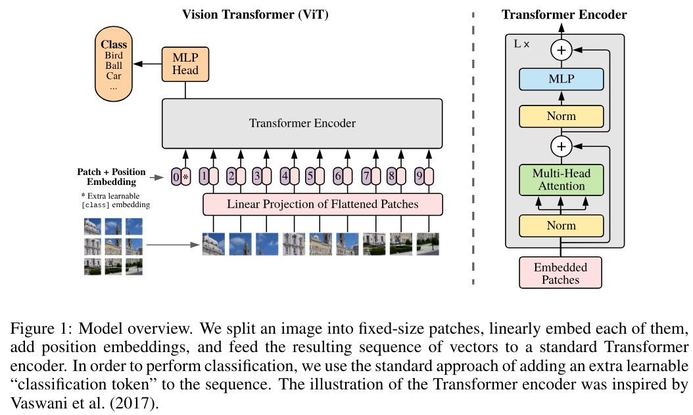
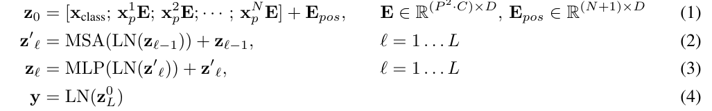
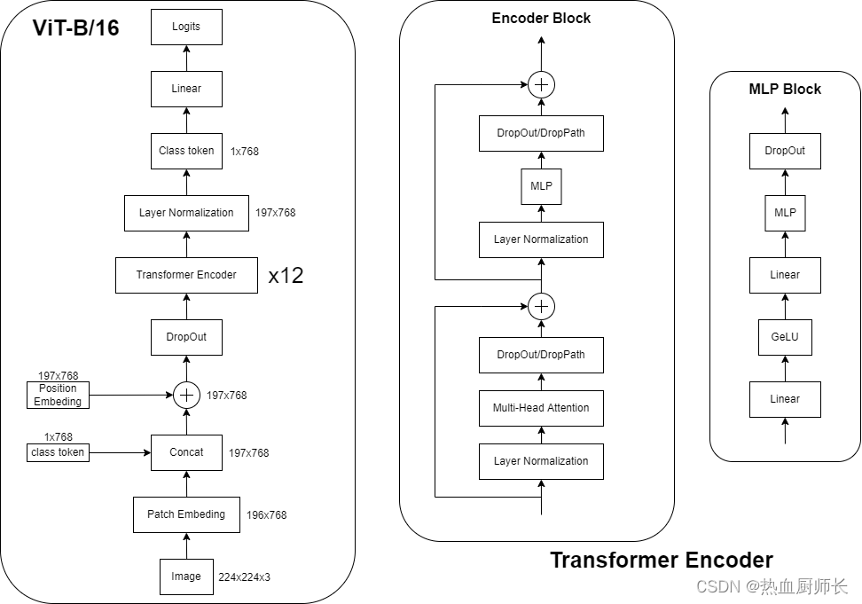
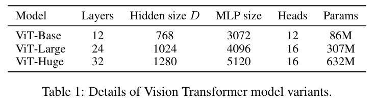
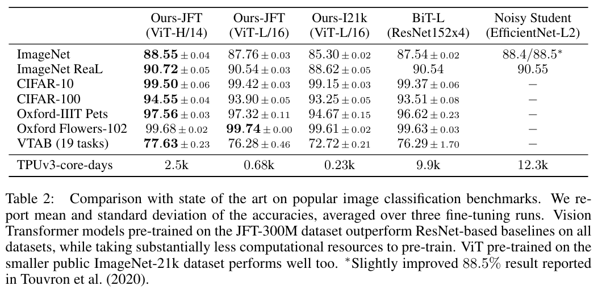

# VIT 模型

Vision Transformer (ViT) 目前是大部分多模态大模型的编码器的 base。这里介绍一下 VIT 的详细模型结构。


## VIT



- (1) patch embedding：例如输入图片大小为 $224 \times 224$，将图片分为固定大小的 patch，patch 大小为 $16 \times 16$，则每张图像会生成 $224 \times 224 /16\times 16=196$ 个 patch，即输入序列长度为 $196$，每个 patch 维度 $16 \times 16 \times 3=768$，线性投射层的维度为 $768 \times N (N=768)$，因此输入通过线性投射层之后的维度依然为 $196 \times 768$，即一共有 $196$ 个token，每个 token 的维度是 $768$ 。这里还需要加上一个特殊字符 cls，因此最终的维度是 $197 \times 768$。到目前为止，已经通过 patch embedding 将一个视觉问题转化为了一个 seq2seq 问题。

- (2) positional encoding（standard learnable 1D position embeddings）：ViT 同样需要加入位置编码，位置编码可以理解为一张表，表一共有 N 行，N 的大小和输入序列长度相同，每一行代表一个向量，向量的维度和输入序列 embedding 的维度相同（768）。注意位置编码的操作是 sum，而不是 concat。加入位置编码信息之后，维度依然是 $197 \times 768$。

- (3) LN/multi-head attention/LN：LN 输出维度依然是 $197 \times 768$。多头自注意力时，先将输入映射到 q，k，v，如果只有一个头，qkv 的维度都是 $197\times768$，如果有 $12$ 个头（$768/12=64$），则 qkv 的维度是 $197\times64$，一共有 12 组 qkv，最后再将 12 组 qkv 的输出拼接起来，输出维度是 $197 \times 768$，然后在过一层 LN，维度依然是 $197\times768$

- (4) MLP：将维度放大再缩小回去，$197 \times 768$ 放大为 $197 \times 3072$，再缩小变为 $197 \times 768$

一个 block 之后维度依然和输入相同，都是 $197 \times 768$，因此可以堆叠多个block。最后会将特殊字符 cls 对应的输出，作为 encoder 的最终输出 ，代表最终的 image presentation（另一种做法是不加 cls 字符，对所有的 tokens 的输出做一个平均），如下图公式，后面接一个 MLP 进行图片分类。



其中 MSA 为 multiheaded selfattention。详细模型结构如下：



## 模型及变体

ViT 参考BERT，共设置了三种模型变体（增加了 Huge 变体）如下图所示。例如 ViT-L/16，代表 Large 变体，输入 patch size 为 $16 \times 16$。



## Benchmark



## 使用 VIT

```
from transformers import AutoImageProcessor, ViTModel
import torch
from datasets import load_dataset

dataset = load_dataset("huggingface/cats-image")
image = dataset["test"]["image"][0]

image_processor = AutoImageProcessor.from_pretrained("google/vit-base-patch16-224-in21k")
model = ViTModel.from_pretrained("google/vit-base-patch16-224-in21k")

inputs = image_processor(image, return_tensors="pt")

with torch.no_grad():
    outputs = model(**inputs)

last_hidden_states = outputs.last_hidden_state
list(last_hidden_states.shape)
# [1, 197, 768]
```

`google/vit-base-patch16-224-in21k` 模型结构
```
ViTModel(
  (embeddings): ViTEmbeddings(
    (patch_embeddings): ViTPatchEmbeddings(
      (projection): Conv2d(3, 768, kernel_size=(16, 16), stride=(16, 16))
    )
    (dropout): Dropout(p=0.0, inplace=False)
  )
  (encoder): ViTEncoder(
    (layer): ModuleList(
      (0-11): 12 x ViTLayer(
        (attention): ViTAttention(
          (attention): ViTSelfAttention(
            (query): Linear(in_features=768, out_features=768, bias=True)
            (key): Linear(in_features=768, out_features=768, bias=True)
            (value): Linear(in_features=768, out_features=768, bias=True)
            (dropout): Dropout(p=0.0, inplace=False)
          )
          (output): ViTSelfOutput(
            (dense): Linear(in_features=768, out_features=768, bias=True)
            (dropout): Dropout(p=0.0, inplace=False)
          )
        )
        (intermediate): ViTIntermediate(
          (dense): Linear(in_features=768, out_features=3072, bias=True)
          (intermediate_act_fn): GELUActivation()
        )
        (output): ViTOutput(
          (dense): Linear(in_features=3072, out_features=768, bias=True)
          (dropout): Dropout(p=0.0, inplace=False)
        )
        (layernorm_before): LayerNorm((768,), eps=1e-12, elementwise_affine=True)
        (layernorm_after): LayerNorm((768,), eps=1e-12, elementwise_affine=True)
      )
    )
  )
  (layernorm): LayerNorm((768,), eps=1e-12, elementwise_affine=True)
  (pooler): ViTPooler(
    (dense): Linear(in_features=768, out_features=768, bias=True)
    (activation): Tanh()
  )
)
```


## 参考文献
- [An Image is Worth 16x16 Words: Transformers for Image Recognition at Scale](https://arxiv.org/abs/2010.11929)
- https://zhuanlan.zhihu.com/p/445122996
- https://blog.csdn.net/weixin_42392454/article/details/122667271
- https://huggingface.co/docs/transformers/model_doc/vit