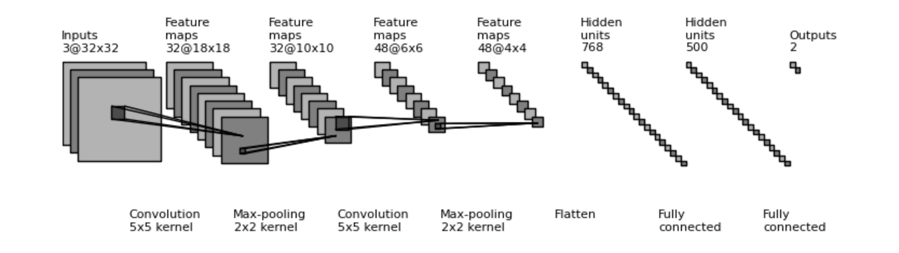
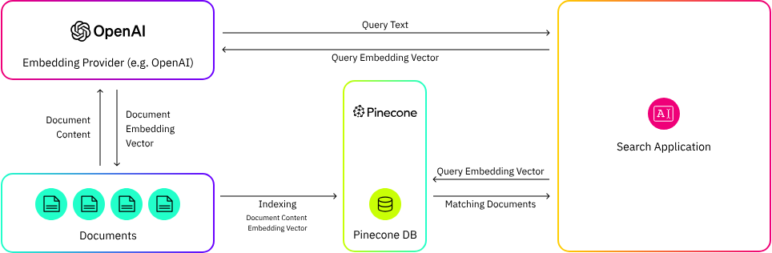

# 万物皆可 Embedding

## 什么是 Embedding


在机器学习和自然语言处理中，Embedding 是指将高维度的数据（例如文字、图片、音频、视频）映射到低维度空间的过程。Embedding 向量通常是一个由实数构成的向量，它将输入的数据表示成一个连续的数值空间中的点。
简单来说，Embedding 就是一个 N 维的实值向量，它几乎可以用来表示任何事情，如文本、音乐、视频等。


自从 2010 年左右以来，随着深度学习技术的发展，Embedding 技术得到了广泛的应用和研究。在这个时期，出现了一些重要的 Embedding 算法，例如 Word2Vec、GloVe 和 FastText 等。这些算法可以通过训练神经网络或使用矩阵分解等技术来学习单词的嵌入表示。这些算法被广泛用于各种自然语言处理任务中，例如文本分类、机器翻译、情感分析等。

随着深度学习和自然语言处理技术的快速发展，Embedding 技术得到了进一步的改进和发展。例如，BERT、ELMo 和 GPT 等大型语言模型可以生成上下文相关的 Embedding 表示，这些 Embedding 可以更好地捕捉单词的语义和上下文信息。

## 为什么需要 Embedding

假设词汇表总共有 10,000 个单词，那么表示每个单词的最简单方法是什么？我们可以简单地为每个单词分配一个整数索引。给定这个包含 10,000 个单词的词汇表，每个单词被分配一个索引。


在给定这种单词到整数的映射之后，我们可以按照以下方式将一个单词表示为一个数字向量
- 每个单词将被表示为一个 n 维向量，其中 n 是词汇表的大小。
- 每个单词的向量表示大部分为“0”，只有在与词在词汇表中的索引对应的位置上有一个“1”。
以下是一些例子：
- 第一个词汇单词 “aardvark” 的向量表示将是 [1, 0, 0, 0, ..., 0] ，其中第一个位置是 “1”，后面跟着 9,999 个零。
- 第二个词汇单词 “able” 的向量表示将是 [0, 1, 0, 0, ..., 0]，其中第一个位置是 “0” ，第二个位置是 “1” ，后面是 9,998 个零。
- 以此类推。

这个过程被称为 One-hot 向量编码，也被称之为独热编码。

现在，假设自然语言处理项目是构建一个翻译模型，我们想要将英语输入句子 “the cat is black” 翻译成另一种语言。首先需要用一个 one-hot 来表示每个单词。我们首先查找第一个单词 “the” 的索引，并找到它在 10,000 个词汇表中的索引是 8676，然后构建一个 One-hot 向量。然后以此类推，得到所有单词的 One-hot 向量。这里每个输入单词生成了一个非常稀疏（大部分为零）的特征向量。


### One-hot 编码的问题

我们已经进行了 One-hot 编码，并成功地将每个单词表示为一组数字向量。许多自然语言处理项目都这样做，但结果可能不理想，特别是当训练数据集很小的时候。这是因为 One-hot 向量并不是一个很好的输入表示方法。

为什 One-hot 编码的问题不是很理想呢？
1. 词汇表大小问题：使用这种方法，随着词汇表的增加，特征向量的大小也会增加。One-hot 向量的维度与单词数量相同。如果特征数量爆炸增长，就需要更多的数据来估计足够好的参数以构建一个合理的泛化模型。
2. 计算问题：每个单词的 Embedding 向量大部分是零，而且许多机器学习模型不能很好地处理非常高维和稀疏的特征。神经网络尤其难以处理这种类型的数据。

One-hot 向量存在的最重要问题是什么？稠密 Embedding 是如何解决这个问题的？

**稠密 Embedding 解决的核心问题是泛化问题**

如果我们假设 “cat” 和 “tiger” 这样的单词实际上是相似的，我们希望找到一种方式将这种信息传递给模型。这一点在其中一个单词很少见（例如 “tiger”）的情况下尤其重要，因为它可以借用与类似但更常见的单词相似的计算路径。这是因为在训练过程中，模型学习以一定的方式处理输入“cat”，通过将其通过由权重和偏置参数定义的变换层。当网络最终看到 “tiger” 时，如果它的 Embedding 与 “cat” 相似，那么它将走类似于 “cat” 的路径，而不是网络必须完全从头开始学习如何处理它。如果预测与以前从未见过的事物有关，那么很难做出准确的预测，但如果它与您之前见过的某些东西相关，那么就更容易了。

这意味着 Embedding 向量使我们能够构建更具泛化能力的模型——而不是网络需要费力地学习处理不同的、不相关的输入的许多不同方式，我们反而让相似的单词“共享”参数和计算路径。


### 一个稠密语义的单词 Embedding 示例

假定我们手动对 5 个单词 "aardvark（土豚）"，"black"，"cat"，"duvet（羽绒被）"，"zombie" 在下面 4 个语义特征上定义数值："animal", "fluffiness（蓬松度）", "dangerous" 和 "spooky（吓人的）"。


在上述虚构的数据集中，有四个语义特征，我们可以将其中两个作为二维散点图绘制出来（见下图）。每个特征是一个不同的轴/维度。


每个单词在按照数值在坐标轴上绘制。例如，单词 “aardvark” 在 “fluffiness（蓬松度）”与 “animal” 这个二维图上的坐标为（x=0.97，y=0.03）。

### 一个非 NLP 语言的示例

假如我们想要对所有推荐的电影集合做 Embedding，那么我们可以尝试手动定义如下特征。
- 演职员列表
- 电影时长
- 电影的种类（爱情/战争/动画等）
- 电影的评分
  
那么如何用一个向量来表示一部电影？
- 假定所有的演职员有 1000 个，那么演职员的列表可以是一个 multi-hot 的向量，该电影有的演员为 ”1“，其他为 "0"，维度为 1000。
- 电影的时长可以转换成分数，维度为 1，比如 120，
- 假定所有的电影种类为 10，那么电影的种类可以用一个 One-hot 向量来表示，维度为 10。
- 电影的评分可以为 0 - 10 之间，维度为 1。

那么一部电影可以用一个向量来表示，总维度为 1012。

这样的向量和上面单词 One-hot 编码有类似的问题。
- 向量的大部分都是稀疏的。
- 向量的不同特征部分维度相差过大。
- 不同向量之间没有什么语义关系。

## 如何获得 Embedding

### 自然语言处理 NLP

#### Word Embedding

Google 在 2013 年提出了 Word2Vec，它的特点是能够将单词转化为向量来表示，这样词与词之间就可以定量的去度量他们之间的关系，挖掘词之间的联系。


在论文中提出了 CBOW 和 Skip-gram 两种模型，CBOW 适合于数据集较小的情况，而 Skip-Gram 在大型语料中表现更好。CBOW 如下图左部分所示，使用围绕目标单词的其他单词（语境）作为输入，在映射层做加权处理后输出目标单词。与 CBOW 根据语境预测目标单词不同，Skip-gram 根据当前单词预测语境，如下图右部分所示。假如我们有一个句子 “There is an apple on the table” 作为训练数据，CBOW 的输入为（is,an,on,the），输出为 apple。而 Skip-gram 的输入为 apple，输出为（is,an,on,the）。


Word2Vec 的训练模型本质上是只具有一个隐含层的神经元网络，它的输入是采用 One-hot 编码的词汇表向量，它的输出也是 One-hot 编码的词汇表向量。使用所有的样本，训练这个神经元网络，等到收敛之后，从输入层到隐含层的那些权重，便是每一个词的词向量。比如，上图中单词的 Word Embedding 便是矩阵 $W_{V \times N}$ 的第 i 行的转置。这样我们就把原本维数为 V 的词向量变成了维数为 N 的词向量（N 远小于 V），并且词向量间保留了一定的相关关系。


Word Embedding 存在一个问题：它只能捕捉单词的静态信息，无法处理一词多义的情况。后来演进的 ELMo(Embedding from Language Models) 、GTP、BERT 等模型可以基于上下文语义生成动态的 Embedding。

### Sentence Embedding

既然词可以 Embedding，句子也应该可以。近年来许多研究者在研究如何进行句子表示学习，从而获得质量较高的句子向量（Sentence Embedding）。事实上，Sentence Embedding 在信息检索，句子匹配，句子分类等任务上均有广泛应用。

与 Word Embedding 类似，同样语义句子的 Embedding 应该具备相临近的特性。


- SIF（Smooth Inverse Frequency）

创建句子表示的一种可能而直接的方式是利用每个 Word Embedding，并根据这些 Embedding 计算整个句子的 Embedding。其中一个算法是 SIF（Smooth Inverse Frequency），它使用每个单词 Embedding 的加权平均，并应用降维技术来获得 Sentence Embedding。


Transformer 模型出来后，演化出很多基于 Transformer 的模型，比如 BERT，Sentence-Bert 等。

### 推荐

#### 从 Word2Vec 到 Item2Vec

在 Word2Vec 诞生之后，Embedding 的思想迅速从自然语言处理领域扩散到几乎所有机器学习领域，既然 Word2Vec 可以对词“序列”中的词进行 Embedding，那么对于用户购买“序列”中的一个商品，用户观看“序列”中的一个电影，也应该存在相应的 Embedding 方法。

于是，微软于 2016 年提出了 [Item2Vec：Neural Item Embedding for Collaborative Filtering](https://arxiv.org/abs/1603.04259) 方法，它是对 Word2vec 方法的推广，使 Embedding 方法适用于几乎所有的序列数据。只要能够用序列数据的形式把我们要表达的对象表示出来，再把序列数据“喂”给 Word2Vec 模型，我们就能够得到任意物品的 Embedding 了。假设我们知道某个用户看过的电影的 ID 序列，比如

```
296 380 344 588 593 231 595 318 480
```


那么此时电影 ID 是词，电影 ID 序列是句子，一个句子内的词有相互关系，那么就可以根据 Item2vec 计算电影 ID 对应的 Embedding 向量。

生成的 Item Embedding 经过 t-SNE 算法的可视化效果：


在 Item2Vec 后，涌现出来大量的推荐算法，比如 YouTube Recommendations，双塔模型，Wide&Deep，DCN，MoE 等等。

#### YouTube Recommendations

[YouTube Recommendations](https://static.googleusercontent.com/media/research.google.com/zh-CN//pubs/archive/45530.pdf) 中的召回，排序的流程基本是现代推荐系统的标准流程。召回阶段（candidate generation）就是要从推荐的百万级别的视频库中筛选出用户可能感兴趣的视频，把推荐的视频库量级从百万级降到几百个。


YouTube 的召回模型


### CV 图像

类比于 Word Embedding 的语义特征，对于 CV 图像，我们期望图像 Embedding 能够表达出图像本身的语义特征。

对于各种 CNN 的模型，就是通过多层的卷积操作在训练过程中捕获图像中存在的特征信息。这些图层将捕获边缘、线条和角等特征，并将它们分组到传递给下一个图层的“桶”中。由于 CNN 的空间不变特性，无论边缘或直线出现在图像的哪个位置，这些特征都将始终映射到相同的桶。这些模型的层变得越来越小，直到一个由多个类别值（比如 ImageNet 有 1000 种）组成的完全连接的层作为输出。



当图像输入通过模型的各个层时，可以提取这些特征表示。被提取的层，也称为潜在空间，通常是靠近模型输出的层。提取的层或潜在空间提供了一个 dense 的表示，其中包含有关当前图片的特征信息，这对于视觉相似性搜索等任务在计算上是可行的。


#### ResNet

通常可以将 ResNet 中最后的 Average pool 输出的 (比如 ResNet50 的维度为 2048) 向量作为图像的 Embedding。


也可以使用其他的图像模型抽取特征，比如 EfficientNet， ViT 等。


### 图像文本语义

除了图像 Embedding 语义对齐外，我们还可以做图像对齐文本的 Embedding 语义。

#### CLIP

CLIP（Contrastive Language-Image Pre-Training）是由 OpenAI 于 2021 年推出的一种深度学习模型，它是一种可以同时处理文本和图像的预训练模型。与以往的图像分类模型不同，CLIP 并没有使用大规模的标注图像数据集来进行训练，而是通过自监督学习的方式从未标注的图像和文本数据中进行预训练，使得模型能够理解图像和文本之间的语义联系。


## 大模型时代的 Embedding

### OpenAI 的 text-embedding 模型

OpenAI 的 [text-embedding](https://platform.openai.com/docs/guides/embeddings) 模型可以用于以下场景：
- 搜索：根据与查询字符串的相关性对结果进行排名
- 聚类：根据相似性将文本字符串分组
- 推荐：推荐与文本字符串相关的项目
- 异常检测：识别与其他文本字符串关联性较低的异常值
- 多样性度量：分析相似性分布
- 分类：根据最相似的标签对文本字符串进行分类

两个向量之间的距离衡量它们之间的相关性。较小的距离表示较高的相关性，而较大的距离表示较低的相关性。

OpenAI 在 2024 年 1 月 25 日发布了新的 Embedding 模型，新模型的性能相比较于旧模型有了较大的提升。


#### 天然支持缩短 Embedding 维度


使用更大维度的 Embedding，将它们存储在向量存储中以便进行检索，通常比使用较小的 Embedding 成本更高，并且消耗更多的计算资源、内存和存储空间。

OpenAI 的两个新 Embedding 模型都使用了一种技术进行训练，该技术允许开发人员在使用 Embedding 时权衡性能和成本。具体而言，开发人员可以通过传递 API 参数来缩短 Embedding 同时具备较好的性能。例如，在 MTEB 基准测试中，一个 text-embedding-3-large Embedding 可以缩短到 256 的大小，但仍然胜过一个大小为 1536 的未缩短的 text-embedding-ada-002 Embedding。

#### [Matryoshka Representation Learning](https://arxiv.org/pdf/2205.13147.pdf)

出发点：人类感知世界是从粗到细粒度，但是模型往往把信息压缩成一个向量。而不同的粒度（维度）的学习可以共享不同的语义空间，比压缩成单独一个向量的方法好。

作者提出了一种 `Matryoshka Representation Learning`（俄罗斯套娃表征学习），在训练时，根据指定维度 `[64,128,...,2048,3072]` 的向量来计算多个 loss。使得用户在推理时，可以根据自己的实际需求，输入维度参数，来得到指定维度的向量。


### 国内模型

国内的优秀 Embedding 模型：

#### M3E(Moka Massive Mixed Embedding)
- Moka：此模型由 MokaAI（北京希瑞亚斯科技）训练，开源和评测（2023 年 6 月）
- Massive：此模型通过千万级 (2200万+) 的中文句对数据集进行训练
- Mixed：此模型支持中英双语的同质文本相似度计算，异质文本检索等功能

#### BGE(BAAI General Embedding)
- 2024 年 1 月 30 日，北京智源人工智能研究院（BAAI）发布了通用语义向量模型 BGE-M3，具备如下特点：
- 支持超过 100 种语言的语义表示及检索任务，多语言、跨语言能力全面领先（Multi-Lingual）
- 最高支持 8192 长度的输入文本，高效实现句子、段落、篇章、文档等不同粒度的检索任务（Multi-Granularity）
- 同时集成了稠密检索、稀疏检索、多向量检索三大能力，一站式支撑不同语义检索场景（Multi-Functionality）


## Embedding 向量数据库

这里介绍几个流行的向量数据库。

### Chroma
Chroma 是一个开源的 Embedding 数据库。Chroma 通过可插拔的知识、事实和技能，为 LLM 应用程序的构建提供了便利。


### Pinecone
Pinecone 是一个托管的向量数据库平台，专门应对与高维数据相关的独特挑战。Pinecone 配备了先进的索引和搜索功能，使数据工程师和数据科学家能够构建和实施大规模的机器学习应用。



### Faiss
Faiss 是一个 Facebook AI 团队开源的库，全称为 Facebook AI Similarity Search。


### Milvus
Milvus 是在 2019 年国内公司创建的，其唯一目标是存储、索引和管理由深度神经网络和其他机器学习（ML）模型生成的大规模 Embedding 向量。


## Embedding 检索算法

这里介绍几个常见的 Embedding 的检索算法。

### 暴力检索
简而言之就是将查询向量和所有数据库中的向量计算距离，然后比较得到结果。

### IVF 算法
IVF(Index Vector Forest) 方法通过将数据集向量分组为簇并将搜索限制在每个查询的一些最近簇来加速向量搜索。

在 IVF-Flat 算法中，只搜索几个簇(而不是整个数据集)是实际的近似值。使用此近似值，可能会错过未搜索的簇的一些近邻，但它极大地缩短了搜索时间。


### HNSW
HNSW(Hierarchical Navigable Small World, 分层的可导航小世界) 是一种用于在高维空间中进行高效人工神经网络搜索的数据结构和算法。它是跳表和小世界图（SWG）结构的扩展，可以有效地找到近似的最近邻。


## Embedding 相似性度量

### 欧氏距离（L2）
欧氏距离主要是用来计算连接两点的线段的实际长度。


### 内积（IP）
两个 Embedding 向量间的 IP 距离可按以下方式定义：


### 余弦相似度（COSINE）
余弦相似度是通过计算两组向量之间的夹角余弦来衡量它们的相似度。可以把这两组向量想象为从同一起点（如 [0,0,...]）出发，但朝向不同的线段。


### 应该使用哪个函数？
通常情况下模型训练时使用什么距离函数，推理时也使用什么距离函数。

[OpenAI 推荐余弦相似度](https://platform.openai.com/docs/guides/embeddings/frequently-asked-questions)，而且 Embedding 通常被归一化为长度 1，这意味着：
- 仅使用内积可以稍微更快地计算余弦相似度
- 余弦相似度和欧式距离将导致相同的排名

## Embedding 实践

### 图片 Embedding

使用 ResNet50 的 Average pool 输出的 2048 维，[对以下图片做 Embedding](https://github.com/towhee-io/examples/tree/main/image/reverse_image_search)


```
import torch
import torch.nn as nn
import torch.nn.functional as F
from torchvision import datasets, transforms
from torchvision import models
from PIL import Image

to_tensor=transforms.Compose([transforms.Resize((256,256),2),
    transforms.CenterCrop(224),
    transforms.ToTensor(),
    transforms.Normalize((0.485, 0.456, 0.406), (0.229, 0.224, 0.225))
    ])

device = torch.device("cuda:0" if torch.cuda.is_available() else "cpu")
model = models.resnet50(pretrained=True)
model.eval()

features = list(model.children())[:-1]
modelout = nn.Sequential(*features).to(device)

img = Image.open("image").convert("RGB")
img_tensor = to_tensor(img).unsqueeze(0).to(device,torch.float)
feature_out = modelout(img_tensor).flatten() # 2048 维度
```

```
import numpy as np
import matplotlib.pyplot as plt
from openTSNE import TSNE
import os

image_path = "/data/test_images/"
labels = os.listdir("/data/test_images/") 

data_list = []
lable_list = []

for lable in labels:
    path = os.path.join("/data/test_images/", lable)
    for pic in os.listdir(path):
        full_path = os.path.join("/data/test_images/", lable, pic)
        data_list.append(full_path)
        lable_list.append(lable)

tensor_out = []
for pic_path in data_list:
    img = Image.open(pic_path).convert("RGB")
    img_tensor = to_tensor(img).unsqueeze(0).to(device,torch.float)
    out = modelout(img_tensor).flatten()
    x_norm = F.normalize(out, p=2, dim=0).cpu().detach().numpy()
    tensor_out.append(x_norm)

tsne = TSNE(n_components=2)
tensor_out_array = np.vstack(tensor_out)
embedded_data = tsne.fit(tensor_out_array)

data = embedded_data

for label in labels:
    points = []
    for i in range(len(lable_list)):
        if lable_list[i] == label:
            points.append(i)
    pp = np.array(points)
    data2 = data[pp]
    print(data2.shape)
    plt.scatter(data2[:,0], data2[:,1], c=plt.cm.Set1(labels.index(label) / 5), label=label)

plt.title('ResNet50 Image Embedding')
plt.xlabel('x')
plt.ylabel('y')

# 添加图例
plt.legend(loc=2)

# 显示图形
plt.show()
```


### 图文 Embedding

使用 [CLIP](https://github.com/openai/CLIP)

```
import os
import clip
import torch
from torchvision.datasets import CIFAR100
from PIL import Image

# Load the model
device = "cuda" if torch.cuda.is_available() else "cpu"
model, preprocess = clip.load('ViT-B/32', device)

classes = ["banana", "flamingo", "goldfish", "jean", "orange"]
img = Image.open("goldfish/n01443537_1415.JPEG") # 使用一张 goldfish 的图片
image_input = preprocess(img).unsqueeze(0).to(device)
text_inputs = torch.cat([clip.tokenize(f"a photo of a {c}") for c in classes]).to(device)

# Calculate features
with torch.no_grad():
    image_features = model.encode_image(image_input)
    text_features = model.encode_text(text_inputs)

# Pick the top 5 most similar labels for the image
image_features /= image_features.norm(dim=-1, keepdim=True)
text_features /= text_features.norm(dim=-1, keepdim=True)
similarity = (100.0 * image_features @ text_features.T).softmax(dim=-1)
values, indices = similarity[0].topk(5)

# Print the result
print("\nTop predictions:\n")
for value, index in zip(values, indices):
    print(f"{classes[index]:>16s}: {100 * value.item():.2f}%")c
```


结果正确：

```
Top predictions:

        goldfish: 100.00%
          orange: 0.01%
            jean: 0.00%
        flamingo: 0.00%
          banana: 0.00%
```

### 文本 Embedding

使用 [BGE-M3](https://huggingface.co/BAAI/bge-m3)
```
from FlagEmbedding import BGEM3FlagModel

model = BGEM3FlagModel('BAAI/bge-m3',  
                       use_fp16=True) 

sentences_1 = [
"What is BGE M3?", 
"Defination of BM25"
]

sentences_2 = [
"BGE M3 is an embedding model supporting dense retrieval, lexical matching and multi-vector interaction.", 
"BM25 is a bag-of-words retrieval function that ranks a set of documents based on the query terms appearing in each document"
]

embeddings_1 = model.encode(sentences_1)['dense_vecs']
embeddings_2 = model.encode(sentences_2)['dense_vecs']
similarity = embeddings_1 @ embeddings_2.T
print(similarity)

# 结果：
# [
# [0.6265, 0.3477],
# [0.3499, 0.678 ]
# ]

```


## Links
- [MTEB: Massive Text Embedding Benchmark](https://arxiv.org/pdf/2210.07316.pdf)
- [C-Pack: Packaged Resources To Advance General Chinese Embedding](https://arxiv.org/pdf/2309.07597v2.pdf)
- [Matryoshka Representation Learning 俄罗斯套娃向量表征学习](https://arxiv.org/abs/2205.13147)
- [FlagEmbedding](https://github.com/FlagOpen/FlagEmbedding/tree/master)
- [Adaptive Retrieval w/ Matryoshka Embeddings](https://xenova-adaptive-retrieval-web.static.hf.space/index.html)
- [Embedding入门介绍以及为什么Embedding在大语言模型中很重要](https://www.datalearner.com/blog/1051683647195362)
- [机器学习中的Embedding:你需要了解的一切](https://zhuanlan.zhihu.com/p/622760943)
- [embedding的原理及实践](https://qiankunli.github.io/2022/03/02/embedding.html)
- [Vector Embeddings: From the Basics to Production](https://partee.io/2022/08/11/vector-embeddings/)
- [The Full Guide to Embeddings in Machine Learning](https://encord.com/blog/embeddings-machine-learning/)
- [why-do-we-use-embeddings-in-nlp](https://towardsdatascience.com/why-do-we-use-embeddings-in-nlp-2f20e1b632d2)
- [Word2Vec详解](https://zhuanlan.zhihu.com/p/61635013)
- [Transformer通俗笔记:从Word2Vec、Seq2Seq到GPT、BERT](https://pattern.swarma.org/article/223)
- [what-are-embeddings](https://wfhbrian.com/what-are-embeddings/)
- [句子表示为向量(上):无监督句子表示学习(sentence embedding)](https://www.cnblogs.com/llhthinker/p/10335164.html)
- [从Word Embedding到Bert模型—自然语言处理中的预训练技术发展史](https://zhuanlan.zhihu.com/p/49271699)
- [跨模态神经搜索（三）：连接文本与图像的 CLIP 模型](https://zhuanlan.zhihu.com/p/600289485)
- [OpenAI新的向量技术(embedding)-俄罗斯套娃表征学习](https://zhuanlan.zhihu.com/p/680273451)
- [一文通透Text Embedding模型:从text2vec、openai-text embedding到m3e、bge](https://huaweidevelopers.csdn.net/65b0c6bddafaf23eeaee6997.html#devmenu10)
- [新一代通用向量模型BGE-M3：一站式支持多语言、长文本和多种检索方式](https://zhuanlan.zhihu.com/p/680537154)
- [加速向量搜索：RAPIDS RAFT IVF-Flat 近似算法](https://developer.nvidia.com/zh-cn/blog/accelerated-vector-search-approximating-with-rapids-raft-ivf-flat/)
- [HNSW算法原理](https://zhuanlan.zhihu.com/p/441470968)
- [相似性度量](https://docs.zilliz.com.cn/docs/search-metrics-explained)