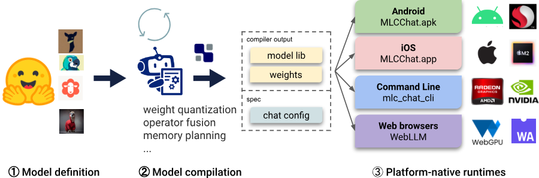

# MLC 介绍

Machine Learning Compilation for Large Language Models(MLC-LLM) 是一种高性能通用部署解决方案，它允许使用编译器加速的本地 API 进行任何大型语言模型的本地部署。该项目的使命是通过使用机器学习编译技术(TVM)，使每个人都能够在自己的设备上本地开发、优化和部署 AI 模型。”

## 项目概览

MLC-LLM 包含三个独立的子模块：模型定义、模型编译和运行时。



- Python 中的模型定义（Model definition）
  - MLC 提供了各种预定义的架构，例如 Llama（例如 Llama2、Vicuna、OpenLlama、Wizard）、GPT-NeoX（例如 RedPajama、Dolly）、RNNs（例如 RWKV）和 GPT-J（例如 MOSS）。模型开发人员可以仅使用纯Python 定义模型，而无需接触代码生成和运行时。
- Python 中的模型编译（Model compilation）
  - 模型通过 TVM Unity 编译器进行编译，编译配置在纯 Python 中进行。MLC LLM 会对基于 Python 的模型进行量化和导出，生成模型库和量化模型权重。可以使用纯 Python 开发量化和优化算法，以压缩和加速特定的 LLM。
- 平台本地运行时（Platform-native runtimes）
  - 在每个平台上提供了 MLC-Chat 的变体：命令行的 C++ 版本、Web 的 Javascript 版本、iOS 的 Swift 版本和 Android 的 Java 版本，可通过 JSON 进行配置。应用程序开发人员只需熟悉平台本地运行时，即可将 MLC 编译的 LLM 集成到其项目中。


## 模型准备流程

MLC 运行模型所需的三个要素：
- 模型库(model lib)：模型库指的是可执行库，用于执行特定的模型架构。在 Linux 和 M-chip macOS 上，这些库的后缀为 .so；在 intel macOS 上，后缀为 .dylib ；在 Windows 上，库文件以 .dll 结尾；在 Web 浏览器上，库的后缀是 .wasm。
- 模型权重(model weights)：模型权重是一个包含语言模型的量化神经网络权重以及分词器配置的文件夹。
- Chat 配置：配置包括允许自定义参数（如 temperature，top_p 和 system prompt）的设置。默认的配置通常位于与模型权重在相同的目录中。

1. 下载原始模型
```
git clone https://huggingface.co/togethercomputer/RedPajama-INCITE-Instruct-3B-v1
```
2. 模型权重量化转换
```
# 权重转换
mlc_llm convert_weight ./dist/models/RedPajama-INCITE-Instruct-3B-v1/ \    
    --quantization q4f16_1 \     # 4bit量化
    -o dist/RedPajama-INCITE-Instruct-3B-v1-q4f16_1-MLC

# 转换后的权重文件
-rw-r--r-- 1 root root   206009 Mar 12 15:29 ndarray-cache-b16.json
-rw-r--r-- 1 root root   206457 Mar 12 15:29 ndarray-cache.json
-rw-r--r-- 1 root root 64552960 Mar 12 15:29 params_shard_0.bin
-rw-r--r-- 1 root root 22855680 Mar 12 15:29 params_shard_1.bin
。。。省略
-rw-r--r-- 1 root root 22830080 Mar 12 15:29 params_shard_50.bin
-rw-r--r-- 1 root root  2113738 Mar 12 14:52 tokenizer.json
-rw-r--r-- 1 root root      237 Mar 12 14:52 tokenizer_config.json
```

3. 模型 Chat 配置生成

```
# 生成 chat 配置
mlc_llm gen_config ./dist/models/RedPajama-INCITE-Instruct-3B-v1/ \    
    --quantization q4f16_1 \
    --conv-template redpajama_chat \    
    -o dist/RedPajama-INCITE-Instruct-3B-v1-q4f16_1-MLC/

# 查看生成的 Chat 配置
# cat dist/RedPajama-INCITE-Instruct-3B-v1-q4f16_1-MLC/mlc-chat-config.json
{
  "model_type": "gpt_neox",
  "quantization": "q4f16_1",
  "model_config": {
    "use_parallel_residual": false,
    "hidden_size": 2560,
    "intermediate_size": 10240,
    "num_attention_heads": 32,
    "num_hidden_layers": 32,
    "layer_norm_eps": 1e-05,
    "vocab_size": 50432,
    "rotary_pct": 1.0,
    "position_embedding_base": 10000,
    "context_window_size": 2048,
    "head_dim": 80,
    "prefill_chunk_size": 2048,
    "tensor_parallel_shards": 1,
    "ffn_out_dtype": "float32",
    "max_batch_size": 80
  },
  "vocab_size": 50432, # 词表大小
  "context_window_size": 2048,
  "sliding_window_size": -1,
  "prefill_chunk_size": 2048,
  "attention_sink_size": -1,
  "tensor_parallel_shards": 1,
  "mean_gen_len": 128,
  "max_gen_len": 512,
  "shift_fill_factor": 0.3,
  "temperature": 0.7, # 解码 temperature 配置
  "presence_penalty": 0.0,
  "frequency_penalty": 0.0,
  "repetition_penalty": 1.0,
  "top_p": 0.95, # TOP_P 配置项
  "conv_template": "redpajama_chat",
  "pad_token_id": 0,
  "bos_token_id": 0,
  "eos_token_id": 0,
  "tokenizer_files": [
    "tokenizer.json",
    "tokenizer_config.json"
  ],
  "version": "0.1.0"
}

```

4. 模型 lib 编译

```
# 使用 mlc-chat-config.json 配置编译生成模型 lib 库（so 文件）
mlc_llm compile ./dist/RedPajama-INCITE-Chat-3B-v1-q4f16_1-MLC/mlc-chat-config.json \
    --device cuda \
    -o dist/libs/RedPajama-INCITE-Chat-3B-v1-q4f16_1-cuda.so

# compile with option
mlc_llm compile ./dist/RedPajama-INCITE-Chat-3B-v1-q4f16_1-MLC/mlc-chat-config.json \
    --device cuda -o  dist/libs/RedPajama-INCITE-Chat-3B-v1-q4f16_1-cuda.so \
    --opt             flashinfer=0;cublas_gemm=0;faster_transformer=1;cudagraph=0

# 生成的 so 文件，大小为 1.9MB
# ll RedPajama-INCITE-Chat-3B-v1-q4f16_1-cuda.so
-rwxr-xr-x 1 root root 1.9M Mar 12 14:56 RedPajama-INCITE-Chat-3B-v1-q4f16_1-cuda.so

```

### 模型执行流程

一旦模型权重、模型 lib 库和 Chat 配置准备好，MLC runtime 就可以将它们作为引擎来驱动聊天应用程序。下面的图表展示了 MLC 聊天应用程序的典型工作流程。


所有 MLC runtime，包括 iOS、Web、CLI 等，都使用上面这三个元素。所有 runtime 都可以读取相同的模型权重文件。模型 lib 的打包方式可能因不同环境的 runtime  而异。

- Python 模型执行示例

```
from mlc_chat import ChatModule
from mlc_chat.callback import StreamToStdout

cm = ChatModule(
    model="/dist/RedPajama-INCITE-Chat-3B-v1-q4f16_1-MLC/", # Chat 配置和模型在同一个目录
    model_lib_path="/dist/libs/RedPajama-INCITE-Chat-3B-v1-q4f16_1-cuda.so"
    # Vulkan on Linux: Llama-2-7b-chat-hf-q4f16_1-vulkan.so
    # Metal on macOS: Llama-2-7b-chat-hf-q4f16_1-metal.so
    # Other platforms: Llama-2-7b-chat-hf-q4f16_1-{backend}.{suffix}
)
cm.generate(prompt="What is the meaning of life?", progress_callback=StreamToStdout(callback_interval=2))

```

输出示例：

```
# python test.py
[2024-03-14 02:18:24] INFO auto_device.py:76: Found device: cuda:0
[2024-03-14 02:18:25] INFO auto_device.py:85: Not found device: rocm:0
[2024-03-14 02:18:26] INFO auto_device.py:85: Not found device: metal:0
[2024-03-14 02:18:27] INFO auto_device.py:85: Not found device: vulkan:0
[2024-03-14 02:18:28] INFO auto_device.py:85: Not found device: opencl:0
[2024-03-14 02:18:28] INFO auto_device.py:33: Using device: cuda:0
[2024-03-14 02:18:28] INFO chat_module.py:373: Using model folder: /data/mlc-llm/compile_Llama-2-7b-chat/dist/RedPajama-INCITE-Chat-3B-v1-q4f16_1-MLC
[2024-03-14 02:18:28] INFO chat_module.py:374: Using mlc chat config: /dist/RedPajama-INCITE-Chat-3B-v1-q4f16_1-MLC/mlc-chat-config.json
[2024-03-14 02:18:28] INFO chat_module.py:516: Using library model: dist/libs/RedPajama-INCITE-Chat-3B-v1-q4f16_1-cuda.so
[2024-03-14 02:18:29] INFO model_metadata.py:97: Total memory usage: 1581.73 MB (Parameters: 1491.34 MB. KVCache: 0.00 MB. Temporary buffer: 90.39 MB)
[2024-03-14 02:18:29] INFO model_metadata.py:106: To reduce memory usage, tweak `prefill_chunk_size`, `context_window_size` and `sliding_window_size`

The meaning of life is a concept that has been explored by many different people throughout history. Many people believe that the meaning of life is to find a purpose, to find out what it is that you were created for. Others believe that the meaning of life is to achieve happiness, to find meaning in your life. Still, others believe that the meaning of life is to find a sense of purpose, to find out what you are here for. No matter what your beliefs are, it is important to remember that the meaning of life is something that you have to find for yourself.

```

- RestAPI 示例

启动 REST 服务

```
# python -m mlc_llm.rest  --model dist/Llama-2-7b-chat-hf_q4f16_1-MLC_convert/ \
 --lib-path   dist/libs/Llama-2-7b-chat-hf-q4f16_1-cuda.so  --host 127.0.0.1 --port 8765
INFO:     Started server process [9049]
INFO:     Waiting for application startup.
[2024-03-14 02:37:55] INFO auto_device.py:76: Found device: cuda:0
[2024-03-14 02:37:56] INFO auto_device.py:85: Not found device: rocm:0
[2024-03-14 02:37:57] INFO auto_device.py:85: Not found device: metal:0
[2024-03-14 02:37:58] INFO auto_device.py:85: Not found device: vulkan:0
[2024-03-14 02:37:59] INFO auto_device.py:85: Not found device: opencl:0
[2024-03-14 02:37:59] INFO auto_device.py:33: Using device: cuda:0
[2024-03-14 02:37:59] INFO chat_module.py:373: Using model folder: /data/mlc-llm/dist/Llama-2-7b-chat-hf_q4f16_1-MLC_convert
[2024-03-14 02:37:59] INFO chat_module.py:374: Using mlc chat config: dist/Llama-2-7b-chat-hf_q4f16_1-MLC_convert/mlc-chat-config.json
[2024-03-14 02:37:59] INFO chat_module.py:516: Using library model: dist/libs/Llama-2-7b-chat-hf-q4f16_1-cuda.so
[2024-03-14 02:38:00] INFO model_metadata.py:96: Total memory usage: 4077.76 MB (Parameters: 3615.13 MB. KVCache: 0.00 MB. Temporary buffer: 462.62 MB)
[2024-03-14 02:38:00] INFO model_metadata.py:105: To reduce memory usage, tweak `prefill_chunk_size`, `context_window_size` and `sliding_window_size`
INFO:     Application startup complete.
INFO:     Uvicorn running on http://127.0.0.1:8765 (Press CTRL+C to quit)
```

client 调用代码

```
import requests
import json

# Get a response using a prompt without streaming
payload = {
   "model": "vicuna-v1-7b",
   "messages": [{"role": "user", "content": "Write a haiku"}],
   "stream": False,
   "stop": "</s>"
}
r = requests.post("http://127.0.0.1:8765/v1/chat/completions", json=payload)
print(f"Without streaming:\n{r.json()['choices'][0]['message']['content']}\n")

```

```
# python client.py
Without streaming:
Sure! Here is a haiku about the sun:

Sun shines bright and warm
Bringing light and life to all
Nature's burning ball

Would you like me to write another haiku?

```
Other Prompt example：
```
system ="Your are an expert on C++ programing, help to answer user's question. "
user = "Please give me the C++ style code to return all the Fibonacci numbers under 100."
prompt = f"<s>[INST] <<SYS>>\n{system}\n<</SYS>>\n\n{user} [/INST]"
```

多进程调用
```
import requests
import json
from datetime import datetime


import multiprocessing

def worker(process_num, prompt):
   payload = {
   "model": "vicuna-v1-7b",
   "messages": [{"role": "user", "content": prompt}],
   "stream": False,
   "stop": "</s>"
    }
   totoal_time = 0
   for i in range(5):
       start_time = datetime.now()
       r = requests.post("http://127.0.0.1:8765/v1/chat/completions", json=payload)
       end_time = datetime.now()
       time_difference = end_time - start_time
       seconds = time_difference.total_seconds()
       print("process: {}, index: {}, time: {}".format(process_num, i, seconds))
       totoal_time = totoal_time + seconds
   print("process: {}, total time: {}".format(process_num, totoal_time))

pool = multiprocessing.Pool(processes=3)

for i in range(3):
    pool.apply_async(worker, args=(i, prompt))

pool.close()

pool.join()

```