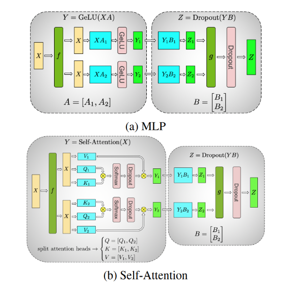

# 推理优化

本文讨论了 LLM 推理中最紧迫的挑战，并提供了一些实际解决方案。

## 理解 LLM 推理

大多数流行的 decoder-only LLM（例如 GPT-3）都是在因果建模 (causal modeling) 目标上进行预训练的，本质上是下一个词的预测器。这些 LLM 将一系列 Token 作为输入，并自回归地生成后续 Token，直到满足停止条件（例如生成的 Token 数量限制或停止词列表）或生成特殊的 `<end>` Token表示生成结束。

该过程包括两个阶段：预填充阶段 (prefill phase) 和解码阶段 (decode phase)。

请注意，Token 是模型处理的语言的最小单元。一个 Token 大约相当于四个英文字符。在输入模型之前，所有自然语言的输入都会被转换为 Token。

## 预填充阶段

在预填充阶段，LLM 处理输入 Token 以计算中间状态（键和值），这些中间状态用于生成“第一个”新 Token。每个新 Token 都依赖于所有先前的 Token，但由于完整的输入范围已知，在高层次上，这是一个高度并行化的矩阵-矩阵操作。它有效地饱和了 GPU 的利用率。

## 解码阶段

在解码阶段，LLM 自回归地逐个生成输出 Token，直到满足停止条件。每个顺序输出 Token 都需要了解所有先前迭代的输出状态（键和值）。与预填充阶段相比，这类似于一种矩阵-向量操作，但对于 GPU 的计算能力利用不足。数据（权重、键、值、激活值）从内存传输到 GPU 的速度主导了延迟，而不是计算本身的速度。换句话说，这是一种 memory-bound 的操作。

本文中介绍的许多推理挑战及相应解决方案都涉及到对解码阶段的优化
- 有效的注意力模块
- 有效管理键和值

不同的 LLM 可能使用不同的分词器，因此，直接比较它们之间的输出 Token 可能并不简单。当比较推理吞吐量时，即使两个 LLM 的每秒输出 Token 数相似，如果它们使用不同的分词器，它们可能并不等效。这是因为相应的 Token 可能代表不同数量的字符。

## 批处理 (Batching)

改善 GPU 利用率并提高吞吐量的最简单方法是通过批处理。由于多个请求使用同一个模型，权重的内存成本得到了分摊。将较大的批次一次性传输到 GPU 进行处理，将更充分地利用可用的计算资源。

然而，批次大小只能增加到一定的限制，超过这个限制可能会导致内存溢出。要更好地理解为什么会出现这种情况，需要查看键-值（KV）缓存和 LLM 内存需求。

传统的批处理（也称为静态批处理）是次优的。这是因为在批处理中的每个请求中，LLM 可能会生成不同数量的完成 Token，进而导致它们具有不同的执行时间。结果是，批处理中的所有请求必须等待最长的请求完成，这可能会因生成长度的差异较大而加剧。有一些方法可以缓解这个问题，例如 in-flight batching，稍后将进行讨论。

## Key-value caching

解码阶段的一种常见优化是键-值（KV）缓存。解码阶段在每个时间步生成一个 Token，但每个 Token 都依赖于所有先前 Token 的键和值张量（包括预填充时计算的输入Token 的 KV 张量，以及计算到当前时间步的任何新 KV 张量）。

为了避免在每个时间步骤中为所有 Token 重新计算所有这些张量，可以将它们缓存在 GPU 内存中。在每次迭代中，当计算出新元素时，它们只需添加到运行缓存中，以便在下一次迭代中使用。在某些实现中，模型的每一层都有一个 KV 缓存。


## LLM 的显存要求

实际上，对于 GPU 上的 LLM 显存需求，主要的两个因素是模型权重和 KV 缓存。

- 模型权重：显存被模型参数占用。例如，一个具有 7B 参数的模型（如 Llama2 7B），以 16-bit 精度（FP16 或 BF16）加载，大约需要 `7B * sizeof(FP16) ~= 14GB` 的内存。

- KV 缓存：内存被 self-attention 张量的缓存占用，以避免冗余计算。
在批处理中，批中每个请求的KV缓存仍然必须单独分配，并且可能占用大量内存。下面的公式描述了适用于大多数常见LLM架构的KV缓存大小。

```
每个 Token 的 KV 缓存大小（以字节为单位）= 2 * (num_layers) * (num_heads * dim_head) * precision_in_bytes
```

第一个因子 2 代表 K 和 V 矩阵。通常，(num_heads * dim_head) 的值与 transformer 的 hidden_size（或模型的维度 d_model）相同。这些模型属性通常可以在模型卡或相关的配置文件中找到。

每个输入序列中的每个 Token 都需要这个内存大小，跨输入批次。假设使用半精度，KV 缓存的总大小由以下公式给出。

```
KV 缓存的总大小（以字节为单位）= (batch_size) * (sequence_length) * 2 * (num_layers) * (hidden_size) * sizeof(FP16)
```

例如，对于一个使用 16-bit 精度、batch size 为 1 的 Llama2 7B 模型，

```
一个 Token 的 KV 缓存大小：1 * 1 * 2 * 32 * 4096 * 2 = 512KB
1024 个 Token 的 KV 缓存的大小将为 1 * 1024 * 2 * 32 * 4096 * 2 = 512MB
4096 个 Token 的 KV 缓存的大小将为 1 * 4096 * 2 * 32 * 4096 * 2 = 2048MB = 2GB。
```

有效地管理这个 KV 缓存是一项具有挑战性的任务。由于随着批大小和序列长度的线性增长，内存需求可能迅速增加。因此，它限制了可以提供的吞吐量，并对长上下文输入提出了挑战。这是本文中介绍的几项优化的动机。

## 使用模型并行化扩展LLM

减少模型权重在每个设备上的内存占用的一种方法是将模型分布在多个 GPU 上。将内存和计算资源分散开来，可以运行更大的模型或更大批次的输入。

模型并行化是显存要求超过单个 GPU 的模型的必需品，并使训练时间和推理度量（延迟或吞吐量）适用于特定的用例。根据如何分割模型权重，有几种模型并行化的方式。

请注意，数据并行也是在上述其他技术中经常提到的一种技术。在数据并行中，模型的权重复制到多个设备上，并且输入的（全局）批次大小被分割成微批次，分配到每个设备上。通过处理更大的批次，它可以减少总体执行时间。然而，它是一种在训练时进行的优化，对于推理过程来说不那么相关。

### Pipeline 并行(Pipeline parallelism)

Pipeline 并行涉及将模型（垂直地）分割成块，每个块包含一组层，这些层在单独的设备上执行。下图是四路 Pipeline 并行的示例，其中模型被顺序分割，所有层的四分之一子集在每个设备上执行。一个设备上的一组操作的输出传播到下一个设备，后者继续执行后续的块。$F_n$ 和 $B_n$ 分别表示设备 $n$ 上的前向传播和反向传播。在每个设备上存储模型权重的内存需求被有效地分成四份。

这种方法的主要限制是，由于处理过程的顺序性质，某些设备或层可能在等待前面层的输出（激活值、梯度）时保持空闲。这导致前向传播和反向传播中的低效或“管道气泡”。在图中，白色的空白区域是使用 Pipeline 并行的大型管道气泡，其中设备处于空闲和低利用状态。

微批处理可以在一定程度上缓解这个问题，如图所示。将输入的全局批次大小分成子批次，逐个处理，梯度在末尾累积。注意，$F_{n,m}$ 和 $B_{n,m}$ 分别表示设备 $n$ 上的微批次 $m$ 的前向传播和后向传播。这种方法缩小了管道气泡的大小，但并不能完全消除它们。


来源：[GPipe: Easy Scaling with Micro-Batch Pipeline Parallelism](https://arxiv.org/pdf/1811.06965.pdf)

### 张量并行(Tensor parallelism)

张量并行化涉及将模型的各个层（水平地，hidden size 的维度）分割成较小的、独立的计算块，可以在不同设备上执行。注意力块和多层感知器（MLP）层是可以利用张量并行化的 transformer 的主要组成部分。在多头注意力块中，每个头或一组头可以分配到不同的设备上，因此它们可以独立且并行地计算。

MLP 和自注意层中的张量并行化示例。在 MLP 中，权重矩阵被分割到多个设备上，使用分割后的权重可以对一批输入进行同时计算。在自注意层中，多个注意力头自然是并行的，并且可以分布在不同的设备上。



来源：[Megatron-LM: Training Multi-Billion Parameter Language Models Using Model Parallelism](https://arxiv.org/pdf/1909.08053.pdf)

图中显示了一个两层 MLP 的两路张量并行化示例，每个层由一个圆角框表示。在第一层中，权重矩阵 $A$ 被分割为 $A_1$ 和 $A_2$。计算 $XA_1$ 和 $XA_2$ 可以在两个不同的设备上独立执行，作用于相同批次（ $f$ 是一个 identity(broadcast) 操作）的输入 $X$。这有效地将每个设备上存储权重的内存需求减半。reduction 操作 $g$ 将输出在第二层中合并。

图中是自注意层中两路张量并行化的示例。多个注意力头天然并行，并且可以在设备之间分割。

### 序列并行(Sequence parallelism)

张量并行存在一些限制，因为它要求将层分割成独立且可管理的块。它不适用于 LayerNorm 和 Dropout 等操作，这些操作需要在张量并行组中进行复制。虽然 LayerNorm 和 Dropout 的计算成本较低，但它们确实需要大量内存来存储（冗余的）激活值。

正如在[《Reducing Activation Recomputation in Large Transformer Models》](https://arxiv.org/pdf/2205.05198.pdf)中所示，这些操作在输入序列上是独立的，可以沿着“序列维度”进行分割，从而使它们具有更高的内存效率。这被称为序列并行化。

同时具有张量并行化和序列并行化的 transformer 层的示例。序列并行化适用于 LayerNorm 和 Dropout 等操作，这些操作需要全局的规约，比如 LayerNorm 需要对单个序列下的所有参数做 reduce-sum，因此不适合张量并行化。


图：具有张量和序列并行化的 MLP 层。$g$ 和 $\bar{g}$ 是共轭的。$g$ 在前向传播中是 all-gather，在后向传播中是减少散射 reduce-scatter。$\bar{g}$ 在前向传播中是 reduce-scatter，后向传播中是 all-gather。

来源：[Reducing Activation Recomputation in Large Transformer Models](https://arxiv.org/pdf/2205.05198.pdf)

如图中所描述，$X$ 在序列维度（也就是 token 维度）上被切分成 $X_1^s$ 和 $X_2^s$，然后分别做 LayerNorm，输出 $Y_1^s$ 和 $Y_2^s$。然后做 all-gather，这样所有卡上有相同的 $Y$。然后再做 Tensor 并行。

模型并行化的技术不是相互排斥的，可以结合使用。它们可以帮助扩展和减少 LLM 每个 GPU 的内存占用，但也有专门用于注意力模块的优化技术。


## 优化注意力机制

缩放点积注意力（scaled dot-product attention, SDPA）操作将查询和键值对映射到输出，如[《Attention Is All You Need》](https://arxiv.org/pdf/1706.03762.pdf)中所述。

作为对 SDPA 的增强，通过使用不同的投影将注意力层并行执行多次，使模型能够同时关注来自不同表示子空间的信息。这些子空间是独立学习的，为模型提供了对输入中不同位置的更丰富理解。

如图所示，多个并行注意力操作的输出被连接并线性投影以进行组合。每个并行注意力层称为一个“头”，这种方法称为多头注意力（MHA）。


在原始论文中，当使用八个并行注意力头时，每个注意力头在模型的降维空间（例如 $d_{model}/8$）上操作。这样可以保持计算成本与单头注意力相似。

```
Prefilling：
X 输入 (batch_size, seq_len, hidden_dim) # hidden_dim = 768

------
MHA: 
P_Q, P_K, P_V = (768, 768), # hidden_dim, hidden_dim

X * P_Q 变成 Q = (batch_size, seq_len, 768)
X * P_K 变成 K = (batch_size, seq_len, 768)
X * P_V 变成 V = (batch_size, seq_len, 768)

拆成 8 个 head：
Q : (8, seq_len, 96) # 768 = 8 * 96
K, V: (8, seq_len, 96)

------
MQA: 
P_Q = (768, 768) 
P_K，P_V = (768, 96) # 只有一个 head

X * P_Q 变成 Q = (batch_size, seq_len, 768)
X * P_K 变成 K = (batch_size, seq_len, 96)
X * P_V 变成 V = (batch_size, seq_len, 96)

把 Q 拆成 8 个 head，K，V 所有 head 共享
Q： (8, seq_len, 96)
K, V：(seq_len, 96)

------
GQA（Group = 2）:
P_Q = (768, 768) 
P_K，P_V = (768, 2 * 96) # 2 个 head

把 Q 拆成 8 个 head，K,V 拆成 2 个 Group，4 个 head 共享一个 K，V
Q： (8, seq_len, 96)
K, V：(2, seq_len, 96)
```

### Multi-query attention

在 [Fast Transformer Decoding](https://arxiv.org/abs/1911.02150) 中提出的多查询注意力（MQA）是 MHA 的一种推理优化之一，它在多个注意力头之间共享键和值。查询向量仍然被多次投影，与之前的操作相同。

尽管 MQA 的计算量与 MHA 相同（这里应该有误，因为有 Head 共享了，X 映射到 K 和 V 的计算量应该是减少了），但从内存中读取的数据量（键、值）相对较少。当受到内存带宽限制时，这可以更好地利用计算资源。它还减小了内存中 KV 缓存的大小，为更大的批次大小提供了空间。

减少键值头可能会导致潜在的准确性降低。此外，需要在推理过程中利用这种优化的模型需要进行训练（或至少使用[约 5% 的训练数据进行微调](https://arxiv.org/pdf/2305.13245.pdf)），以启用 MQA。

### Grouped-query attention

分组查询注意力（GQA）在 MHA 和 MQA 之间取得平衡，通过将键和值投影到几个查询头的组中。在每个组内，它的行为类似于多查询注意力。

图中显示，多头注意力具有多个键值头（左侧）。分组查询注意力（中间）具有多于一个但少于查询头数量的键值头，这是内存需求和模型质量之间的平衡。多查询注意力（右侧）具有一个单一的键值头，有助于节省内存。


不同的注意力机制对比。左：多头注意力具有多个键值头。右：多查询注意力具有一个单一的键值头，从而降低了内存需求。中：分组查询注意力具有几个键值头，平衡了内存和模型质量。

来源：[GQA: Training Generalized Multi-Query Transformer Models from Multi-Head Checkpoints](https://arxiv.org/pdf/2305.13245v2.pdf)

使用 MHA 进行原始训练的模型可以使用一部分原始训练计算进行 "uptrained"，并获得接近 MHA 的质量，同时保持更接近MQA的计算效率。Llama 2 70B 是利用 GQA 的模型的一个示例。

类似 MQA 和 GQA 的优化有助于通过减少存储的键和值头的数量来减少 KV 缓存所需的内存。但是，KV 缓存的管理可能仍存在低效问题。在优化注意力模块本身之外，下一节将介绍一种更高效的 KV 缓存管理技术。

### Flash attention

另一种优化注意力机制的方法是修改某些计算的顺序，以更好地利用 GPU 的内存层次结构。神经网络通常按层描述，并且大多数实现也是按此方式布局，即一次按顺序对输入数据进行一种计算。然而，这并不总是导致最佳性能，因为在已经进入内存层次结构的较高、性能更好的级别上进行更多的计算可能是有益的。

在实际计算过程中将多个层融合在一起可以最大限度地减少 GPU 需要读取和写入内存的次数，并将需要相同数据的计算组合在一起，即使它们是神经网络中不同层的一部分。

其中一个非常流行的融合方法是 FlashAttention，它是一种 I/O 感知的精确注意力算法，详细信息可参阅[《FlashAttention: Fast and Memory-Efficient Exact Attention with IO-Awareness》](https://arxiv.org/abs/2205.14135)。精确注意力意味着它在数学上与标准的多头注意力完全相同（对于多查询和分组查询注意力也有变种），因此可以将其替换到现有的模型架构中，甚至是已经训练好的模型中而无需进行任何修改。

I/O 感知意味着在融合操作时会考虑先前讨论的一些内存移动成本。特别是，FlashAttention 使用 “tiling”（切片）一次完全计算并写出最终矩阵的一小部分，而不是逐步在整个矩阵上进行部分计算，并在中间写出中间值。


图中显示了在 40GB GPU 上使用切片的 FlashAttention 计算模式和内存层次结构。右侧的图表显示了通过融合和重新排序注意力机制的不同组件所带来的相对加速比。

## Paged Attention

通过分页管理KV缓存的高效方法

有时，KV 缓存静态地“过度配置”，以适应最大可能的输入（支持的序列长度），因为输入的大小是不可预测的。例如，如果模型支持的最大序列长度为 2,048，则无论请求中的输入大小和生成的输出大小如何，都会在内存中保留 2,048 大小的空间。这个空间可能是连续分配的，而且通常有很大部分未被使用，导致内存浪费或碎片化。这个保留的空间将在请求的生命周期内被占用。


图中说明了由于过度配置和 KV 缓存的低效管理而导致的内存浪费和碎片化。
- "reserved" 表示为未来使用保留的内存，将在整个请求持续时间内保留。
- "internal fragmentation" 是由于很难预测生成的长度，因此内存被过度配置以适应最大序列长度。
- "external fragmentation" 表示由于批处理中的请求需要不同的预分配大小而导致的低效。

来源：[Efficient Memory Management for Large Language Model Serving with PagedAttention](https://arxiv.org/pdf/2309.06180.pdf)

受操作系统中的分页机制的启发，PagedAttention 算法使得连续的键和值可以存储在内存中的非连续空间中。它将每个请求的 KV 缓存分成表示固定数量 Token 的块，这些块可以以非连续的方式存储。

在注意力计算过程中，使用一个块表来按需获取这些块。随着新的 Token 生成，会进行新的块分配。这些块的大小是固定的，消除了不同请求需要不同分配的挑战所带来的低效。这极大地限制了内存的浪费，可以实现更大的批处理大小（从而提高吞吐量）。


## 模型优化技术

到目前为止，我们已经讨论了 LLM 在内存使用方面的不同方式，内存如何分布在多个不同的 GPU 上，以及优化注意力机制和 KV 缓存的方法。还有一些模型优化技术可以通过对模型权重本身进行修改来减少每个 GPU 上的内存使用。GPU 还具有专用硬件来加速对这些修改后的值进行操作，为模型提供更多的加速。

### 量化(Quantization)

量化是减少模型权重和激活精度的过程。大多数模型使用 32-bit 或 16-bit 精度进行训练，其中每个参数和激活元素占用 32-bit 或 16-bit 内存，即单精度浮点数。然而，大多数深度学习模型可以使用 8-bit 甚至更少的每个值来有效表示。


图中显示了一种可能的量化方法在进行量化前后的数值分布。在这种情况下，由于四舍五入而丢失了一些精度，并且由于裁剪而丢失了一些动态范围，从而使得数值可以以更小的格式表示。

降低模型的精度可以带来多个好处。模型在内存中占用的空间更小，可以在相同的硬件上容纳更大的模型。量化还意味着可以在相同的带宽上传输更多的参数，这有助于加速受带宽限制的模型。

对于 LLM，有许多不同的量化技术，可以在激活、权重或两者上降低精度。量化权重要简单得多，因为它们在训练后是固定的。然而，这可能会导致一些性能损失，因为激活保持在较高的精度。GPU 没有专用的硬件用于乘法 INT8 和 FP16 数字，因此权重必须转换回更高的精度以进行实际操作。

还可以量化激活，即 Transformer 块和网络层的输入，但这也带来了自身的挑战。激活向量通常包含异常值，有效地增加了它们的动态范围，并使得以低精度表示这些值比权重更具挑战性。

一种选择是通过将代表性数据集通过模型进行传递，找出异常值可能出现的位置，并选择以比其他激活更高的精度来表示某些激活（LLM.int8()）。另一种选择是借用权重的动态范围（易于量化），并在激活中重复使用该范围。

### 稀疏性(Sparsity)

类似于量化，已经证明许多深度学习模型对修剪（或将接近 0 的某些值替换为 0）是有鲁棒性的。稀疏矩阵是指其中许多元素为 0 的矩阵。这些矩阵可以用比完整的稠密矩阵更小的空间表示出来。


图：以压缩格式表示的稀疏矩阵，包含非零数据值及其对应的两位索引

特别是 GPU 具有针对一种结构化稀疏性的硬件加速，其中每 4 个值中有两个由零表示。稀疏表示还可以与量化结合，以实现更大的执行加速。找到以稀疏格式表示大型语言模型的最佳方法仍然是一个活跃的研究领域，并为未来改善推理速度提供了有希望的方向。


### 蒸馏(Distillation)

缩小模型大小的另一种方法是通过一种称为蒸馏的过程，将其知识传输到较小的模型中。这个过程涉及训练一个较小的模型（称为学生）来模仿一个较大模型（教师）的行为。

蒸馏模型的成功例子包括 DistilBERT，它将一个 BERT 模型压缩了 40%，同时保留了 97% 的语言理解能力，并且速度比原模型快 60%。

虽然在 LLM 中进行蒸馏是一个活跃的研究领域，但总体方法最早在[《Distilling the Knowledge in a Neural Network》](https://arxiv.org/abs/1503.02531)中首次针对神经网络进行了描述：

- 通过使用衡量它们输出差异的损失函数，训练学生网络以模拟较大的教师网络的性能。这个目标还可以包括将学生的输出与真实标签进行匹配的原始损失函数。
- 匹配的教师输出可以是最后一层（称为 logits）或中间层激活。


图中显示了使用教师和学生logits之间的知识蒸馏的一般框架。教师的 logits 是学生优化的软目标。其他蒸馏方法可能使用其他损失度量来从教师那里“蒸馏”知识。

来源：[Knowledge Distillation: A Survey](https://arxiv.org/pdf/2006.05525.pdf)

蒸馏的另一种替代方法是使用教师生成的数据对学生 LLM 进行监督训练，这在人工注释稀缺或不可用时特别有用。[《Distilling Step by Step!》](https://arxiv.org/abs/2305.02301)在提供作为基准的标签之外，将教师 LLM 作为 ground truth。这些 ground truth 作为中间推理步骤以数据高效的方式训练较小的学生 LLM。

需要注意的是，如今许多最先进的 LLM 具有限制性许可证，禁止使用它们的输出来训练其他 LLM，这使得找到合适的教师模型具有挑战性。

## 模型服务技术

模型执行通常受到内存带宽的限制，特别是在权重方面受到带宽限制。即使在之前应用了所有先前描述的模型优化方法之后，仍然很可能受到内存限制。因此，当加载模型权重时，应尽可能多地利用它们。换句话说，尝试并行进行操作。可以采取两种方法：

- In-flight batching：同时执行多个不同的请求。
- Speculative inference：并行执行序列的多个不同步骤，以尝试节省时间。

### In-flight batching

在实际应用中，LLM 具有一些独特的执行特性，这可能使得有效地批处理请求变得困难。单个模型可以同时用于各种看起来非常不同的任务。从聊天机器人中简单的问答回应，到文档摘要或长代码的生成，工作负载具有高度的动态性，输出的大小差异多达数个数量级。

这种多样性可能使得批处理请求并有效地并行执行变得具有挑战性，而这是为了为神经网络提供服务的常见优化方式。这可能导致某些请求比其他请求提前完成。

为了管理这些动态负载，许多 LLM 服务解决方案包括一种优化的调度技术，称为 continuous batching 或者 in-flight batching。这利用了一个事实，即 LLM 的整体文本生成过程可以分解为对模型的多次执行迭代。

在在 in-flight batching 中，服务器运行时不必等待整个批处理完成后再转到下一组请求，而是立即将已完成的序列从批处理中排除出去。然后，在其他请求仍在进行中时，它开始执行新的请求。因此 in-flight batching 可以大大提高实际使用情况下的 GPU 利用率。


### 推测性推理(Speculative inference)

推测性推理，也称为推测性采样(speculative sampling)、辅助生成(assisted generation)或分块并行解码(blockwise parallel decoding)，是一种并行执行 LLM 的不同方式。通常，GPT 风格的大型语言模型是自回归模型，逐个生成文本 Token。

生成的每个 Token 都依赖于之前的所有 Token 来提供上下文。这意味着在常规执行中，不可能并行生成同一序列的多个 Token ——必须等待第 n 个 Token 生成后才能生成 n+1。

图中显示了推测性推理的示例，其中草稿模型临时预测了多个未来步骤，并在并行中进行验证或拒绝。在本例中，草稿的前两个预测Token被接受，而最后一个Token在继续生成之前被拒绝并移除。


从 “I saw a dog ride”，draft 模型预测 “in the bus”。verification 模型并行预测 “in the car”，因此我们拒绝 “car” Token。

来源：[Blockwise Parallel Decoding for Deep Autoregressive Models](https://arxiv.org/abs/1811.03115)

推测性采样提供了一种解决方案。该方法的基本思想是使用一些“更廉价”的过程生成几个 Token 长的 draft 延续。然后，在多个步骤中并行执行主要的 “verification” 模型，使用廉价的 draft 作为需要的执行步骤的“推测性”上下文。

如果 “verification” 模型生成与 draft 相同的 Token，则可以将这些 Token 接受为输出。否则，可以在第一个不匹配的 Token 之后丢弃所有内容，并使用新的 draft 重复该过程。

有许多不同的选项来生成 draft Token，每个选项都有不同的权衡。您可以训练多个模型，或在单个预训练模型上微调多个头部，以预测多个步骤的 Token。或者，您可以使用一个较小的模型作为 draft 模型，使用一个更大、更强大的模型作为 “verification”。

## 总结

本文概述了许多最流行的解决方案，以帮助高效优化和提供 LLM。

## 参考文献
- [原文：mastering-llm-techniques-inference-optimization](https://developer.nvidia.com/blog/mastering-llm-techniques-inference-optimization/)