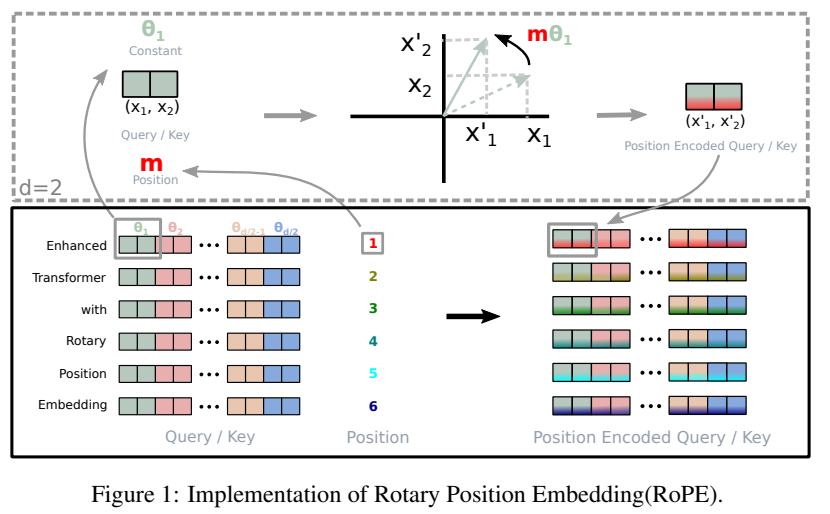
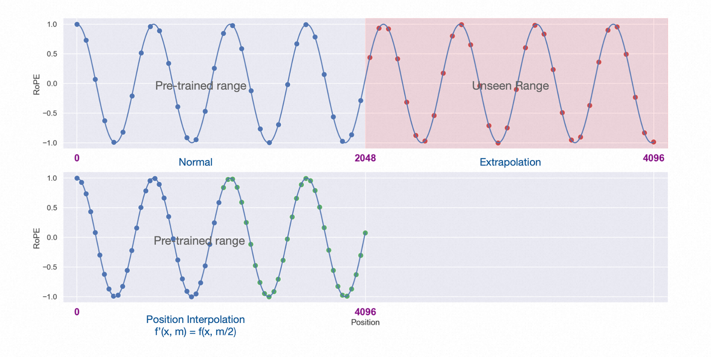

# Rotary Position Embedding

**旋转式位置编码（Rotary Position Embedding，RoPE）**

不同于 RNN、CNN 等模型，对于 Transformer 模型来说，位置编码的加入是必不可少的，因为纯粹的 Attention 模块是无法捕捉输入顺序的，即无法区分不同位置的 Token。为此我们大体有两个选择：
- 想办法将位置信息融入到输入中，这构成了绝对位置编码的一般做法；
- 想办法微调一下Attention结构，使得它有能力分辨不同位置的Token，这构成了相对位置编码的一般做法。


## Attention 回顾

在 Transformer 的 Attention 机制中，输入的每个 Token 首先会被映射为一个向量（即 embedding），然后通过如下公式计算注意力分数：

$$ \text{Attention}(Q, K, V) = \text{softmax}\left(\frac{QK^T}{\sqrt{d_k}}\right)V $$

这里 $Q$（Query）、$K$（Key）、$V$（Value）都是由输入 embedding 经过线性变换得到的。如果不引入任何位置信息，那么对于序列中的任意两个 Token，只要它们的 embedding 相同，无论它们在序列中的位置如何，经过 Attention 机制后得到的输出都是完全一样的。也就是说，Attention 只关注 Token 之间的内容相似性（即 embedding 之间的关系），而完全忽略了它们在序列中的先后顺序。

举个例子，假设输入序列为 $[A, B, C]$，如果我们将其顺序打乱为 $[C, B, A]$，只要 $A$、$B$、$C$ 的 embedding 不变，Attention 计算出来的结果也不会发生变化。这就导致模型无法区分“我爱你”和“你爱我”这样的句子，因为它们的 embedding 只是顺序不同，内容完全一样。

因此，**纯粹的 Attention 模块本身是“无序”的**，它对输入 Token 的顺序没有任何感知能力。为了让模型能够理解和利用序列的顺序信息，必须通过“位置编码（Positional Encoding）”等方式，将位置信息显式地注入到输入 embedding 中，使得不同位置的 Token 即使内容相同，其最终的表示也会不同，从而让模型能够区分不同位置的 Token。

## RoPE

在 RoPE 中，出发点就是“通过绝对位置编码的方式实现相对位置编码”，这样做既有理论上的优雅之处，也有实践上的实用之处，比如它可以拓展到线性 Attention 中就是主要因为这一点。

为了达到这个目的，我们假设通过运算 $f(\cdot, \text{position})$ 来给向量 $q,k$ 添加绝对位置信息：

$$ \tilde{q}_m = f(q, m), \tilde{k}_m = f(k, n) $$

其中 $m$ 和 $n$ 分别是向量 $q$ 和 $k$ 在序列中的位置。

Attention 的核心运算是内积，所以我们希望的内积的结果带有相对位置信息，因此假设，

$$ <f(q, m), f(k, n)> = g(q, k, m-n)$$

也就是任何两个添加了位置信息的向量的内积都带了两者之间的位置信息。

通过求解最终可以得到（略过详细过程）

$$ f(q, m) = q \cdot e^{i \cdot m \cdot \theta}$$

其中 $e^i$ 是欧拉公式（ $ e^{ix} = \cos(x) + i \sin(x) $ ）, $m$ 是向量 $q$ 的位置， $\theta$ 是某个角度。

根据欧拉公式，可以得到（这里先假定 $q$ 是二维的） 

$$ f(q, m) = (q^{(1)} + i q^{(2)}) \cdot (\cos(m \cdot \theta) + i \sin(m \cdot \theta) )$$

展开后，可以写成如下矩阵相乘的形式：

$$
\begin{align*}
f(q, m) & = (q^{(1)} \cos(m\theta) - q^{(2)} \sin(m\theta), \quad  q^{(1)} \sin(m\theta) + q^{(2)} \cos(m\theta)) \\
        & = \begin{pmatrix}
                \cos(m\theta) & -\sin(m\theta) \\
                \sin(m\theta) & \cos(m\theta)
                \end{pmatrix} 
                \begin{pmatrix}
                q^{(1)} \\
                q^{(2)}
                \end{pmatrix}
\end{align*}
$$

也就是说，对于每一对相邻的偶数、奇数维度（$q^{(1)}, q^{(2)}$），都可以用一个二维旋转矩阵作用在原始向量上，实现旋转式位置编码。这种方式可以批量应用到高维向量的每一对分量上。

然后，计算向量 $q$ 和向量 $k$ 之间的内积 $ <f(q, m), f(k, n)> $。

通过合并计算，最终可以得到：

$$
<f(q, m), f(k, n)> = 
\left(
    q_m^{(1)} \quad q_m^{(2)}
\right)
\begin{pmatrix}
    \cos((m-n)\theta) & -\sin((m-n)\theta) \\
    \sin((m-n)\theta) & \cos((m-n)\theta)
\end{pmatrix}
\begin{pmatrix}
    k_n^{(1)} \\
    k_n^{(2)}
\end{pmatrix}
$$

也就是满足了上面 $ g(q, k, m-n)$ 的要求。

### 多维的情况

因此，在二维的时候，位置编码函数如下，

$$
\begin{align*}
f(q, m) = \begin{pmatrix}
                \cos(m\theta) & -\sin(m\theta) \\
                \sin(m\theta) & \cos(m\theta)
                \end{pmatrix} 
                \begin{pmatrix}
                q^{(1)} \\
                q^{(2)}
                \end{pmatrix}
\end{align*}
$$

由于内积满足线性叠加性，因此任意偶数维的 RoPE，我们都可以表示为二维情形的拼接

$$
\left(
\begin{array}{cccccc}
\cos m\theta_0 & -\sin m\theta_0 & 0 & 0 & \cdots & 0 \\
\sin m\theta_0 & \cos m\theta_0  & 0 & 0 & \cdots & 0 \\
0 & 0 & \cos m\theta_1 & -\sin m\theta_1 & \cdots & 0 \\
0 & 0 & \sin m\theta_1 & \cos m\theta_1  & \cdots & 0 \\
\vdots & \vdots & \vdots & \vdots & \ddots & \vdots \\
0 & 0 & 0 & 0 & \cos m\theta_{d/2-1} & -\sin m\theta_{d/2-1} \\
0 & 0 & 0 & 0 & \sin m\theta_{d/2-1} & \cos m\theta_{d/2-1} \\
\end{array}
\right)
\cdot
\left(
\begin{array}{c}
q^{(0)} \\
q^{(1)} \\
q^{(2)} \\
q^{(3)} \\
\vdots \\
q^{(d-2)} \\
q^{(d-1)} \\
\end{array}
\right)
$$

其中 $θ_i=10000^{−2i/d}$ 。

上面的左边矩阵是一个正交矩阵，它不会改变向量的模长，因此通常来说它不会改变原模型的稳定性。同时由于稀疏性，所以直接用矩阵乘法来实现会很浪费算力，推荐通过下述方式来实现 RoPE：

$$
\begin{pmatrix}
q^{(0)} \\
q^{(1)} \\
q^{(2)} \\
q^{(3)} \\
\vdots \\
q^{(d-2)} \\
q^{(d-1)} \\
\end{pmatrix}
\otimes
\begin{pmatrix}
\cos m\theta_0 \\
\cos m\theta_0 \\
\cos m\theta_1 \\
\cos m\theta_1 \\
\vdots \\
\cos m\theta_{d/2-1} \\
\cos m\theta_{d/2-1}
\end{pmatrix}
+
\begin{pmatrix}
-q^{(1)} \\
q^{(0)} \\
-q^{(3)} \\
q^{(2)} \\
\vdots \\
-q^{(d-1)} \\
q^{(d-2)}
\end{pmatrix}
\otimes
\begin{pmatrix}
\sin m\theta_0 \\
\sin m\theta_0 \\
\sin m\theta_1 \\
\sin m\theta_1 \\
\vdots \\
\sin m\theta_{d/2-1} \\
\sin m\theta_{d/2-1}
\end{pmatrix}
$$

如下图：



## 代码实现

### LLAMA 的实现

[LLAMA 的代码](https://github.com/meta-llama/llama/blob/llama_v1/llama/model.py)

```
import torch

def precompute_freqs_cis(dim: int, end: int, constant: float = 10000.0):
    '''
    计算cos和sin的值，cos 值在实部，sin 值在虚部，类似于 cosx+j*sinx
    :param dim: q,k,v的最后一维，一般为 emb_dim/head_num
    :param end: 句长 length
    :param constant： 这里指 10000
    :return:
    复数计算 torch.polar(a, t)输出， a*(cos(t)+j*sin(t))
    '''
    # freqs: 计算 1/(10000^(2i/d) )，将结果作为参数theta
    # 形式化为 [theta_0, theta_1, ..., theta_(d/2-1)]
    # 其中 [: (dim // 2)] 是为了 dim 为奇数的情况下做截断
    # torch.arange(0, dim, 2) 等于公式里面的 2i
    freqs = 1.0 / (constant ** (torch.arange(0, dim, 2)[: (dim // 2)].float() / dim)) # [d/2]

    # 计算 m
    t = torch.arange(end, device=freqs.device)  # [length]
    # 计算 m*theta 的外积
    # m.shape = (length), freqs.shape = (d/2)
    freqs = torch.outer(t, freqs).float()  # [length, d/2]
    # freqs形式化为 [m*theta_0, m*theta_1, ..., m*theta_(d/2-1)],其中 m=0,1,...,length-1

    # 计算 cos(m*theta)+j*sin(m*theta)
    # 其中 freqs 是角度，向量的长度为 1，所以这里使用 ones_like
    freqs_cis = torch.polar(torch.ones_like(freqs), freqs)  # complex64
    # freqs_cis: [cos(m*theta_0)+j*sin(m*theta_0),  cos(m*theta_1)+j*sin(m*theta_1),), ..., cos(m*theta_(d/2-1))+j*sin(m*theta_(d/2-1))]
    # 其中j为虚数单位， m=0,1,...,length-1
    return freqs_cis # [length, d/2]

def reshape_for_broadcast(freqs_cis: torch.Tensor, x: torch.Tensor):
    ndim = x.ndim
    assert 0 <= 1 < ndim
    assert freqs_cis.shape == (x.shape[1], x.shape[-1])
    shape = [d if i == 1 or i == ndim - 1 else 1 for i, d in enumerate(x.shape)] # (1, length, 1, d/2)
    return freqs_cis.view(*shape) # [1, length, 1, d/2]

def apply_rotary_emb(xq: torch.Tensor, xk: torch.Tensor, freqs_cis: torch.Tensor,):
    # 先将 xq 维度变为 [bs, length, head,  d/2, 2], 利用 torch.view_as_complex 转变为复数
    # xq:[q0, q1, .., q(d-1)] 转变为 xq_: [q0+j*q1, q2+j*q3, ..., q(d-2)+j*q(d-1)]
    xq_ = torch.view_as_complex(xq.float().reshape(*xq.shape[:-1], -1, 2)) # [bs, length, head, d/2]
    # 同样的，xk_:[k0+j*k1, k2+j*k3, ..., k(d-2)+j*k(d-1)]
    xk_ = torch.view_as_complex(xk.float().reshape(*xk.shape[:-1], -1, 2))

    freqs_cis = reshape_for_broadcast(freqs_cis, xq_) # [1, length, 1, d/2]
    # 这里 xq_ * freqs_cis 就是每个元素相乘，计算复数的乘法
    # 下式 xq_ * freqs_cis 形式化输出，以第一个为例, 如下
    # (q0+j*q1)(cos(m*theta_0)+j*sin(m*theta_0)) = q0*cos(m*theta_0)-q1*sin(m*theta_0) + j*(q1*cos(m*theta_0)+q0*sin(m*theta_0))
    # 上式的实部为q0*cos(m*theta_0)-q1*sin(m*theta_0)，虚部为q1*cos(m*theta_0)+q0*sin(m*theta_0)
    # 然后通过 torch.view_as_real 函数，取出实部和虚部，维度由[bs, length, head, d/2]变为[bs, length, head, d/2, 2]，最后一维放实部与虚部
    # 最后经 flatten 函数将维度拉平，即 [bs, length, head, d]
    # 此时 xq_out 形式化为 [实部0，虚部0，实部1，虚部1，..., 实部(d/2-1), 虚部(d/2-1)]
    # 即为新生成的q
    xq_out = torch.view_as_real(xq_ * freqs_cis).flatten(3) # [bs, length, head, d]
    xk_out = torch.view_as_real(xk_ * freqs_cis).flatten(3)
    return xq_out.type_as(xq), xk_out.type_as(xk)

if __name__=='__main__':
    # (bs, length, head, d)
    q = torch.randn((2, 10, 4, 32))  # q=[q0, q1, .., qd-1]
    k = torch.randn((2, 10, 4, 32))
    v = torch.randn((2, 10, 4, 32))
    freqs_cis= precompute_freqs_cis(dim=32, end=10, constant= 10000.0)

    q_new, k_new = apply_rotary_emb(xq=q, xk=k, freqs_cis=freqs_cis)
    print(q_new.shape) # (2, 10, 4, 32)
    print(k_new.shape)
```

### Transformer 的实现

[Transformer 实现的代码](https://github.com/huggingface/transformers/blob/6cdbd73e01a9719bfaec07d91fd108e8d932bbbb/src/transformers/models/llama/modeling_llama.py#L96)

注意下面标注的部分

```
class LlamaRotaryEmbedding(nn.Module):
    def __init__(self, dim, max_position_embeddings=2048, base=10000, device=None, scaling_factor=1.0):
        super().__init__()
        self.scaling_factor = scaling_factor
        self.dim = dim
        self.max_position_embeddings = max_position_embeddings
        self.base = base
        inv_freq = 1.0 / (self.base ** (torch.arange(0, self.dim, 2, dtype=torch.int64).float().to(device) / self.dim))
        self.register_buffer("inv_freq", inv_freq, persistent=False)
        # For BC we register cos and sin cached
        self.max_seq_len_cached = max_position_embeddings
        t = torch.arange(self.max_seq_len_cached, device=device, dtype=torch.int64).type_as(self.inv_freq)
        t = t / self.scaling_factor
        freqs = torch.outer(t, self.inv_freq)
        # Different from paper, but it uses a different permutation in order to obtain the same calculation
        # 注意：这里的实现有点不同
        emb = torch.cat((freqs, freqs), dim=-1)
        self.register_buffer("_cos_cached", emb.cos().to(torch.get_default_dtype()), persistent=False)
        self.register_buffer("_sin_cached", emb.sin().to(torch.get_default_dtype()), persistent=False)

    @property
    def sin_cached(self):
        logger.warning_once(
            "The sin_cached attribute will be removed in 4.39. Bear in mind that its contents changed in v4.38. Use "
            "the forward method of RoPE from now on instead. It is not used in the `LlamaAttention` class"
        )
        return self._sin_cached

    @property
    def cos_cached(self):
        logger.warning_once(
            "The cos_cached attribute will be removed in 4.39. Bear in mind that its contents changed in v4.38. Use "
            "the forward method of RoPE from now on instead. It is not used in the `LlamaAttention` class"
        )
        return self._cos_cached

    @torch.no_grad()
    def forward(self, x, position_ids):
        # x: [bs, num_attention_heads, seq_len, head_size]
        inv_freq_expanded = self.inv_freq[None, :, None].float().expand(position_ids.shape[0], -1, 1)
        position_ids_expanded = position_ids[:, None, :].float()
        # Force float32 since bfloat16 loses precision on long contexts
        # See https://github.com/huggingface/transformers/pull/29285
        device_type = x.device.type
        device_type = device_type if isinstance(device_type, str) and device_type != "mps" else "cpu"
        with torch.autocast(device_type=device_type, enabled=False):
            freqs = (inv_freq_expanded.float() @ position_ids_expanded.float()).transpose(1, 2)
            emb = torch.cat((freqs, freqs), dim=-1)
            cos = emb.cos()
            sin = emb.sin()
        return cos.to(dtype=x.dtype), sin.to(dtype=x.dtype)


def rotate_half(x):
    """
    Rotates half the hidden dims of the input.
    rotate_half 函数的核心作用是对输入张量 x 的最后一个维度进行“旋转”操作
    将最后一个维度分成两半，分别是 x1（前半部分）和 x2（后半部分）。
    对后半部分 x2 取负号。
    将负号后的 x2 和 x1 重新拼接，顺序变为 (-x2, x1)。
    这里和原始的论文中交替取两个元素不同
    """
    x1 = x[..., : x.shape[-1] // 2]
    x2 = x[..., x.shape[-1] // 2 :]
    return torch.cat((-x2, x1), dim=-1)


def apply_rotary_pos_emb(q, k, cos, sin, position_ids=None, unsqueeze_dim=1):
    """Applies Rotary Position Embedding to the query and key tensors.

    Args:
        q (`torch.Tensor`): The query tensor.
        k (`torch.Tensor`): The key tensor.
        cos (`torch.Tensor`): The cosine part of the rotary embedding.
        sin (`torch.Tensor`): The sine part of the rotary embedding.
        position_ids (`torch.Tensor`, *optional*):
            Deprecated and unused.
        unsqueeze_dim (`int`, *optional*, defaults to 1):
            The 'unsqueeze_dim' argument specifies the dimension along which to unsqueeze cos[position_ids] and
            sin[position_ids] so that they can be properly broadcasted to the dimensions of q and k. For example, note
            that cos[position_ids] and sin[position_ids] have the shape [batch_size, seq_len, head_dim]. Then, if q and
            k have the shape [batch_size, heads, seq_len, head_dim], then setting unsqueeze_dim=1 makes
            cos[position_ids] and sin[position_ids] broadcastable to the shapes of q and k. Similarly, if q and k have
            the shape [batch_size, seq_len, heads, head_dim], then set unsqueeze_dim=2.
    Returns:
        `tuple(torch.Tensor)` comprising of the query and key tensors rotated using the Rotary Position Embedding.
    """
    cos = cos.unsqueeze(unsqueeze_dim)
    sin = sin.unsqueeze(unsqueeze_dim)
    # 注意：这里 rotate_half 将前后半部分 (x1, x2) 做交换，并变成 (-x2, x1)
    q_embed = (q * cos) + (rotate_half(q) * sin)
    k_embed = (k * cos) + (rotate_half(k) * sin)
    return q_embed, k_embed


# Attention 计算
query_states = query_states.view(bsz, q_len, self.num_heads, self.head_dim).transpose(1, 2)
key_states = key_states.view(bsz, q_len, self.num_key_value_heads, self.head_dim).transpose(1, 2)
value_states = value_states.view(bsz, q_len, self.num_key_value_heads, self.head_dim).transpose(1, 2)

past_key_value = getattr(self, "past_key_value", past_key_value)
cos, sin = self.rotary_emb(value_states, position_ids)
query_states, key_states = apply_rotary_pos_emb(query_states, key_states, cos, sin)

```

这其实是因为 tranformer 中在将权重转换成 HF 的格式时，对 Q，K 的权重提前做了转换

[代码](https://github.com/huggingface/transformers/blob/e42587f596181396e1c4b63660abf0c736b10dae/src/transformers/models/llama/convert_llama_weights_to_hf.py#L113-L115) 如下

```

# permute for sliced rotary
def permute(w, n_heads=n_heads, dim1=dim, dim2=dim):
    """
    w.view(n_heads, dim1 // n_heads // 2, 2, dim2) 将原始权重张量 w 重新排列成四维张量
    transpose(1, 2) 交换第 1 维和第 2 维（即 dim1 // n_heads // 2 和 2）
    reshape(dim1, dim2) 操作将张量重新拉平成原始的二维形状 (dim1, dim2)
    """
    return w.view(n_heads, dim1 // n_heads // 2, 2, dim2).transpose(1, 2).reshape(dim1, dim2)


state_dict = {
    # 这里对 Q 和 K 提前做了转换
    f"model.layers.{layer_i}.self_attn.q_proj.weight": permute(
        loaded[f"layers.{layer_i}.attention.wq.weight"]
    ),
    f"model.layers.{layer_i}.self_attn.k_proj.weight": permute(
        loaded[f"layers.{layer_i}.attention.wk.weight"]
    ),
    f"model.layers.{layer_i}.self_attn.v_proj.weight": loaded[f"layers.{layer_i}.attention.wv.weight"],
    f"model.layers.{layer_i}.self_attn.o_proj.weight": loaded[f"layers.{layer_i}.attention.wo.weight"],
    f"model.layers.{layer_i}.mlp.gate_proj.weight": loaded[f"layers.{layer_i}.feed_forward.w1.weight"],
    f"model.layers.{layer_i}.mlp.down_proj.weight": loaded[f"layers.{layer_i}.feed_forward.w2.weight"],
    f"model.layers.{layer_i}.mlp.up_proj.weight": loaded[f"layers.{layer_i}.feed_forward.w3.weight"],
    f"model.layers.{layer_i}.input_layernorm.weight": loaded[f"layers.{layer_i}.attention_norm.weight"],
    f"model.layers.{layer_i}.post_attention_layernorm.weight": loaded[f"layers.{layer_i}.ffn_norm.weight"],
}

```

permute 的作用示例如下：

```
n = 8
matrix = torch.zeros((n, n))
for i in range(n):
    for j in range(n):
        matrix[i, j] = i * n +  j

>>> print(matrix)
tensor([[ 0.,  1.,  2.,  3.,  4.,  5.,  6.,  7.],
        [ 8.,  9., 10., 11., 12., 13., 14., 15.],
        [16., 17., 18., 19., 20., 21., 22., 23.],
        [24., 25., 26., 27., 28., 29., 30., 31.],
        [32., 33., 34., 35., 36., 37., 38., 39.],
        [40., 41., 42., 43., 44., 45., 46., 47.],
        [48., 49., 50., 51., 52., 53., 54., 55.],
        [56., 57., 58., 59., 60., 61., 62., 63.]])
>>> permute(matrix, n_heads=1, dim1=8, dim2=8)
tensor([[ 0.,  1.,  2.,  3.,  4.,  5.,  6.,  7.],
        [16., 17., 18., 19., 20., 21., 22., 23.],
        [32., 33., 34., 35., 36., 37., 38., 39.],
        [48., 49., 50., 51., 52., 53., 54., 55.],
        [ 8.,  9., 10., 11., 12., 13., 14., 15.],
        [24., 25., 26., 27., 28., 29., 30., 31.],
        [40., 41., 42., 43., 44., 45., 46., 47.],
        [56., 57., 58., 59., 60., 61., 62., 63.]])
```

## 长度外推

### 位置插值

论文名称：EXTENDING CONTEXT WINDOW OF LARGE LANGUAGE MODELS VIA POSITION INTERPOLATION

论文链接：https://arxiv.org/pdf/2306.1559



- 左半部分为预训练阶段的位置向量范围 [0,2048]
- 右上角为长度外推的部分 (2048,4096]
- 左下角为位置插值法，将 [0,4096] 的值降采样到 [0,2048] 预训练阶段支持的范围

公式如下，L为原先支持的长度(如 2048)， 为需要扩展的长度(如 4096)：

$$ f'(x, m)= f(x, \frac{mL}{L'})$$

代码实现：
```
def RotaryEmbedding(torch.nn.Module):
    def __init__(self, dim, max_position_embeddings=2048, base=10000, device=None):
        super().__init__()
        inv_freq = 1.0 / (base ** (torch.arange(0, dim, 2).float().to(device) / dim))
        self.register_buffer("inv_freq", inv_freq)

        max_position_embeddings = 8192

        # Build here to make `torch.jit.trace` work.
        self.max_seq_len_cached = max_position_embeddings
        t = torch.arange(
            self.max_seq_len_cached,
            device=self.inv_freq.device,
            dtype=self.inv_freq.dtype,
        )

        # 和上面的 self.scaling_factor 一致
        self.scale = 1 / 4
        t *= self.scale

        freqs = torch.einsum("i,j->ij", t, self.inv_freq)
        # Different from paper, but it uses a different permutation in order to obtain the same calculation
        emb = torch.cat((freqs, freqs), dim=-1)
        self.register_buffer(
            "cos_cached", emb.cos()[None, None, :, :], persistent=False
        )
        self.register_buffer(
            "sin_cached", emb.sin()[None, None, :, :], persistent=False
        )
```


### NTK-Aware Scaled RoPE

原文链接：[NTK-Aware Scaled RoPE](https://www.reddit.com/r/LocalLLaMA/comments/14lz7j5/ntkaware_scaled_rope_allows_llama_models_to_have/)

苏神分析链接：[Transformer升级之路：10、RoPE是一种β进制编码](https://link.zhihu.com/?target=https%3A//kexue.fm/archives/9675)

**位置 n 的旋转位置编码（RoPE），本质上就是数字 n 的 β 进制编码！**

通过进制转换，将原来的底数 $\beta$ (10000)，扩大 k 倍 (10000k)，为了让 RoPE 在更长序列下的编码效果等价于原始序列下的效果，需要满足：

$$ \frac{n}{(\beta \lambda)^{d/2 - 1}} = \frac{n/k}{(\beta )^{d/2 - 1}} $$

- n：序列长度（sequence length）。即模型一次可以处理的最大 token 数
- k：缩放因子（scaling factor），用于扩展 RoPE 的可用序列长度。比如 k=8 意味着序列长度扩展 8 倍
- β（beta）：缩放参数（scaling parameter），用于调整 RoPE 的频率范围，使其适配更长的序列。
- λ（lambda）：原始 RoPE 的频率基底（base frequency），通常是一个常数（如 10000）。
- d：特征维度（hidden dimension），通常指 RoPE 作用的维度索引。
- 左边：原始 RoPE 在序列长度 n 下的频率分布。
- 右边：缩放后 RoPE 在序列长度 n/k 下的频率分布。

这个等式的含义是：通过调整 β，使得在扩展序列长度 n/k 时，RoPE 的频率分布与原始 n 时保持一致。

不过，个人感觉好像把 $k$ 放到左边是不是更容易理解？

$$ \frac{n \cdot k}{(\beta \lambda)^{d/2 - 1}} = \frac{n}{(\beta )^{d/2 - 1}} $$

求解得到： 

$$ \lambda = k^{\frac{2}{d-2}}$$

[原始作者的实现](https://www.reddit.com/r/LocalLLaMA/comments/14lz7j5/ntkaware_scaled_rope_allows_llama_models_to_have/)

```
import transformers

old_init = transformers.models.llama.modeling_llama.LlamaRotaryEmbedding.__init__
def ntk_scaled_init(self, dim, max_position_embeddings=2048, base=10000, device=None):

    #The method is just these three lines
    max_position_embeddings = 16384
    a = 8 #Alpha value
    # 这里的 a(=8) 是要扩展的倍数，对应本文的 k。
    # 注意 k^(d/(d−2)) 是乘在 10000 上的，所以变换之后是这样的结果 β=(10000 ∗ k^(d/(d−2))^(2/d) = 10000^(2/d) ∗ k^ (2/d−2)，所以 λ=k^(2/(d−2))
    base = base * a ** (dim / (dim-2)) #Base change formula

    old_init(self, dim, max_position_embeddings, base, device)
```


[Transformer 的代码](https://github.com/huggingface/transformers/blob/6cdbd73e01a9719bfaec07d91fd108e8d932bbbb/src/transformers/models/llama/modeling_llama.py#L158)的实现：

```
class LlamaDynamicNTKScalingRotaryEmbedding(LlamaRotaryEmbedding):
    """LlamaRotaryEmbedding extended with Dynamic NTK scaling. Credits to the Reddit users /u/bloc97 and /u/emozilla"""

    def forward(self, x, position_ids):
        # difference to the original RoPE: inv_freq is recomputed when the sequence length > original length
        seq_len = torch.max(position_ids) + 1
        if seq_len > self.max_position_embeddings:
            # 计算新的基地
            # 
            base = self.base * (
                (self.scaling_factor * seq_len / self.max_position_embeddings) - (self.scaling_factor - 1)
            ) ** (self.dim / (self.dim - 2))
            inv_freq = 1.0 / (
                base ** (torch.arange(0, self.dim, 2, dtype=torch.int64).float().to(x.device) / self.dim)
            )
            self.register_buffer("inv_freq", inv_freq, persistent=False)  # TODO joao: this may break with compilation

        cos, sin = super().forward(x, position_ids)
        return cos, sin

```


## 参考文献
- https://spaces.ac.cn/archives/8265/comment-page-1
- https://spaces.ac.cn/archives/8130
- https://zhuanlan.zhihu.com/p/645263524
- https://zh.wikipedia.org/wiki/%E6%AC%A7%E6%8B%89%E5%85%AC%E5%BC%8F
- https://zhuanlan.zhihu.com/p/642884818
- https://blog.csdn.net/angel_hben/article/details/132475879
- https://arxiv.org/pdf/2104.09864
- https://github.com/huggingface/transformers/issues/25199
- https://discuss.huggingface.co/t/is-llama-rotary-embedding-implementation-correct/44509
- https://normxu.github.io/Rethinking-Rotary-Position-Embedding-2/