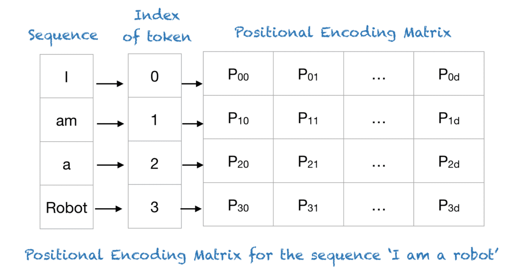
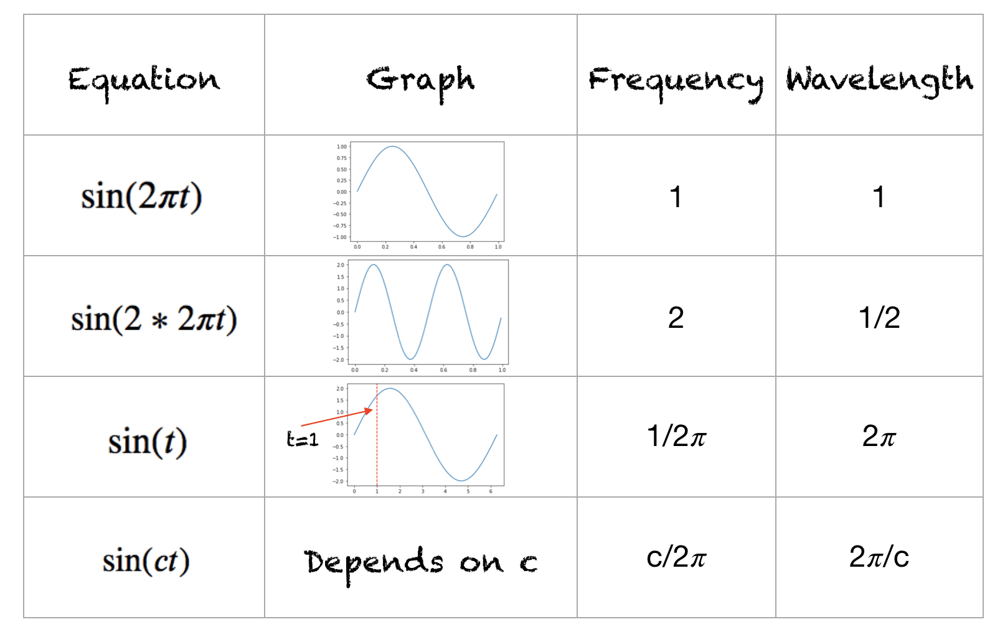
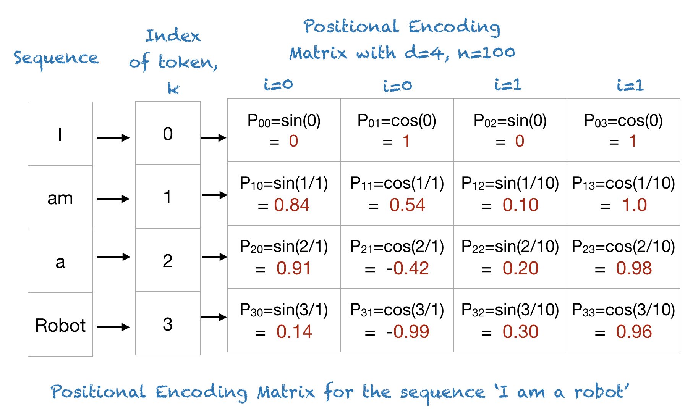
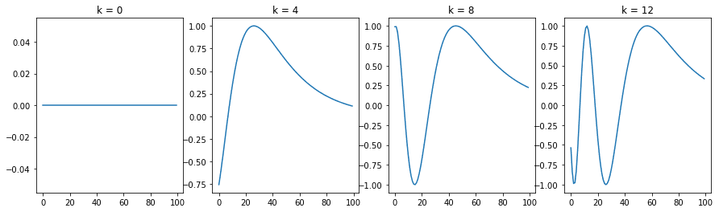
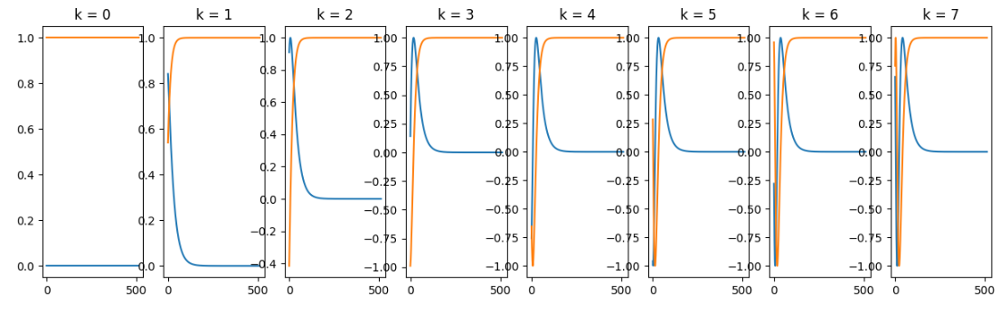
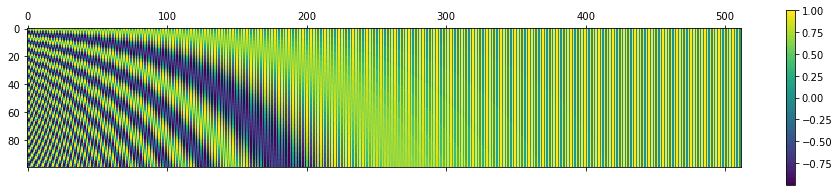
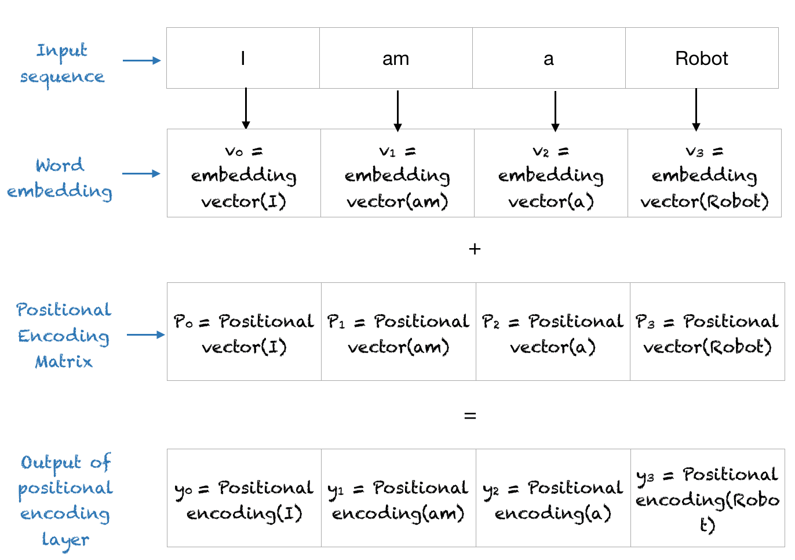

# Positional Encoding 详解


## 论文原文

Since our model contains no recurrence and no convolution, in order for the model to make use of the
order of the sequence, we must inject some information about the relative or absolute position of the
tokens in the sequence. To this end, we add "positional encodings" to the input embeddings at the
bottoms of the encoder and decoder stacks. The positional encodings have the same dimension dmodel
as the embeddings, so that the two can be summed. There are many choices of positional encodings,
learned and fixed [9].
In this work, we use sine and cosine functions of different frequencies:

 $$PE(pos, 2i) = \sin\Big(\frac{pos}{n^{2i/d}}\Big) $$

 $$PE(pos, 2i+1) = \cos\Big(\frac{pos}{n^{2i/d}}\Big) $$


where pos is the position and i is the dimension. That is, each dimension of the positional encoding
corresponds to a sinusoid. The wavelengths form a geometric progression from 2π to 10000 · 2π. We
chose this function because we hypothesized it would allow the model to easily learn to attend by
relative positions, since for any fixed offset k, P Epos+k can be represented as a linear function of
P Epos.
We also experimented with using learned positional embeddings [9] instead, and found that the two
versions produced nearly identical results (see Table 3 row (E)). We chose the sinusoidal version
because it may allow the model to extrapolate to sequence lengths longer than the ones encountered
during training.

## 什么是 Positional Encoding？

位置编码描述了序列中 Token 的位置，以便为每个位置的唯一的表示。在 Transformer 模型中，使用单个数字（如索引值）来表示 Token 在序列中的位置是不可行的。
这是因为对于较长的序列，索引值可能会变得非常大。如果将索引值规范化为 0 到 1 之间的值，对于可变长度的序列，会导致不同的归一化结果。

这样固然使得所有位置编码都落入区间 [0,1]，但是问题也是显著的：
不同长度序列的位置编码的步长是不同的，在较短序列中相邻的两个 Token 的位置编码的差异，会比长序列中相邻的两个 Token 的位置编码差异更小。如果使用这种方法，那么在长文本中相对次序关系会被“稀释”。

我们关注的位置信息，最核心的就是相对次序关系，尤其是上下文中的次序关系。也就是关注一个 Token 与另一个 Token 距离的相对位置（距离差几个 Token）。应该让位置 1 和位置 2 的距离比位置 3 和位置 10 的距离更近，位置 1 和位置 2 与位置 3 和位置 4 都只相差1。

总结一下，Positional Encoding的定义要满足下列需求：
- 每个位置有一个唯一的 positional encoding；
- 最好具有一定的值域范围，否则它比一般的 Word Embedding 的数值要大，难免会抢了 Word Embedding 的「风头」，对模型可能有一定的干扰；
- 需要体现一定的相对次序关系，并且在一定范围内的编码差异不应该依赖于文本长度，具有一定 translation invariant 平移不变性。

Transformer 使用一种智能的位置编码方案，其中每个位置/索引被映射到一个向量。
因此，位置编码层的输出是一个矩阵，矩阵的每一行表示序列中的编码对象与其位置信息相加得到的结果。下面的图示例展示了仅编码位置信息的矩阵。



## 正弦函数

这是对正弦函数的简要回顾；你同样可以使用余弦函数进行等效操作。该函数的取值范围为 [-1,+1] 。波形的频率是在一秒钟内完成的周期数。波长是波形重复自身的距离。不同波形的波长和频率如下所示：



$sin(2\pi x)$ 中 $2\pi x$ 为角度，当角度为 0 时，值为 0，当角度为 $90$ 度时，值为1，角度为 $180$ 度时，值为 0。以此类推。

## Transformer 中 的 Positional Encoding

假设有一个长度为 $L$ 的输入序列，Word Embedding 的维度为 $d$，并且需要确定该序列中的第 $k^{th}$ 对象的位置。位置编码由不同频率的正弦和余弦函数给出：

 $$PE(k, 2i) = \sin\Big(\frac{k}{n^{2i/d}}\Big) $$

 $$PE(k, 2i+1) = \cos\Big(\frac{k}{n^{2i/d}}\Big) $$

其中

- $k$: 输入序列中对象的位置，也就是输入的序列长度中的第 $k$ 个。
- $d$：输出 Word Embedding 的维度
- $n$: 用户定义的标量，《Attention Is All You Need》的作者设定为10,000。
- $i$: 用于映射到列索引，当值为单个值时，同时映射到正弦和余弦函数

在上述表达式中，可以看到偶数位置对应于正弦函数，奇数位置对应于余弦函数。

## 示例

为了理解上述表达式，让我们以短语 “I am a robot” 为例，其中 n=100，d=4。下表显示了该短语的位置编码矩阵。实际上，对于任何具有 n=100 和 d=4 的四个字母短语，位置编码矩阵都将是相同的。



示例（n=100，k=3, i=1, d=4）：

 $$PE(k=3, 2i=2) = \sin\Big(\frac{3}{100^{2/4}}\Big) = 0.2955 $$

 $$PE(k=3, 2i+1=3) = \cos\Big(\frac{3}{100^{2/4}}\Big) = 0.9553  $$

上面其实是第 $k$ 个 Token 的第 3 维和第 4 维度的值。

## Python 代码

下面是一个使用 NumPy 实现位置编码的简短 Python 代码。为了更容易理解位置编码，代码进行了简化。

```
import numpy as np
import matplotlib.pyplot as plt

def getPositionEncoding(seq_len, d, n=10000):
    P = np.zeros((seq_len, d))
    for k in range(seq_len):
        for i in np.arange(int(d/2)):
            denominator = np.power(n, 2*i/d)
            P[k, 2*i] = np.sin(k/denominator)
            P[k, 2*i+1] = np.cos(k/denominator)
    return P

P = getPositionEncoding(seq_len=4, d=4, n=100)
print(P)
```
```
[[ 0.          1.          0.          1.        ]
 [ 0.84147098  0.54030231  0.09983342  0.99500417]
 [ 0.90929743 -0.41614684  0.19866933  0.98006658]
 [ 0.14112001 -0.9899925   0.29552021  0.95533649]]
```

为了理解位置编码，让我们从 n=10,000 和 d=512 的不同位置的正弦波开始。

```
def plotSinusoid(k, d=512, n=10000):
    x = np.arange(0, 100, 1)
    denominator = np.power(n, 2*x/d)
    y = np.sin(k/denominator)
    plt.plot(x, y)
    plt.title('k = ' + str(k))
 
fig = plt.figure(figsize=(15, 4))    
for i in range(4):
    plt.subplot(141 + i) # 141 是用于创建子图的参数。它是一个三位数的整数，其中第一位表示子图的总行数，第二位表示子图的总列数，第三位表示当前子图的索引
    plotSinusoid(i*4)
```



同时打印 sin 和 cos 函数。

```
def plotSinusoid(k, d=512, n=10000):
    x = np.arange(0, 512, 1)
    denominator = np.power(n, 2*x/d)
    y1 = np.sin(k/denominator)
    y2 = np.cos(k/denominator)
    plt.plot(x, y1)
    plt.plot(x, y2)
    plt.title('k = ' + str(k))
 
fig = plt.figure(figsize=(15, 4))    
for i in range(8):
    plt.subplot(181 + i)
    plotSinusoid(i)
```


## 可视化位置编码矩阵


```
import matplotlib.pyplot as plt

def getPositionEncoding(seq_len, d, n=10000):
    P = np.zeros((seq_len, d))
    for k in range(seq_len):
        for i in np.arange(int(d/2)):
            denominator = np.power(n, 2*i/d)
            P[k, 2*i] = np.sin(k/denominator)
            P[k, 2*i+1] = np.cos(k/denominator)
    return P


P = getPositionEncoding(seq_len=100, d=512, n=10000)
cax = plt.matshow(P)
plt.gcf().colorbar(cax)
```



## Transfomer 中的实现

```
class PositionalEncoding(nn.Module):
    r"""Inject some information about the relative or absolute position of the tokens in the sequence.
        The positional encodings have the same dimension as the embeddings, so that the two can be summed.
        Here, we use sine and cosine functions of different frequencies.
    .. math:
        \text{PosEncoder}(pos, 2i) = sin(pos/10000^(2i/d_model))
        \text{PosEncoder}(pos, 2i+1) = cos(pos/10000^(2i/d_model))
        \text{where pos is the word position and i is the embed idx)
    Args:
        d_model: the embed dim (required).
        dropout: the dropout value (default=0.1).
        max_len: the max. length of the incoming sequence (default=5000).
    Examples:
        >>> pos_encoder = PositionalEncoding(d_model)
    """

    def __init__(self, d_model, dropout=0.1, max_len=5000):
        super(PositionalEncoding, self).__init__()
        self.dropout = nn.Dropout(p=dropout)

        pe = torch.zeros(max_len, d_model)
        position = torch.arange(0, max_len, dtype=torch.float).unsqueeze(1)
        div_term = torch.exp(torch.arange(0, d_model, 2).float() * (-math.log(10000.0) / d_model))
        pe[:, 0::2] = torch.sin(position * div_term)
        pe[:, 1::2] = torch.cos(position * div_term)
        #pe = pe.unsqueeze(0).transpose(0, 1)
        pe = pe.unsqueeze(0)
        self.register_buffer('pe', pe)

    def forward(self, x):
        r"""Inputs of forward function
        Args:
            x: the sequence fed to the positional encoder model (required).
        Shape:
            x: [sequence length, batch size, embed dim]
            output: [sequence length, batch size, embed dim]
        Examples:
            >>> output = pos_encoder(x)
        """

        # x = x + self.pe[:x.size(0), :]
        x = x + self.pe[:, :x.size(1)]
        return self.dropout(x)
```

重点看一下如下代码

```
max_len=5000
d_model=512
pe = torch.zeros(max_len, d_model)
position = torch.arange(0, max_len, dtype=torch.float).unsqueeze(1)
div_term = torch.exp(torch.arange(0, d_model, 2).float() * (-math.log(10000.0) / d_model))
pe[:, 0::2] = torch.sin(position * div_term)
pe[:, 1::2] = torch.cos(position * div_term)
```

这里做了一个 $log$ 和 $exp$ 的转换

 $$PE(pos, 2i) = \sin\Big(\frac{pos}{n^{2i/d}}\Big) = \sin\Big(pos * {n^{\frac{-2i}{d}}}\Big) $$

$$n^{\frac{-2i}{d}} = e^{log{n^{\frac{-2i}{d}}}} = e^{{\frac{-2i}{d}}{logn}} $$


## Positional Encoding 最后的输出

位置编码层将 Positional Encoding 与 Word Embedding 相加，并将该矩阵输出给后续的层。整个过程如下所示：




## 参考文档
- [Attention Is All You Need](https://arxiv.org/pdf/1706.03762.pdf)
- [A Gentle Introduction to Positional Encoding](https://machinelearningmastery.com/a-gentle-introduction-to-positional-encoding-in-transformer-models-part-1/)
- [详解Transformer中的Positional Encoding](https://blog.csdn.net/qq_40744423/article/details/121930739)
##

