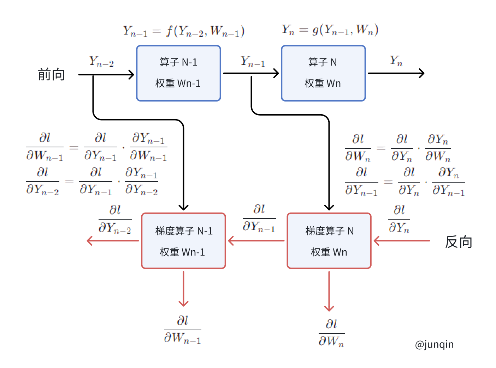

# 自动微分 (AUTOGRAD)

`torch.autograd` 是 PyTorch 的自动微分引擎，用于支持神经网络训练。

## 背景

神经网络（Neural networks）是一组嵌套函数，对一些输入数据进行执行。这些函数由参数定义（包括权重和偏置），在 PyTorch 中以张量的形式存储。

神经网络的训练分为两个步骤：

- 前向传播：在前向传播中，神经网络对样本的标注进行预测。它通过将输入数据通过每个函数来进行运算，从而进行这种猜测。

- 反向传播：在反向传播中，神经网络根据其预测的误差调整其参数。它通过从输出处向后遍历，收集与函数参数相关的误差导数（梯度），并使用梯度下降优化参数。

## Pytorch 中的使用

让我们来看一个单独的训练步骤。在这个例子中，我们从 torchvision 加载一个预训练的 resnet18 模型。我们创建一个随机数据张量来表示一个具有 3 个通道、高度和宽度为 64 的单个图像，以及其相应的标签初始化为一些随机值。预训练模型中的标签形状为（1,1000）。

```
import torch
from torchvision.models import resnet18, ResNet18_Weights
model = resnet18(weights=ResNet18_Weights.DEFAULT)
data = torch.rand(1, 3, 64, 64)
labels = torch.rand(1, 1000)
```

接下来，我们将输入数据通过模型的每一层进行运算，以进行预测。这是前向传递的过程。

我们使用模型的预测结果和相应的样本标注来计算误差（loss）。接下来的步骤是通过网络进行误差的反向传播。当我们在误差张量上调用 `.backward()` 时，反向传播过程开始。然后，Autograd 会计算并存储每个模型参数的梯度，存储在参数的 `.grad` 属性中。

```
loss = (prediction - labels).sum()
loss.backward() # backward pass
```

接下来，我们加载一个优化器，这里使用的是学习率为 0.01、动量为 0.9 的 SGD 优化器。我们在优化器中注册模型的所有参数。

```
optim = torch.optim.SGD(model.parameters(), lr=1e-2, momentum=0.9)
```

最后，我们调用 `.step()` 来启动梯度下降。优化器根据存储在 `.grad` 中的梯度来调整每个参数。

```
optim.step() #gradient descent
```

至此完成了一次前向和反向传播过程，完整的代码：

```
import torch
from torchvision.models import resnet18, ResNet18_Weights

data = torch.rand(1, 3, 64, 64)
labels = torch.rand(1, 1000)

model = resnet18(weights=ResNet18_Weights.DEFAULT)

# 初始化优化器时，告诉优化器应该更新模型的哪些参数（张量）
optim = torch.optim.SGD(model.parameters(), lr=1e-2, momentum=0.9)

prediction = model(data) # forward pass

loss = (prediction - labels).sum()

# pytorch 中 backward（）函数的计算，当进行反向传播时，梯度是累加起来而不是被替换，但在处理每一个 batch 时，如不需要与其他 batch 的梯度累加，需要对每个 batch 调用一遍 zero_grad（）将参数梯度置 0.
# 如果不是处理每个 batch 清除一次梯度，而是两次或多次再清除一次，也就是进行了梯度累加，相当于提高了 batch_size
# 执行 w.grad.data.zero_()
optim.zero_grad()

# 根据计算图，反向传播，通过链式法则，计算每个一参数的梯度
# 梯度就会被张量本身“存储”起来（它们具有 grad 和 requires_grad 属性）
loss.backward() # backward pass

# 优化器遍历它应该更新的所有参数（张量），并使用它们内部存储的 grad 来更新它们的值
# 不同的优化器有不同的策略
# 单纯的 SGD 计算 w.data = w.data - lr * w.wgrad.data
# Adam 会计算梯度一阶和二阶动量，然后再计算更新 w
optim.step() # gradient descent

```

## 自动微分中的求导过程 (Differentiation in Autograd)

让我们来看看 `autograd` 如何收集梯度。我们创建了两个张量 $a$ 和 $b$，并设置 `requires_grad=True`。这告诉 `autograd` 需要跟踪对它们的每个操作。

```
import torch

a = torch.tensor([2., 3.], requires_grad=True)
b = torch.tensor([6., 4.], requires_grad=True)
```

我们创建另一个张量 $Q = 3 a^3 - b^2$ 。

```
Q = 3*a**3 - b**2
```

假设 $a$ 和 $b$ 是神经网络的参数，$Q$ 是误差。在神经网络训练中，我们希望计算误差相对于参数的梯度，即：

$$ \frac{\partial Q}{\partial a} = 9 a^2 $$

$$ \frac{\partial Q}{\partial b} = -2 b $$

当我们在 $Q$ 上调用 `.backward()` 时，`autograd` 会计算这些梯度，并将它们存储在相应张量的 `.grad` 属性中。

我们需要在 `Q.backward()` 中明确传递一个梯度参数，因为它是一个向量。`gradient` 是一个与 `Q` 形状相同的张量，它表示 `Q` 相对于自身的梯度，即：

$$  \frac{\partial Q}{\partial Q} = 1 $$

同样地，我们也可以将 $Q$ 聚合成一个标量，并隐式地调用 `backward`，例如 `Q.sum().backward()`。

```
external_grad = torch.tensor([1., 1.])
Q.backward(gradient=external_grad)
```

梯度现在存储在 `a.grad` 和 `b.grad` 中。

```
# check if collected gradients are correct
print(9*a**2 == a.grad)
print(-2*b == b.grad)

# 输出
# tensor([True, True])
# tensor([True, True])

```

完整代码：

```
import torch

a = torch.tensor([2., 3.], requires_grad=True)
b = torch.tensor([6., 4.], requires_grad=True)

Q = 3*a**3 - b**2

external_grad = torch.tensor([1., 1.])
Q.backward(gradient=external_grad)

print(9*a**2 == a.grad)
print(-2*b == b.grad)

```

```
>>> a.grad
tensor([36., 81.])
>>> b.grad
tensor([-12.,  -8.])

```

## 使用 autograd 进行向量微积分（Vector Calculus）

假如你有一个向量函数 $ \vec{y} = f(\vec{x})$，其中 $\vec{y}$ 和 $\vec{x}$ 均为向量。$\vec{y}$ 的维度为 $m$，$\vec{x}$ 的维度为 $n$。

那么向量 $\vec{y}$ 相对于向量 $\vec{x}$ 的梯度是一个雅可比矩阵 $J$。

$$
J = \left[ \frac{\partial \vec{y}}{\partial x_1} {\cdots} \frac{\partial \vec{y}}{\partial x_n}  \right] = \begin{bmatrix}
{\frac{\partial y_1}{\partial x_1}}&{\cdots}&{\frac{\partial y_1}{\partial x_n}}\\
{\vdots}&{\ddots}&{\vdots}\\
{\frac{\partial y_m}{\partial x_1}}&{\cdots}&{\frac{\partial y_m}{\partial x_n}}\\
\end{bmatrix}
$$

一般来说，`torch.autograd` 就是用于计算向量雅可比积 (vector-Jacobian product) 的引擎。

也就是给定任何向量 $\vec{v}$，计算积 $ J^T \cdot \vec{v}$。

如果 $\vec{v}$ 是标量函数 $l = g(\vec{y})$ 的梯度，也就是

$$ \vec{v} = \left[ \frac{\partial l}{\partial y_1} {\cdots} \frac{\partial l}{\partial y_m}  \right]^T_{m \times 1} $$

那么根据链式法则，向量雅可比积将是 $l$ 相对于 $\vec{x}$ 的梯度：

$$
J^T \cdot \vec{v} = {\begin{bmatrix}
{\frac{\partial y_1}{\partial x_1}}&{\cdots}&{\frac{\partial y_m}{\partial x_1}}\\
{\vdots}&{\ddots}&{\vdots}\\
{\frac{\partial y_1}{\partial x_n}}&{\cdots}&{\frac{\partial y_m}{\partial x_n}}\\ 
\end{bmatrix}_{n \times m}}
\times
{\left[ \frac{\partial l}{\partial y_1} {\cdots} \frac{\partial l}{\partial y_m}  \right]^T_{m \times 1}}
$$

在上面的例子中，我们使用的就是向量雅可比积的这个特性；`external_grad` 表示 $\vec{v}$。


## 计算图 (Computational Graph)

从概念上讲，`autograd` 在一个由 `Function` 对象组成的有向无环图（DAG）中记录数据（张量）和所有执行的操作（以及生成的新张量）。在这个 DAG 中，叶子节点是输入张量，根节点是输出张量。通过从根节点到叶子节点的追踪，可以使用链式法则自动计算梯度。

在前向传递中，autograd 同时执行两个操作：
- 运行请求的操作以计算生成的张量，以及
- 在 DAG 中维护操作的梯度函数。

当在 DAG 根节点上调用 `.backward()` 方法时，反向传播开始。然后，`autograd`：

- 从每个 `.grad_fn` 计算梯度，
- 将梯度累积到相应张量的 `.grad` 属性中，

使用链式法则一直传播到叶子张量。

下面是示例中 DAG 的可视化表示。在图中，箭头方向表示正向传递。节点代表正向传递中每个操作的反向函数。蓝色的叶子节点代表我们的叶子张量 $a$ 和 $b$。


在 PyTorch 中，DAG 是动态的。需要注意的重要一点是，在每次 `.backward()` 调用之后，图是从头开始重新创建的；`autograd` 会开始填充一个新的图。这正是允许在模型中使用控制流语句的原因；如果需要，可以在每次迭代中更改形状、大小和操作。

## 从有向无环图（DAG）中排除

`torch.autograd` 会跟踪所有 `requires_grad` 标志设置为 `True` 的张量上的操作。对于不需要梯度的张量，将 `requires_grad` 属性设置为 `False` 会将其排除在梯度计算 DAG 之外。

即使只有一个输入张量设置了 requires_grad=True，操作的输出张量也会需要梯度。

```
x = torch.rand(5, 5)
y = torch.rand(5, 5)
z = torch.rand((5, 5), requires_grad=True)

a = x + y
print(f"Does `a` require gradients? : {a.requires_grad}")
# Does `a` require gradients? : False
b = x + z
print(f"Does `b` require gradients?: {b.requires_grad}")
# Does `b` require gradients?: True
```

```
x = torch.rand((5, 5), requires_grad=True)
y = torch.rand(5, 5)
z = torch.rand(5, 5)

a = x + y
print(f"Does `a` require gradients? : {a.requires_grad}")
# Does `a` require gradients? : False
b = a + z
print(f"Does `b` require gradients?: {b.requires_grad}")
# Does `b` require gradients?: True
c = y + z
print(f"Does `c` require gradients?: {c.requires_grad}")
# Does `c` require gradients?: False
```

在神经网络中，不计算梯度的参数通常被称为冻结参数 （frozen parameters）。如果事先知道不需要这些参数的梯度，将模型的一部分“冻结”起来是很有用的（这样可以通过减少 autograd 计算来提高性能）。

在微调中，我们冻结大部分模型，通常只修改分类器层以对新标签进行预测。让我们通过一个小例子来演示这一点。与之前一样，我们加载一个预训练的 resnet18 模型，并冻结所有参数。

```
from torch import nn, optim

model = resnet18(weights=ResNet18_Weights.DEFAULT)

# Freeze all the parameters in the network
for param in model.parameters():
    param.requires_grad = False
```

假设我们想在一个包含 10 个标签的新数据集上微调模型。在 resnet 中，分类器是最后一个线性层 `model.fc`。我们可以简单地用一个新的线性层（默认情况下是非冻结的）替换它，作为我们的分类器。

```
model.fc = nn.Linear(512, 10)
```

现在模型中的所有参数除了 `model.fc` 都被冻结了。唯一需要计算梯度的是 `model.fc` 中的权重和偏置。

```
# Optimize only the classifier
optimizer = optim.SGD(model.parameters(), lr=1e-2, momentum=0.9)
```

请注意，尽管我们在优化器中注册了所有参数，但只有分类器的权重和偏置在计算梯度（因此在梯度下降中更新）。

相同的排除功能也可以通过 `torch.no_grad()` 作为上下文管理器来使用。

## torch.Tensor.backward

再来看 `Tensor.backward` 函数。
```
Tensor.backward(gradient=None, retain_graph=None, create_graph=False, inputs=None)[source]


Computes the gradient of current tensor wrt graph leaves.
计算当前张量相对于图中叶子节点的梯度。

The graph is differentiated using the chain rule. If the tensor is non-scalar (i.e. its data has more than one element) and requires gradient, the function additionally requires specifying gradient. It should be a tensor of matching type and location, that contains the gradient of the differentiated function w.r.t. self.
使用链式法则对图进行微分。如果张量是非标量（即其数据具有多个元素）且需要梯度，则该函数还需要指定梯度。梯度应为匹配类型和位置的张量，其中包含相对于自身的微分函数的梯度。

This function accumulates gradients in the leaves - you might need to zero .grad attributes or set them to None before calling it. See Default gradient layouts for details on the memory layout of accumulated gradients.
该函数在叶子节点中累积梯度-在调用之前，您可能需要将 .grad 属性归零或设置为None。有关累积梯度的内存布局的详细信息，请参阅默认梯度布局。
```

这个函数传入的 `gradient` 就是该 Tensor 反向传播时的梯度。`gradient` 的形状与该 Tensor 相同。

假定该 Tensor 为 $Y$， $Y = f(X)$，其中 $Y$ 和 $X$ 都是 Tensor。

那么损失函数假定为 $l = g(Y)$。那么 $Y$ 的梯度就是 $ \frac{\partial l}{\partial Y} $。

那么根据链式法则：

$$ \frac{\partial l}{\partial X}  = \frac{\partial l}{\partial Y} \cdot  \frac{\partial Y}{\partial X} $$

这里的 `gradient` 就是 $Y$ 相对于 $l$ 的梯度，也就是 $\frac{\partial l}{\partial Y}$，来为链式法则中后续计算叶子节点 $X$ 的梯度。

如果 Tensor 是标量，那么当前 Tensor 可以理解为就是 loss。示例：

```
import torch

x1 = torch.tensor([1.0, 2.0, 3.0], requires_grad=True)
x2 = torch.tensor([4.0, 5.0, 6.0], requires_grad=True)
x3 = torch.tensor([7.0, 8.0, 9.0], requires_grad=True)
y1 = x1 * x2 
y2 = y1 + x3
z = torch.sum(y2)
z.backward()
print(x1.grad) # tensor([4., 5., 6.])
print(x2.grad) # tensor([1., 2., 3.])
print(x3.grad) # tensor([1., 1., 1.])

```

```
>>> y1.grad # None
>>> y2.grad
>>> y1.grad_fn
<MulBackward0 object at 0x7fb5d5f73610>
>>> y2.grad_fn
<AddBackward0 object at 0x7fb5d5f73e80>
>>> y1.requires_grad
True

>>> x1.grad
tensor([4., 5., 6.])
>>> x1.grad_fn
```
如果不是标量，那么就需要传参数 `gradient`
```
import torch

x1 = torch.tensor([1.0, 2.0, 3.0], requires_grad=True)
x2 = torch.tensor([4.0, 5.0, 6.0], requires_grad=True)
x3 = torch.tensor([7.0, 8.0, 9.0], requires_grad=True)
y1 = x1 * x2 
y2 = y1 + x3

# 这里不使用 z = torch.sum(y2)，直接用梯度
# 此时 external_grad 就是 y2 相对于 z 的梯度
external_grad = torch.tensor([1., 1., 1.0])
y2.backward(external_grad)

print(x1.grad) # tensor([4., 5., 6.])
print(x2.grad) # tensor([1., 2., 3.])
print(x3.grad) # tensor([1., 1., 1.])

```

`.requires_grad_(...)` 可以在原地更改现有张量的 `requires_grad` 标志。如果未提供输入标志，默认为 True。
```
>>> a = torch.randn(2, 2)
>>> a = ((a * 3) / (a - 1))
>>> print(a.requires_grad)
False
>>> a.requires_grad_(True)
tensor([[-8.7206,  9.5911],
        [-3.2956, -3.0361]], requires_grad=True)
>>> print(a.requires_grad)
True
>>> b = (a * a).sum()
>>> print(b.grad_fn)
<SumBackward0 object at 0x7fb5d5f73400>

```


```
import torch

>>> x = torch.ones(2, 2, requires_grad=True)
>>> print(x.data)
tensor([[1., 1.],
        [1., 1.]])
>>> print(x.grad)
None
>>> print(x.grad_fn)
None
>>>
>>> y = x + 2
>>> print(y)
tensor([[3., 3.],
        [3., 3.]], grad_fn=<AddBackward0>)
>>> print(y.grad_fn)
<AddBackward0 object at 0x7fb5d5f73e80>
>>>
>>> z = y * y * 3
>>> out = z.mean()
>>> print(z, out)
tensor([[27., 27.],
        [27., 27.]], grad_fn=<MulBackward0>) tensor(27., grad_fn=<MeanBackward0>)

```

## 一个简单的 MLP 示例

```
import torch
import torch.autograd as autograd

x = torch.randn((5, 3), requires_grad=False)
y = torch.randn(5, requires_grad=False)

w1 = torch.randn((3, 4), requires_grad=True)
b1 = torch.randn(4, requires_grad=True)

w2 = torch.randn((4, 1), requires_grad=True)
b2 = torch.randn(1, requires_grad=True)

y1 = x @ w1 + b1
y2 = y1 @ w2 + b2

l = ((y - y2.squeeze()) ** 2).sum()

l.backward()

```

```
y2_grad = autograd.grad(l, y2, retain_graph=True)

# y2 的梯度 d(y2) = 2(y2 - y)
>>> y2_grad
(tensor([[ 1.8210],
        [ 6.5158],
        [ 2.8230],
        [-2.5306],
        [ 6.3659]]),)
>>> l
tensor(25.1672, grad_fn=<SumBackward0>)
>>> y
tensor([ 0.1177, -0.4787,  1.1570, -0.7038, -0.3809])
>>> y2
tensor([[ 1.0282],
        [ 2.7791],
        [ 2.5685],
        [-1.9691],
        [ 2.8020]], grad_fn=<AddBackward0>)
>>> 2 * (y2.squeeze() - y)
tensor([ 1.8210,  6.5158,  2.8230, -2.5306,  6.3659], grad_fn=<MulBackward0>)

# y1 的梯度 d(y1) = y2_grad @ w.t()
>>> y2_grad[0] @ w2.t()
tensor([[ 0.1996,  3.5949, -2.6491,  0.7318],
        [ 0.7140, 12.8628, -9.4787,  2.6183],
        [ 0.3094,  5.5730, -4.1067,  1.1344],
        [-0.2773, -4.9956,  3.6813, -1.0169],
        [ 0.6976, 12.5669, -9.2606,  2.5581]], grad_fn=<MmBackward0>)

```

```
y1_grad = autograd.grad(l, y1, retain_graph=True)

>>> y1_grad
(tensor([[ 0.1996,  3.5949, -2.6491,  0.7318],
        [ 0.7140, 12.8628, -9.4787,  2.6183],
        [ 0.3094,  5.5730, -4.1067,  1.1344],
        [-0.2773, -4.9956,  3.6813, -1.0169],
        [ 0.6976, 12.5669, -9.2606,  2.5581]]),)
>>> y1_grad[0].shape
torch.Size([5, 4])

# 计算 w1 的梯度
>>> x.t() @ y1_grad[0]
tensor([[  2.6609,  47.9346, -35.3232,   9.7575],
        [  0.1913,   3.4460,  -2.5394,   0.7015],
        [  0.2197,   3.9581,  -2.9167,   0.8057]])
>>> w1.grad
tensor([[  2.6609,  47.9346, -35.3232,   9.7575],
        [  0.1913,   3.4460,  -2.5394,   0.7015],
        [  0.2197,   3.9581,  -2.9167,   0.8057]])

# 计算 b1 的梯度
>>> y_grad[0].t()
tensor([[ 0.1996,  0.7140,  0.3094, -0.2773,  0.6976],
        [ 3.5949, 12.8628,  5.5730, -4.9956, 12.5669],
        [-2.6491, -9.4787, -4.1067,  3.6813, -9.2606],
        [ 0.7318,  2.6183,  1.1344, -1.0169,  2.5581]])
>>> y_grad[0].t().sum(axis=1)
tensor([  1.6432,  29.6020, -21.8138,   6.0257])

# sum([0.1996,  0.7140,  0.3094, -0.2773,  0.6976]) = 1.6432
>>> b1.grad 
tensor([  1.6432,  29.6020, -21.8138,   6.0257])

```

## 一个更泛的图



## 参考文献
- https://pytorch.org/tutorials/beginner/blitz/autograd_tutorial.html
- https://stackoverflow.com/questions/53975717/pytorch-connection-between-loss-backward-and-optimizer-step
- https://www.cnblogs.com/zjuhaohaoxuexi/p/17067395.html
- https://pytorch.org/tutorials/beginner/former_torchies/autograd_tutorial.html
- https://www.cnblogs.com/zjuhaohaoxuexi/p/17067395.html
- https://pytorch-tutorial.readthedocs.io/en/latest/tutorial/chapter02_basics/2_1_2_pytorch-basics-autograd/