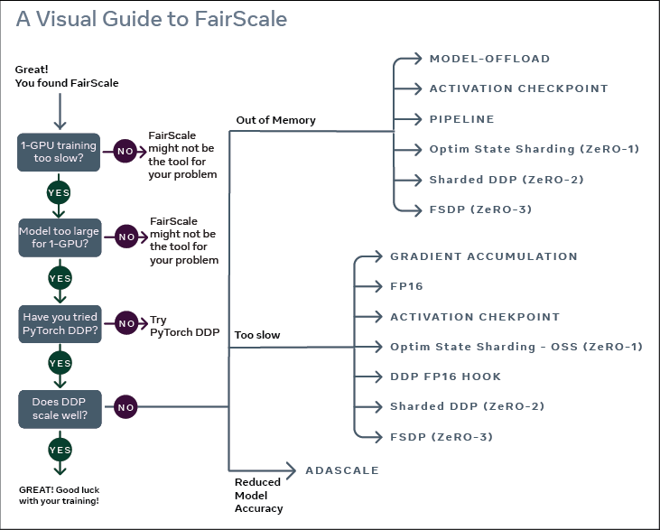
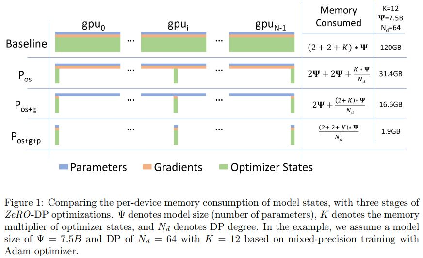
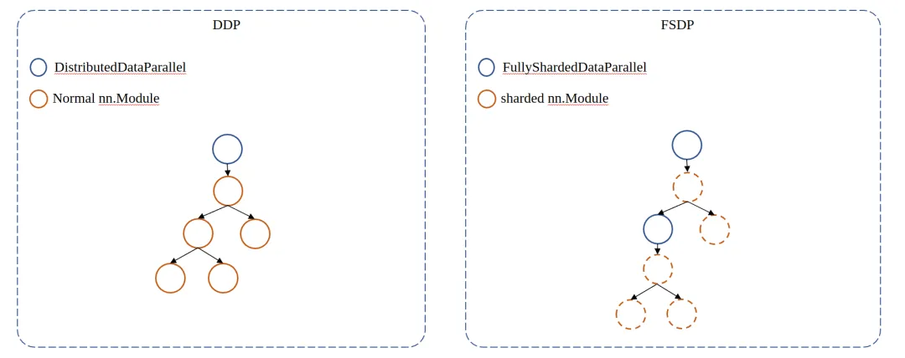

# FSDP 详解

## FSDP 的前生今世

FSDP 的实现借鉴了 FairScale。PyTorch 在开发大型特性时一般会新建一个库来做一些验证性的支持，并收集用户发反馈，FairScale、Dynamo（PyTorch 2.0 的基石）、torchdistx 均是如此。等到特性日益成熟后，（也许）就会合入到 PyTorch。

FairScale [User Workflow](https://fairscale.readthedocs.io/en/latest/getting_started.html)：



## ZeRO 简介

FairScale 把 FSDP 定义为 ZeRO3



模型训练的时候，显存占用大体可以分成三部分，即激活值、模型权重、模型梯度和优化器状态。对于视觉模型而言，显存占比最大的是激活值，因此使用混合精度训练能够大幅度的降低激活值的显存占用（fp16）。然而对于大语言模型或者多模态模型而言，优化后三者的显存占用则显得更重要。

以 PyTorch 为例，当你使用 DDP 时，其实会在每个进程为模型参数、模型梯度、优化器状态分配内存，并在训练过程中同步地更新这些数据。这样的做法虽然能够通过数据并行以达到加速训练的目的，但是它在显存分配上的策略，显然是非常糟糕的。既然每个进行的参数都是一样的，为什么每个进程还需要保存完整的参数呢？所以 ZeRO 就主张每个进程只保存参数的一部分，用到的时候再 all gather 到各个进程。ZeRO 有三个阶段的优化策略，即：

- ZeRO1：只把优化器状态进行分片
- ZeRO2：对优化器状态 + 梯度进行分片
- ZeRO3：对优化器状态 + 梯度 + 模型参数进行分片

以 7.5B 参数量的模型为例，先简单计算一下模型参数、模型梯度、优化器状态的显存占用情况：

- fp32 训练：
    - 模型参数量为 $\Psi$，其梯度也为 $\Psi$，在使用 Adam 的情况下，优化器状态为 $2\Psi$。如果是普通的 fp32 训练，那么实际占用的内存就是 $(1 + 1 + 2)\Psi * 4 = 16\Psi$ 字节 （4 为 fp32 数据占据的内存大小）；
- fp16 训练：
  - 如果开启混合精度训练，为了保证参数更新的精度，优化器状态需要维持在 fp32 ，此外还需要额外保存一份 fp32 模型参数的拷贝，因此显存占用为 $2\Psi$(模型参数) + $2\Psi$(模型梯度) + $8\Psi$(优化器状态) + $4\Psi$(模型参数 fp32 拷贝，deepspeed 实现存储在优化器)：$16\Psi$字节。

带入这样的视角，相信就能理解为什么上图中 7.5B 的模型显存占用可以高达 120B，以及为什么 ZeRO 系列为何如此有效。


## FSDP - ZeRO3?

言归正传，FairScale 说 FSDP 相当于 ZeRO3 的优化，那我们不妨通过一个简单的例子，来感受一下（例子中优化器选择 SGD，因为 PyTorch 的 Adam 做了非常多的优化，其显存实际占用会明显高于理论）。在正式测试之前，我们先来看一下单卡 fp32 训练、单卡 fp16 训练、DDP fp16 训练的测试：

以如下的模型为示例：
```
self.linear = nn.Sequential(
    *(nn.Linear(10000, 10000) for _ in range(10))
)
```

模型总参数量为 1000100000, FP32 占用的显存量为 3.73G，梯度的 FP32 也为 3.73G，两者加起来约为 8G。

#### 单卡 fp16 + fp32

```
import os
import argparse
import functools
import torch
import torch.nn as nn
import torch.nn.functional as F
import torch.optim as optim

class Layer(nn.Module):
    def __init__(self):
        super().__init__()
        self.linear = nn.Sequential(
            *(nn.Linear(10000, 10000) for _ in range(10))
        )

    def forward(self, x):
        return self.linear(x)

def test_fp32():
    model = Layer().cuda()
    optimizer = optim.SGD(model.parameters(), lr=0.1, momentum=0.9)
    data = torch.ones(10000).cuda()
    for i in range(10):
        optimizer.zero_grad()
        output = model(data)
        loss = output.sum()
        loss.backward()
        optimizer.step()
        memory = torch.cuda.max_memory_allocated()
        print(f'fp32 memory allocate: {memory / 1e9:.3f}G')

def test_fp16():
    torch.cuda.init()
    model = Layer().cuda()
    optimizer = optim.SGD(model.parameters(), lr=0.1, momentum=0.9)
    data = torch.ones(10000).cuda()
    for _ in range(10):
        with torch.autocast(device_type='cuda'):
            optimizer.zero_grad()
            output = model(data)
            loss = output.sum()
            loss.backward()
            optimizer.step()
        memory = torch.cuda.max_memory_allocated()
        print(f'fp16 memory allocated: {memory / 1e9:.3f}G')
```

```
fp16 memory allocated: 14.235G
fp32 memory allocate: 12.035G
```

amp 显存占用还多了 2G？这是咋算的？这里就不得不提到 amp 的实现方式了。PyTorch 的 amp 不会改变模型权重的类型，即仍然以 fp32 存储，而选择在白名单算子的 forward backward 前后，把 fp32 的 weights 转换成 fp16，以计算出 fp16 的激活值和 fp16 的梯度，其中 fp16 的梯度还会进一步转换成 fp32，以保证参数更新的精度。

但是既然权重和梯度仍然保留 fp32，优化器状态也理应保持不变，那为啥还多了 2G？原因在于 forward 和 backward 这份 fp16 的权重被缓存了，这部分实现在 amp 的 C++ 代码里。缓存的 fp16 梯度，就是多出来 2G  的源头。

要想节省这部分参数，需要给 autocast 传入 cache_enabled=False，

```
def test_fp16():
    torch.cuda.init()
    model = Layer().cuda()
    optimizer = optim.SGD(model.parameters(), lr=0.1, momentum=0.9)
    data = torch.ones(10000).cuda()
    for _ in range(10):
        with torch.autocast(device_type='cuda', cache_enabled=False):
            optimizer.zero_grad()
            output = model(data)
            loss = output.sum()
            loss.backward()
            optimizer.step()
        memory = torch.cuda.max_memory_allocated()
        print(f'fp16 cache_enabled=False memory allocated: {memory / 1e9:.3f}G')
```

```
fp16 cache_enabled=False memory allocated: 12.035G
fp16 cache_enabled=False memory allocated: 12.235G
```

这样一来，显存消耗为 12.235G，基本和 fp32 一致，也符合预期。

查看[文档说明](https://pytorch.org/docs/stable/amp.html)

```
Args:
    device_type(str, required):  Device type to use. Possible values are: 'cuda', 'cpu', 'xpu' and 'hpu'.
                                    The type is the same as the `type` attribute of a :class:`torch.device`.
                                    Thus, you may obtain the device type of a tensor using `Tensor.device.type`.
    enabled(bool, optional):  Whether autocasting should be enabled in the region.
        Default: ``True``
    dtype(torch_dtype, optional):  Whether to use torch.float16 or torch.bfloat16.
    cache_enabled(bool, optional):  Whether the weight cache inside autocast should be enabled.
        Default: ``True``
```

## DDP 训练

DDP 只是在每个进程创建模型，更新模型而已，显存占用应该还是 12G 吧？

```
import os
import torch
import torch.nn as nn
import torch.nn.functional as F
import torch.optim as optim
import torch.distributed as dist
from torch.nn.parallel import DistributedDataParallel
import torch.multiprocessing as mp

def setup(rank, world_size):
    os.environ['MASTER_ADDR'] = 'localhost'
    os.environ['MASTER_PORT'] = '12356'

    # initialize the process group
    dist.init_process_group("nccl", rank=rank, world_size=world_size)

def cleanup():
    dist.destroy_process_group()

class Layer(nn.Module):
    def __init__(self):
        super().__init__()
        self.linear = nn.Sequential(
            *(nn.Linear(10000, 10000) for _ in range(10))
        )

    def forward(self, x):
        return self.linear(x)

def test_ddp_fp16(rank, world_size):
    setup(rank, world_size)
    torch.cuda.set_device(rank)
    model = Layer().cuda()
    model = DistributedDataParallel(model)
    optimizer = optim.SGD(model.parameters(), lr=0.1, momentum=0.9)
    data = torch.ones(10000).cuda()
    for _ in range(10):
        with torch.autocast(device_type='cuda', cache_enabled=False):
            optimizer.zero_grad()
            output = model(data)
            loss = output.sum()
            loss.backward()
            optimizer.step()
        memory = torch.cuda.max_memory_allocated()
        if rank == 0:
            print(f'DDP memory allocated: {memory / 1e9:.3f}G')
    cleanup()

if __name__ == '__main__':
  WORLD_SIZE = torch.cuda.device_count()
  mp.spawn(test_ddp_fp16,
        args=(WORLD_SIZE,),
        nprocs=WORLD_SIZE,
        join=True)

```

```
memory allocated: 16.036G
memory allocated: 16.236G
```

原理也很简单，ddp 执行 gradient computation 和 gradient synchronization 时需要有一个桶（bucket，具体介绍见之前的 DDP 介绍），桶会保留一份 gradient 的拷贝，因此会额外消耗 4G 左右的显存。

## FSDP 训练


```
import os
import argparse
import functools
import torch
import torch.nn as nn
import torch.nn.functional as F
import torch.optim as optim
import torch.distributed as dist
from torch.nn.parallel import DistributedDataParallel
import torch.multiprocessing as mp

from torch.distributed.fsdp import FullyShardedDataParallel as FSDP
from torch.distributed.fsdp.wrap import _module_wrap_policy

from torch.distributed.fsdp.fully_sharded_data_parallel import (
    CPUOffload,
    BackwardPrefetch,
)
from torch.distributed.fsdp.wrap import (
    size_based_auto_wrap_policy,
    enable_wrap,
    wrap,
)

def setup(rank, world_size):
    os.environ['MASTER_ADDR'] = 'localhost'
    os.environ['MASTER_PORT'] = '12356'

    # initialize the process group
    dist.init_process_group("nccl", rank=rank, world_size=world_size)

def cleanup():
    dist.destroy_process_group()


class Layer(nn.Module):
    def __init__(self):
        super().__init__()
        self.linear = nn.Sequential(
            *(nn.Linear(10000, 10000) for _ in range(10))
        )

    def forward(self, x):
        return self.linear(x)

def test_ddp_fp16(rank, world_size):
    setup(rank, world_size)
    torch.cuda.set_device(rank)
    model = Layer().cuda()
    model = DistributedDataParallel(model)
    optimizer = optim.SGD(model.parameters(), lr=0.1, momentum=0.9)
    data = torch.ones(10000).cuda()
    for _ in range(10):
        with torch.autocast(device_type='cuda', cache_enabled=False):
            optimizer.zero_grad()
            output = model(data)
            loss = output.sum()
            loss.backward()
            optimizer.step()
        memory = torch.cuda.max_memory_allocated()
        if rank == 0:
            print(f'memory allocated: {memory / 1e9:.3f}G')
    cleanup()

def test_fsdp_fp16(rank, world_size):
    setup(rank, world_size)
    torch.cuda.set_device(rank)
    model = Layer().cuda()
    mypolicy = functools.partial(
        size_based_auto_wrap_policy, min_num_params=20000
    )
    model = FSDP(model, device_id=rank,
                 auto_wrap_policy=mypolicy)
    optimizer = optim.SGD(model.parameters(), lr=0.1, momentum=0.9)
    data = torch.ones(10000).cuda()
    for _ in range(10):
        with torch.autocast(device_type='cuda', cache_enabled=False):
            optimizer.zero_grad()
            output = model(data)
            loss = output.sum()
            loss.backward()
            optimizer.step()
        memory = torch.cuda.max_memory_allocated()
        print(f'FSDP {rank} memory allocated: {memory / 1e9:.3f}G')
    cleanup()

if __name__ == '__main__':
  WORLD_SIZE = torch.cuda.device_count()
  mp.spawn(test_fsdp_fp16,
        args=(WORLD_SIZE,),
        nprocs=WORLD_SIZE,
        join=True)

```

只有一张卡时

```
FSDP memory allocated: 12.034G
FSDP memory allocated: 12.434G
```

两张卡时
```
FSDP 0 memory allocated: 6.021G
FSDP 1 memory allocated: 6.021G
FSDP 0 memory allocated: 7.225G
FSDP 1 memory allocated: 7.225G
```

4 张卡时
```
FSDP 1 memory allocated: 4.507G
FSDP 0 memory allocated: 4.507G
FSDP 2 memory allocated: 4.507G
FSDP 3 memory allocated: 4.507G
FSDP 1 memory allocated: 5.224G
FSDP 2 memory allocated: 5.224G
FSDP 3 memory allocated: 5.224G
FSDP 0 memory allocated: 5.224G
```

## FSDP 分片策略

我们需要通过 auto_wrap_policy 来指定模型分片策略，那么这个参数是如何起作用的呢？以及为什么不配这个参数，其优化效果只能达到 ZeRO-stage1。

与 DistiributedDataParallel 类似，FSDP 也是通过一个 model wrapper： FullyShardedDataParallel 来实现参数切分的逻辑。被 wrap 的 model 会成为 root fsdp module，而 root fsdp module 在构建时，会根据用户定义的 auto_wrap_policy 递归地把 submodule wrap 成 child fsdp module：




auto_wrap_policy 需要遵循一定的接口规范即接受以下几个参数：

- module：递归遍历 submodule 时，访问到的 module
- recurse：判断一个 submodule 为 child fsdp module 后，是否再进一步递归判断该 submodule 的 submodule 需要被 wrap 成 child fsdp module
- nonwrapped_numel：这个参数的的含义是当前模块，不需要被分片的参数的参数量。什么是不需要被分片的参数呢？一般来说包含两部分，即已经被分片的参数和用户指定的需要被忽略的参数（ignored_params）。基于这个参数可以实现 size-based wrap policy，例如官方实现的 size_based_auto_wrap_policy 。


FSDP 把 auto_wrap_policy 这个参数的配置权交给用户，扩展性固然是提升了，但是也无形的增加了 FSDP 的学习成本，比如 auto_wrap_policy 会起什么作用，它的几个入参的含义又是什么，刚使用 FSDP 的用户难免会为此感到一头雾水。

这部分的理解可以参考一下 [FSDP tutorial](./FSDP_tutorial.md)。原作中的 `_module_wrap_policy` 在 pytorch 2.1 中已不生效。

## 总结

- FSDP 在显存节省方面，其效果确实与 ZeRO3 等价，但是需要注意的是，在开启混合精度训练（autocast）的情况下，需要把 cache_enabled 设置为 Flase。
- FSDP 在易用性方面，上手成本比较高，用户需要理解 FSDP wrap module 的逻辑，auto_wrap_policy 的作用，以及一些限制。在不足够熟悉 FSDP 本身的逻辑和限制，足够了解 model 结构的情况下，容易出现报错，且触发 error message 和 error 真正的诱因没有太大关联，难以 debug。
- PyTorch 2.0 通过 use_ori_params 参数大大提升了 FSDP 的易用性，但是对 requires_grad 属性统一的限制仍然存在。要解决这个问题可以坐等 PyTorch 2.1 更新，并指定 use_orig_params=True。但如果想要临时解决的话需要在 auto_wrap_policy 做一些改动，由于是基于 FSDP 内部的协议做的修改，可能不是很稳定，在这就不做赘述。

# 参考文献
- 原文：https://mp.weixin.qq.com/s/PyhS95_fJMrRi_PncKu3Pw
- https://fairscale.readthedocs.io/en/latest/getting_started.html
- https://www.deepspeed.ai/tutorials/zero/