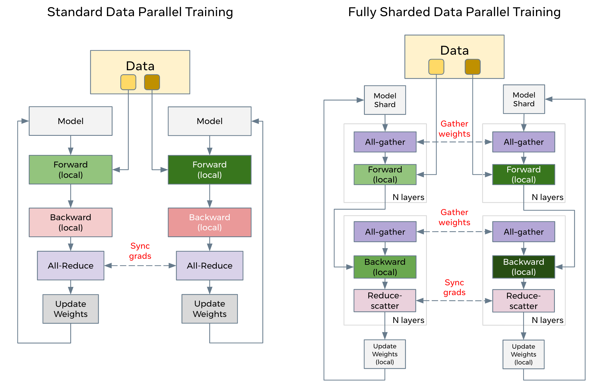
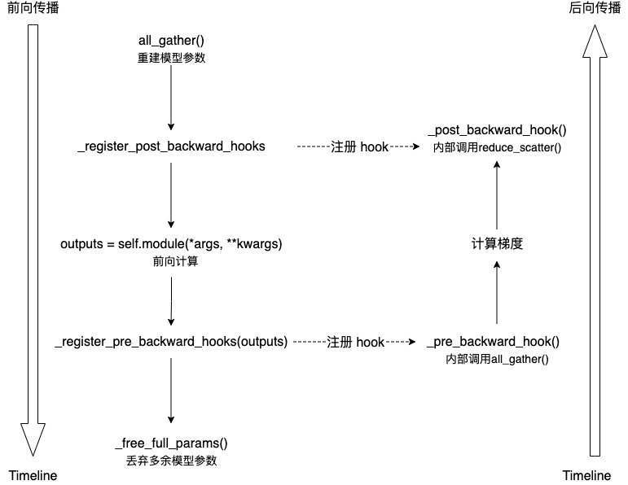
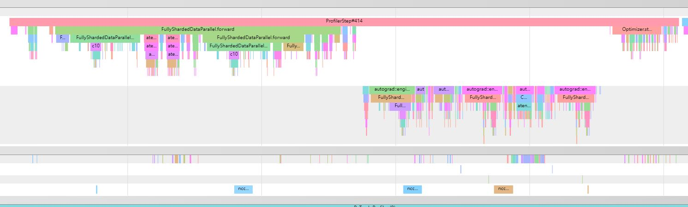
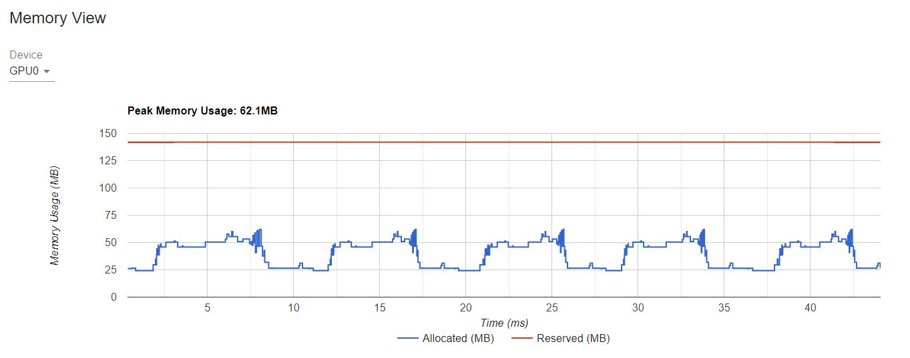

# Fully Sharded Data Parallel(FSDP) tutorial

大规模训练模型是一项具有挑战性的任务，它需要大量的计算资源和资源支持。同时，处理这些非常庞大模型的训练也带来了相当的工程复杂性。PyTorch 1.11 发布了 FSDP（Fully Sharded DataParallel 的功能来更方便大模型的训练。

## FSDP 如何工作？

在分布式数据并行（DistributedDataParallel，DDP）训练中，每个进程/Worker 拥有模型的一个副本并处理一批数据，最后使用全局归约（all-reduce）将不同 Worker 上的梯度求和。在 DDP 中，模型权重和优化器状态在所有工作器之间进行复制。FSDP 是一种数据并行形式，它在 DDP 的 Rank 之间对模型参数、优化器状态和梯度进行分片。

使用 FSDP 进行训练时，相比于在所有工作器上使用 DDP 训练，GPU 的内存占用更小。这使得训练一些非常大的模型成为可能，因为它允许更大的模型或批量大小适应设备。然而，这也带来了通信量增加的代价。通过内部优化，如重叠通信和计算，可以降低通信开销。

FSDP 工作流程如图所示：


在高层次上，FSDP 的工作原理如下：

- 在构造函数中：
    - 将模型参数进行分片，每个 Rank 只保留自己的分片。
- 在前向传播路径中：
    - 执行 all_gather 操作，从所有 Rank 收集所有分片，以恢复完整的 FSDP 单元参数。
    - 进行前向计算。
    - 丢弃刚刚收集的参数分片。
- 在反向传播路径中：
    - 运行 all_gather 操作，从所有 Rank 收集所有分片，以恢复完整的 FSDP 单元参数。
    - 进行反向计算。
    - 运行 reduce_scatter 操作，同步梯度。
    - 丢弃参数。

可以将 FSDP 的分片视为将 DDP 梯度全局归约（all-reduce）分解为 reduce-scatter 和 all-gather 的一种方法。具体而言
- 在前向传播过程中，它执行 all-gather 操作，收集和合并更新后的参数分片。
- 在反向传播过程中，FSDP 会 Reduce-Scatther 梯度，确保每个 Rank 拥有梯度的一个分片。然后，在优化器步骤中，它更新相应的参数分片。


伪代码如下：

```
FSDP forward pass:
    for layer_i in layers:
        all-gather full weights for layer_i # 权重
        forward pass for layer_i
        discard full weights for layer_i # 权重

FSDP backward pass:
    for layer_i in layers:
        all-gather full weights for layer_i # 权重
        backward pass for layer_i
        discard full weights for layer_i # 权重
        reduce-scatter gradients for layer_i # 梯度
```

对比一下 DDP 和 FSDP 的区别：



从该图中可以看到
- DDP
  - 数据被切分送到不同的 Rank，每一个 Rank 都保留了模型的参数，梯度，优化器状态。
  - 在前向/反向过程中，每个 Rank 都独立计算，不依赖于其他 Rank。
  - 在反向结束的时候，做一次 All Reduce，将所有 Rank 上的梯度规约，然后更新本地的参数（同时也更新了本地的优化器状态）。
- FSDP
  - 数据同样被切分到不同的 Rank，每个 Rank 只保留了部分的模型切片，每个参数矩阵 $W$ 会被视为一个一维的 Tensor 然后做切分，切分的大小取决于并行的 Worker 数量。
  - 假设有 2 个GPU，模型参数被切分到两个 GPU 之上。假设模型有两个参数，Parameter 0，Parameter 1，每个参数都被切分成两段，分别存在两个 GPU 之上，其中 Parameter 0 被分成 Parameter 0_0 和 Parameter 0_1，Parameter 1 被分成 Parameter 1_0 和 Parameter 1_1
    ```
                    Model Parameter
                    +----------------------------+
                    |       Parameter 0          |
                    |                            |
                    |       Parameter 1          |
                    |                            |
                    +------------+---------------+
                                |
                                | split
                                v
                            +-----+-----+
                            |           |
                            |           |
    GPU 0                   v           v                       GPU 1
    +------------------------+----+   +--+---------------------------+
    |  Model Parameter Shard 0    |   |  Model Parameter Shard 1     |
    | +-------------------------+ |   | +--------------------------+ |
    | |    Parameter 0_0        | |   | |      Parameter 0_1       | |
    | |                         | |   | |                          | |
    | |    Parameter 1_0        | |   | |      Parameter 1_1       | |
    | |                         | |   | |                          | |
    | +-------------------------+ |   | +--------------------------+ |
    +-----------------------------+   +------------------------------+

    ```
  - 在前向的时候，每个 Rank 需要做一次 All Gather 把当前 layer 的参数全部的切片收集起来，然后进行前向计算。计算完成后，释放收集到的其他参数切片。
  - 在反向的时候，每个 Rank 同样要做一次 All Gather 将当前 layer 的参数切片收集起来，然后进行反向计算。这样当前 layer 上，每个 Rank 都计算出了当前 layer 参数的完整梯度（由当前 Rank 的数据计算出的当 layer 的所有参数的梯度）。
  - 同步梯度：然后执行一次 Reduce Scatter，更新参数（同时更新优化器状态）。也就是如上个图片所示，每个 Rank 各自做一次 Reduce，这样部分参数梯度就被规约到某一个 Rank 上，然后再做一次 Scatter，将梯度分散到各个 Rank。
  - 伪代码如下：
    ```
        before reduce_scatter:
            param.grad (GPU #0): [1, 2, 3, 4]
            param.grad (GPU #1): [5, 6, 7, 8]

        after reduce_scatter:
            param.grad (GPU #0): [6, 8]    # 1+5, 2+6
            param.grad (GPU #1): [10, 12]  # 3+7, 4+8
    ```

Pytorch 代码实现的原理如下：



## 如何使用 FSDP

```
# Based on: https://github.com/pytorch/examples/blob/master/mnist/main.py
import os
import argparse
import functools
import torch
import torch.nn as nn
import torch.nn.functional as F
import torch.optim as optim
from torchvision import datasets, transforms


from torch.optim.lr_scheduler import StepLR

import torch.distributed as dist
import torch.multiprocessing as mp
from torch.nn.parallel import DistributedDataParallel as DDP
from torch.utils.data.distributed import DistributedSampler
from torch.distributed.fsdp import FullyShardedDataParallel as FSDP
from torch.distributed.fsdp.fully_sharded_data_parallel import (
    CPUOffload,
    BackwardPrefetch,
)
from torch.distributed.fsdp.wrap import (
    size_based_auto_wrap_policy,
    enable_wrap,
    wrap,
)

def setup(rank, world_size):
    os.environ['MASTER_ADDR'] = 'localhost'
    os.environ['MASTER_PORT'] = '12355'

    # initialize the process group
    dist.init_process_group("nccl", rank=rank, world_size=world_size)

def cleanup():
    dist.destroy_process_group()


class Net(nn.Module):
    def __init__(self):
        super(Net, self).__init__()
        self.conv1 = nn.Conv2d(1, 32, 3, 1)
        self.conv2 = nn.Conv2d(32, 64, 3, 1)
        self.dropout1 = nn.Dropout(0.25)
        self.dropout2 = nn.Dropout(0.5)
        self.fc1 = nn.Linear(9216, 128)
        self.fc2 = nn.Linear(128, 10)

    def forward(self, x):

        x = self.conv1(x)
        x = F.relu(x)
        x = self.conv2(x)
        x = F.relu(x)
        x = F.max_pool2d(x, 2)
        x = self.dropout1(x)
        x = torch.flatten(x, 1)
        x = self.fc1(x)
        x = F.relu(x)
        x = self.dropout2(x)
        x = self.fc2(x)
        output = F.log_softmax(x, dim=1)
        return output


def train(args, model, rank, world_size, train_loader, optimizer, epoch, sampler=None):
    model.train()
    ddp_loss = torch.zeros(2).to(rank)
    if sampler:
        sampler.set_epoch(epoch)
    for batch_idx, (data, target) in enumerate(train_loader):
        data, target = data.to(rank), target.to(rank)
        optimizer.zero_grad()
        output = model(data)
        loss = F.nll_loss(output, target, reduction='sum')
        loss.backward()
        optimizer.step()
        ddp_loss[0] += loss.item()
        ddp_loss[1] += len(data)

    dist.all_reduce(ddp_loss, op=dist.ReduceOp.SUM)
    if rank == 0:
        print('Train Epoch: {} \tLoss: {:.6f}'.format(epoch, ddp_loss[0] / ddp_loss[1]))


def test(model, rank, world_size, test_loader):
    model.eval()
    correct = 0
    ddp_loss = torch.zeros(3).to(rank)
    with torch.no_grad():
        for data, target in test_loader:
            data, target = data.to(rank), target.to(rank)
            output = model(data)
            ddp_loss[0] += F.nll_loss(output, target, reduction='sum').item()  # sum up batch loss
            pred = output.argmax(dim=1, keepdim=True)  # get the index of the max log-probability
            ddp_loss[1] += pred.eq(target.view_as(pred)).sum().item()
            ddp_loss[2] += len(data)

    dist.all_reduce(ddp_loss, op=dist.ReduceOp.SUM)

    if rank == 0:
        test_loss = ddp_loss[0] / ddp_loss[2]
        print('Test set: Average loss: {:.4f}, Accuracy: {}/{} ({:.2f}%)\n'.format(
            test_loss, int(ddp_loss[1]), int(ddp_loss[2]),
            100. * ddp_loss[1] / ddp_loss[2]))


def fsdp_main(rank, world_size, args):
    setup(rank, world_size)

    transform=transforms.Compose([
        transforms.ToTensor(),
        transforms.Normalize((0.1307,), (0.3081,))
    ])

    dataset1 = datasets.MNIST('./data', train=True, download=True,
                        transform=transform)
    dataset2 = datasets.MNIST('./data', train=False,
                        transform=transform)

    sampler1 = DistributedSampler(dataset1, rank=rank, num_replicas=world_size, shuffle=True)
    sampler2 = DistributedSampler(dataset2, rank=rank, num_replicas=world_size)

    train_kwargs = {'batch_size': args.batch_size, 'sampler': sampler1}
    test_kwargs = {'batch_size': args.test_batch_size, 'sampler': sampler2}
    cuda_kwargs = {'num_workers': 2,
                    'pin_memory': True,
                    'shuffle': False}
    train_kwargs.update(cuda_kwargs)
    test_kwargs.update(cuda_kwargs)

    train_loader = torch.utils.data.DataLoader(dataset1,**train_kwargs)
    test_loader = torch.utils.data.DataLoader(dataset2, **test_kwargs)
    my_auto_wrap_policy = functools.partial(
        size_based_auto_wrap_policy, min_num_params=100
    )
    torch.cuda.set_device(rank)


    init_start_event = torch.cuda.Event(enable_timing=True)
    init_end_event = torch.cuda.Event(enable_timing=True)

    model = Net().to(rank)

    model = FSDP(model)

    optimizer = optim.Adadelta(model.parameters(), lr=args.lr)

    scheduler = StepLR(optimizer, step_size=1, gamma=args.gamma)
    init_start_event.record()
    for epoch in range(1, args.epochs + 1):
        train(args, model, rank, world_size, train_loader, optimizer, epoch, sampler=sampler1)
        test(model, rank, world_size, test_loader)
        scheduler.step()

    init_end_event.record()

    if rank == 0:
        print(f"CUDA event elapsed time: {init_start_event.elapsed_time(init_end_event) / 1000}sec")
        print(f"{model}")

    if args.save_model:
        # use a barrier to make sure training is done on all ranks
        dist.barrier()
        # to save the FSDP model, we need to call the state_dict on each rank then on Rank 0 save the overall states.
        states = model.state_dict()
        if rank == 0:
            torch.save(states, "mnist_cnn.pt")

    cleanup()

if __name__ == '__main__':
    # Training settings
    parser = argparse.ArgumentParser(description='PyTorch MNIST Example')
    parser.add_argument('--batch-size', type=int, default=64, metavar='N',
                        help='input batch size for training (default: 64)')
    parser.add_argument('--test-batch-size', type=int, default=1000, metavar='N',
                        help='input batch size for testing (default: 1000)')
    parser.add_argument('--epochs', type=int, default=10, metavar='N',
                        help='number of epochs to train (default: 14)')
    parser.add_argument('--lr', type=float, default=1.0, metavar='LR',
                        help='learning rate (default: 1.0)')
    parser.add_argument('--gamma', type=float, default=0.7, metavar='M',
                        help='Learning rate step gamma (default: 0.7)')
    parser.add_argument('--no-cuda', action='store_true', default=False,
                        help='disables CUDA training')
    parser.add_argument('--seed', type=int, default=1, metavar='S',
                        help='random seed (default: 1)')
    parser.add_argument('--save-model', action='store_true', default=False,
                        help='For Saving the current Model')
    args = parser.parse_args()

    torch.manual_seed(args.seed)

    WORLD_SIZE = torch.cuda.device_count()
    mp.spawn(fsdp_main,
        args=(WORLD_SIZE, args),
        nprocs=WORLD_SIZE,
        join=True)

```

将模型包装在 FSDP 中后，模型的结构如下所示，我们可以看到模型已经被包装在一个 FSDP 单元中。另外，我们将接下来看一下如何添加 fsdp_auto_wrap_policy，并讨论其中的差异。

```
FullyShardedDataParallel(
  (_fsdp_wrapped_module): Net(
    (conv1): Conv2d(1, 32, kernel_size=(3, 3), stride=(1, 1))
    (conv2): Conv2d(32, 64, kernel_size=(3, 3), stride=(1, 1))
    (dropout1): Dropout(p=0.25, inplace=False)
    (dropout2): Dropout(p=0.5, inplace=False)
    (fc1): Linear(in_features=9216, out_features=128, bias=True)
    (fc2): Linear(in_features=128, out_features=10, bias=True)
  )
)
```

上面是将整个模型放到一个 FSDP 单元中，这将降低计算效率和内存效率。其工作原理如下：假设模型包含 100 个线性层。如果使用 `FSDP(model)`，那么只会有一个 FSDP 单元包装整个模型。在这种情况下，allgather 将收集所有 100 个线性层的完整参数，因此不会为参数分片节省 CUDA 内存。此外，对于所有 100 个线性层，只有一个阻塞的 allgather 调用，层之间没有通信和计算重叠。

为了避免这种情况，可以传递一个 `auto_wrap_policy`，当满足指定条件（例如大小限制）时，它将封装当前的 FSDP 单元并自动启动一个新的单元。这样，将拥有多个 FSDP 单元，每次只有一个 FSDP 单元需要收集完整的参数。例如，假设有 5 个 FSDP 单元，每个单元包装 20 个线性层。然后，在前向传播中，第一个 FSDP 单元将为前 20 个线性层收集参数，进行计算，丢弃参数，然后继续下一个 20 个线性层。因此，在任何时刻，每个 Rank 只会生成包含 20 个线性层参数/梯度的模型，而不是 100 个。

我们可以定义 auto_wrap_policy 并将其传递给 FSDP 封装器。在下面的示例中， `my_auto_wrap_policy` 定义了一个层是否可以由 FSDP 进行封装或分片的条件，即该层的参数数量是否大于100。如果该层的参数数量小于 100，它将与其他小层一起被 FSDP 封装。找到一个最佳的自动封装策略是具有挑战性的，PyTorch 将在未来添加用于此配置的自动调优工具。在没有自动调优工具的情况下，通过实验性地使用不同的自动封装策略对您的工作流进行剖析，并找到最佳的策略。

```
my_auto_wrap_policy = functools.partial(
        size_based_auto_wrap_policy, min_num_params=20000
    )
torch.cuda.set_device(rank)
model = Net().to(rank)

model = FSDP(model,
    auto_wrap_policy=my_auto_wrap_policy)
```
应用 `my_auto_wrap_policy`, 模型会变成下面这样:

```
FullyShardedDataParallel(
  (_fsdp_wrapped_module): Net(
    (conv1): Conv2d(1, 32, kernel_size=(3, 3), stride=(1, 1))
    (conv2): Conv2d(32, 64, kernel_size=(3, 3), stride=(1, 1))
    (dropout1): Dropout(p=0.25, inplace=False)
    (dropout2): Dropout(p=0.5, inplace=False)
    (fc1): FullyShardedDataParallel(
      (_fsdp_wrapped_module): Linear(in_features=9216, out_features=128, bias=True)
    )
    (fc2): Linear(in_features=128, out_features=10, bias=True)
  )
)

```

#### CPU Off-loading

如果模型非常大，即使使用 FSDP 也无法适应 GPU，那么 CPU Off-loading 可能会有所帮助。

目前，只支持参数和梯度的 CPU Off-loading（也就是不支持优化器参数）。可以通过传递`cpu_offload=CPUOffload(offload_params=True)` 来启用。

请注意，当前情况下，为了使参数和梯度处于同一设备上以与优化器一起工作，这将隐式地启用梯度卸载到CPU。该 API 可能会发生变化。默认值为 None，这种情况下不会进行卸载。

使用此功能可能会显著降低训练速度，因为需要频繁地从主机复制张量到设备，但它可以提高内存效率并训练更大规模的模型。

```
model = FSDP(model,
    auto_wrap_policy=my_auto_wrap_policy,
    cpu_offload=CPUOffload(offload_params=True))
```

## Profiling 

对训练增加 profiling

```
def train(args, model, rank, world_size, train_loader, optimizer, epoch, sampler=None):
    model.train()
    ddp_loss = torch.zeros(2).to(rank)
    if sampler:
        sampler.set_epoch(epoch)

    def trace_handler(p):
      output = p.key_averages().table(sort_by="self_cuda_time_total", row_limit=10)
      print(output)
      p.export_chrome_trace("./profiling/fsdp_trace_{}_{}_{}.json".format(rank, epoch, str(p.step_num)))

    with profile(
    activities=[ProfilerActivity.CPU, ProfilerActivity.CUDA],
    profile_memory=True,
    record_shapes=True,
    schedule=torch.profiler.schedule(
        wait=1,
        warmup=1,
        active=5),
    on_trace_ready=trace_handler
) as p:
      for batch_idx, (data, target) in enumerate(train_loader):
        data, target = data.to(rank), target.to(rank)
        optimizer.zero_grad()
        output = model(data)
        loss = F.nll_loss(output, target, reduction='sum')
        loss.backward()
        optimizer.step()
        ddp_loss[0] += loss.item()
        ddp_loss[1] += len(data)
        p.step()

    dist.all_reduce(ddp_loss, op=dist.ReduceOp.SUM)
    if rank == 0:
        print('Train Epoch: {} \tLoss: {:.6f}'.format(epoch, ddp_loss[0] / ddp_loss[1]))

```

使用 Tensorboard

```
def train(args, model, rank, world_size, train_loader, optimizer, epoch, sampler=None):
    model.train()
    ddp_loss = torch.zeros(2).to(rank)
    if sampler:
        sampler.set_epoch(epoch)

    with profile(
    activities=[ProfilerActivity.CPU, ProfilerActivity.CUDA],
    profile_memory=True,
    record_shapes=True,
    schedule=torch.profiler.schedule(
        wait=1,
        warmup=1,
        active=5),
    on_trace_ready=torch.profiler.tensorboard_trace_handler('./log/fsdp')
) as p:
      for batch_idx, (data, target) in enumerate(train_loader):
        data, target = data.to(rank), target.to(rank)
        optimizer.zero_grad()
        output = model(data)
        loss = F.nll_loss(output, target, reduction='sum')
        loss.backward()
        optimizer.step()
        ddp_loss[0] += loss.item()
        ddp_loss[1] += len(data)
        p.step()

    dist.all_reduce(ddp_loss, op=dist.ReduceOp.SUM)
    if rank == 0:
        print('Train Epoch: {} \tLoss: {:.6f}'.format(epoch, ddp_loss[0] / ddp_loss[1]))

```

查看训练的一次前向和反向：



可以比较明显的看到 
- 前向的 AllGather： ncclKernel_AllGather_RING_LL_Sum_int8_t
- 反向的 AllGather： ncclKernel_AllGather_RING_LL_Sum_int8_t
- 梯度同步 ReduceScatter：ncclKernel_ReduceScatter_RING_LL_Sum_float

查看显存的使用过程



## 参考文献
- https://pytorch.org/tutorials/intermediate/FSDP_tutorial.html
- https://www.cnblogs.com/rossiXYZ/p/15819817.html