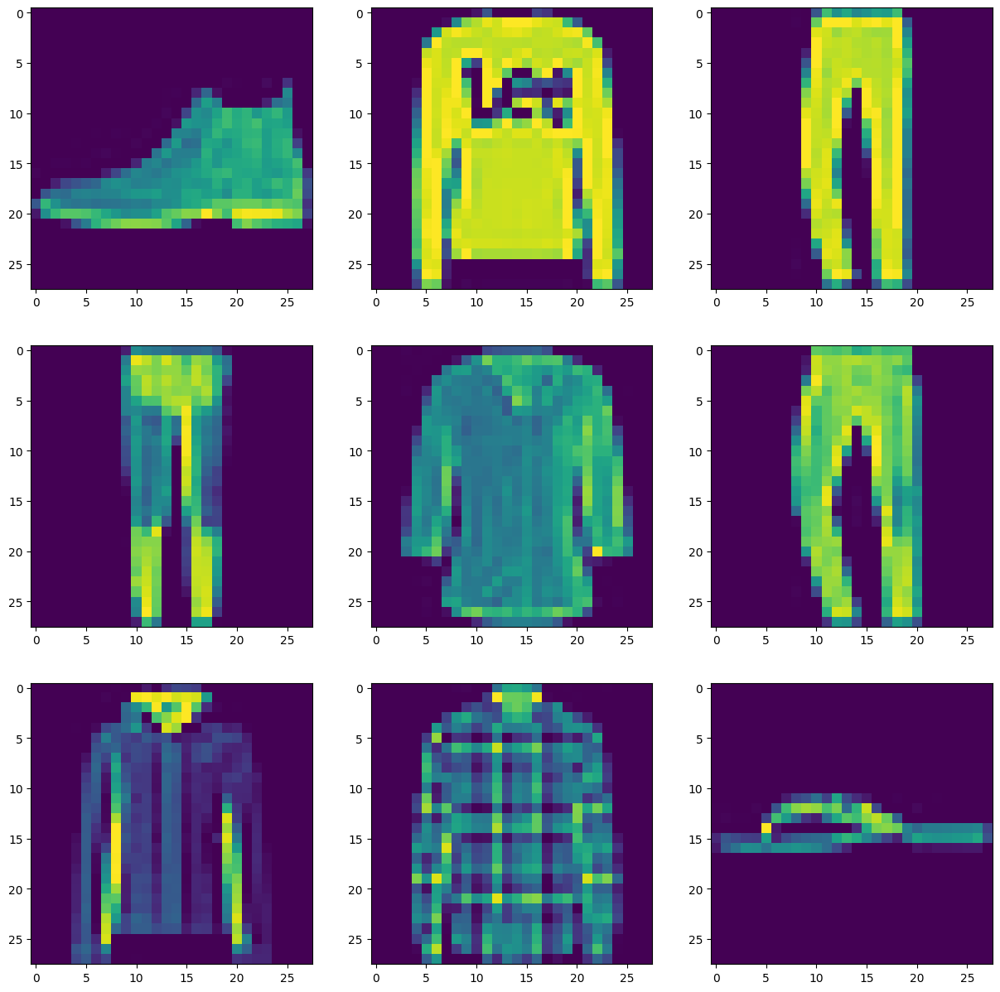

# Quick Start

https://pytorch.org/tutorials/beginner/basics/quickstart_tutorial.html

https://pytorch.org/docs/stable/index.html

## Fashion MNIST

https://www.kaggle.com/datasets/zalando-research/fashionmnist

类似 MNIST 的 fashion 图片。每张图片是 28*28 的像素，总共 784 个像素。

类别列表：
```
0 T-shirt/top
1 Trouser
2 Pullover
3 Dress
4 Coat
5 Sandal
6 Shirt
7 Sneaker
8 Bag
9 Ankle boot
```

```
# Create data loaders.
test_dataloader = DataLoader(test_data, batch_size=batch_size)

for X, y in test_dataloader:
    print(f"Shape of X [N, C, H, W]: {X.shape}")
    print(f"Shape of y: {y.shape} {y.dtype}")
    break

fig, axes = plt.subplots(nrows=3, ncols=3, figsize=(15,15))

for i in range(3):
    for j in range(3):        
            axes[i, j].imshow(X[i*3 + j].permute(1, 2, 0))
```



### Dataset&Dataloader

https://pytorch.org/tutorials/beginner/basics/data_tutorial.html

Dataset 保存样本和对应的标签，DataLoader 封装了一个迭代器来访问样本。

### 模型

一个简单的 MLP 结构，输入为 784，输出为 10 个。

```
NeuralNetwork(
  (flatten): Flatten(start_dim=1, end_dim=-1)
  (linear_relu_stack): Sequential(
    (0): Linear(in_features=784, out_features=512, bias=True)
    (1): ReLU()
    (2): Linear(in_features=512, out_features=512, bias=True)
    (3): ReLU()
    (4): Linear(in_features=512, out_features=10, bias=True)
  )
)

```

### 训练

一些值得关注的接口

将模型拷贝到 GPU
```
model = NeuralNetwork().to(device)  # https://pytorch.org/docs/stable/generated/torch.nn.Module.html#torch.nn.Module.to
```

训练和评估时有些模块的行为不同，比如 Dropout，BatchNorm
```
model.train() # https://pytorch.org/docs/stable/generated/torch.nn.Module.html#torch.nn.Module.train
model.eval() # https://pytorch.org/docs/stable/generated/torch.nn.Module.html#torch.nn.Module.eval
```

损失函数和优化器
```
loss_fn = nn.CrossEntropyLoss()
optimizer = torch.optim.SGD(model.parameters(), lr=1e-3) # https://pytorch.org/docs/stable/optim.html

optimizer.zero_grad() # 将所有 Tensor 的梯度都设置为 0
loss.backward() # https://pytorch.org/docs/stable/generated/torch.Tensor.backward.html
                # 使用链式法则计算计算图中的梯度
                # 该函数会将所有的梯度累加，如果不需要累加需要将所有梯度提前置为 0
optimizer.step() # 按照优化器的策略，使用梯度更新所有的 Tensor，即执行一次梯度下降
```

关闭梯度计算的上下文管理器
```
torch.no_grad https://pytorch.org/docs/stable/generated/torch.no_grad.html
```

### 保存模型

```

model.state_dict() # https://pytorch.org/tutorials/recipes/recipes/what_is_state_dict.html
                   # 返回一个 <class 'collections.OrderedDict'> 保存模型中所有的参数
                   # odict_keys(['linear_relu_stack.0.weight', 'linear_relu_stack.0.bias', 'linear_relu_stack.2.weight', 'linear_relu_stack.2.bias', 'linear_relu_stack.4.weight', 'linear_relu_stack.4.bias'])
torch.save(model.state_dict(), "model.pth") # https://pytorch.org/docs/stable/generated/torch.save.html
                                            # 保存模型参数，只保存参数 Tensor，不包括计算图

model.load_state_dict(torch.load("model.pth")) # 加载保存的参数
```


