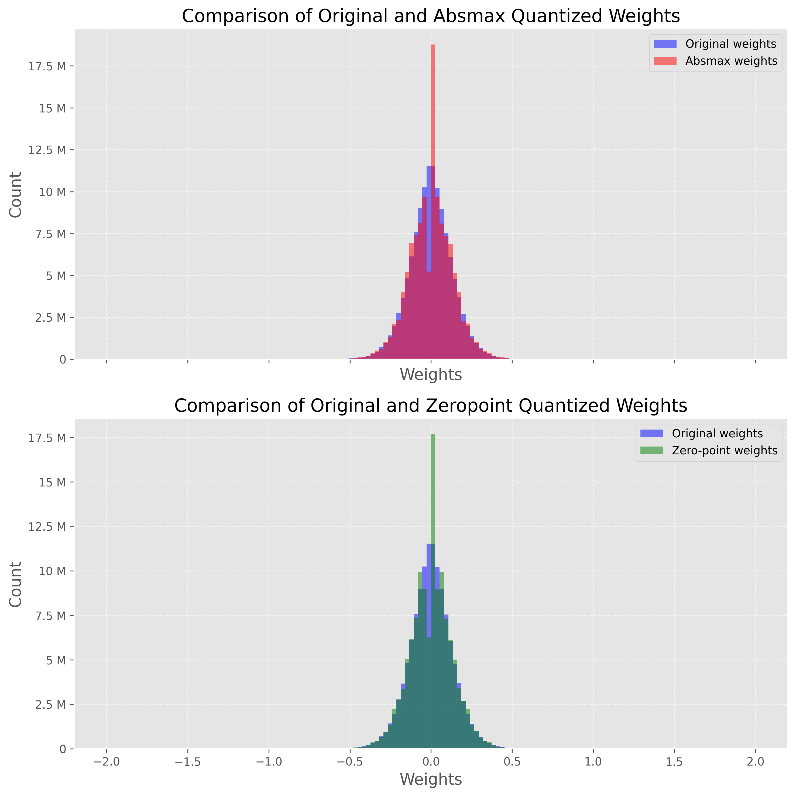
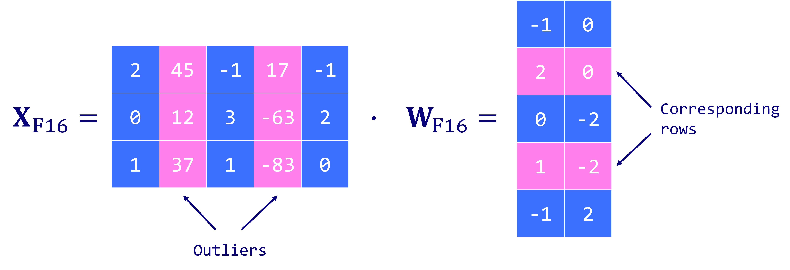
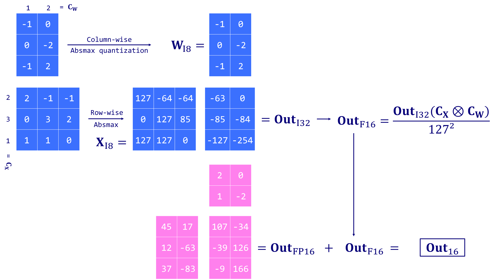
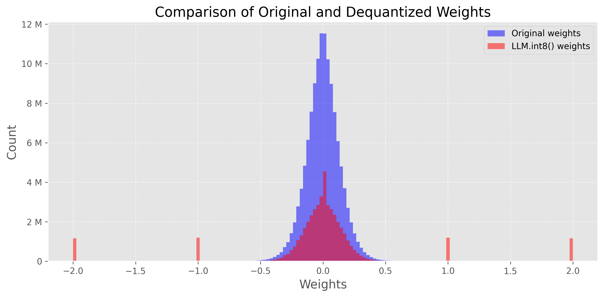

# 权重量化简介

大型语言模型（LLM）以其庞大的计算需求而闻名。通常，模型的大小是通过参数数量（大小）乘以这些值的精度（数据类型）来计算。然而，为了节省内存，可以通过量化使用低精度的数据类型存储权重。

两个主要的权重量化技术类别：

- Post-Training Quantization（PTQ）是一种简单直接的技术，将已经训练好的模型的权重转换为低精度，而无需重新训练。尽管实施简单，但 PTQ 可能会导致性能下降。

- Quantization-Aware Training（QAT）在预训练或微调阶段中加入了权重转换过程，从而改善了模型的性能。然而，QAT 在计算上是昂贵的，并且需要具有代表性的训练数据。

这里重点介绍 PTQ，以降低参数的精度。为了更好地理解，我们将使用一个 GPT-2 模型的示例，应用简单和更复杂的技术。

## 精度介绍

详细参考[精度介绍一文](../precision/fp32_fp16_bf16.md)

## 朴素的 8-bit 量化

在本节中，我们将实施两种量化技术：一种是 absolute maximum（absmax）量化的对称量化方法，另一种是 zero-point 量化的非对称量化方法。在这两种情况下，目标是将 FP32 张量 $X$ (原始权重）映射到 INT8 张量 $X_{quant}$（量化权重）。

### absmax quantization
使用 absmax 量化，原始数值被除以张量的绝对最大值，并乘以一个缩放因子（127），将输入映射到范围 [-127, 127]。为了恢复原始的 FP16 值，INT8 数值除以量化因子，但是四舍五入会导致一定的精度损失。

$$
X_{\rm quant} = \rm round \left( \frac{127}{\rm max{|X|}} \cdot X \right) 
$$
$$
X_{\rm dequant} = \frac{\rm max{|X|}}{127} \cdot X_{\rm quant}
$$

例如，假定有一个绝对最大值为 3.2。权重为 0.1 将被量化为 $\rm round \left( \frac{127}{\rm 3.2} \times 0.1 \right) = \rm round (3.96875) = 4 $。

如果想要将其反量化，我们将得到 $\frac{3.2}{127} \times 4 = 0.1008 $，这意味着一个误差为 0.008。

下面是相应的 Python 实现：

```
import torch

def absmax_quantize(X):
    # Calculate scale
    scale = 127 / torch.max(torch.abs(X))

    # Quantize
    X_quant = (scale * X).round()

    # Dequantize
    X_dequant = X_quant / scale

    return X_quant.to(torch.int8), X_dequant
```

### zero-point quantization

使用 zero-point 量化，我们可以考虑非对称的输入分布，在考虑 ReLU 函数的输出（仅为正值）时很有用。首先，输入值将通过值的总范围（255）除以最大值和最小值之间的差异来进行缩放。然后，此分布通过 zero-point 进行偏移，将其映射到范围 [-128, 127]（与 absmax 相比增加了 zero-point）。首先，我们计算缩放因子( scale factor )和零点值( zero-point )：

$$
\rm scale =  \frac{255}{\rm max(X) - \rm min(X)}
$$

$$
\rm zeropoint = - \rm round(scale \cdot min(X)) - 128
$$

然后，我们可以用这些变量来进行量化和反量化。

$$
X_{\rm quant} = \rm round \left( \rm scale \cdot X + zeropoint \right) 
$$

$$
X_{\rm dequant} = \frac{X_{\rm quant} - \rm zeropoint}{\rm scale} 
$$

假定有一个最大值为 3.2 和最小值为 -3.0，可以计算 $\rm scale = \frac{255}{ 3.2 + 3.0}  = 41.13$ 和 $\rm zeropoint = - \rm round(41.13 \cdot -3.0) - 128 = 123 - 128 = -5$，则之前的 0.1 量化为 $\rm round \left( \rm 41.13 \cdot 0.1 -5 \right) = -1$，得到的结果和之前的 absmax 不同。


Python 的实现如下：

```
def zeropoint_quantize(X):
    # Calculate value range (denominator)
    x_range = torch.max(X) - torch.min(X)
    x_range = 1 if x_range == 0 else x_range

    # Calculate scale
    scale = 255 / x_range

    # Shift by zero-point
    zeropoint = (-scale * torch.min(X) - 128).round()

    # Scale and round the inputs
    X_quant = torch.clip((X * scale + zeropoint).round(), -128, 127)

    # Dequantize
    X_dequant = (X_quant - zeropoint) / scale

    return X_quant.to(torch.int8), X_dequant
```

我们可以借助 transformers 库在真实模型上使用这两个函数。

```
pip install -q bitsandbytes>=0.39.0
pip install -q accelerate
pip install transformers
```

我们首先加载 GPT-2 的模型和分词器。这是一个非常小的模型，我们可能不想对其进行量化，但对于本教程来说已经足够了。首先，我们想观察模型的大小，以便稍后进行比较，并评估由于 8 位量化而产生的内存节省。

```
from transformers import AutoModelForCausalLM, AutoTokenizer
import torch
torch.manual_seed(0)

# Set device to CPU for now
device = 'cpu'

# Load model and tokenizer
model_id = 'gpt2'
model = AutoModelForCausalLM.from_pretrained(model_id).to(device)
tokenizer = AutoTokenizer.from_pretrained(model_id)

# Print model size
print(f"Model size: {model.get_memory_footprint():,} bytes")
```
得到模型参数大小
```
Model size: 510,342,192 bytes
```
GPT-2 模型参数 FP32 精度的大小大约为 487MB。

下一步是使用 zero-point 量化和 absmax 量化对权重进行量化。在下面的示例中，我们将这些技术应用于 GPT-2 的第一个注意力层，以查看结果。

```
# Extract weights of the first layer
weights = model.transformer.h[0].attn.c_attn.weight.data
print("Original weights:")
print(weights)

# Quantize layer using absmax quantization
weights_abs_quant, _ = absmax_quantize(weights)
print("\nAbsmax quantized weights:")
print(weights_abs_quant)

# Quantize layer using absmax quantization
weights_zp_quant, _ = zeropoint_quantize(weights)
print("\nZero-point quantized weights:")
print(weights_zp_quant)
```

```
Original weights:
tensor([[-0.4738, -0.2614, -0.0978,  ...,  0.0513, -0.0584,  0.0250],
        [ 0.0874,  0.1473,  0.2387,  ..., -0.0525, -0.0113, -0.0156],
        [ 0.0039,  0.0695,  0.3668,  ...,  0.1143,  0.0363, -0.0318],
        ...,
        [-0.2592, -0.0164,  0.1991,  ...,  0.0095, -0.0516,  0.0319],
        [ 0.1517,  0.2170,  0.1043,  ...,  0.0293, -0.0429, -0.0475],
        [-0.4100, -0.1924, -0.2400,  ..., -0.0046,  0.0070,  0.0198]])

Absmax quantized weights:
tensor([[-21, -12,  -4,  ...,   2,  -3,   1],
        [  4,   7,  11,  ...,  -2,  -1,  -1],
        [  0,   3,  16,  ...,   5,   2,  -1],
        ...,
        [-12,  -1,   9,  ...,   0,  -2,   1],
        [  7,  10,   5,  ...,   1,  -2,  -2],
        [-18,  -9, -11,  ...,   0,   0,   1]], dtype=torch.int8)

Zero-point quantized weights:
tensor([[-20, -11,  -3,  ...,   3,  -2,   2],
        [  5,   8,  12,  ...,  -1,   0,   0],
        [  1,   4,  18,  ...,   6,   3,   0],
        ...,
        [-11,   0,  10,  ...,   1,  -1,   2],
        [  8,  11,   6,  ...,   2,  -1,  -1],
        [-18,  -8, -10,  ...,   1,   1,   2]], dtype=torch.int8)

```
原始（FP32）和量化（INT8）值之间的差异比较明显，但是 absmax 权重和 zero-point 权重之间的差异比较微妙。在这种情况下，看起来 zero-point 被用 -1 进行了偏移。这表明该层的权重分布相当对称。

我们可以通过对 GPT-2 的每一层（线性层、注意力层等）进行量化来比较这些技术，并创建两个新模型：model_abs 和 model_zp。准确地说，我们实际上将用反量化的权重替换原始权重。这有两个好处：它允许我们比较权重的分布（相同的尺度），实际运行模型。

实际上，PyTorch 默认不允许进行 INT8 矩阵乘法。在真实的场景中，我们会将它们反量化以运行模型（例如使用 FP16），但以 INT8 形式存储。在下一节中，我们将使用 bitsandbytes 库来解决这个问题。

```
import numpy as np
from copy import deepcopy

# Store original weights
weights = [param.data.clone() for param in model.parameters()]

# Create model to quantize
model_abs = deepcopy(model)

# Quantize all model weights
weights_abs = []
for param in model_abs.parameters():
    _, dequantized = absmax_quantize(param.data)
    param.data = dequantized
    weights_abs.append(dequantized)

# Create model to quantize
model_zp = deepcopy(model)

# Quantize all model weights
weights_zp = []
for param in model_zp.parameters():
    _, dequantized = zeropoint_quantize(param.data)
    param.data = dequantized
    weights_zp.append(dequantized)
```

现在我们已经对模型进行了量化，我们想要检查这个过程的影响。直观地说，我们希望确保量化权重与原始权重接近。检查的一种可视化方法是绘制反量化和原始权重的分布图。如果量化是有损的，它将会显著改变权重的分布。

下图显示了这个比较，其中蓝色的直方图表示原始（FP32）权重，红色的直方图表示反量化（从 INT8）权重。请注意，由于具有非常高的绝对值的异常值（稍后会详细讨论），我们只在 -2 和 2 之间显示这个图表。



两个图形非常相似，在 0 附近有一个令人惊讶的峰值。这个峰值显示出我们的量化是相当有损的，因为逆过程不会输出原始值。对于 absmax 模型来说，这一点尤为明显，它在 0 附近显示出一个较低的谷底和一个较高的峰值。

让我们比较原始模型和量化模型的性能。为此，我们定义了一个 generate_text() 函数，用于使用 top-k 采样生成 50 个 token。


```
def generate_text(model, input_text, max_length=50):
    input_ids = tokenizer.encode(input_text, return_tensors='pt').to(device)
    output = model.generate(inputs=input_ids,
                            max_length=max_length,
                            do_sample=True,
                            top_k=30,
                            pad_token_id=tokenizer.eos_token_id,
                            attention_mask=input_ids.new_ones(input_ids.shape))
    return tokenizer.decode(output[0], skip_special_tokens=True)

# Generate text with original and quantized models
original_text = generate_text(model, "I have a dream")
absmax_text   = generate_text(model_abs, "I have a dream")
zp_text       = generate_text(model_zp, "I have a dream")

print(f"Original model:\n{original_text}")
print("-" * 50)
print(f"Absmax model:\n{absmax_text}")
print("-" * 50)
print(f"Zeropoint model:\n{zp_text}")
```

```
Original model:
I have a dream, but I'm scared I might fail."

She did not say what she was scared of, but she certainly wasn't scared of what she will do if she tries any of these things. Even if it is just to
--------------------------------------------------
Absmax model:
I have a dream about creating a museum museum. I will make the exhibit for children with disabilities, with children who suffer from developmental disabilities. Children suffer from developmental disabilities when they are younger than 5 years old. That makes me the perfect person. I
--------------------------------------------------
Zeropoint model:
I have a dream of having it for free," said a woman who refused to identify, and whose address is in the South East Asian neighbourhood, in the town of Jamshed.

In that case, she is a mother, grandmother and
```

我们可以通过计算每个输出的困惑度 (perplexity) 来量化其是否更具意义。困惑度是评估语言模型常用的指标，它衡量模型在预测序列中下一个 token 时的不确定性。在这个比较中，我们通常假设得分越低，模型越好。实际上，一个困惑度较高的句子也可能是正确的。

我们使用一个简化的函数来实现它，因为它不需要考虑上下文窗口的长度等细节，由于我们的句子很短。

```
def calculate_perplexity(model, text):
    # Encode the text
    encodings = tokenizer(text, return_tensors='pt').to(device)

    # Define input_ids and target_ids
    input_ids = encodings.input_ids
    target_ids = input_ids.clone()

    with torch.no_grad():
        outputs = model(input_ids, labels=target_ids)

    # Loss calculation
    neg_log_likelihood = outputs.loss

    # Perplexity calculation
    ppl = torch.exp(neg_log_likelihood)

    return ppl

ppl     = calculate_perplexity(model, original_text)
ppl_abs = calculate_perplexity(model_abs, absmax_text)
ppl_zp  = calculate_perplexity(model_zp, absmax_text)

print(f"Original perplexity:  {ppl.item():.2f}")
print(f"Absmax perplexity:    {ppl_abs.item():.2f}")
print(f"Zeropoint perplexity: {ppl_zp.item():.2f}")
```

```
Original perplexity:  11.11
Absmax perplexity:    16.47
Zeropoint perplexity: 17.60
```

我们可以看到原始模型的困惑度略低于其他两个模型。单个实验的可靠性不太高，但我们可以多次重复这个过程，以观察每个模型之间的差异。理论上，zero-poing 量化应该比 absmax 稍好，但计算成本也更高。

在这个示例中，我们将量化技术应用于整个层（按张量基础）。然而，我们可以在不同的粒度级别上应用它：从整个模型到单个值。一次性对整个模型进行量化会严重降低性能，而对单个值进行量化会带来很大的开销。在实践中，我们通常更喜欢向量化 (vector-wise quantization) 的量化方法，它考虑了同一张量内行和列中值的变异性。

然而，即使是向量化的量化也无法解决异常值特征 (outlier features) 的问题。异常值特征是指当模型达到一定规模（>6.7B 参数）时，在所有 Transformer 中出现的极端值（负值或正值）。这是一个问题，因为单个异常值可能会降低所有其他值的精度。但是丢弃这些异常值特征并不是一个选择，因为它将极大地降低模型的性能。

示例：

```
A=[-0.10, -0.23, 0.08, -0.38, -0.28, -0.29, -2.11, 0.34, -0.53, -67.0]

```

注意到向量 A 中有异常值，如果去掉该值对向量 A 做量化和反量化，处理后的结果是：

```
[-0.10, -0.23, 0.08, -0.38, -0.28, -0.28, -2.11, 0.33, -0.53]
```
出现的误差只有 -0.29 -> -0.28。但是如果我们在保留异常值 -67.0 的情况下对该向量做量化和反量化，处理后的结果是：
```
[ -0.00, -0.00, 0.00, -0.53, -0.53, -0.53, -2.11, 0.53, -0.53, -67.00]
```
可见大部分信息在处理后都丢失了。

## LLM.int8

由 Dettmers 等人（2022年）引入，LLM.int8() 是解决异常值 (outlier features) 问题的一种解决方案。它依赖于一种向量化（absmax）量化方案，并引入了混合精度量化。这意味着异常值特征在 FP16 格式下进行处理以保留其精度，而其他值在 INT8 格式下进行处理。由于异常值约占值的 0.1％，这有效地将 LLM 的内存占用减少了将近 2 倍。



LLM.int8() 通过以下三个关键步骤进行矩阵乘法计算：

- 从输入hidden states $X$ 中提取包含异常值特征的列，使用自定义阈值进行筛选。
- 使用 FP16 对异常值进行矩阵乘法运算，使用 INT8 对非异常值进行向量化量化的矩阵乘法运算（对于 hidden states 是按行进行的，对于权重矩阵是按列进行的）。
- 对非异常值结果进行反量化（从 INT8 转为 FP16），然后将其与异常值结果相加，得到完整的 FP16 结果。



这种方法是必要的，因为 8 位精度是有限的，当对包含比较大的值的向量进行量化时，可能会产生相当大的误差。这些误差在传播到多个层时也会趋向于放大。

我们可以很容易地使用这种技术，这要归功于 bitsandbytes 库被集成到 Hugging Face 生态系统中。我们只需要在加载模型时指定`load_in_8bit=True`（同时需要 GPU 支持）。

```
device = torch.device('cuda' if torch.cuda.is_available() else 'cpu')

model_int8 = AutoModelForCausalLM.from_pretrained(model_id,
                                             device_map='auto',
                                             load_in_8bit=True,
                                             )
print(f"Model size: {model_int8.get_memory_footprint():,} bytes")
```

```
Model size: 176,527,896 bytes
```

通过添加这一行额外的代码，模型现在几乎缩小了三倍（ 168MB 对比 487MB ）。我们甚至可以像之前一样比较原始权重和量化权重的分布：

```
import matplotlib.pyplot as plt
import matplotlib.ticker as ticker

# Flatten weight tensors
weights_int8 = [param.data.clone() for param in model_int8.parameters()]
weights_int8 = np.concatenate([t.cpu().numpy().flatten() for t in weights_int8])

# Set background style
plt.style.use('ggplot')

# Create figure and axis
fig, ax = plt.subplots(figsize=(10,5), dpi=300)

# Plot the histograms
ax.hist(weights, bins=150, alpha=0.5, label='Original weights',
        color='blue', range=(-2, 2))
ax.hist(weights_int8, bins=150, alpha=0.5, label='LLM.int8() weights',
        color='red', range=(-2, 2))

# Add grid
ax.grid(True, linestyle='--', alpha=0.6)

# Add legend
ax.legend()

# Add title and labels
ax.set_title('Comparison of Original and Dequantized Weights', fontsize=16)
ax.set_xlabel('Weights', fontsize=14)
ax.set_ylabel('Count', fontsize=14)
plt.gca().yaxis.set_major_formatter(ticker.EngFormatter())

# Improve font
plt.rc('font', size=12)

plt.tight_layout()
plt.show()
```



在这种情况下，我们可以看到在 -2、-1、0、1、2 等处有尖峰。这些值对应于存储在 INT8 格式（非异常值）中的参数。您可以通过使用 model_int8.parameters() 打印模型的权重来验证。

我们还可以使用这个量化模型生成文本，并将其与原始模型进行比较。

```
# Generate text with quantized model
text_int8 = generate_text(model_int8, "I have a dream")

print(f"Original model:\n{original_text}")
print("-" * 50)
print(f"LLM.int8() model:\n{text_int8}")
```

```
Original model:
I have a dream, but I'm scared I might fail."

She did not say what she was scared of, but she certainly wasn't scared of what she will do if she tries any of these things. Even if it is just to
--------------------------------------------------
LLM.int8() model:
I have a dream. I don't know what will come of it, but I am going to have to look for something that will be right. I haven't thought about it for a long time, but I have to try to get that thing
```

很难判断哪个输出是最好的，但我们可以依靠困惑度指标给出一个（近似的）答案。

```
print(f"Perplexity (original):   {ppl.item():.2f}")

ppl = calculate_perplexity(model_int8, text_int8)
print(f"Perplexity (LLM.int8()): {ppl.item():.2f}")
```

```
Perplexity (original):   11.11
Perplexity (LLM.int8()): 7.93
```

在这种情况下，量化模型的困惑度比原始模型低。一般情况下，并非总是这样，但这表明这种量化技术非常有竞争力。事实上，LLM.int8() 的作者表明，性能下降非常低，可以忽略不计（<1%）。然而，它在计算方面有额外的成本：对于大型模型来说，LLM.int8() 的速度大约慢了 20% 左右。

## 总结

本文主要介绍了两种 8-bit 量化技术：absmax 和 zero-point 量化。然而，它们的局限性，特别是在处理异常值方面，导致了 LLM.int8() 的出现，这是一种能够保持模型性能的技术。这种方法突显了在权重量化领域取得的进展，揭示了妥善处理异常值的重要性。


## 参考
- https://mlabonne.github.io/blog/posts/Introduction_to_Weight_Quantization.html
- https://zhuanlan.zhihu.com/p/627436535