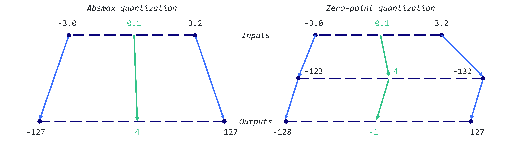

# 权重量化简介

大型语言模型（LLM）以其庞大的计算需求而闻名。通常，模型的大小是通过参数数量（大小）乘以这些值的精度（数据类型）来计算。然而，为了节省内存，可以通过量化使用低精度的数据类型存储权重。

两个主要的权重量化技术类别：

- Post-Training Quantization（PTQ）是一种简单直接的技术，将已经训练好的模型的权重转换为低精度，而无需重新训练。尽管实施简单，但 PTQ 可能会导致性能下降。

- Quantization-Aware Training（QAT）在预训练或微调阶段中加入了权重转换过程，从而改善了模型的性能。然而，QAT 在计算上是昂贵的，并且需要具有代表性的训练数据。

这里重点介绍 PTQ，以降低参数的精度。为了更好地理解，我们将使用一个 GPT-2 模型的示例，应用简单和更复杂的技术。

## 精度介绍

详细参考[精度介绍一文](../precision/fp32_fp16_bf16.md)

## 朴素的 8-bit 量化

在本节中，我们将实施两种量化技术：一种是 absolute maximum（absmax）量化的对称量化方法，另一种是 zero-point 量化的非对称量化方法。在这两种情况下，目标是将 FP32 张量 $X$ (原始权重）映射到 INT8 张量 $X_{quant}$（量化权重）。

### absmax quantization
使用 absmax 量化，原始数值被除以张量的绝对最大值，并乘以一个缩放因子（127），将输入映射到范围 [-127, 127]。为了恢复原始的 FP16 值，INT8 数值除以量化因子，但是四舍五入会导致一定的精度损失。

$$
X_{\rm quant} = \rm round \left( \frac{127}{\rm max{|X|}} \cdot X \right) 
$$
$$
X_{\rm dequant} = \frac{\rm max{|X|}}{127} \cdot X_{\rm quant}
$$

例如，假定有一个绝对最大值为 3.2。权重为 0.1 将被量化为 $\rm round \left( \frac{127}{\rm 3.2} \times 0.1 \right) = \rm round (3.96875) = 4 $。

如果想要将其反量化，我们将得到 $\frac{3.2}{127} \times 4 = 0.1008 $，这意味着一个误差为 0.008。

下面是相应的 Python 实现：

```
import torch

def absmax_quantize(X):
    # Calculate scale
    scale = 127 / torch.max(torch.abs(X))

    # Quantize
    X_quant = (scale * X).round()

    # Dequantize
    X_dequant = X_quant / scale

    return X_quant.to(torch.int8), X_dequant
```

### zero-point quantization

使用 zero-point 量化，我们可以考虑非对称的输入分布，在考虑 ReLU 函数的输出（仅为正值）时很有用。首先，输入值将通过值的总范围（255）除以最大值和最小值之间的差异来进行缩放。然后，此分布通过 zero-point 进行偏移，将其映射到范围 [-128, 127]（与 absmax 相比增加了 zero-point）。首先，我们计算缩放因子( scale factor )和零点值( zero-point )：

$$
\rm scale =  \frac{255}{\rm max(X) - \rm min(X)}
$$

$$
\rm zeropoint = - \rm round(scale \cdot min(X)) - 128
$$

然后，我们可以用这些变量来进行量化和反量化。

$$
X_{\rm quant} = \rm round \left( \rm scale \cdot X + zeropoint \right) 
$$

$$
X_{\rm dequant} = \frac{X_{\rm quant} - \rm zeropoint}{\rm scale} 
$$

假定有一个最大值为 3.2 和最小值为 -3.0，可以计算 $\rm scale = \frac{255}{ 3.2 + 3.0}  = 41.13$ 和 $\rm zeropoint = - \rm round(41.13 \cdot -3.0) - 128 = 123 - 128 = -5$，则之前的 0.1 量化为 $\rm round \left( \rm 41.13 \cdot 0.1 -5 \right) = -1$，得到的结果和之前的 absmax 不同。



Python 的实现如下：

```
def zeropoint_quantize(X):
    # Calculate value range (denominator)
    x_range = torch.max(X) - torch.min(X)
    x_range = 1 if x_range == 0 else x_range

    # Calculate scale
    scale = 255 / x_range

    # Shift by zero-point
    zeropoint = (-scale * torch.min(X) - 128).round()

    # Scale and round the inputs
    X_quant = torch.clip((X * scale + zeropoint).round(), -128, 127)

    # Dequantize
    X_dequant = (X_quant - zeropoint) / scale

    return X_quant.to(torch.int8), X_dequant
```

## 参考
- https://mlabonne.github.io/blog/posts/Introduction_to_Weight_Quantization.html