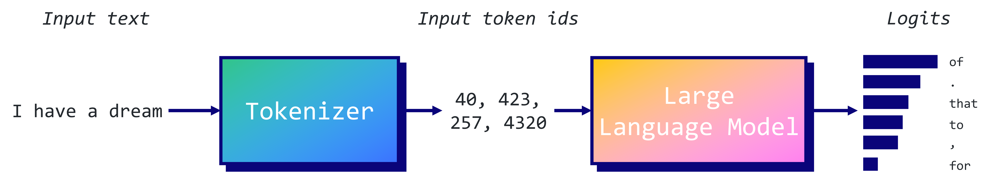
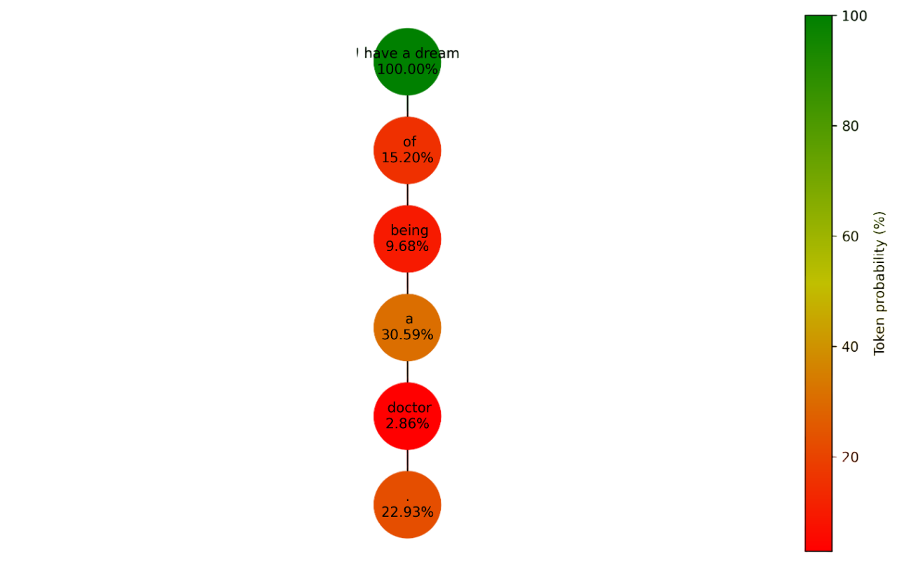
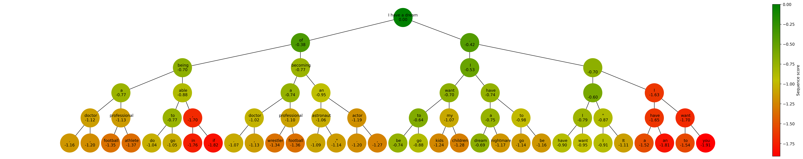
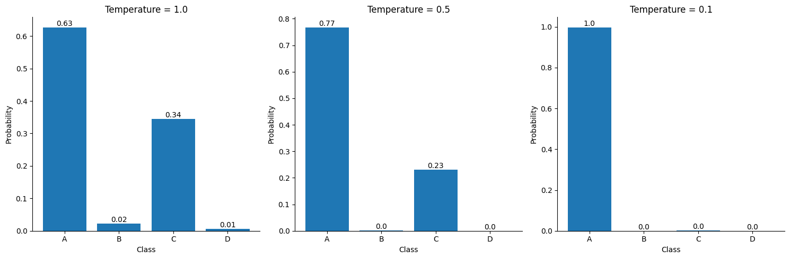
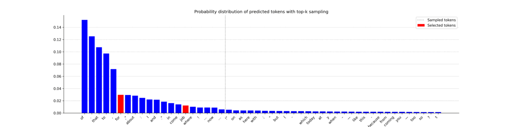
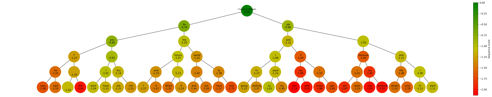
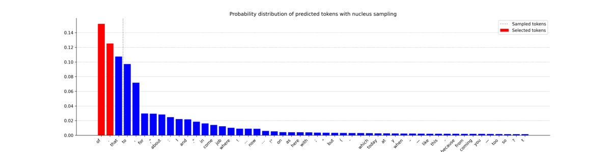
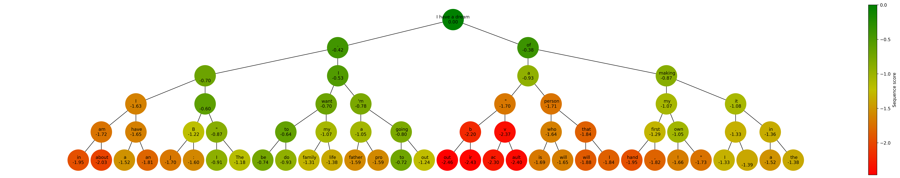

# Decoding Strategies

在本文中，我们将探讨 LLM（Large Language Models）如何生成文本，深入研究贪婪搜索 (greedy search) 和束搜索 (beam search) 的机制，以及使用 top-k 和 nucleus 采样的抽样技术。还将熟悉如何处理重要的超参数，如温度（temperature）、num_beams、top_k 和 top_p。

## 背景

首先，让我们从一个示例开始。我们将向 GPT-2 模型输入文本 “I have a dream”，并要求它生成接下来的 5 个 token。

```
from transformers import GPT2LMHeadModel, GPT2Tokenizer
import torch

device = 'cuda' if torch.cuda.is_available() else 'cpu'
model = GPT2LMHeadModel.from_pretrained('gpt2').to(device)
tokenizer = GPT2Tokenizer.from_pretrained('gpt2')
model.eval()

text = "I have a dream"
input_ids = tokenizer.encode(text, return_tensors='pt').to(device)

outputs = model.generate(input_ids, max_length=len(input_ids.squeeze())+5)
generated_text = tokenizer.decode(outputs[0], skip_special_tokens=True)
print(f"Generated text: {generated_text}")
```

```
Generated text: I have a dream of being a doctor.
```

似乎是 GPT-2 生成了句子 “I have a dream of being a doctor”。然而，GPT-2并没有完全产生这个句子。

有一个常见的误解，认为像 GPT-2 这样的 LLM 直接生成文本。事实并非如此。相反，LLM 计算 logits，即为其词汇表中的每个可能的标记分配得分。为了简化说明，以下是这个过程的图解解释：



这里，tokenizer（此处为 [Byte-Pair Encoding](https://en.wikipedia.org/wiki/Byte_pair_encoding) ）将输入文本中的每个 token 转换为相应的 token ID。然后，GPT-2 使用这些 token ID 作为输入，尝试预测最有可能的下一个 token。最后，模型生成 logits，这些 logits 通过 softmax 函数转换为概率。

例如，模型将在 “I have a dream” 后面的 “of” 上分配一个 17% 的概率。这个输出实际上代表了序列中潜在的下一个 token 的按排名排序的列表。更正式地，我们将这个概率表示为 $P( of | I\,have \,a\,dream) = 17$ 。

像 GPT 这样自回归的模型基于前序输入的 token 来预测序列中的下一个 token。这个序列的联合概率 $P(W)$ 可以分解为：

$$
P(s)=P(w_1,w_2,...,w_t)=\displaystyle \prod_i^t P(w_i|w_1,w_2,...,w_{i−1})
$$

对于序列中的每一个 token $w_i$，$P(w_i|w_1,w_2,...,w_{i−1})$ 表示给定前序 token $(w_1,w_2,...,w_{i−1})$下，输出 $w_t$的条件概率。 GPT-2 计算词表 5027 个 token 中的每一个 token 的概率。

这里引申出了一个问题：如何使用这些概率来生成文本？这就是解码策略(decoding strategies)发挥作用的地方，比如贪婪搜索(greedy search)和束搜索(beam search)。

## greedy search

贪婪搜索是一种解码方法，它将每一步中最有可能的 token 作为序列中的下一个 token。简单来说，它只保留每个阶段中最可能的 token，舍弃所有其他潜在选项。以我们的例子为例：

步骤1：输入：“I have a dream” → 最可能的 token：“ of”
步骤2：输入：“I have a dream of” → 最可能的 token：“ being”
步骤3：输入：“I have a dream of being” → 最可能的 token：“ a”
步骤4：输入：“I have a dream of being a” → 最可能的 token：“ doctor”
步骤5：输入：“I have a dream of being a doctor” → 最可能的 token：“.”

虽然这种方法看起来很直观，但是要注意，贪婪搜索是目光短浅的：它只考虑每一步中最有可能的 token，而不考虑对序列的整体影响。这种特性使其快速高效，因为它不需要跟踪多个序列，但这也意味着它可能错过了概率比较低一些的 token 生成的更好序列。

接下来，让我们使用 Graphviz 和 Networkx 来说明贪婪搜索的实现。我们选择具有最高分数的 token ID，计算其对数概率（我们取对数以简化计算），并将其添加到树中。我们将重复这个过程五次。

```
import matplotlib.pyplot as plt
import networkx as nx
import numpy as np
import time

def get_log_prob(logits, token_id):
    # Compute the softmax of the logits
    probabilities = torch.nn.functional.softmax(logits, dim=-1)
    log_probabilities = torch.log(probabilities)
    
    # Get the log probability of the token
    token_log_probability = log_probabilities[token_id].item()
    return token_log_probability

def greedy_search(input_ids, node, length=5):
    if length == 0:
        return input_ids

    outputs = model(input_ids)
    predictions = outputs.logits

    # Get the predicted next sub-word (here we use top-k search)
    # argmax 计算概率最大的 token
    logits = predictions[0, -1, :]
    token_id = torch.argmax(logits).unsqueeze(0)

    # Compute the score of the predicted token
    token_score = get_log_prob(logits, token_id)

    # Add the predicted token to the list of input ids
    new_input_ids = torch.cat([input_ids, token_id.unsqueeze(0)], dim=-1)

    # Add node and edge to graph
    next_token = tokenizer.decode(token_id, skip_special_tokens=True)
    current_node = list(graph.successors(node))[0]
    graph.nodes[current_node]['tokenscore'] = np.exp(token_score) * 100
    graph.nodes[current_node]['token'] = next_token + f"_{length}"

    # Recursive call
    input_ids = greedy_search(new_input_ids, current_node, length-1)
    
    return input_ids

# Parameters
length = 5
beams = 1

# Create a balanced tree with height 'length'
graph = nx.balanced_tree(1, length, create_using=nx.DiGraph())

# Add 'tokenscore', 'cumscore', and 'token' attributes to each node
for node in graph.nodes:
    graph.nodes[node]['tokenscore'] = 100
    graph.nodes[node]['token'] = text

# Start generating text
output_ids = greedy_search(input_ids, 0, length=length)
output = tokenizer.decode(output_ids.squeeze().tolist(), skip_special_tokens=True)
print(f"Generated text: {output}")
```

```
Generated text: I have a dream of being a doctor.
```

贪婪搜索生成了与 transformers 库中的文本相同的结果：“I have a dream of being a doctor。”让我们可视化我们创建的树结构。

```
import matplotlib.pyplot as plt
import networkx as nx
import matplotlib.colors as mcolors
from matplotlib.colors import LinearSegmentedColormap

def plot_graph(graph, length, beams, score):
    fig, ax = plt.subplots(figsize=(3+1.2*beams**length, max(5, 2+length)), dpi=300, facecolor='white')

    # Create positions for each node
    pos = nx.nx_agraph.graphviz_layout(graph, prog="dot")

    # Normalize the colors along the range of token scores
    if score == 'token':
        scores = [data['tokenscore'] for _, data in graph.nodes(data=True) if data['token'] is not None]
    elif score == 'sequence':
        scores = [data['sequencescore'] for _, data in graph.nodes(data=True) if data['token'] is not None]
    vmin = min(scores)
    vmax = max(scores)
    norm = mcolors.Normalize(vmin=vmin, vmax=vmax)
    cmap = LinearSegmentedColormap.from_list('rg', ["r", "y", "g"], N=256) 

    # Draw the nodes
    nx.draw_networkx_nodes(graph, pos, node_size=2000, node_shape='o', alpha=1, linewidths=4, 
                          node_color=scores, cmap=cmap)

    # Draw the edges
    nx.draw_networkx_edges(graph, pos)

    # Draw the labels
    if score == 'token':
        labels = {node: data['token'].split('_')[0] + f"\n{data['tokenscore']:.2f}%" for node, data in graph.nodes(data=True) if data['token'] is not None}
    elif score == 'sequence':
        labels = {node: data['token'].split('_')[0] + f"\n{data['sequencescore']:.2f}" for node, data in graph.nodes(data=True) if data['token'] is not None}
    nx.draw_networkx_labels(graph, pos, labels=labels, font_size=10)
    plt.box(False)

    # Add a colorbar
    sm = plt.cm.ScalarMappable(cmap=cmap, norm=norm)
    sm.set_array([])
    if score == 'token':
        fig.colorbar(sm, ax=ax, orientation='vertical', pad=0, label='Token probability (%)')
    elif score == 'sequence':
        fig.colorbar(sm, ax=ax, orientation='vertical', pad=0, label='Sequence score')
    plt.show()

# Plot graph
plot_graph(graph, length, 1.5, 'token')
```



在这个图中，顶部的节点存储输入 token（因此具有 100% 的概率），而其他所有节点表示生成的 token。尽管在预测时，该序列中的每个 token 都是最有可能的，但是 “being” 和 “doctor” 分别被赋予了相对较低的概率，分别为 9.68% 和 2.86%。这表明我们第一个预测的令牌 “of” 可能不是最合适的选择，因为它导致了相当不可能的 “being”。

在接下来的部分，我们将探讨束搜索如何解决这个问题。

## Beam Search

与贪婪搜索只考虑下一个最有可能的 token 不同，束搜索考虑了最有可能的 $n$ 个令牌，其中 $n$ 表示 beam 的数量。此过程重复进行，直到达到预定义的最大长度或出现序列结束 token。此时，具有最高总分的序列（或“beam”）被选择为输出。

我们可以修改之前的函数，考虑到最可能的 $n$ 个令牌，而不仅仅是一个。在这里，我们将维护序列得分 $log(P(w))$，即 beam 中每个 token 的对数概率的累加和。我们通过序列长度对这个得分进行归一化，以防止对较长序列的偏见（这个因子可以进行调整）。再次，我们将生成五个额外的 token 来完成句子 “I have a dream。”

```
from tqdm.notebook import tqdm

def greedy_sampling(logits, beams):
    return torch.topk(logits, beams).indices
    
def beam_search(input_ids, node, bar, length, beams, sampling, temperature=0.1):
    if length == 0:
        return None

    outputs = model(input_ids)
    predictions = outputs.logits

    # Get the predicted next sub-word (here we use top-k search)
    logits = predictions[0, -1, :]

    if sampling == 'greedy':
        top_token_ids = greedy_sampling(logits, beams)
    elif sampling == 'top_k':
        top_token_ids = top_k_sampling(logits, temperature, 20, beams)
    elif sampling == 'nucleus':
        top_token_ids = nucleus_sampling(logits, temperature, 0.5, beams)

    for j, token_id in enumerate(top_token_ids):
        bar.update(1)

        # Compute the score of the predicted token
        token_score = get_log_prob(logits, token_id)
        cumulative_score = graph.nodes[node]['cumscore'] + token_score

        # Add the predicted token to the list of input ids
        new_input_ids = torch.cat([input_ids, token_id.unsqueeze(0).unsqueeze(0)], dim=-1)

        # Add node and edge to graph
        token = tokenizer.decode(token_id, skip_special_tokens=True)
        current_node = list(graph.successors(node))[j]
        graph.nodes[current_node]['tokenscore'] = np.exp(token_score) * 100
        graph.nodes[current_node]['cumscore'] = cumulative_score
        graph.nodes[current_node]['sequencescore'] = 1/(len(new_input_ids.squeeze())) * cumulative_score
        graph.nodes[current_node]['token'] = token + f"_{length}_{j}"

        # Recursive call
        # 递归调用生成每个 beam 下的新 token
        beam_search(new_input_ids, current_node, bar, length-1, beams, sampling, 1)

# Parameters
length = 5
beams = 2

# Create a balanced tree with height 'length' and branching factor 'k'
graph = nx.balanced_tree(beams, length, create_using=nx.DiGraph())
bar = tqdm(total=len(graph.nodes))

# Add 'tokenscore', 'cumscore', and 'token' attributes to each node
for node in graph.nodes:
    graph.nodes[node]['tokenscore'] = 100
    graph.nodes[node]['cumscore'] = 0
    graph.nodes[node]['sequencescore'] = 0
    graph.nodes[node]['token'] = text

# Start generating text
beam_search(input_ids, 0, bar, length, beams, 'greedy', 1)
```

该函数计算了 63 个 token 和 beam 的长度为 $5^2=25$ 个可能的序列的得分。在我们的实现中，所有信息都存储在图中。我们的下一步是提取最佳序列。

首先，我们确定具有最高序列得分的叶节点。接下来，我们找到从根节点到叶节点的最短路径。沿着这条路径的每个节点都包含最佳序列的一个 token。以下是我们可以实现它的方法：

```
def get_best_sequence(G):
    # Create a list of leaf nodes
    leaf_nodes = [node for node in G.nodes() if G.out_degree(node)==0]

    # Get the leaf node with the highest cumscore
    max_score_node = None
    max_score = float('-inf')
    for node in leaf_nodes:
        if G.nodes[node]['sequencescore'] > max_score:
            max_score = G.nodes[node]['sequencescore']
            max_score_node = node

    # Retrieve the sequence of nodes from this leaf node to the root node in a list
    path = nx.shortest_path(G, source=0, target=max_score_node)

    # Return the string of token attributes of this sequence
    sequence = "".join([G.nodes[node]['token'].split('_')[0] for node in path])
    
    return sequence, max_score

sequence, max_score = get_best_sequence(graph)
print(f"Generated text: {sequence}")
```

```
Generated text: I have a dream. I have a dream
```

最佳序列似乎是 “I have a dream. I have a dream”，这是 GPT-2 的一个常见回答，尽管可能会让人感到惊讶。为了验证这一点，让我们绘制这个图。



在这个可视化中，我们将显示每个节点的序列得分，表示到该点的序列得分。如果函数 get_best_sequence() 正确的话，在序列 “I have a dream. I have a dream” 中的 “dream” 节点应该在所有叶节点中具有最高分数。

确实，"dream" token 具有最高的序列得分，值为 -0.69。有趣的是，我们可以看到贪婪序列 "I have a dream of being a doctor." 的得分在左侧，值为 -1.16。

正如预期的那样，贪婪搜索导致了次优的结果。但是，说实话，beam search 的结果也没有特别引人注目。为了生成更多样化的序列，我们将实现两种采样算法：top-k 和 nucleus。

## Top-k sampling

Top-k 采样是一种利用语言模型生成的概率分布，在最有可能的 $k$ 个选项中随机选择 token 的技术。

为了说明，假设 $k=3$ 和 4 个 token：A，B，C 和 D。以及对应的概率为：$P(A) =30$，$P(B)=15$，$P(C)=5$，和 $P(D)=1$。在 top-3 采样中，token D 会被忽略，算法有 60% 的概率输出 A，30% 的概率输出 B，10% 的概率输出 C。这种方法确保我们优先选择最有可能的令牌，同时在选择过程中引入了随机性的元素。

引入随机性的另一种方式是温度（temperature）的概念。温度
 $T$ 是一个从 0 到 1 的参数，它影响由 softmax 函数生成的概率，使得最有可能的 token 更具影响力。在实践中，它简单地将输入的 logits 除以一个我们称之为温度的值：

$$
softmax(x_i)= \frac{e^{x_j/T}}{\sum_j e^{x_j/T}}
$$

下面是一个图表，展示了温度对于给定输入 logits [1.5, -1.8, 0.9, -3.2] 生成的概率的影响。我们绘制了三个不同的温度值以观察差异。



温度为 1.0 相当默认的 softmax 输出。另一方面，较低的温度设定（0.1）会显著改变概率分布。在文本生成中，这常用于控制生成输出中的“创造性”水平。通过调整温度，我们可以影响模型生成的多样性或可预测性的程度。

现在让我们来实现 top-k 采样算法。我们将在 beam_search() 函数中使用它，并提供 “top_k” 参数。为了说明算法的工作原理，我们还将绘制 top_k=20 时的概率分布图。



这些图表很好地说明了 top-k 采样的工作原理，横向条的左侧是所有可能被选中的 token。虽然大部分时间选择了最有可能的 token（用红色表示），但它也允许选择不太可能的 token。这提供了一个有趣的权衡，可以将序列引导到一个不太可预测但更自然的句子。现在让我们打印生成的文本。

```
sequence, max_score = get_best_sequence(graph)
print(f"Generated text: {sequence}")
```

```
Generated text: I have a dream job and I want to
```

Top-k 采样找到了一个新的序列："I have a dream job and I want to"，这个序列感觉比 "I have a dream. I have a dream" 更自然。

让我们看看这个决策树与之前的决策树有什么不同。



可以看到节点与先前的迭代有明显的不同，做出了更多样化的选择。尽管这个新结果的序列得分可能不是最高的（ -1.01 而不是先前的 -0.69），但重要的是要记住，较高的得分并不总是导致更真实或更有意义的序列。

现在我们已经介绍了 top-k 采样，我们必须介绍另一种最流行的采样技术：nucleus 采样。


## Nucleus sampling

核采样（Nucleus sampling），也被称为 top-p 采样（top-p sampling），与 top-k 采样采用不同的方法。核采样不是选择最有可能的前 k 个令牌，而是选择一个截断值 $p$，使得所选 token 的概率总和超过 $p$。这形成了一个 Nucleus token 集合，我们可以从中随机选择下一个 token。

换句话说，模型按降序检查其最有可能的 token，并将它们逐个添加到列表中，直到总概率超过阈值 $p$。与 top-k 采样不同，核采样中包含的 token 数量在每一步中都不同。这种变化通常会导致更多样化和创造性的输出，因此 Nucleus sampling 在文本生成等任务中很受欢迎。

为了实现 Nucleus sampling 方法，我们可以在beam_search() 函数中使用 “nucleus” 参数。在本例中，我们将 $p$ 的值设置为 0.5。为了简化问题，我们将包含的最小 token 数量设为 beam 数量相等。我们还将考虑累积概率低于 $p$ 的令牌，而不是高于 $p$ 的 token。值得注意的是，虽然细节可能有所不同，但 Nucleus sampling 的核心思想保持不变。

```
def nucleus_sampling(logits, temperature, p, beams, plot=True):
    assert p > 0
    assert p <= 1

    # Sort the probabilities in descending order and compute cumulative probabilities
    sorted_logits, sorted_indices = torch.sort(logits, descending=True)
    probabilities = torch.nn.functional.softmax(sorted_logits / temperature, dim=-1)
    cumulative_probabilities = torch.cumsum(probabilities, dim=-1)

    # Create a mask for probabilities that are in the top-p
    mask = cumulative_probabilities < p

    # If there's not n index where cumulative_probabilities < p, we use the top n tokens instead
    if mask.sum() > beams:
        top_p_index_to_keep = torch.where(mask)[0][-1].detach().cpu().tolist()
    else:
        top_p_index_to_keep = beams

    # Only keep top-p indices
    indices_to_remove = sorted_indices[top_p_index_to_keep:]
    sorted_logits[indices_to_remove] = float('-inf')

    # Sample n tokens from the resulting distribution
    probabilities = torch.nn.functional.softmax(sorted_logits / temperature, dim=-1)
    next_tokens = torch.multinomial(probabilities, beams)

    # Plot distribution
    if plot:
        total_prob = torch.nn.functional.softmax(logits / temperature, dim=-1)
        plot_prob_distribution(total_prob, next_tokens, 'nucleus', top_p_index_to_keep)

    return next_tokens

# Start generating text
beam_search(input_ids, 0, bar, length, beams, 'nucleus', 1)
```




在这个图表中，您可以看到 nucleus 中包含的 token 数量变化很大。生成的概率分布差异很大，导致选择的 token 并不总是最有可能的令牌。这为生成独特和多样化的序列打开了大门。现在，让我们观察一下生成的文本。

```
sequence, max_score = get_best_sequence(graph)
print(f"Generated text: {sequence}")
```

```
Generated text: I have a dream. I'm going to
```

Nucleus sampling 生成了序列：“I have a dream. I'm going to”，与贪婪采样相比，它在语义连贯性方面有明显的提升。

为了比较决策路径，让我们可视化 Nucleus sampling 生成的新决策树。

```
# Plot graph
plot_graph(graph, length, beams, 'sequence')
```



与 top-k 采样一样，这个决策树与贪婪采样生成的决策树非常不同，展示了更多的变化。无论是 top-k 采样还是 Nucleus 采样，在生成文本时都提供了独特的优势，增加了多样性，并向输出引入了创造性。在两种方法（甚至贪婪搜索）之间的选择将取决于您项目的具体需求和约束条件。


## 总结

在本文中，我们深入探讨了 LLM（大型语言模型），特别是 GPT-2 使用的各种解码方法。我们从简单的贪婪搜索开始，它立即选择最有可能的下一个 token，但往往是次优的选择。接下来，我们介绍了 beam search 技术，它在每个步骤中考虑了几个最有可能的令牌。尽管 beam search  提供了更细致的结果，但有时在生成多样化和创造性序列方面可能表现不佳。

为了增加过程的变化性，我们接着介绍了 top-k 采样和核采样。top-k 采样通过在最有可能的 k 个令牌中随机选择来使文本生成更加多样化，而核采样则通过根据累加概率动态形成 token 核来选择不同的路径。每种方法都具有独特的优势和潜在的缺点，而您的项目的具体要求将在很大程度上决定它们之间的选择。
