# FP32/FP16/BF16

一个浮点数使用 $n$ 位来存储一个数值。这些位进一步分为三个不同的组成部分：

- 符号位(Sign)：符号位表示数的正负性。它使用一位，其中 0 表示正数，1 表示负数。
- 指数(Exponent)：指数是一段位，表示底数（通常是二进制表示中的 2）的幂次。指数也可以是正数或负数，允许数表示非常大或非常小的值。
- 尾数/有效数字(Significand/Mantissa)：剩余的位用于存储尾数，也称为有效数字。它代表了数字的有效位数。数字的精度在很大程度上取决于尾数的长度。

这种设计使得浮点数能够覆盖一定范围的值，并具有不同级别的精度。用于此表示的公式为：

$(-1)^{sign} \times base^{exponent} \times {significand} $

为了更好地理解，让我们深入了解一些在深度学习中常用的数据类型：float32（FP32）、float16（FP16）和 bfloat16（BF16）：


- FP32 使用 32 位来表示一个数：一位用于表示符号，8 位用于表示指数，剩下的 23 位用于表示尾数。虽然它提供了很高的精度，但 FP32 的缺点是计算和内存占用较高。
- FP16 使用 16 位来存储一个数：一位用于表示符号，5 位用于表示指数，10 位用于表示尾数。虽然这使得它更节省内存并加快计算速度，但由于范围和精度的减少，可能会引入数值不稳定性，可能影响模型的准确性。
- BF16 也是一种 16 位的格式，其中有一位用于表示符号，8 位用于表示指数，7 位用于表示尾数。与 FP16 相比，BF16 扩展了可表示的范围，从而降低了下溢和上溢的风险。尽管由于较少的尾数位数而减少了精度，但 BF16 通常不会对模型性能产生显著影响，并且对于深度学习任务来说是一个有用的折衷方案。

FP32 通常被称为 `full precision`（4 字节），而 BF16 和 FP16 被称为 `half-precision`（2 字节）。

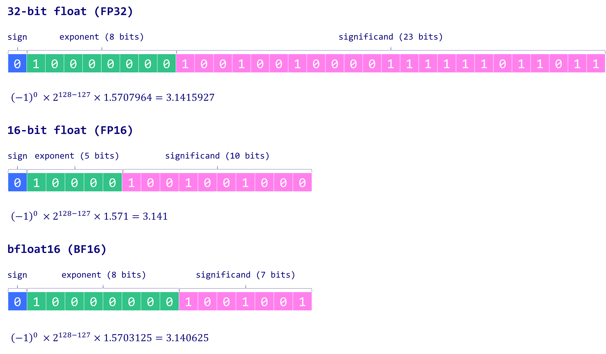

# FP32

在线转换器[IEEE-754 Floating Point Converter](https://www.h-schmidt.net/FloatConverter/IEEE754.html)

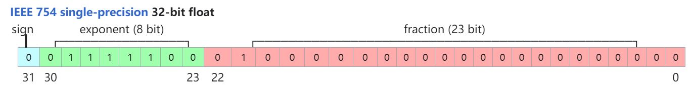

- Sign(符号位): 1 位，0表示整数；1 表示负数
- Exponent(指数位)：8 位，表示整数部分，偏置值是 127
- Fraction(尾数位)：23 位，表示小数部分，也是隐含了首位的1，实际的尾数精度为 24 位

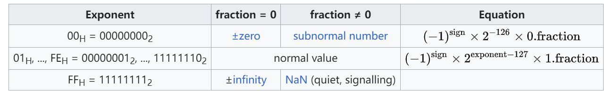

示例：

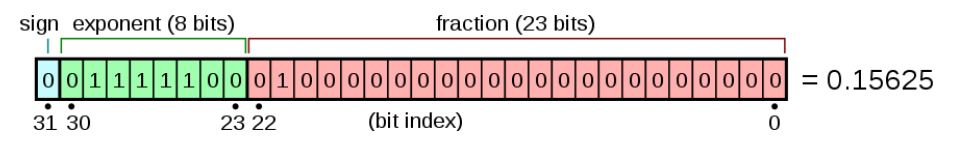

计算

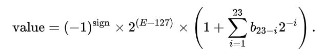

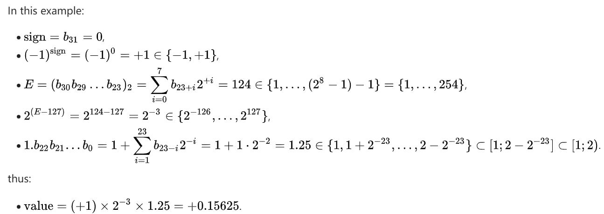
# FP16

在线转换器[IEEE 754 Calculator](http://weitz.de/ieee/)


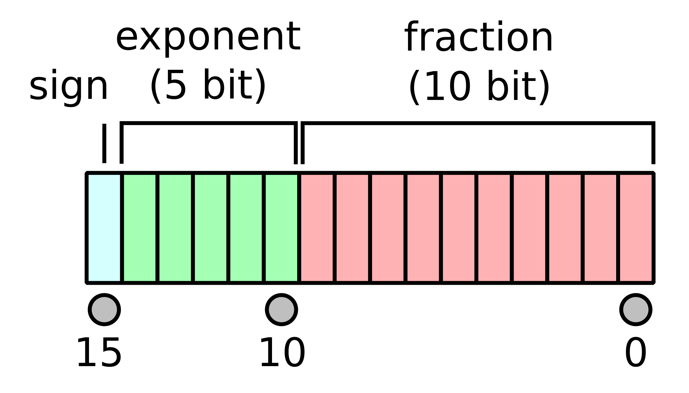

- Sign(符号位): 1 位，0表示整数；1表示负数。
- Exponent(指数位)：5 位，范围为 00001(1) 到 11110(30)，偏置值是 $15$。这个偏置值确保了指数位可以表示从 $-14$ 到 $+15$ 的范围，而不是 1 到 30，注：当指数位都为 00000 和 11111 时，它表示的是一种特殊情况，在 IEEE 754 标准中叫做非规范化情况。
- Fraction(尾数位)：10 位，存储的尾数位数为 10 位，但其隐含了一个前导位，其值为 1，除非指数字段存储了全零。因此，在内存格式中，只有 10 位尾数出现，但总精度为 11 位。在 IEEE 754 术语中，尾数有 10 位，但尾数精度有 11 位（ $log_{10}2^{11} \approx 3.311$ 十进制位数，或者 4 个数字 $\pm$ 略小于最后一位的 5 个单位）。

这里的隐含位可能有点难以理解，简单通俗来说，假设尾数部分为 1001000000，为默认在其前面加一个 1，最后变成 1.1001000000 然后换成 10 进制就是 :
```
# 第一种计算方式
1.1001000000 = 1 * 2^0 + 1 * 2^(-1) + 0 * 2^(-2) + 0 * 2^(-3) + 1 * 2^(-4) + 0 * 2^(-5) + 0 * 2^(-6) + 0 * 2^(-7) + 0 * 2^(-8) + 0 * 2^(-9) = 1.5625
# 第二种计算方式
1.1001000000 = 1 + 576(1001000000变成10进制)/1024 = 1.5625
```

FP16 计算的公式如下：

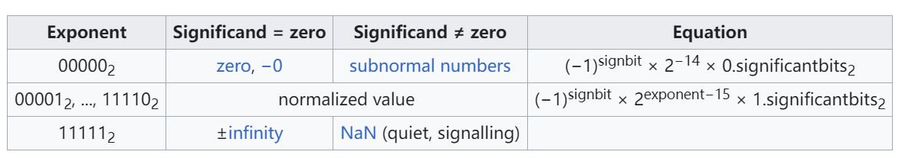

其中第一行表示的是特殊情况，当指数位为全 0 时，尾数位的前导位为 0。

这里还有两个概念 normal number(规格数) & subnormal number(非规格数)，参考文后。subnormal number 表示隐藏前导位为 0。

按照上面的计算公式，可以计算如下示例：

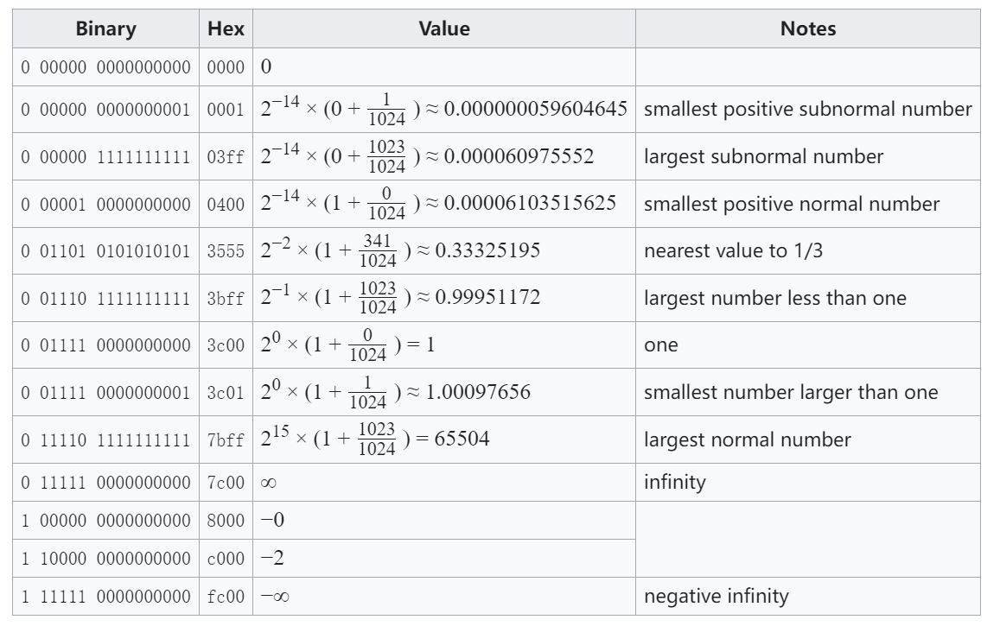

# BF16
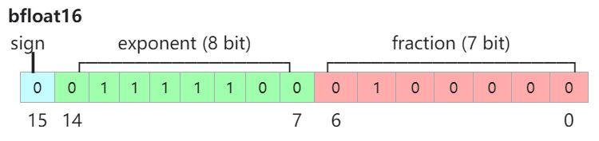

- Sign(符号位): 1 位，0 表示整数；1 表示负数
- Exponent(指数位)：8 位，表示整数部分，偏置值是 127
- Fraction(尾数位)：7 位，表示小数部分，也是隐含了首位的1，实际的尾数精度为 8 位

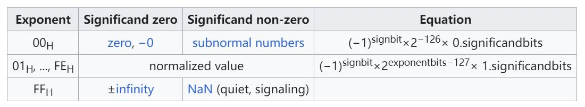

示例：

bfloat16 精度下的最大有限正值：
$7F7F = 0 11111110 1111111 = (2^8 − 1) × 2^{−7} × 2^{127}  \approx 3.38953139 × 10^{38}$

bfloat16 精度和单精度浮点数下的最小规范化正值：
$0080 = 0 00000001 0000000 = 2^{−126} \approx 1.175494351 × 10^{−38}$


#  normal number(规格数) & subnormal number(非规格数)

根据 IEEE754 的规定，按照尾数位隐藏的整数部分是 1. 还是 0. 可以将浮点数划分为两类： normal number(规格数) 和 subnormal number(非规格数)

下面以 32 位浮点数为例来解释这些概念。

### normal number(规格数)

就是尾数位隐藏的整数部分是 1. 的数，这种数叫做 normal number，可以理解为"正常的数"。 一般来说，我们遇到的都是 normal number

举例:
20.5 在内存中表示为: 0 1000 0011 **0100 1000 0000 0000 000**

其中尾数部分(即上面的加粗部分)，去掉后面补的零之后为: 01001

但事实上，真实的尾数部分应该是: 1.01001，即前面省略了整数部分 1.

### subnormal number(非规格数)

尾数位隐藏的整数部分为 0. 的数，叫做 subnormal number，也叫作 denormal number，可以理解为"低于正常数的数"

引入 subnormal number 这个概念，是为了在浮点数下溢时，可以逐位的损失精度，以尽可能精确的表达 0 附近的极小数。

为了表示 subnormal number，IEEE754 规定：如果将指数位全部填充为 0，则表示这个数是个 subnormal number

举例: 以 32 位浮点数为例，当你看到类似于 * 00000000 *********************** 这样内存状态的数时，(即指数位全部为0 的数)，就应该知道，这是个 subnormal number，此时这个数的尾数位隐藏的整数不是 1. 而是 0.


## pytorch 中查看

FP16：
```
torch.finfo(torch.float16)

finfo(resolution=0.001, min=-65504, max=65504, eps=0.000976562, smallest_normal=6.10352e-05, tiny=6.10352e-05, dtype=float16)
```
一些解释：

- resolution（分辨率）：这个浮点数类型的在十进制上的分辨率，表示两个不同值之间的最小间隔。对于 torch.float16，分辨率是 0.001，就是说两个不同的 torch.float16 数值之间的最小间隔是 0.001。
- min（最小值）：对于 torch.float16，最小值是 -65504。
- max（最大值）：对于 torch.float16，最大值是 65504。
- eps（机器精度）：机器精度表示在给定数据类型下，比 1 大的最小浮点数，对于 torch.float16，机器精度是 0.000976562，对应上表中的smallest number larger than one。
smallest_normal（最小正规数）：最小正规数是大于零的最小浮点数，对于 torch.float16，最小正规数是 6.10352e-05，对应上表中的smallest positive normal number
- tiny（最小非零数）：最小非零数是大于零的最小浮点数，对于 torch.float16，最小非零数也是 6.10352e-05，也是对应上表中的smallest positive normal number

这里 resolution（分辨率）实际上应该就是 $log_{10}2^{11} \approx 3.311$，在 10 进制上的最小精度表示为 3 位小数。

BF16：
```
import torch
torch.finfo(torch.bfloat16)
# 结果
finfo(resolution=0.01, min=-3.38953e+38, max=3.38953e+38, eps=0.0078125, smallest_normal=1.17549e-38, tiny=1.17549e-38, dtype=bfloat16)
```

可以明显的看到 bfloat16 比 float16 精度降低了，但是表示的范围更大了，能够有效的防止在训练过程中的溢出。

FP32：

```
import torch
torch.finfo(torch.float32)
# 结果
finfo(resolution=1e-06, min=-3.40282e+38, max=3.40282e+38, eps=1.19209e-07, smallest_normal=1.17549e-38, tiny=1.17549e-38, dtype=float32)
```

FP16 的精度：
```
import torch

# 把10进制数转化为 torch.float16
num = 3.141
num_fp16 = torch.tensor(num).half()
print(num_fp16)
# 结果
tensor(3.1406, dtype=torch.float16)

num = 3.1415
num_fp16 = torch.tensor(num).half()
print(num_fp16)
# 结果
tensor(3.1406, dtype=torch.float16)
# 可以看到3.141和3.1415间隔只有0.0005，所以在float16下结果是一样的

num = 3.142
num_fp16 = torch.tensor(num).half()
print(num_fp16)
# 结果
tensor(3.1426, dtype=torch.float16)
# 可以看到结果不一样了

# 3.1417 => tensor(3.1426, dtype=torch.float16)
# 3.1416 => tensor(3.1406, dtype=torch.float16)
# 3.141 => tensor(3.1406, dtype=torch.float16)
# 3.1398 => tensor(3.1406, dtype=torch.float16)
# 3.1393 => tensor(3.1387, dtype=torch.float16)

```

float16 变成 2 进制，再把 2 进制变成 16 进制

```
import struct
def float16_to_bin(num):
    # 将float16数打包为2字节16位，使用struct.pack
    packed_num = struct.pack('e', num)

    # 解包打包后的字节以获取整数表示
    int_value = struct.unpack('H', packed_num)[0]

    # 将整数表示转换为二进制
    binary_representation = bin(int_value)[2:].zfill(16)
    return binary_representation

num = 3.141
num_fp16 = torch.tensor(num).half()
print(num_fp16)
binary_representation = float16_to_bin(num_fp16)
print(binary_representation)  # 打印二进制表示
# 结果
tensor(3.1406, dtype=torch.float16)
0100001001001000


num = 3.1415
num_fp16 = torch.tensor(num).half()
binary_representation = float16_to_bin(num_fp16)
print(binary_representation)  # 打印二进制表示
# 结果
tensor(3.1406, dtype=torch.float16)
0100001001001000  # 还是一样的结果

num = 3.142
num_fp16 = torch.tensor(num).half()
print(num_fp16)
binary_representation = float16_to_bin(num_fp16)
print(binary_representation)  # 打印二进制表示
# 结果
tensor(3.1426, dtype=torch.float16)
0100001001001001  # 不一样了
```
把 2 进制变成 16 进制

```
def binary_to_float16(binary_string):
    # 检查输入是否是有效的16位二进制字符串
    if len(binary_string) != 16:
        raise ValueError("输入的二进制字符串必须是16位长")

    # 提取组成部分：符号、指数、尾数
    sign = int(binary_string[0])  # 符号位
    exponent = int(binary_string[1:6], 2)  # 指数位
    mantissa = int(binary_string[6:], 2) / 1024.0  # 尾数位，除以2的10次方（即1024）以获得10位精度

    # 根据符号、指数和尾数计算float16值
    value = (-1) ** sign * (1 + mantissa) * 2 ** (exponent - 15)
    return value

# 10进制3.141对应float16：3.1406
binary_representation = "0100001001001000"
# 将二进制表示转换为float16
float16_value = binary_to_float16(binary_representation)
print("通过2进制转化后Float16值:", float16_value)
# 结果：
通过2进制转化后Float16值: 3.140625

# 10进制3.1415对应float16：3.1406
binary_representation = "0100001001001000"
# 将二进制表示转换为float16
float16_value = binary_to_float16(binary_representation)
print("通过2进制转化后Float16值:", float16_value)
# 结果：
通过2进制转化后Float16值: 3.140625

# 10进制3.142对应float16：3.1426
binary_representation = "0100001001001001"
# 将二进制表示转换为float16
float16_value = binary_to_float16(binary_representation)
print("通过2进制转化后Float16值:", float16_value)
# 结果：
通过2进制转化后Float16值: 3.142578125
```

# 转换

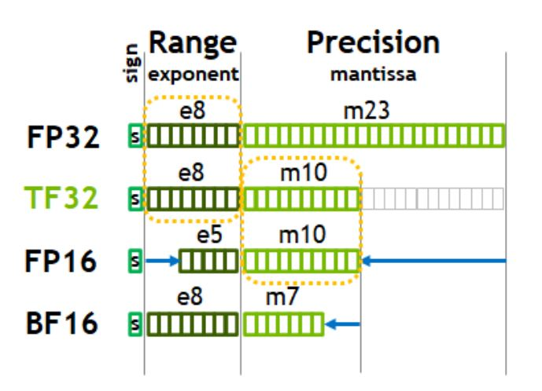

## FP32 -> bf16

其实就是把 float32 后边多余的位给截断就好


```
// convert float to brain half
NCNN_EXPORT NCNN_FORCEINLINE unsigned short float32_to_bfloat16(float value)
{
    // 16 : 16
    union
    {
        unsigned int u;
        float f;
    } tmp;
    tmp.f = value;
    return tmp.u >> 16;
}
// convert brain half to float
NCNN_EXPORT NCNN_FORCEINLINE float bfloat16_to_float32(unsigned short value)
{
    // 16 : 16
    union
    {
        unsigned int u;
        float f;
    } tmp;
    tmp.u = value << 16;
    return tmp.f;
}
```

# FP32 到 FP16

只贴简单部分

```
// exponent mask
// 0111 1111 1000 0000 0000 0000 0000 0000(0x7f800000)
// 对 exponent 完整的运算 ((((float >> 23) - 127 + 15) & 0x1f) << 10)
// 对应简化计算首先调整偏置 
// Adjust bias
// 0011 1000 0000 0000 0000 0000 0000 0000(0x38000000)
uint32_t x = *((uint32_t*)&f);
uint16_t h = ((x>>16)&0x8000)|((((x&0x7f800000)-0x38000000)>>13)&0x7c00)|((x>>13)&0x03ff);
```

# 参考
- https://cloud.google.com/tpu/docs/bfloat16
- https://en.wikipedia.org/wiki/Half-precision_floating-point_format
- https://zhuanlan.zhihu.com/p/657886517
- https://zhuanlan.zhihu.com/p/343037540
- https://en.wikipedia.org/wiki/Single-precision_floating-point_format
- https://zhuanlan.zhihu.com/p/676509123
- https://xiaolincoding.com/os/1_hardware/float.html#%E5%8D%81%E8%BF%9B%E5%88%B6%E5%B0%8F%E6%95%B0%E4%B8%8E%E4%BA%8C%E8%BF%9B%E5%88%B6%E7%9A%84%E8%BD%AC%E6%8D%A2