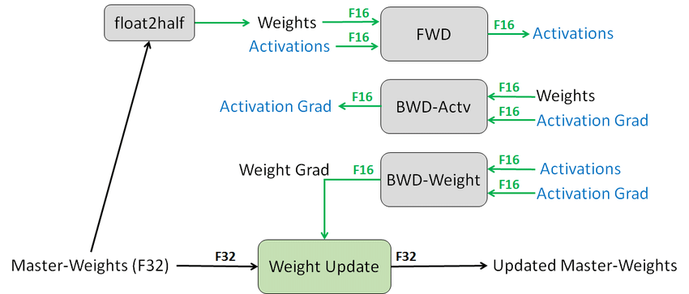

# Automatic Mixed Precision

使用混合精度训练需要三个步骤：

- 在可能的情况下将模型转换为使用 float16 数据类型。
- 保留 float32 的主权重以累积每次迭代的权重更新。
- 使用损失缩放 (loss scaling) 以保留小的梯度值。

支持完全自动化混合精度训练的框架还支持以下功能：

- 自动损失缩放和主权重集成到优化器类中。
- 在 float16 和 float3 2之间进行自动转换，以最大限度地提高速度，同时确保任务特定的准确性不会损失。

## 参考文献
- https://docs.nvidia.com/deeplearning/performance/mixed-precision-training/index.html#amp
- https://developer.nvidia.com/blog/video-mixed-precision-techniques-tensor-cores-deep-learning/
- https://www.researchgate.net/publication/320322028_Mixed_Precision_Training?_tp=eyJjb250ZXh0Ijp7ImZpcnN0UGFnZSI6Il9kaXJlY3QiLCJwYWdlIjoiX2RpcmVjdCJ9fQ