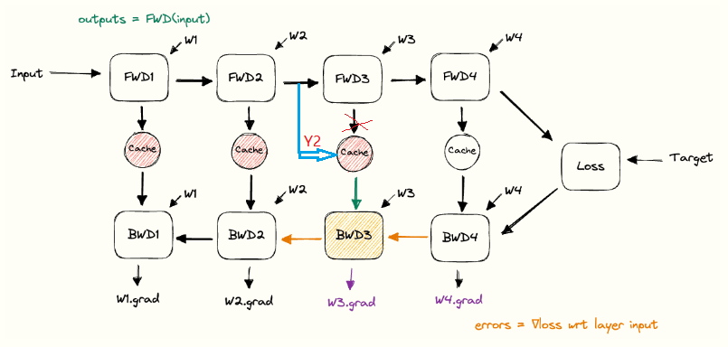
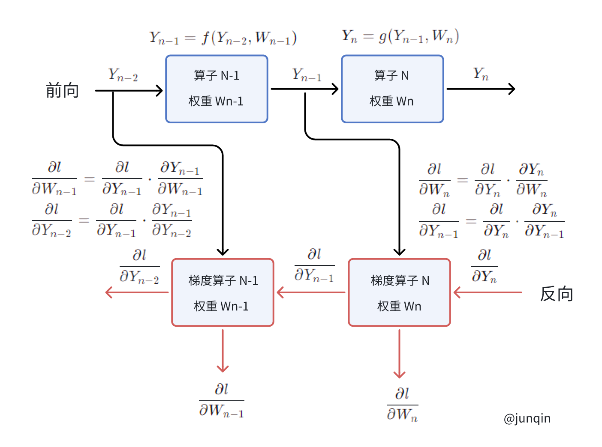

# 前向和反向传播

在图中，展示了用于实现反向传播的功能构建模块。每个模块从左侧接收输入，并将其转换为右侧的输出。Cache 模块的目的是将其输入数据存储起来，直到下次被检索。

(不过我觉得这张图中间的 Backward 有误，第一个输入应该是 Outout of Layer N-1)


在运行反向传播计算梯度之后，我们使用优化器来更新权重。


简要概述各个并行化训练技术。

下面的鹅卵石图 (pebble graph) 展示了在前向传播期间如何构建缓存的激活值，并在对应的反向传播执行后丢弃。我们可以看到，在给定层的反向传播执行后，每个层权重的梯度是可用的（紫色）。


不过，我觉得上面的图其实不准确，cache 的应该是前一个算子输出的激活值。因为当前算子的梯度计算应该只需要**当前算子的权重**和**当前算子的输入**（也就是前一个算子的激活值），示例如下：




## 矩阵乘加前向和反向

### 前向传播

$$ Y = X \times W + b $$

每个变量的维度信息：
- $ X \in \mathbb{R}^{n \times d}$
- $ W \in \mathbb{R}^{d \times m}$
- $ b \in \mathbb{R}^{m \times 1}$
- $ Y \in \mathbb{R}^{n \times m}$

变量说明：
- $X$ 所有数据构成的矩阵，$n$ 为样本总数，$d$ 为每一个样本的维度；
- $W$ 所有权重的参数矩阵，$d$ 为每一个样本的维度，$m$ 为输出节点的总数；
- $b$ 为偏置矩阵
- $Y$ 为输出

### 反向传播

用反向传播算法更新参数时，涉及到的参数梯度的求解，需要求解的变量有 $\nabla W$, $\nabla X$, $\nabla b$。

假设损失函数为 $L$, 是一个标量。

#### $\nabla X$ 的分析

导数的链式法则，$\nabla X$ 可以表示成下面的形式：

$$ \nabla X =  \frac{ \partial L} { \partial X} = \frac{ \partial L} { \partial Y} \frac{ \partial Y} { \partial X} $$

维度分析：
- $\nabla X$ 的维度要和 $X$ 保持一致：$ \nabla X \in \mathbb{R}^{n \times d}$
- $\frac{ \partial L} { \partial Y}$ 的维度要和 $Y$ 保持一致，并且标量对矩阵求偏导，矩阵的维度不变：$\frac{ \partial L} { \partial Y} \in \mathbb{R}^{n \times m} $

矩阵相乘的分析，我们可以得到 $\frac{ \partial Y} { \partial X}$ 的维度应该是 $m \times d $，由于是和 $W$ 相关的，$W$ 的维度是 $ d \times m $，因此可以得出结论， $\frac{ \partial Y} { \partial X}$ 是权重矩阵 $W$ 的转置：

$$ \nabla X =  \frac{ \partial L} { \partial X} = \frac{ \partial L} { \partial Y} \frac{ \partial Y} { \partial X} = \frac{ \partial L} { \partial Y} W^T $$

#### $\nabla W$ 的分析

$\nabla W$ 可以表示成下面的形式：

$$ \nabla W =  \frac{ \partial L} { \partial W} = \frac{ \partial L} { \partial Y} \frac{ \partial Y} { \partial W} \in \mathbb{R}^{d \times m} $$

维度分析：
- $\nabla W$ 的维度要和 $W$ 保持一致：$ \nabla W \in \mathbb{R}^{d \times m}$
- $\frac{ \partial L} { \partial Y} \in \mathbb{R}^{n \times m} $

同样可以分析出，$ \frac{ \partial Y} { \partial W} \in \mathbb{R}^{d \times n}$，$ \frac{ \partial Y} { \partial W}$ 为样本矩阵 $X$ 的转置：

$$ \nabla W =  \frac{ \partial L} { \partial W} = \frac{ \partial L} { \partial Y} \frac{ \partial Y} { \partial W} = X^T \frac{ \partial L} { \partial Y}  $$

#### $\nabla b$ 的分析

$\nabla b$ 可以表示成下面的形式：

$$ \nabla b =  \frac{ \partial L} { \partial b} = \frac{ \partial L} { \partial Y} \frac{ \partial Y} { \partial b} \in \mathbb{R}^{m \times 1} $$

维度分析：
- $\frac{ \partial L} { \partial Y} \in \mathbb{R}^{n \times m} $
  
则 $\frac{ \partial Y} { \partial b} \in \mathbb{R}^{n \times 1} $，则

$$ \nabla b =  \frac{ \partial L} { \partial b} = \frac{ \partial L} { \partial Y} \frac{ \partial Y} { \partial b} = ( \frac{ \partial L} { \partial Y} )^T \frac{ \partial Y} { \partial b} $$

其中 $\frac{ \partial Y} { \partial b}$ 应该为 $[1, 1, \cdots, 1]_{n \times 1}$


## Pytorch MLP 示例

```
import torch
import torch.autograd as autograd

x = torch.randn((5, 3), requires_grad=False)
y = torch.randn(5, requires_grad=False)

w1 = torch.randn((3, 4), requires_grad=True)
b1 = torch.randn(4, requires_grad=True)

w2 = torch.randn((4, 1), requires_grad=True)
b2 = torch.randn(1, requires_grad=True)

y1 = x @ w1 + b1
y2 = y1 @ w2 + b2

l = ((y - y2.squeeze()) ** 2).sum()

l.backward()

```

```
y2_grad = autograd.grad(l, y2, retain_graph=True)

# y2 的梯度 d(y2) = 2(y2 - y)
>>> y2_grad
(tensor([[ 1.8210],
        [ 6.5158],
        [ 2.8230],
        [-2.5306],
        [ 6.3659]]),)
>>> l
tensor(25.1672, grad_fn=<SumBackward0>)
>>> y
tensor([ 0.1177, -0.4787,  1.1570, -0.7038, -0.3809])
>>> y2
tensor([[ 1.0282],
        [ 2.7791],
        [ 2.5685],
        [-1.9691],
        [ 2.8020]], grad_fn=<AddBackward0>)
>>> 2 * (y2.squeeze() - y)
tensor([ 1.8210,  6.5158,  2.8230, -2.5306,  6.3659], grad_fn=<MulBackward0>)

# y1 的梯度 d(y1) = y2_grad @ w.t()
>>> y2_grad[0] @ w2.t()
tensor([[ 0.1996,  3.5949, -2.6491,  0.7318],
        [ 0.7140, 12.8628, -9.4787,  2.6183],
        [ 0.3094,  5.5730, -4.1067,  1.1344],
        [-0.2773, -4.9956,  3.6813, -1.0169],
        [ 0.6976, 12.5669, -9.2606,  2.5581]], grad_fn=<MmBackward0>)

```

```
y1_grad = autograd.grad(l, y1, retain_graph=True)

>>> y1_grad
(tensor([[ 0.1996,  3.5949, -2.6491,  0.7318],
        [ 0.7140, 12.8628, -9.4787,  2.6183],
        [ 0.3094,  5.5730, -4.1067,  1.1344],
        [-0.2773, -4.9956,  3.6813, -1.0169],
        [ 0.6976, 12.5669, -9.2606,  2.5581]]),)
>>> y1_grad[0].shape
torch.Size([5, 4])

# 计算 w1 的梯度
>>> x.t() @ y1_grad[0]
tensor([[  2.6609,  47.9346, -35.3232,   9.7575],
        [  0.1913,   3.4460,  -2.5394,   0.7015],
        [  0.2197,   3.9581,  -2.9167,   0.8057]])
>>> w1.grad
tensor([[  2.6609,  47.9346, -35.3232,   9.7575],
        [  0.1913,   3.4460,  -2.5394,   0.7015],
        [  0.2197,   3.9581,  -2.9167,   0.8057]])

# 计算 b1 的梯度
>>> y_grad[0].t()
tensor([[ 0.1996,  0.7140,  0.3094, -0.2773,  0.6976],
        [ 3.5949, 12.8628,  5.5730, -4.9956, 12.5669],
        [-2.6491, -9.4787, -4.1067,  3.6813, -9.2606],
        [ 0.7318,  2.6183,  1.1344, -1.0169,  2.5581]])
>>> y_grad[0].t().sum(axis=1)
tensor([  1.6432,  29.6020, -21.8138,   6.0257])

# sum([0.1996,  0.7140,  0.3094, -0.2773,  0.6976]) = 1.6432
>>> b1.grad 
tensor([  1.6432,  29.6020, -21.8138,   6.0257])

```

## 一个更泛的图




## 参考文献
- https://siboehm.com/articles/22/data-parallel-training
- https://www.cnblogs.com/objectDetect/p/5849605.html