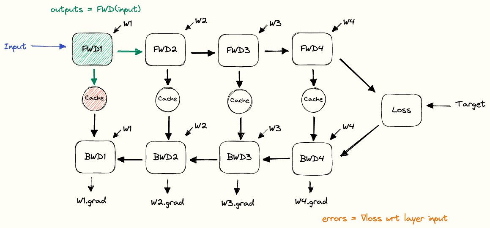

# 前向和反向传播

在图中，展示了用于实现反向传播的功能构建模块。每个模块从左侧接收输入，并将其转换为右侧的输出。Cache 模块的目的是将其输入数据存储起来，直到下次被检索。

在运行反向传播计算梯度之后，我们使用优化器来更新权重。

简要概述各个并行化训练技术。

下面的鹅卵石图 (pebble graph) 展示了在前向传播期间如何构建缓存的激活值，并在对应的反向传播执行后丢弃。我们可以看到，在给定层的反向传播执行后，每个层权重的梯度是可用的（紫色）。

## 矩阵乘加前向和反向

### 前向传播

$$ Y = X \times W + b $$

每个变量的维度信息：
- $ X \in \mathbb{R}^{n \times d}$
- $ W \in \mathbb{R}^{d \times m}$
- $ b \in \mathbb{R}^{m \times 1}$
- $ Y \in \mathbb{R}^{n \times m}$

变量说明：
- $X$ 所有数据构成的矩阵，$n$ 为样本总数，$d$ 为每一个样本的维度；
- $W$ 所有权重的参数矩阵，$d$ 为每一个样本的维度，$m$ 为输出节点的总数；
- $b$ 为偏置矩阵
- $Y$ 为输出

### 反向传播

用反向传播算法更新参数时，涉及到的参数梯度的求解，需要求解的变量有 $\nabla W$, $\nabla X$, $\nabla b$。

假设损失函数为 $L$, 是一个标量。

#### $\nabla X$ 的分析

导数的链式法则，$\nabla X$ 可以表示成下面的形式：

$$ \nabla X =  \frac{ \partial L} { \partial X} = \frac{ \partial L} { \partial Y} \frac{ \partial Y} { \partial X} $$

维度分析：
- $\nabla X$ 的维度要和 $X$ 保持一致：$ \nabla X \in \mathbb{R}^{n \times d}$
- $\frac{ \partial L} { \partial Y}$ 的维度要和 $Y$ 保持一致，并且标量对矩阵求偏导，矩阵的维度不变：$\frac{ \partial L} { \partial Y} \in \mathbb{R}^{n \times m} $

矩阵相乘的分析，我们可以得到 $\frac{ \partial Y} { \partial X}$ 的维度应该是 $m \times d $，由于是和 $W$ 相关的，$W$ 的维度是 $ d \times m $，因此可以得出结论， $\frac{ \partial Y} { \partial X}$ 是权重矩阵 $W$ 的转置：

$$ \nabla X =  \frac{ \partial L} { \partial X} = \frac{ \partial L} { \partial Y} \frac{ \partial Y} { \partial X} = \frac{ \partial L} { \partial Y} W^T $$

#### $\nabla W$ 的分析

$\nabla W$ 可以表示成下面的形式：

$$ \nabla W =  \frac{ \partial L} { \partial W} = \frac{ \partial L} { \partial Y} \frac{ \partial Y} { \partial W} \in \mathbb{R}^{d \times m} $$

维度分析：
- $\nabla W$ 的维度要和 $W$ 保持一致：$ \nabla W \in \mathbb{R}^{d \times m}$
- $\frac{ \partial L} { \partial Y} \in \mathbb{R}^{n \times m} $

同样可以分析出，$ \frac{ \partial Y} { \partial W} \in \mathbb{R}^{d \times n}$，$ \frac{ \partial Y} { \partial W}$ 为样本矩阵 $X$ 的转置：

$$ \nabla W =  \frac{ \partial L} { \partial W} = \frac{ \partial L} { \partial Y} \frac{ \partial Y} { \partial W} = X^T \frac{ \partial L} { \partial Y}  $$

#### $\nabla b$ 的分析

$\nabla b$ 可以表示成下面的形式：

$$ \nabla b =  \frac{ \partial L} { \partial b} = \frac{ \partial L} { \partial Y} \frac{ \partial Y} { \partial b} \in \mathbb{R}^{m \times 1} $$

维度分析：
- $\frac{ \partial L} { \partial Y} \in \mathbb{R}^{n \times m} $
  
则 $\frac{ \partial Y} { \partial b} \in \mathbb{R}^{n \times 1} $，则

$$ \nabla b =  \frac{ \partial L} { \partial b} = \frac{ \partial L} { \partial Y} \frac{ \partial Y} { \partial b} = ( \frac{ \partial L} { \partial Y} )^T \frac{ \partial Y} { \partial b} $$

## 参考文献
- https://siboehm.com/articles/22/data-parallel-training
- https://www.cnblogs.com/objectDetect/p/5849605.html