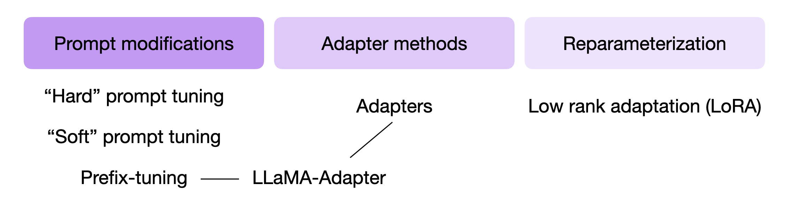
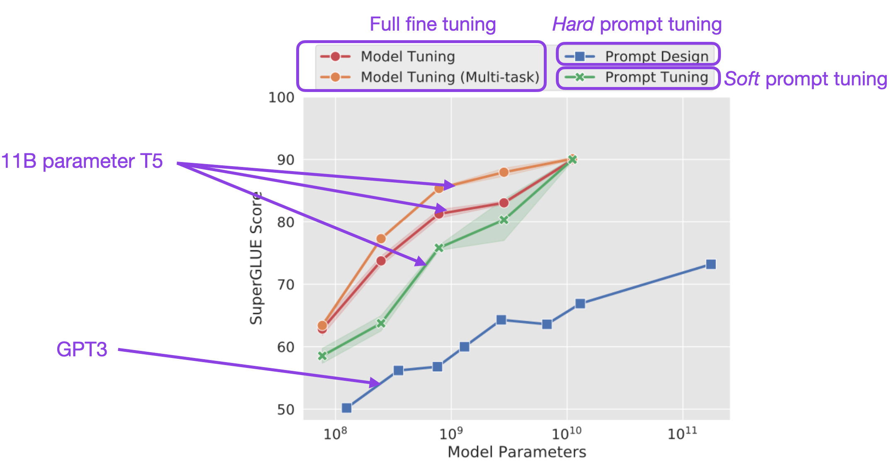
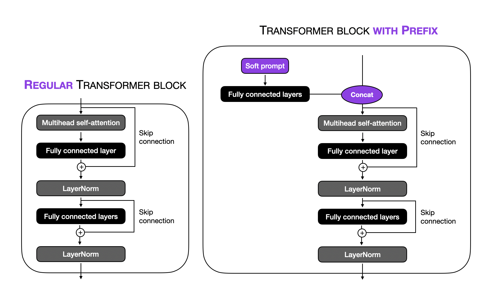
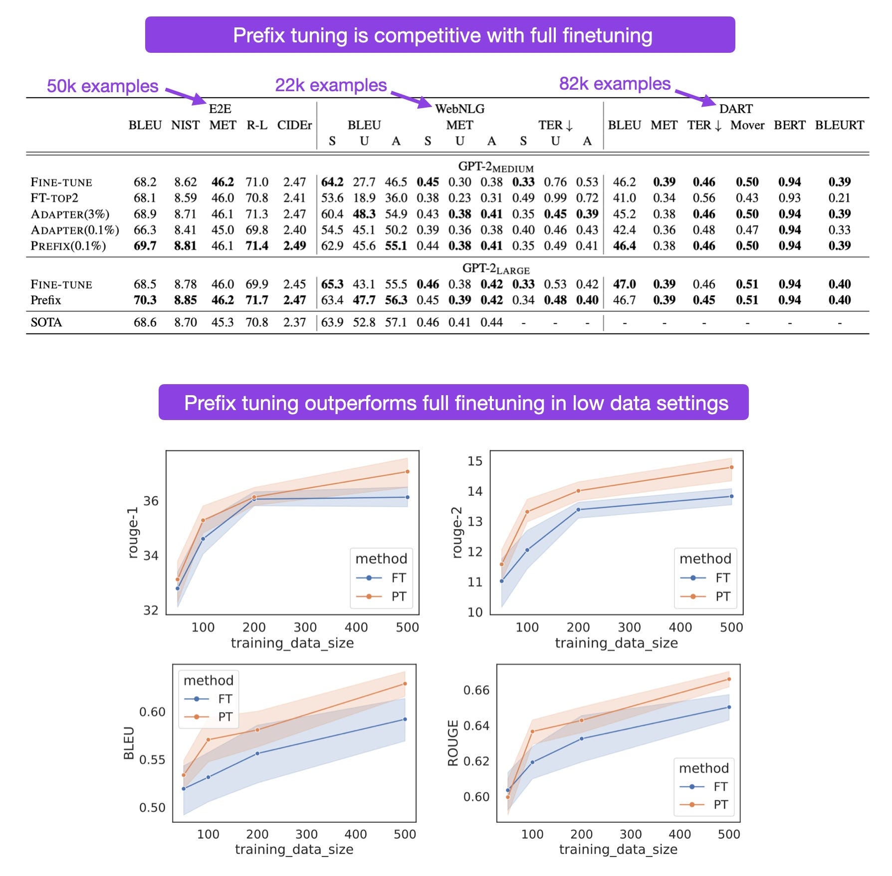

# 理解参数高效的 LLM 微调：Prompt Tuning 和 Prefix Tuning

## parameter-efficient finetuning 的种类



## Prompt Tuning

原始的 prompt tuning 概念是指通过改变输入提示词来实现更好的模型输出结果的技术。
例如，假设我们希望将一个英文句子翻译成德文。我们可以以不同的方式向模型提问，如下所示。

```
1) "Translate the English sentence '{english_sentence}' into German: {german_translation}"
2) "English: '{english_sentence}' | German: {german_translation}"
3) "From English to German: '{english_sentence}' -> {german_translation}"
```

上述所示的概念被称为 hard prompt tuning，因为我们直接改变了不可微分的离散输入 token。

与 hard prompt tuning 相反，[soft prompt tuning](https://arxiv.org/abs/2104.08691)（Lester等人，2021）将输入 token 的 embeddings 与可通过反向传播进行优化的可训练张量连接起来，以提高目标任务的模型性能。

伪代码如下所示，用于说明 soft prompt 的概念。

```PYTHON
soft_prompt = torch.nn.Parameter( # Make tensor trainable
    torch.rand(num_tokens, embed_dim)) # Initialize soft prompt tensor

def input_with_soft_prompt(x, soft_prompt) :
    x = concatenate([soft_prompt, x], # Prepend soft prompt to input
                    dim=seq_len)
    return x

# train soft prompt tensor via gradient descent
train(model(input_with_soft_prompt(x)))

# use model with soft prompts
model(input_with_soft_prompt(x))
```

Soft prompts 与离散文本提示(discrete text prompts)的区别在于，Soft prompts 是通过反向传播获得的，并且可以根据来自标记数据集的损失反馈进行调整。

相比完全微调，Soft prompts tuning 在参数效率上更高，尽管它的模型性能可能稍差，如下图所示。



上图来自论文的注释图，https://arxiv.org/abs/2104.08691

另一方面，如上图所示，如果模型具有 110 亿参数，Soft prompts tuning 将与完全微调的性能相匹配（作为参考，最小的 LLaMA 模型有 70 亿参数，最大的 LLaMA 模型有 650 亿参数）。

- 存储效率

如果我们为特定任务微调预训练模型，我们必须为每个任务保留一个单独的模型副本。然而，使用 prompts tuning，每个任务只需要存储一个小的任务特定 Soft prompts。例如，对于 T5 "XXL"模型，每个微调模型副本需要 110 亿个参数。相比之下，假设提示长度为 5 个 token，Embedding 维度为4 096，Soft prompts 仅需要 20480 个参数。这相当于减少了五个数量级。

## Prefix Tuning

另外一个微调的变体是 [prefix tuning](https://arxiv.org/abs/2101.00190)（Li和Liang，2021）。prefix tuning 的思想是在每个 Transformer 块中添加可训练的张量，而不仅仅是 soft prompts tuning 中使用的 embedding 输入。此外，我们通过全连接层（一个具有两层和非线性激活函数的多层感知机）获得 soft prompt embedding。下图说明了常规 Transformer 块和添加前缀的 Transformer 块之间的区别。



请注意，在上图中，“全连接层”指的是一个小型 multilayer perceptron（两个全连接层之间有一个非线性激活函数）。这些全连接层将 soft prompt 嵌入到与 Transformer 块输入具有相同维度的特征空间中，以确保连接的兼容性。

使用（Python）伪代码，我们可以如下所示地说明常规 Transformer 块和添加前缀的 Transformer 块之间的区别。

```PY
def transformer_block_with_prefix(x, soft_prompt):
    soft_prompt = FullyConnectedLayers(soft_prompt) # Prefix
    x = concatenate([soft_prompt, x], # Prefix
                    dim=seq_len)      # Prefix
    residual = x
    x = self_attention(x)
    x = LayerNorm(x + residual)
    residual = x
    x = FullyConnectedLayers(x)
    x = LayerNorm(x + residual)
    return x
```

根据原始的 prefix tuning 论文，prefix tuning 在只训练 0.1％ 的参数的情况下实现了与微调所有层相当的建模性能。这些实验是基于 GPT-2 模型进行的。此外，在许多情况下，前缀调整甚至优于对所有层进行微调，这可能是因为涉及的参数更少，有助于减少对较小目标数据集的过拟合。



最后，在推理过程中，在学习了 soft prompts 之后，我们必须将其作为前缀提供。这使得模型能够将其结果调整到特定任务。此外，我们可以有多个 soft prompts，每个对应于不同的任务，并在推理过程中提供适当的前缀，以实现特定任务的最佳结果。


## Prefix VS Prompt Tuning

Soft prompt tuning 和 Prompt Tuning 在性能方面如何比较？遗憾的是，由于这两种方法是独立开发并在同一时间发布的，各自的论文中没有直接进行比较。此外，在搜索后续的 parameter-efficient LLM 文献时，我没有找到同时包含这两种方法的基准。

Prompt Tuning 通过向输入序列插入任务特定的前缀来修改模型的更多层，因此需要微调更多的参数。另一方面，Soft prompt tuning 只涉及微调输入 prompt embedding，因此更新的参数较少。这使得 Soft prompt tuning 可能比 Prompt Tuning 更具参数效率，但也可能限制其适应目标任务的能力。

就性能而言，可以合理地期望 Prompt Tuning 可能表现更好，因为它有更多的参数来调整模型以适应新任务。然而，这可能以增加计算资源和过拟合的风险为代价。另一方面，Soft prompt tuning 可能在计算效率上更高，但微调参数的数量较少可能会限制建模性能。


## Hugging face 

Prefix tuning for conditional generation: https://huggingface.co/docs/peft/main/en/task_guides/seq2seq-prefix-tuning

```
peft_config = PrefixTuningConfig(task_type=TaskType.SEQ_2_SEQ_LM, inference_mode=False, num_virtual_tokens=20)

model = AutoModelForSeq2SeqLM.from_pretrained(model_name_or_path)
model = get_peft_model(model, peft_config)
model.print_trainable_parameters()
"trainable params: 983040 || all params: 738651136 || trainable%: 0.13308583065659835"
```

Soft prompts: https://huggingface.co/docs/peft/conceptual_guides/prompting

https://huggingface.co/docs/peft/main/en/task_guides/clm-prompt-tuning

# 原文
- https://magazine.sebastianraschka.com/p/understanding-parameter-efficient
- https://magazine.sebastianraschka.com/p/finetuning-large-language-models
- https://tinnakorn.cs.rmu.ac.th/Courses/Tutorial/ML.Generative.AI.on.AWS/OEBPS/ch06.html