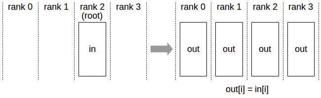

# Collective operation

这里介绍 集合通信 Collective Operations。

[mpi4py 代码参考](./mpi4py.md)

## Overview

Overview of collective operations. 
- (a) Broadcast. 
- (b) All-Gather.
- (c) Scatter.
- (d) All-to-All.
- (e) Reduce.
- (f) All-Reduce.
- (g) Reduce-Scatter.

## NCCL Collective Operations

### ALLReduce

AllReduce 操作在不同设备之间对数据进行归约操作（例如求和、最小值、最大值），并将结果存储在每个排名的接收缓冲区中。

在 k 个 Rank 之间的求和 AllReduce 操作中，每个 Rank 将提供一个包含 N 个值的数组 $in$，并在数组 $out$ 中接收相同的结果，其中 $out[i] = in0[i] + in1[i] + ... + in(k-1)[i]$。

### Broadcast

Broadcast 操作将一个包含 N 个元素的缓冲区从 root Rank 复制到所有 Rank。

注意：root 参数是 Rank 之一，而不是设备编号，因此受到不同的 Rank 到设备映射的影响。

### Reduce

Reduce 操作执行与 AllReduce 相同的操作，但只将结果存储在指定 root Rank 的接收缓冲区中。

注意：root 参数是 Rank 之一（而不是设备编号），因此受到不同的 Rank 到设备映射的影响。

注意：Reduce 操作后跟 Broadcast 操作等效于 AllReduce 操作。

### AllGather

AllGather 操作将来自 k 个 Rank 的 N 个值收集到一个大小为 k*N 的输出缓冲区，并将该结果分发给所有 Rank。

输出按 Rank 索引排序。因此，AllGather 操作受到不同的 Rank 到设备映射的影响。

注意：AllReduce 操作等效于执行 ReduceScatter 操作，然后再执行 AllGather 操作。

### ReduceScatter

ReduceScatter 操作执行与 Reduce 相同的操作，但结果以相等大小的块在 Rank 之间分散，每个 Rank 根据其 Rank 索引获得一块数据。

由于 Rank 确定数据布局，因此 ReduceScatter 操作受到不同的 Rank 到设备映射的影响。

### Ring AllReduce

各个设备首尾相连，形成单向的环。每个环上处理一部分数据 block，NCCL 在 luanch kernel 时，会确定 block 的数量，一个 block 对应一个环。

一个循环中 AllReduce 的实现：

- 一共有 k 各设备，将每个设备上的数据划分成等大的 k 个 chunk

- step 0：当前设备的 rank 为 ringIx 则将 （ringIx + k -1 ) mod N 号 chunk 传给下一个设备

- 进行 K - 2 次循环，j 从2 遍历道 N-1； 每次循环将 接收该设备的 （ringIx + k - j ) mod N 作为 chunk_id ，进行reduce之后，传给下一个设备

- step k-1:每个设备选择自己的 rank 作为 chunk_id，调用 directRecvReduceCopySend 接收 chunk，和 sendbuff 中对应的数据 reduce，此时的结果已经是该 chunk 所有 rank sendbuff 中的数据 reduce 之后的结果，将这个结果写入到 recvbuff ，并发送给下一个设备，因为下一步操作不需要再进行 reduce，所以可以使用 directSend。

- k-2 step 接收对应位置数据并发送给下一个设备

- 最后一步只需要接收数据，不需要发送

## 参考文献
- https://jcst.ict.ac.cn/en/supplement/f82ea167-0ca9-46dc-9109-28b6ca0cf983
- https://docs.nvidia.com/deeplearning/nccl/user-guide/docs/usage/collectives.html
- https://en.wikipedia.org/wiki/Collective_operation
- https://blog.csdn.net/greatcoder/article/details/125973196
- [集体通信（Collective Communication）算法入门：从 AllGather 到 AllReduce](https://bohrium.dp.tech/notebooks/1447)