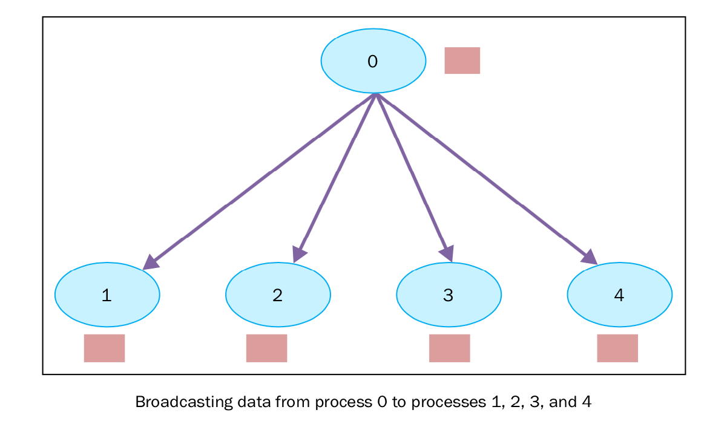
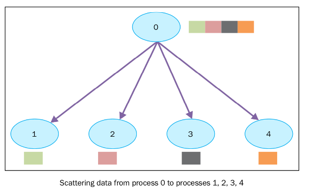
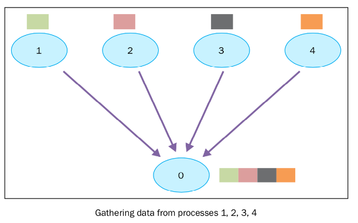
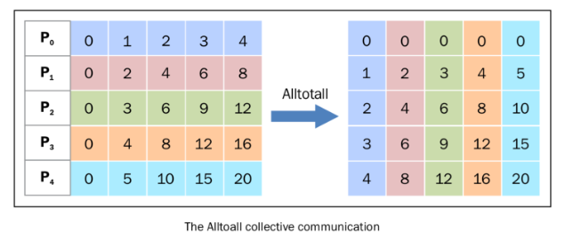

# mpi4py

## broadcast 通讯

有一个 root 进程， rank 等于 0，保存自己的数据 variable_to_share ，以及其他定义在通讯组中的进程。




```broadcast.py
from mpi4py import MPI
comm = MPI.COMM_WORLD
rank = comm.Get_rank()
if rank == 0:
    variable_to_share = 100
else:
    variable_to_share = None
variable_to_share = comm.bcast(variable_to_share, root=0)
print("process = %d" %rank + " variable shared  = %d " %variable_to_share)
```

```
# mpiexec  --allow-run-as-root -n 5 python broadcast.py
process = 0 variable shared  = 100
process = 3 variable shared  = 100
process = 4 variable shared  = 100
process = 1 variable shared  = 100
process = 2 variable shared  = 100
```

```
from mpi4py import MPI

comm = MPI.COMM_WORLD
rank = comm.Get_rank()

if rank == 0:
    data = {'key1' : [7, 2.72, 2+3j],
            'key2' : ( 'abc', 'xyz')}
    print('before broadcasting: process %d has %s' % (rank, data))
else:
    data = None
    print('before broadcasting: process %d has %s' % (rank, data))

data = comm.bcast(data, root=0)
print('after broadcasting: process %d has %s' % (rank, data))
```

```
# mpiexec  --allow-run-as-root -n 5 python broadcast01.py
before broadcasting: process 3 has None
before broadcasting: process 1 has None
before broadcasting: process 4 has None
before broadcasting: process 2 has None
before broadcasting: process 0 has {'key1': [7, 2.72, (2+3j)], 'key2': ('abc', 'xyz')}
after broadcasting: process 0 has {'key1': [7, 2.72, (2+3j)], 'key2': ('abc', 'xyz')}
after broadcasting: process 4 has {'key1': [7, 2.72, (2+3j)], 'key2': ('abc', 'xyz')}
after broadcasting: process 1 has {'key1': [7, 2.72, (2+3j)], 'key2': ('abc', 'xyz')}
after broadcasting: process 2 has {'key1': [7, 2.72, (2+3j)], 'key2': ('abc', 'xyz')}
after broadcasting: process 3 has {'key1': [7, 2.72, (2+3j)], 'key2': ('abc', 'xyz')}
```

```
# Bcast.py

import numpy as np
from mpi4py import MPI

comm = MPI.COMM_WORLD
rank = comm.Get_rank()

if rank == 0:
    data = np.arange(10, dtype='i')
    print('before broadcasting: process %d has %s' % (rank, data))
else:
    data = np.zeros(10, dtype='i')
    print('before broadcasting: process %d has %s' % (rank, data))

comm.Bcast(data, root=0)

print('after broadcasting: process %d has %s' % (rank, data))
```

```
# mpiexec  --allow-run-as-root -n 5 python broadcast02.py
before broadcasting: process 0 has [0 1 2 3 4 5 6 7 8 9]
before broadcasting: process 2 has [0 0 0 0 0 0 0 0 0 0]
before broadcasting: process 1 has [0 0 0 0 0 0 0 0 0 0]
before broadcasting: process 3 has [0 0 0 0 0 0 0 0 0 0]
before broadcasting: process 4 has [0 0 0 0 0 0 0 0 0 0]
after broadcasting: process 0 has [0 1 2 3 4 5 6 7 8 9]
after broadcasting: process 1 has [0 1 2 3 4 5 6 7 8 9]
after broadcasting: process 2 has [0 1 2 3 4 5 6 7 8 9]
after broadcasting: process 3 has [0 1 2 3 4 5 6 7 8 9]
after broadcasting: process 4 has [0 1 2 3 4 5 6 7 8 9]
```

## scatter 通讯



```
from mpi4py import MPI
comm = MPI.COMM_WORLD
rank = comm.Get_rank()
if rank == 0:
    array_to_share = [1, 2, 3, 4 ,5 ,6 ,7, 8 ,9 ,10]
else:
    array_to_share = None
recvbuf = comm.scatter(array_to_share, root=0)
print("process = %d" %rank + " recvbuf = %d " %recvbuf)
```

```
# mpiexec  --allow-run-as-root -n 10 python scatter.py
process = 5 recvbuf = 6
process = 2 recvbuf = 3
process = 0 recvbuf = 1
process = 8 recvbuf = 9
process = 4 recvbuf = 5
process = 6 recvbuf = 7
process = 3 recvbuf = 4
process = 9 recvbuf = 10
process = 1 recvbuf = 2
process = 7 recvbuf = 8
```

comm.scatter 有一个限制，发送数据的列表中元素的个数必须和接收的进程数相等。举个例子，如果列表中的个数比进程数多，就会看到如下错误：

```
Traceback (most recent call last):
  File "/data/mpi/scatter.py", line 8, in <module>
    recvbuf = comm.scatter(array_to_share, root=0)
  File "mpi4py/MPI/Comm.pyx", line 1587, in mpi4py.MPI.Comm.scatter
  File "mpi4py/MPI/msgpickle.pxi", line 823, in mpi4py.MPI.PyMPI_scatter
  File "mpi4py/MPI/msgpickle.pxi", line 161, in mpi4py.MPI.pickle_dumpv
ValueError: expecting 5 items, got 10
```

numpy

```
import numpy as np
from mpi4py import MPI


comm = MPI.COMM_WORLD
size = comm.Get_size()
rank = comm.Get_rank()

sendbuf = None
if rank == 0:
    sendbuf = np.empty([size, 10], dtype='i')
    sendbuf.T[:, :] = range(size)
print('before scattering: process %d has %s' % (rank, sendbuf))

recvbuf = np.empty(10, dtype='i')
comm.Scatter(sendbuf, recvbuf, root=0)
print('after scattering: process %d has %s' % (rank, recvbuf))
```

```
# mpiexec  --allow-run-as-root -n 5 python scatter_np.py
before scattering: process 3 has None
before scattering: process 1 has None
before scattering: process 4 has None
before scattering: process 2 has None
before scattering: process 0 has [[0 0 0 0 0 0 0 0 0 0]
 [1 1 1 1 1 1 1 1 1 1]
 [2 2 2 2 2 2 2 2 2 2]
 [3 3 3 3 3 3 3 3 3 3]
 [4 4 4 4 4 4 4 4 4 4]]
after scattering: process 0 has [0 0 0 0 0 0 0 0 0 0]
after scattering: process 4 has [4 4 4 4 4 4 4 4 4 4]
after scattering: process 3 has [3 3 3 3 3 3 3 3 3 3]
after scattering: process 1 has [1 1 1 1 1 1 1 1 1 1]
after scattering: process 2 has [2 2 2 2 2 2 2 2 2 2]

```

## Gather 通讯



```
from mpi4py import MPI
comm = MPI.COMM_WORLD
size = comm.Get_size()
rank = comm.Get_rank()
data = (rank+1)**2
data = comm.gather(data, root=0)
if rank == 0:
    print ("rank 0 receiving data to other process: {}".format(data))
else:
    print("non rank 0 data: {}".format(data))
```

```
# mpiexec  --allow-run-as-root -n 5 python gather.py
non rank 0 data: None
non rank 0 data: None
non rank 0 data: None
non rank 0 data: None
rank 0 receiving data to other process: [1, 4, 9, 16, 25]
```

numpy 
```
# Gather.py

import numpy as np
from mpi4py import MPI


comm = MPI.COMM_WORLD
size = comm.Get_size()
rank = comm.Get_rank()

sendbuf = np.zeros(10, dtype='i') + rank
print('before gathering: process %d has %s' % (rank, sendbuf))

recvbuf = None
if rank == 0:
    recvbuf = np.empty([size, 10], dtype='i')

comm.Gather(sendbuf, recvbuf, root=0)
print('after gathering: process %d has %s' % (rank, recvbuf))
```

```
before gathering: process 2 has [2 2 2 2 2 2 2 2 2 2]
before gathering: process 1 has [1 1 1 1 1 1 1 1 1 1]
after gathering: process 1 has None
before gathering: process 4 has [4 4 4 4 4 4 4 4 4 4]
after gathering: process 4 has None
before gathering: process 3 has [3 3 3 3 3 3 3 3 3 3]
after gathering: process 3 has None
before gathering: process 0 has [0 0 0 0 0 0 0 0 0 0]
after gathering: process 2 has None
after gathering: process 0 has [[0 0 0 0 0 0 0 0 0 0]
 [1 1 1 1 1 1 1 1 1 1]
 [2 2 2 2 2 2 2 2 2 2]
 [3 3 3 3 3 3 3 3 3 3]
 [4 4 4 4 4 4 4 4 4 4]]
```

## Alltoall 通讯

Alltoall 集体通讯结合了 scatter 和 gather 的功能。在 mpi4py 中，有以下三种类型的 Alltoall 集体通讯。

- comm.Alltoall(sendbuf, recvbuf) :
- comm.Alltoallv(sendbuf, recvbuf) :
- comm.Alltoallw(sendbuf, recvbuf) :

Alltoall 只能散发长度相同的数据量，而 Alltoallv 则可散发不同长度的数据量，Alltoallw 是对 Alltoallv 的进一步扩展，不仅可以发送不同长度的数据，还可以发送不同类型的数据。

在下面的例子中，我们将看到 mpi4py 是如何实现 comm.Alltoall 的。我们定义了进程的通讯者组，进程可以在组中接收或发送数据，格式为数字数据的数组。

```
from mpi4py import MPI
import numpy

comm = MPI.COMM_WORLD
size = comm.Get_size()
rank = comm.Get_rank()
a_size = 1

senddata = (rank+1)*numpy.arange(size,dtype=int)
recvdata = numpy.empty(size*a_size,dtype=int)

print("before Rank {} senddata: {}, recvdata: {}".format(rank, senddata, recvdata))

comm.Alltoall(senddata, recvdata)

print("after Rank {} senddata: {}, recvdata: {}".format(rank, senddata, recvdata))

```

```
# mpiexec  --allow-run-as-root -n 5 python alltoall_01.py
before Rank 1 senddata: [0 2 4 6 8], recvdata: [0 1 2 3 4]
before Rank 2 senddata: [ 0  3  6  9 12], recvdata: [0 1 2 3 4]
before Rank 3 senddata: [ 0  4  8 12 16], recvdata: [0 1 2 3 4]
before Rank 4 senddata: [ 0  5 10 15 20], recvdata: [0 1 2 3 4]
before Rank 0 senddata: [0 1 2 3 4], recvdata: [0 1 2 3 4]

after Rank 0 senddata: [0 1 2 3 4], recvdata: [0 0 0 0 0]
after Rank 2 senddata: [ 0  3  6  9 12], recvdata: [ 2  4  6  8 10]
after Rank 3 senddata: [ 0  4  8 12 16], recvdata: [ 3  6  9 12 15]
after Rank 4 senddata: [ 0  5 10 15 20], recvdata: [ 4  8 12 16 20]
after Rank 1 senddata: [0 2 4 6 8], recvdata: [1 2 3 4 5]
```

comm.alltoall 方法将 task j 的中 sendbuf 的第 i 个对象拷贝到 task i 中 recvbuf 的第 j 个对象（接收者收到的对象和发送者一一对应，发送者发送的对象和接收者一一对应）。

下图可以表示这个发送过程。



从图中我们可以观察到：

- P0 包含数据 [0 1 2 3 4]，它将 0 赋值给自己， 1 传给进程 P1 ， 2 传给进程 P2 ， 3 传给进程 P3 ， 4 传给进程 P4 。
- P1 包含数据 [0 2 4 6 8]，它将 0 赋值给 P0， 1 传给自己 ， 2 传给进程 P2 ， 3 传给进程 P3 ， 4 传给进程 P4 。
- 以此类推……

等于进行一个全局转置。

## 参考文献
- https://python-parallel-programmning-cookbook.readthedocs.io/zh-cn/latest/chapter3/11_Using_the_mpipy_Python_module.html
- https://github.com/laixintao/python-parallel-programming-cookbook-cn
- https://www.jianshu.com/p/f497f3a5855f
- https://zhuanlan.zhihu.com/p/25332041
- https://muyuuuu.github.io/2021/02/23/MPI-basics/
- https://www.jianshu.com/p/d2e0b977328d