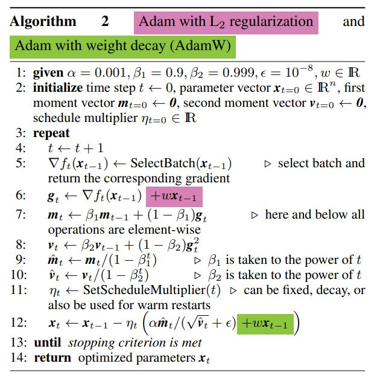

# 优化器

## AdamW

[Fixing Weight Decay Regularization in Adam](./226_fixing_weight_decay_regulariza.pdf)



AdamW 是在 Adam+L2 正则化的基础上进行改进的算法。

使用 Adam 优化带 L2 正则的损失并不有效。如果引入 L2 正则项，在计算梯度的时候会加上对正则项求梯度的结果。

那么如果本身比较大的一些权重对应的梯度也会比较大，由于 Adam 计算步骤中减去项会有除以梯度平方的累积，使得减去项偏小。按常理说，越大的权重应该惩罚越大，但是在 Adam 并不是这样。

而权重衰减对所有的权重都是采用相同的系数进行更新，越大的权重显然惩罚越大。

在常见的深度学习库中只提供了 L2 正则，并没有提供权重衰减的实现。

```
# m = beta1*m + (1-beta1)*dx
next_m = (tf.multiply(self.beta_1, m) + tf.multiply(1.0 - self.beta_1, grad))
# v = beta2*v + (1-beta2)*(dx**2)
next_v = (tf.multiply(self.beta_2, v) + tf.multiply(1.0 - self.beta_2, tf.square(grad)))
# m / (np.sqrt(v) + eps)
update = next_m / (tf.sqrt(next_v) + self.epsilon)
# Just adding the square of the weights to the loss function is *not*
# the correct way of using L2 regularization/weight decay with Adam,
# since that will interact with the m and v parameters in strange ways.
#
# Instead we want to decay the weights in a manner that doesn't interact
# with the m/v parameters. This is equivalent to adding the square
# of the weights to the loss with plain (non-momentum) SGD.
if self._do_use_weight_decay(param_name):
update += self.weight_decay_rate * param
update_with_lr = self.learning_rate * update
# x += - learning_rate * m / (np.sqrt(v) + eps)
next_param = param - update_with_lr
```

理解总结：
因为 L2 正则的方式会让权重衰减的惩罚项在后面计算 momentum 和 variance 中变小。而 AdamW 则跳过了 momentum 和 variance 的计算，直接在最后的参数更新时做权重衰减。

## 参考
- https://www.cnblogs.com/tfknight/p/13425532.html
