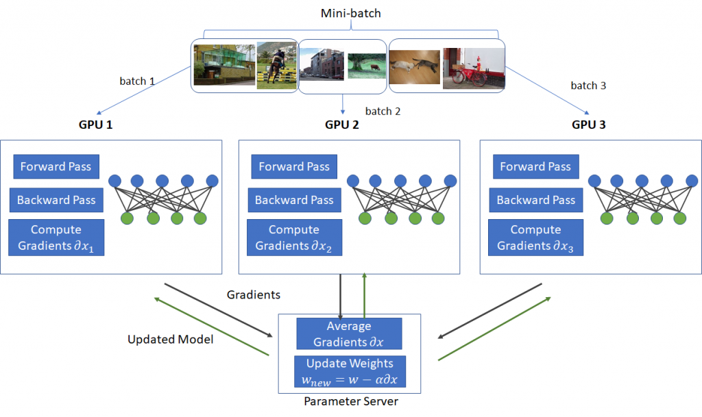

# 分布式训练并行化

## 数据并行 (Data Parallelism)

数据并行是最常见的并行形式，因为它很简单。在数据并行训练中，数据集被分割成几个分片，每个分片被分配到一个设备上。这相当于沿批次（Batch）维度对训练过程进行并行化。每个设备将持有一个完整的模型副本，并在分配的数据集分片上进行训练。在反向传播之后，模型的梯度将会聚合（All Reduce），以便在不同设备上的模型参数能够保持同步。典型的数据并行实现：PyTorch DDP。

### Parameter Server

### 

## 张量并行 (Tensor Parallelism)

## 流水线并行 (Pipeline Parallelism)

## 

## 参考文献
- https://huggingface.co/docs/transformers/v4.17.0/en/parallelism
- https://zhuanlan.zhihu.com/p/598714869
- https://siboehm.com/articles/22/data-parallel-training
- https://bobondemon.github.io/2020/12/20/Distributed-Data-Parallel-and-Its-Pytorch-Example/
- https://www.microsoft.com/en-us/research/blog/pipedream-a-more-effective-way-to-train-deep-neural-networks-using-pipeline-parallelism/