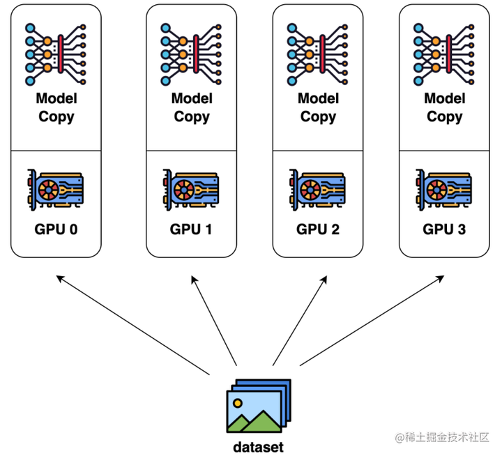
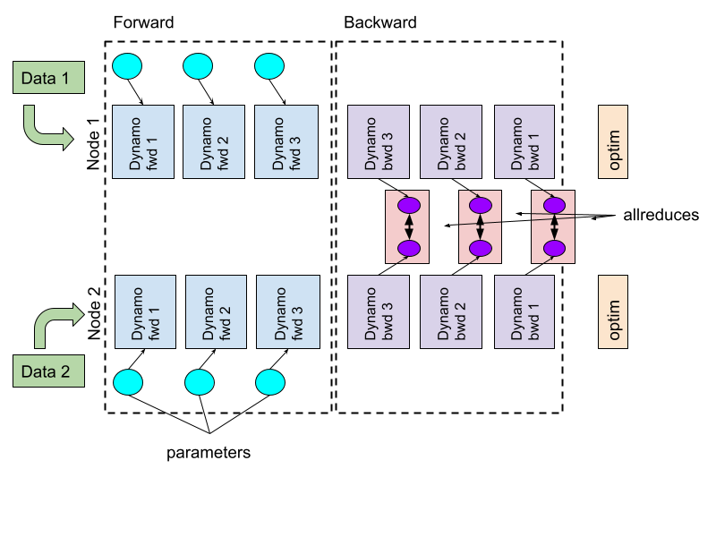
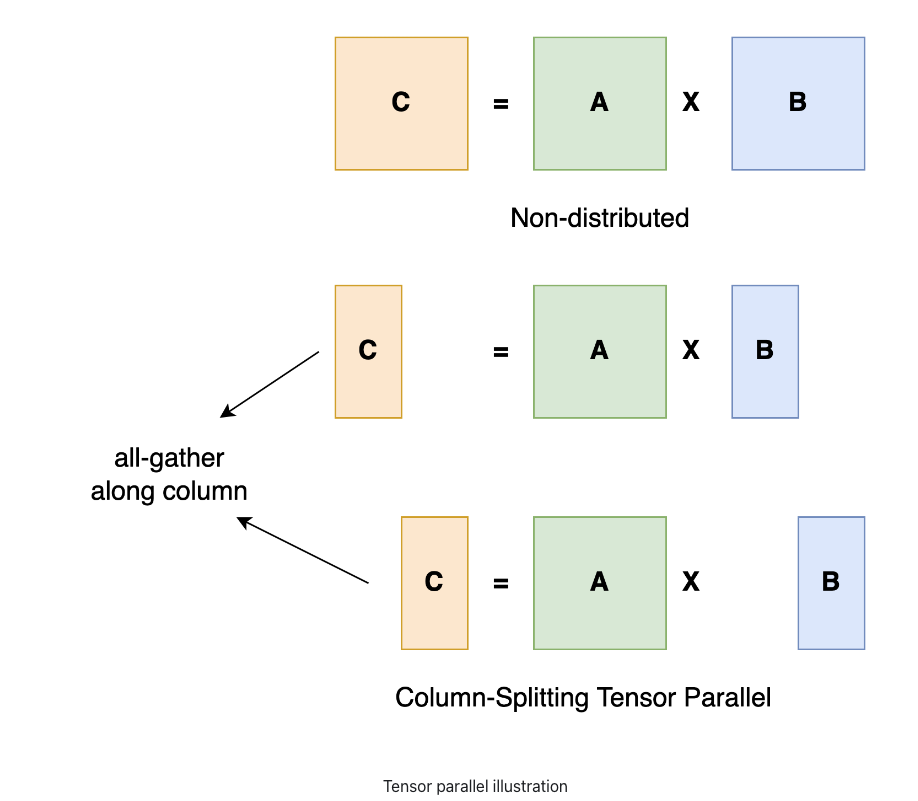
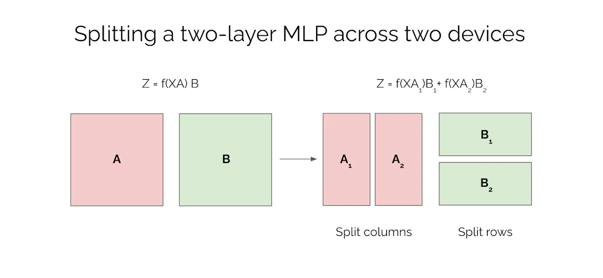
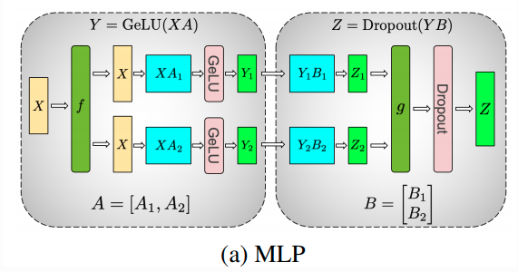
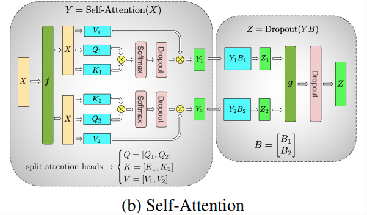
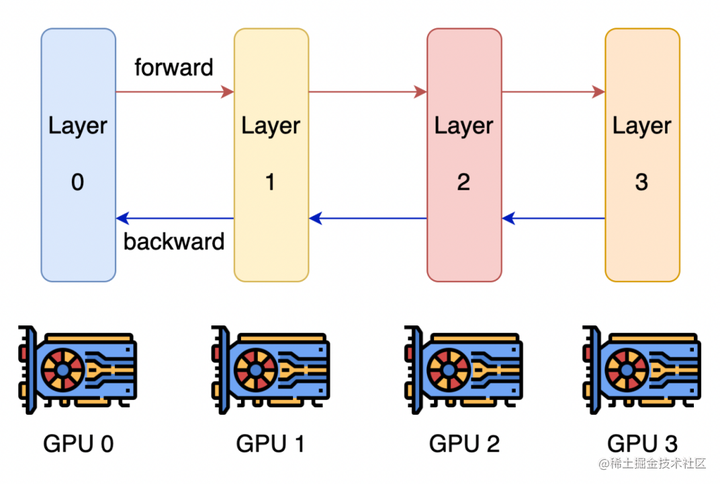
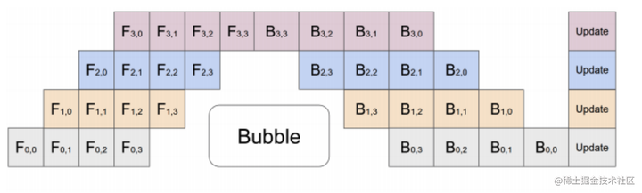
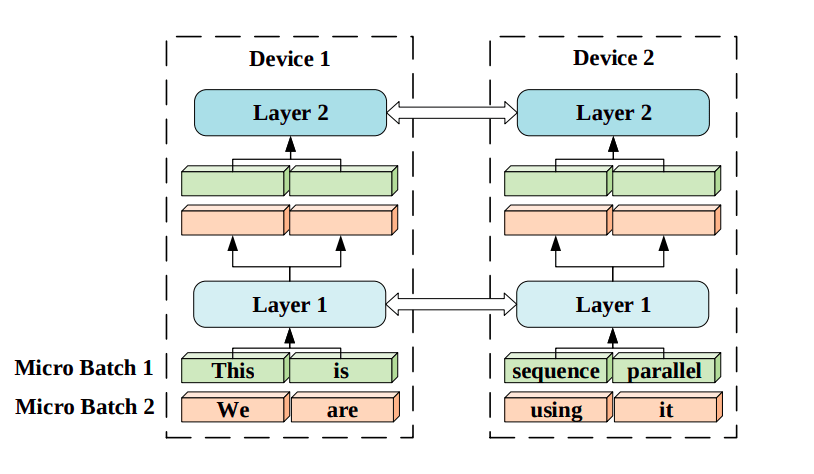
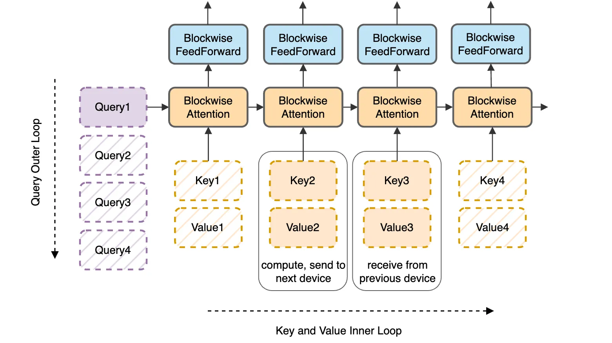

# 分布式训练并行化

## 数据并行 (Data Parallelism)

数据并行是最常见的并行形式，因为它很简单。在数据并行训练中，数据集被分割成几个分片，每个分片被分配到一个设备上。这相当于沿批次（Batch）维度对训练过程进行并行化。每个设备将持有一个完整的模型副本，并在分配的数据集分片上进行训练。在反向传播之后，模型的梯度将会聚合（All Reduce），以便在不同设备上的模型参数能够保持同步。典型的数据并行实现：PyTorch DDP。

#### Parameter Server

数据并行的一种实现方式： 参数服务器。

### Pytorch DDP

数据并行的一种实现方式：Pytorch DDP(Distributed Data Parallel)。

### ZeRO

ZeRO 也是数据并行的一种方式，详细参考 [ZeRO](./../../DeepSpeed/zero.md)。

## 张量并行 (Tensor Parallelism)

张量并行训练是将一个张量沿特定维度分成 N 块，每个设备只持有整个张量的 1/N，同时不影响计算图的正确性。这需要额外的通信来确保结果的正确性。

LLM 中的 MLP 层的张量并行。

LLM 中的 Attention 层的张量并行。

## 流水线并行 (Pipeline Parallelism)

流水线并行的核心思想是，模型按层分割成若干块，每块都交给一个设备。

- 在前向传播过程中，每个设备将中间的激活传递给下一个阶段。
- 在反向传播过程中，每个设备将输入张量的梯度传回给前一个流水线阶段。

这允许设备同时进行计算，从而增加训练的吞吐量。

流水线并行训练的一个明显缺点是训练设备容易出现空闲状态（因为后一个阶段需要等待前一个阶段执行完毕），导致计算资源的浪费，加速效率没有数据并行高。

典型的流水线并行实现：GPipe、PipeDream、PipeDream-2BW、PipeDream Flush（1F1B）。

## 序列并行（Sequence Parallelism）

序列并行是在 Token 维度进行切分，将 Token 序列按照一定的切分比例，切分到不同的 GPU 上执行。

这种方法的主要挑战是在多个设备之间计算注意力分数。为了解决这个问题，作者提出了一种称为 `Ring Self-Attention（RSA）`的新方法，可以在分布式环境中计算注意力分数。

## 参考文献
- https://huggingface.co/docs/transformers/v4.17.0/en/parallelism
- https://zhuanlan.zhihu.com/p/598714869
- https://siboehm.com/articles/22/data-parallel-training
- https://bobondemon.github.io/2020/12/20/Distributed-Data-Parallel-and-Its-Pytorch-Example/
- https://www.microsoft.com/en-us/research/blog/pipedream-a-more-effective-way-to-train-deep-neural-networks-using-pipeline-parallelism/
- https://www.mishalaskin.com/posts/tensor_parallel
- https://uvadlc-notebooks.readthedocs.io/en/latest/tutorial_notebooks/scaling/JAX/tensor_parallel_simple.html
- https://deepsense.ai/how-to-train-a-large-language-model-using-limited-hardware/